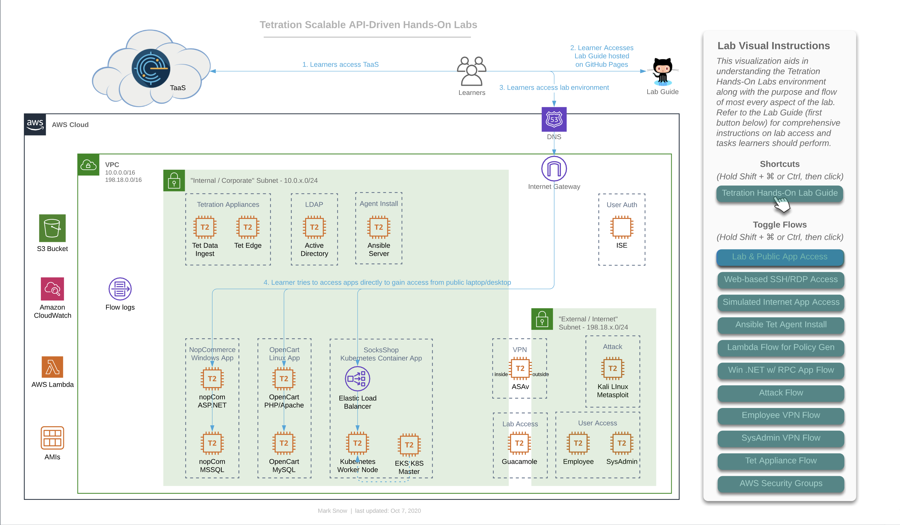
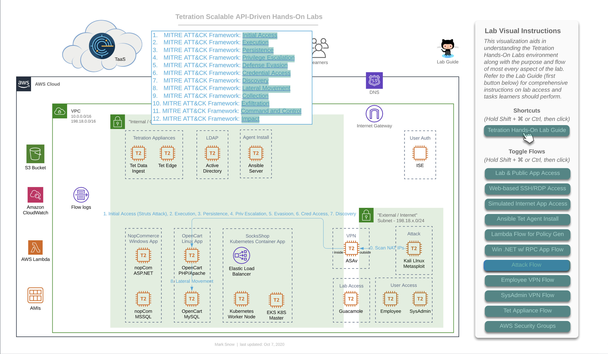

# Cisco Tetration Virtual Bootcamp
  
## Diagrams
  

### Diagrams for this Module
<a href="#diagram-001" style="font-weight:bold">Diagram 001 - Interactive Diagram Toggle Flows</a>  
<a href="#diagram-002" style="font-weight:bold">Diagram 002 - Interactive Diagram Clickable Hotspots</a>  
<a href="#diagram-003" style="font-weight:bold">Diagram 003 - Base Diagram</a>  
<a href="#diagram-004" style="font-weight:bold">Diagram 004 - Access to TaaS, Lab Guide, and Public Access to Apps</a>  
<a href="#diagram-005" style="font-weight:bold">Diagram 005 - Access to Lab Environment</a>  
<a href="#diagram-006" style="font-weight:bold">Diagram 006 - Lab Simulated Internet Access</a>  
<a href="#diagram-007" style="font-weight:bold">Diagram 007 - Tetration Agent Deployment via Ansible</a>  
<a href="#diagram-008" style="font-weight:bold">Diagram 008 - Lambda Traffic Generation for ADM</a>  
<a href="#diagram-009" style="font-weight:bold">Diagram 009 - Windows .NET App Flow with RPC Calls to AD</a>  
<a href="#diagram-010" style="font-weight:bold">Diagram 010 - MITRE ATT&CK Framework-based Attack Flow</a>  
<a href="#diagram-011" style="font-weight:bold">Diagram 011 - Simulated Internet "Employee" VPN Flow with ISE SGT Assignment</a>  
<a href="#diagram-012" style="font-weight:bold">Diagram 012 - Simulated Internet "SysAdmin" VPN Flow with ISE SGT Assignment</a>  
<a href="#diagram-013" style="font-weight:bold">Diagram 013 - Tetration Edge & Data Ingest Appliance Traffic Flows</a>  
<a href="#diagram-014" style="font-weight:bold">Diagram 014 - AWS Security Groups for Lab Administrator</a>  

---

### Introduction to Lab Diagrams 

Throughout this lab guide you will find diagrams that can be helpful in visualizing the flow of information for a given topic. These diagrams will generally be included in the context of the task where they might add value. However, you may also wish to occasionally come back to this page to view all of the diagrams in one go. 

We recommend [Google Chrome](https://www.google.com/chrome/){:target="_blank"} for the best browsing experience.

#### A note on image sizes
If the images on any of the lab guide pages are too small, you may click on any image to open the link to its full size (fit to the browser window), and then click again if the magnifying glass shows up with a '+'. You also may prefer to see all images larger on any given page, in which case simply clicking `Ctrl +` multiple times on Windows, or `Cmd +` (`⌘ +`) multiple times on a Mac, will zoom into the page size in most web browsers. However, it should be noted that if you zoom into the main documentation window, and then click on any image to open its native original, that the image may at that time be too large due to the zoom factor, and you may wish to zoom back out. To do so for Windows simply click `Ctrl -` multiple times, and for Mac click `Cmd -` (`⌘ -`) multiple times, until you reach your desired size. Do note that this _may_ also change the zoom level of your main documentation window correspondingly and that you may wish to resize that window again to suit. 

### Diagrams

#### Live Interactive Diagram
You may prefer to utilize [this interactive LucidChart diagram](https://www.lucidchart.com/documents/view/425e1b97-194e-413a-b793-0df939a87501){:target="_blank"} while working on various modules in this lab. It is possible that the interactive diagram may have slightly newer enhancements or modifications, depending on when you view, and should be considered to be the most reliable and up-to-date version, though every attempt will be made to take static screenshots and update those here, as often as possible. Should you choose to use the interactive diagram, follow the instructions on right of the diagram to toggle on/off various "flows", as seen in this image:

<a href="#diagram-001" style="font-weight:bold">Diagram 001</a>
  
  
To toggle flows on/off, follow the instructions for depending on whether you are using a Windows machine or a Mac. For Windows, press and hold `Shift + Ctrl`, then click. For Mac, press and hold `Shift + ⌘`, then click. When you press these key combinations, you should see the clickable links in the panel turn a sort of greenish color, as such:

<a href="#diagram-002" style="font-weight:bold">Diagram 002</a>
  

#### Base Diagram

<a href="#diagram-003" style="font-weight:bold">Diagram 003</a>
  

As mentioned, here are are a collection of the diagram with each flow enabled, for concise reference. 

This first image is the base diagram which references the environment that _each_ learner will have access to. Note that every item you see here is completely unique and independant for each and every learner. This includes Windows VMs, Linux VMs, Active Directory, Ansible, ASAv, Tetration appliances, Lambda, Kubernetes - all of it. Each learner will also have their own unique instance of TaaS (Tetration-as-a-Service), as well. 

  
  

#### Incremental Diagrams with Flows

<a href="#diagram-004" style="font-weight:bold">Diagram 004</a>
  

> NOTE: The URL to access all of the workloads and assets for your lab environment are unique to you and will be provided to you by the lab administrator in a CSV or XLS format. 

This is the flow that for a learner (that's you) accessing the lab environment. You will have been provided a unique URL and login for your TaaS instance, and will access it directly given that information (step 1 in this diagram). Step 2 in this diagram shows you accesing the lab guide documentation, which we will assume you have managed somehow since you are reading this on that documentation site, which is hosted with GitHub Pages. Step 3 on the diagram shows you accessing the three applications that you have unique to your lab environment. You will be able to access each of the apps directly from your local laptop/workstation. Later on you will also find that you will be able to access each app from the two Win10 "User Access" machines pictured at the bottom right in the simulated "External / Internet" Subnet - 198.18.x.0/24". 

  
  
As you can see from the diagram above, your lab contains one of each of the following apps:

   1. Windows app - "nopCommerce" 
      *  Win19 IIS App server
      *  Win19 MS SQL DB server
   2. Linux app - "OpenCart"
      *  CentOS 7 Apache App server
      *  CentOS 7 MySQL DB server
   3. Microservices Container app on Kubernetes - "Sock Shop"
      *  Front End service
      *  Payment service
      *  Shipping service
      *  Queuemaster service
      *  RabbitMQ service
      *  Orders service
         *  Orders App
         *  Orders DB
      *  User service
         *  User App
         *  User DB
      *  Catalog service
         *  Catalog App
         *  Catalog DB
      *  Carts service
         *  Carts App
         *  Carts DB

<a href="#diagram-005" style="font-weight:bold">Diagram 005</a>
  

This diagram depicts how you will gain access to the workloads running in your lab environment. Access to this lab environment will be done entirely from your web browser using the open-source [Apache Guacamole](https://guacamole.apache.org/){:target="_blank"}. We'll refer to this often as just "Guac".

This will be either to the desktop via RDP in the case of a Windows machine or to the shell via SSH in the case of a Linux machine. Access will always be via your web browser where RDP and SSH will be proxied. Note that copy/paste will work from your local laptop/workstation to the remote desktop or shell. This goes for file transfer, as well. For copy/paste, simply copy something to your local workstation clipboard, navigate to the RDP desktop via the web browser, and paste the item as usual using `Ctrl + V`. Simalar functionality will exist for pasting to an SSH session via the browser, simply `right-click` to paste. Finally, to make a file transfer, simply drag a file from your local workstation over to the RDP or SSH session and the file should copy over remotely. 

  
  

<a href="#diagram-006" style="font-weight:bold">Diagram 006</a>
  

This diagram depicts you accessing each of the three apps in your lab env from either of the two Win10 "User Access" machines pictured at the bottom right in the simulated "External / Internet" Subnet - 198.18.x.0/24". You will first need to gain access to the Win10 desktops via RDP and that will naturally be accomplished via your web browser using Guac. 

  
  

<a href="#diagram-007" style="font-weight:bold">Diagram 007</a>
  

This diagram depicts how you will deploy Tetration Agents out to each of your workloads in your lab environment. Deployment will occur by performing the following tasks:
   1. Connect to the Guac server via HTTPS
   2. Click on and connecting to the Ansible machine
   3. Verify and, if necessary, edit the inventory for deployment by first changing directories with `cd /opt/ansible-tetration-sensor/` running `sudo nano inventory/hosts` and when prompted with `[sudo] password for ciscolab:`, entering the standard lab password of `tet123$$!`. 

  

The Ansible machine is already configured to deploy agents out to the following workloads by OS:

   * Windows 2019
      * nopCommerce IIS server
      * nopCommerce MSSQL server
      * Active Directory server
   * CentOS 7
      * OpenCart Apache server
      * OpenCart MySQL server
      * Ansible Automation server (itself)
   * Ubuntu 16.04
      * EKS Worker Node

<a href="#diagram-008" style="font-weight:bold">Diagram 008</a>
  

This diagram depicts how AWS Lambda (aka 'Serverles') plays nice with Tetration from a policy perspective. AWS allows you to assign Lambda event-driven functions to be sourced from either one of their public Internet IP addresses or from your own private RFC1918 subnet inside your VPC. In our lab, we have configured the triggering event to be time, specifically that every 60 seconds two functions are run using Node.js, each making a single HTTPS call, one to the Windows-based nopCommerce app and the other to the Linux-based OpenCart app. This is helpful in two ways - firstly in that it allows us to include the concept of adding logic to your Tetration policy that accounts for AWS Serverless technologies, and secondly in that it actually ensures that there is constant traffic hitting these two applications and ensuring that there is plenty of flow data present in the Tetration collectors when it's time for you to run ADM for each app in order to generate that policy. If you're wondering why we don't have a function calling the Container-based Sock Shop app, it's due to the fact that Tetration agents do not collect flow telemetry information from container workloads and therefore wouldn't have much value since running ADM for container apps is a moot point, and needing to manually generate policy for these apps to include allowing serverless sources such as Lambda would have already been covered by the other two apps. 

  
  

<a href="#diagram-009" style="font-weight:bold">Diagram 009</a>
  

This diagram is an important one because it depicts the flow that is both specific to, and critical for Microsoft server applications. Microsoft uses a range of 16,383 ports for a technology known as "RPC" or "Remote Procedure Calls". Specifically, they use TCP ports 49195-65535.  While RPC is not a Microsoft protocol and not unique to only Microsoft workloads, it is most commonly found in environments that have Windows servers. In fact, it could easily be said that almost _every_ data center and cloud environment that has Windows server workloads will almost certainly be utilitizing their version of RPC - namely MSRPC. Since the destination port for RPC is dynamically chosen at execution time, and because that port can fall anywhere in the above mentioned range, it is critical that policy generated by Tetration includes these destination port ranges for virtually any Windows server that needs to communicate with an Active Directory Domain Controller using Windows Server domains protocols - such as authentication. While not every server necessarily needs to authenticate often, when necessary it is critical that it be allowed to do so. We want to ensure that these AD servers have policy instantiated that allow other windows servers (and workstation clients) to communicate with them on these ports. 

In our case, we have the MS-SQL server set to use Domain Authentication rather than the built-in SA (System Account) user, which we have seen time and again in corporate environments, because it allows DBAs and domain admins to easily update passwords in a central location that databases distributed across the organization all use, rather than reaching out to every SQL server and updating the local SA account password when necessary (say in the event that a DBA moves on from the org). 

Another common place you may find RPC in use is with NFS. You will likely encounter the usage of RPC in many other environments and should be on the lookout for it and other ephemeral port-range protocols like it. A quick parting thought is that you should look out for other ephemeral port "hopping" protocols besides RPC, when building policy in a production deployment of Tetration. A quick example that comes to mind is "RTP" or "Real Time Protocol". RTP and its sister - RTCP (Real Time Control Protocol) together use a range of UCP ports from 16384-32767, and will likely be found anywhere that VoIP is used - such as with IP Phones and Telepresence units talking to one another as well as a slew of other devices such as voice gateways and call recorders. 

  
  

<a href="#diagram-010" style="font-weight:bold">Diagram 010</a>
  

This diagram depicts the flow of traffic that will be used during the lab that calls for you to initiate a live attack from the Kali Linux server running the Metasploit toolkit. This will demonstrate the [MITRE ATT&CK Framework](https://attack.mitre.org/){:target="_blank"} that has been defined by the not-for-profit organization called Mitre Corporation - whose charters and funding come from (among other places) [NIST](https://www.nist.gov/){:target="_blank"}. This is also the organization that maintains ["CVEs" or "Common Vulnerabilities and Exposures"](https://cve.mitre.org/){:target="_blank"} as a part of the ["NVD" or "National Vulnerability Database"](https://nvd.nist.gov/){:target="_blank"}. This framework articulates the systematic approach that virtually every breach consists of. 

This consists of:
1. Initial Access
2. Execution
3. Persistence
4. Privilege Escalation
5. Defense Evasion
6. Credential Access
7. Discovery
8. Lateral Movement
9. Collection
10. Command and Control
11. Exfiltration
12. Impact

You will use this diagram when performing the lab that will have you attack a known vulnerability running on the server hosting the OpenCart webapp tier and then continuing on to accomplish lateral movement to other higher-value targets, such as the DB containing customer info with PII. 

  
  

<a href="#diagram-011" style="font-weight:bold">Diagram 011</a>
  

This diagram depicts the flow of traffic that will be used during the lab that has you use the general "Employee" machine outside of the ASAv firewall in your lab-simulated "Internet" to VPN into the organization and gain access via user-identification based policy which relies on ISE authenticating to Windows Active Directory and mapping the AD Security Group (AD-SG) to the ISE TrustSec Security Group (TrustSec-SG). Upon successful authentication and mapping of an AD-SG to an ISE TrustSec-SG, a SGT or Security Group Tag will be assigned, which is a numerical value. This SGT is what will be used by Tetration in creating policy to allow certain users access to certain defined resources. Whenever a user gets both authenticated (ID verification) and authorized (permissions granted via group mapping) by ISE to a SGT, ISE will update its ["pxGrid" or "Platform Group Exchange Grid"](https://www.cisco.com/c/en/us/products/security/pxgrid.html){:target="_blank"} and those subscribed to that grid -which in this case is Tetration- will get an updated list of Users, their SGTs, and their IP Addresses, among a slew of other information. Tetration will then use the IP addresses of these hosts to update various workload firewall rules where enforcement is in place. 

In this lab diagram, Employees get standard access to the app front-ends and no more - essentially what everyone else gets. 

  
  

<a href="#diagram-012" style="font-weight:bold">Diagram 012</a>
  

> TL;DR - this is the same info except for the last sentence, so skip it if you read the above diagram.

This diagram depicts the flow of traffic that will be used during the lab that has you use the general "Employee" machine outside of the ASAv firewall in your lab-simulated "Internet" to VPN into the organization and gain access via user-identification based policy which relies on ISE authenticating to Windows Active Directory and mapping the AD Security Group (AD-SG) to the ISE TrustSec Security Group (TrustSec-SG). Upon successful authentication and mapping of an AD-SG to an ISE TrustSec-SG, a SGT or Security Group Tag will be assigned, which is a numerical value. This SGT is what will be used by Tetration in creating policy to allow certain users access to certain defined resources. Whenever a user gets both authenticated (ID verification) and authorized (permissions granted via group mapping) by ISE to a SGT, ISE will update its ["pxGrid" or "Platform Group Exchange Grid"](https://www.cisco.com/c/en/us/products/security/pxgrid.html){:target="_blank"} and those subscribed to that grid -which in this case is Tetration- will get an updated list of Users, their SGTs, and their IP Addresses, among a slew of other information. Tetration will then use the IP addresses of these hosts to update various workload firewall rules where enforcement is in place. 

In this lab diagram, SysAdmins not only get standard access to the app front-ends, but they also gain RDP and/or SSH access to each app's frontend workload as well as the backend databases, so that they can properly perform necessary administration. 

  
  

<a href="#diagram-013" style="font-weight:bold">Diagram 013</a>
  

This diagram depicts the flow of traffic used by various devices to utimately ingest information into the Tetration cluster. The Tetration Edge appliance is used to subscribe to the pxGrid from ISE for SGT and user-based policy. The Tetration Data Ingest appliance is used to collect NetFlow v9 info from the ASAv which is useful in stitching together flows of traffic from outside the firewall all the way through being NAT'd by that ASAv and then traversing to the internal corporate network and making their way to app frontends. This same Tetration Data Ingest appliance is used to collect Flow Logs from an AWS VPC via an S3 bucket. This is useful for collecting traffic from any workload that may not have (or be able to have) a Tetration agent installed on it. 

  
  

<a href="#diagram-014" style="font-weight:bold">Diagram 014</a>
  

This diagram depicts the AWS Security Groups that help to keep this intentionally open lab environment from being completely opened before a learner can properly create and enforce Tetration policy.

  
  

  
---  
  
| [Return to Table of Contents](https://tetration.guru/bootcamp/) | [Go to Top of the Page](README.md) | [Continue to the Introduction](https://tetration.guru/bootcamp/module_01/) |
