# Cisco Tetration - Hands-On Lab

## Module07 - Scopes
Scopes are used in Tetration to break down an IP scheme of an organization into manageable blocks that represent a function,  such as an application.  Scopes are organized in a tree structure,  with a Root Scope at the top of the tree which represents all IP addresses;  both internal and external.  The root scope is tied to the VRF,  which in turn represents the IP space of a Tenant.  In Tetration Cloud,  there can be only a single Tenant and hence only a single VRF and Root Scope.  With an on-prem Tetration cluster,  you could possibly have multiple Tenants and VRFs.  Each leaf of the scope tree is tied to a query, with the queries typically being more broad at the higher levels of the tree and becoming more specific as you traverse down the tree structure.  For example,  consider the following scope structure that will be used in this lab:
```
  Root  
    └── Pod (PodSubnet=internal)    
        └── Cloud (orchestrator_Cloud=AWS)      
            └── Region (orchestrator_Region=us-east-1)  
                ├── CommonApps (orchestrator_AppName=Common)  
                    ├── OpenCart (orchestrator_AppName=OpenCart)  
                    ├── SockShop (orchestrator_AppName=SockShop)  
                    └── nopCommerce (orchestrator_AppName=nopCommerce)  
```
In this tree structure, the Pod matches our annotation PodSubnet=internal which is assigned in our annotations file to match all RFC1918 IP address space. At each level of the tree our query results will become less broad until at the bottom of the tree we are matching workloads that are specific to an application.  With this scope hierarchy,  policy can be applied at any level of the tree and will be collapsed into a single policy that will be applied on matching workloads.  This allows us to create very broad policy,  such as policy that applies to everything in AWS by applying the policy at the Cloud level,  while applying policy that is required specifically for the application to function at the lower-level application scopes. This way we can define policy for the services that are common across the organization or across a particular region or cloud, such as DNS, DHCP, Active Directory, etc. once in the higher level scope and have those policies applied across all workloads,  while creating smaller rulesets at the lower level application scopes. Breaking the policy into smaller subsets of rules makes the ruleset much easier to digest by administrators. It also provides the ability for the security team to set broad policy at a higher level of the scope tree that implements a corporate policy, for example "Dev can't talk to Prod".  

In this module,  we'll define the Scope tree that will be used throughout the rest of the lab exercises.  

---
<a href="https://cisco-tetration-hol-content.s3.amazonaws.com/videos/07a_scope_creation.mp4" style="font-weight:bold" title="Collection Rules Title"> Click here to view a video highlighting the creation of Scopes.</a>

<a href="https://cisco-tetration-hol-content.s3.amazonaws.com/videos/07b_scope_member_verify.mp4" style="font-weight:bold" title="Collection Rules Title"> Click here to view a video showing the verification of Scope members.</a>

---

### Steps for this Module  
<a href="#step-001" style="font-weight:bold">Step 001 - Navigate to Scopes</a>  
<a href="#step-002" style="font-weight:bold">Step 002 - Create a new scope under the root</a>  
<a href="#step-003" style="font-weight:bold">Step 003 - Create the Pod scope</a>  
<a href="#step-004" style="font-weight:bold">Step 004 - Enter the Pod scope</a>  
<a href="#step-005" style="font-weight:bold">Step 005 - Create a new scope under the Pod scope</a>  
<a href="#step-006" style="font-weight:bold">Step 006 - Create the Cloud scope</a>  
<a href="#step-007" style="font-weight:bold">Step 007 - Enter the Cloud scope</a>  
<a href="#step-008" style="font-weight:bold">Step 008 - Create a new scope under the Cloud scope</a>  
<a href="#step-009" style="font-weight:bold">Step 009 - Create the Region scope</a>  
<a href="#step-010" style="font-weight:bold">Step 010 - Enter the Region scope</a>  
<a href="#step-011" style="font-weight:bold">Step 011 - Create a scope under the Region scope</a>  
<a href="#step-012" style="font-weight:bold">Step 012 - Create the nopCommerce scope</a>  
<a href="#step-013" style="font-weight:bold">Step 013 - Create a second scope under the Region</a>  
<a href="#step-014" style="font-weight:bold">Step 014 - Create the OpenCart scope</a>  
<a href="#step-015" style="font-weight:bold">Step 015 - Create a third scope under the Region</a>  
<a href="#step-016" style="font-weight:bold">Step 016 - Create the Common Apps scope</a>  
<a href="#step-017" style="font-weight:bold">Step 017 - Commit scope updates</a>  
<a href="#step-018" style="font-weight:bold">Step 018 - Observe the commit status</a>  
<a href="#step-019" style="font-weight:bold">Step 019 - View the query results for AppGroup = Common</a>  
<a href="#step-020" style="font-weight:bold">Step 020 - Observe workloads associated with Common Apps</a>  
<a href="#step-021" style="font-weight:bold">Step 021 - View the query results for AppGroup = nopCommerce</a>  
<a href="#step-022" style="font-weight:bold">Step 022 - Observe workloads associated with nopCommerce</a>  
<a href="#step-023" style="font-weight:bold">Step 023 - View the query results for AppGroup = OpenCart</a>  
<a href="#step-024" style="font-weight:bold">Step 024 - Observe workloads associated with OpenCart</a>  

---

<div class="step" id="step-001"><a href="#step-001" style="font-weight:bold">Step 001</a></div>  

Click the Gear icon in the right-hand corner and select Scopes

<a href="images/module07_001.png">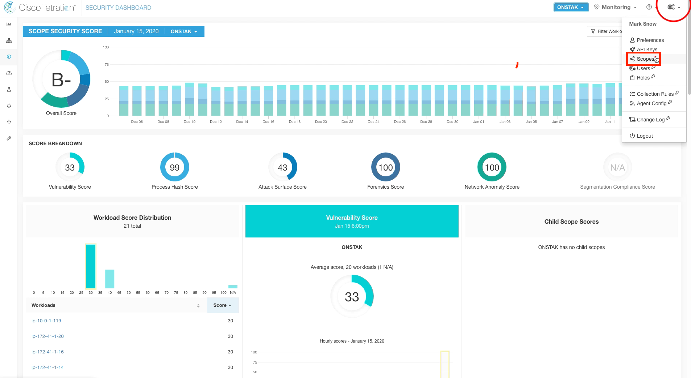</a>  


<div class="step" id="step-002"><a href="#step-002" style="font-weight:bold">Step 002</a></div>  

Here we will create our first scope under the root scope. Click Create New Scope.

> Your root scope will be named based on your StudentID in the lab.  In a real customer deployment in Tetration Cloud, it would be the company name.  

<a href="images/module07_002.png">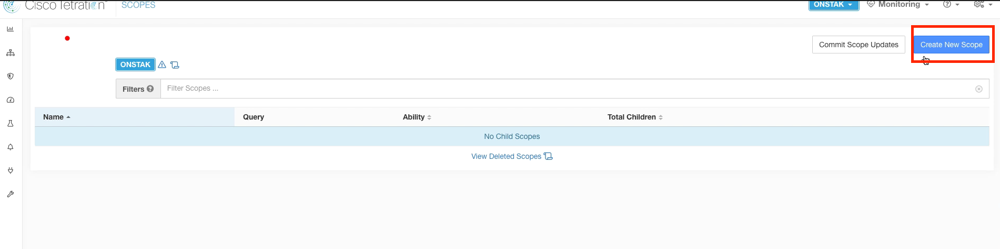</a>  


<div class="step" id="step-003"><a href="#step-003" style="font-weight:bold">Step 003</a></div>  

The name of the first scope will be Pod, to represent your student Pod.  Set the query to * PodSubnet = internal.  This was a static annotation that we set in the previous module on annotations.  It matches all RFC1918 private address space.  

<a href="images/module07_003.png">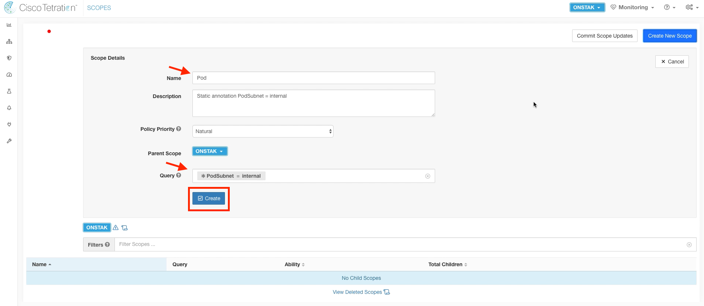</a>  


<div class="step" id="step-004"><a href="#step-004" style="font-weight:bold">Step 004</a></div>  

Click on Pod to navigate to the next level in the scope tree.  Notice how the path at the top now changes to ROOT : Pod.  

<a href="images/module07_004.png">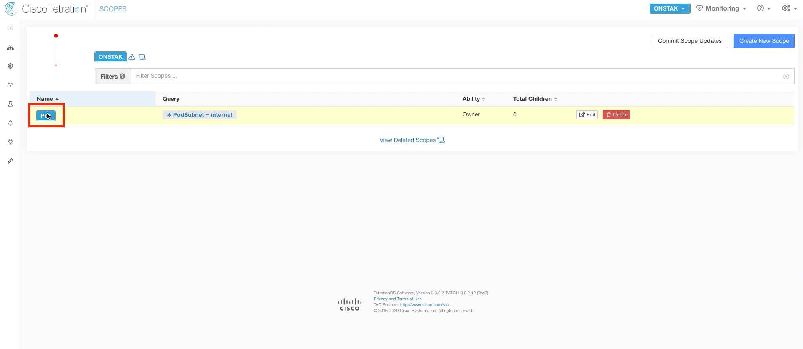</a>  


<div class="step" id="step-005"><a href="#step-005" style="font-weight:bold">Step 005</a></div>  

Create a new child scope under the Pod scope.  

<a href="images/module07_005.png">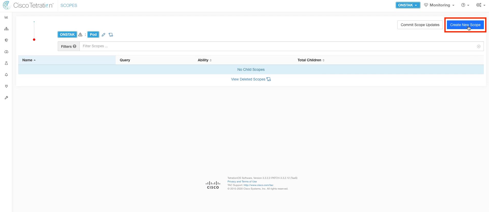</a>  


<div class="step" id="step-006"><a href="#step-006" style="font-weight:bold">Step 006</a></div>  

Name this scope Cloud,  and enter the query *orchestrator_Cloud = AWS.  From here on out, we'll be matching on tags that are set on your instances running in AWS. Recall that these tags are being pulled in from the External Orchestrator configuration for AWS. All instances will be tagged with the Cloud = AWS tag.  

<a href="images/module07_006.png">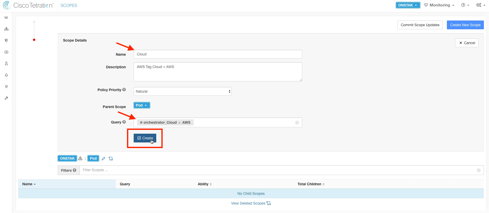</a>  


<div class="step" id="step-007"><a href="#step-007" style="font-weight:bold">Step 007</a></div>  

Click on the Cloud scope to move down to the next level in the scope tree.

<a href="images/module07_007.png">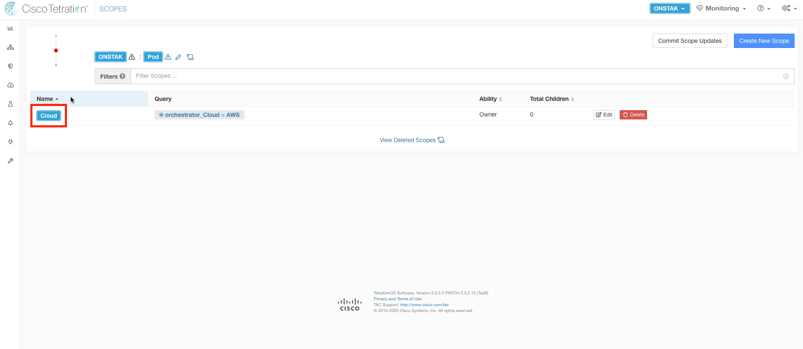</a>  


<div class="step" id="step-008"><a href="#step-008" style="font-weight:bold">Step 008</a></div>  

Create a new Scope under the Cloud scope.

<a href="images/module07_008.png">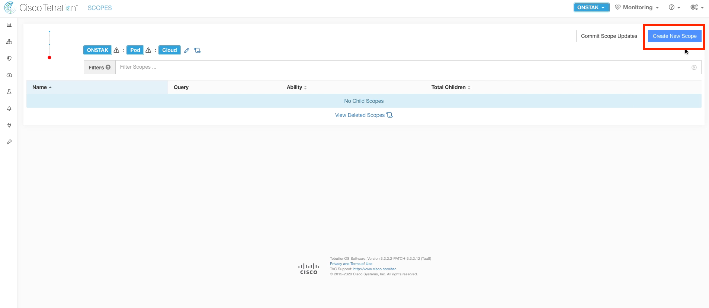</a>  


<div class="step" id="step-009"><a href="#step-009" style="font-weight:bold">Step 009</a></div>  

Name the new scope Region,  and enter the query *orchestrator_Region = us-east-1.

<a href="images/module07_009.png">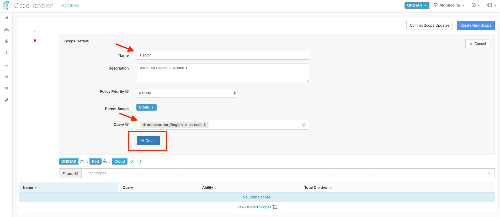</a>  


<div class="step" id="step-010"><a href="#step-010" style="font-weight:bold">Step 010</a></div>  

Click on the Region scope to navigate to the next level in the scope tree.

<a href="images/module07_010.png">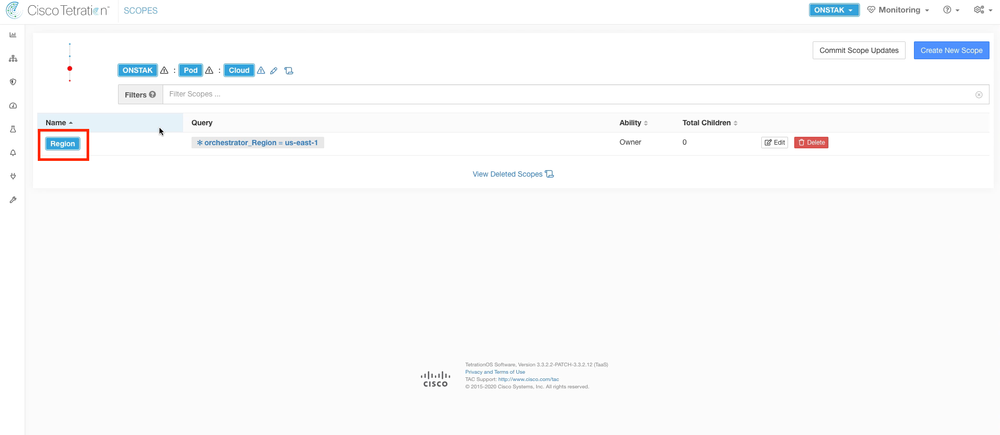</a>  


<div class="step" id="step-011"><a href="#step-011" style="font-weight:bold">Step 011</a></div>  

Create a new scope under the Region scope.  We will create three scopes under the Region.  

<a href="images/module07_011.png">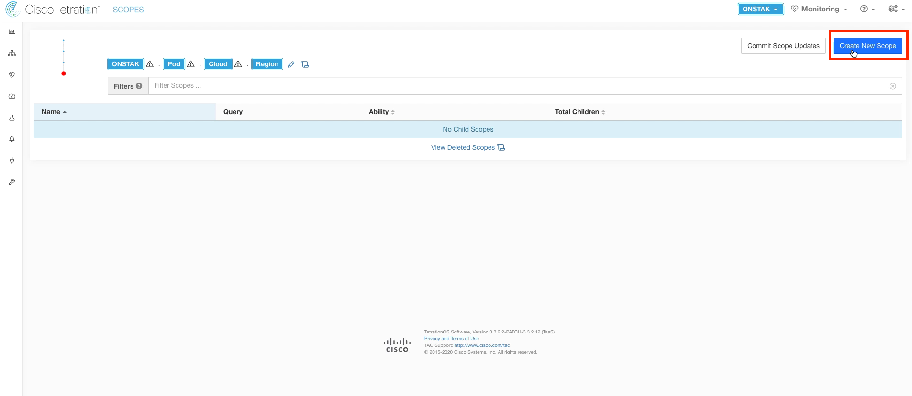</a>  


<div class="step" id="step-012"><a href="#step-012" style="font-weight:bold">Step 012</a></div>  

Name the first scope under the Region nopCommerce,  and set the query to *orchestrator_AppName = nopCommerce.  This query will match the Windows app servers.  

<a href="images/module07_012.png">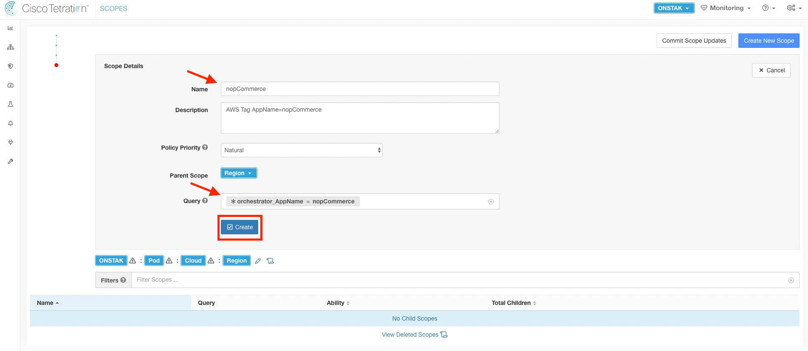</a>  


<div class="step" id="step-013"><a href="#step-013" style="font-weight:bold">Step 013</a></div>  

Create another scope under the Region scope.

<a href="images/module07_013.png">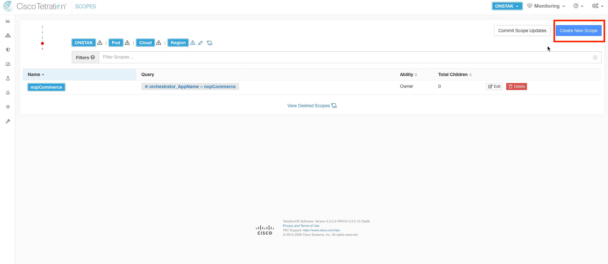</a>  


<div class="step" id="step-014"><a href="#step-014" style="font-weight:bold">Step 014</a></div>  

Name the scope OpenCart,  and enter the query *orchestrator_AppName = OpenCart.

<a href="images/module07_014.png">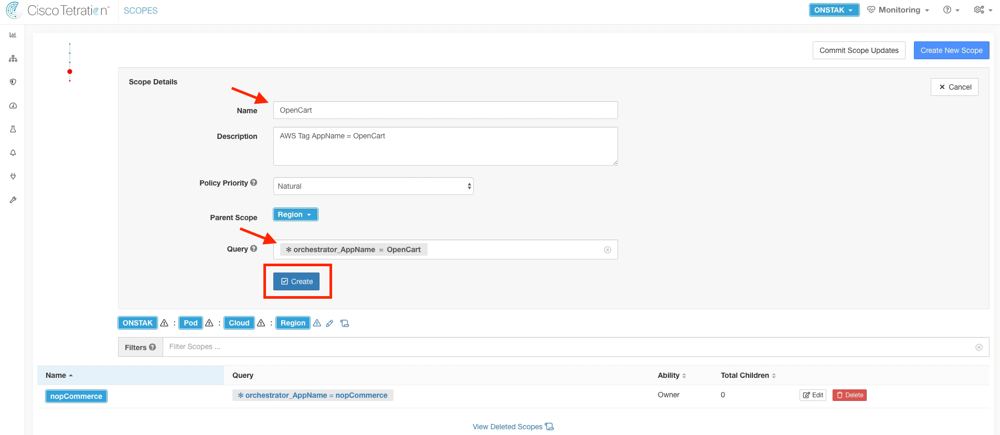</a>  


<div class="step" id="step-015"><a href="#step-015" style="font-weight:bold">Step 015</a></div>  

Create another scope under the Region scope.

<a href="images/module07_015.png">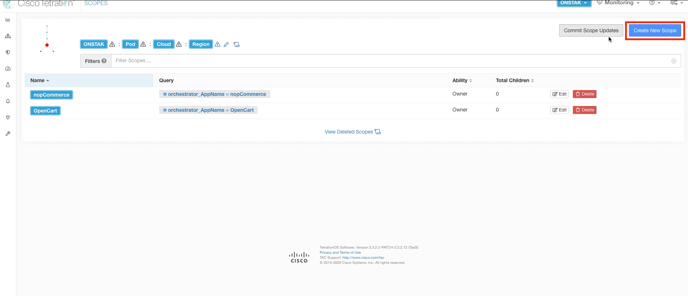</a>  


<div class="step" id="step-016"><a href="#step-016" style="font-weight:bold">Step 016</a></div>  

Enter Common Apps for the name and enter the query *orchestrator_AppGroup = Common.  This will match the Windows Active Directory and Ansible servers.  

<a href="images/module07_016.png">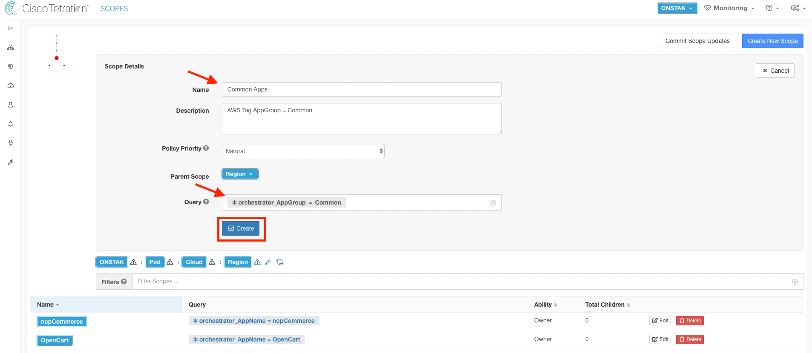</a>  


<div class="step" id="step-017"><a href="#step-017" style="font-weight:bold">Step 017</a></div>  

Click Commit Scope Updates to approve the new scopes and have the new scope structure take affect.  

<a href="images/module07_017.png">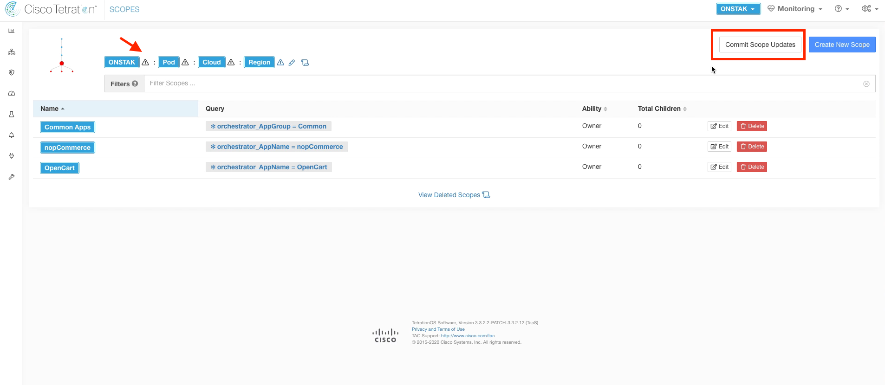</a>  


<div class="step" id="step-018"><a href="#step-018" style="font-weight:bold">Step 018</a></div>  

After a few minutes, the warning icon that indicates scopes have not been committed will disappear.  

> You may have to refresh your screen a few times.

<a href="images/module07_018.png">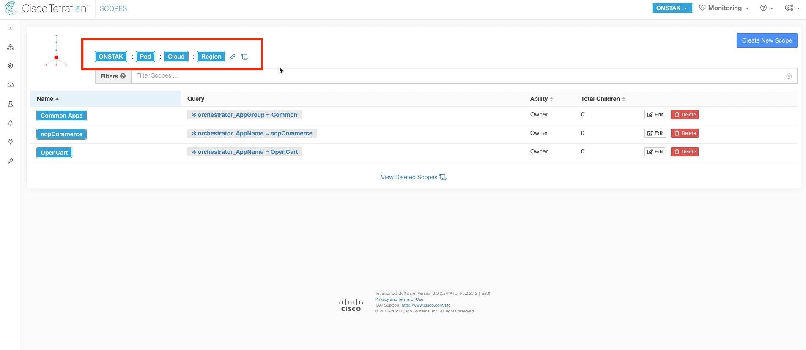</a>  


<div class="step" id="step-019"><a href="#step-019" style="font-weight:bold">Step 019</a></div>  

Now we will verify that the queries match the workloads in the lab environment.  Click on the query orchestrator_AppGroup = Common.

<a href="images/module07_019.png">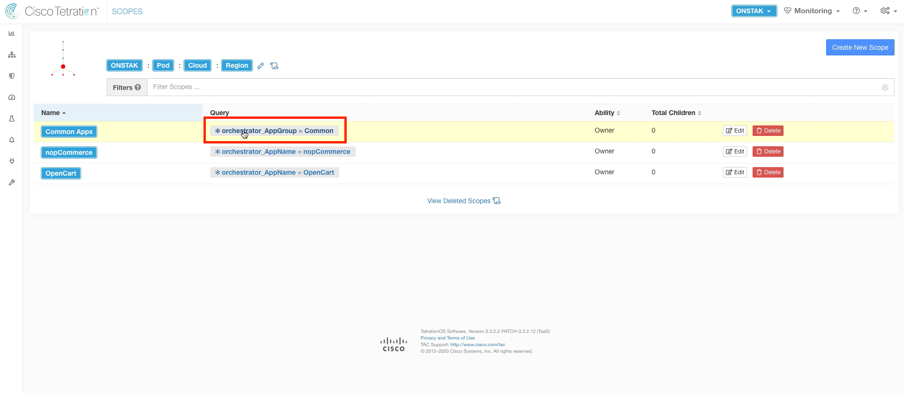</a>  


<div class="step" id="step-020"><a href="#step-020" style="font-weight:bold">Step 020</a></div>  

Here you should see listed the Active Directory server as well as CentOS machine which is the Ansible server.  Cross check the IP addressing against your pod information.  Click the back button on the browser to return to the previous screen.

<a href="images/module07_020.png">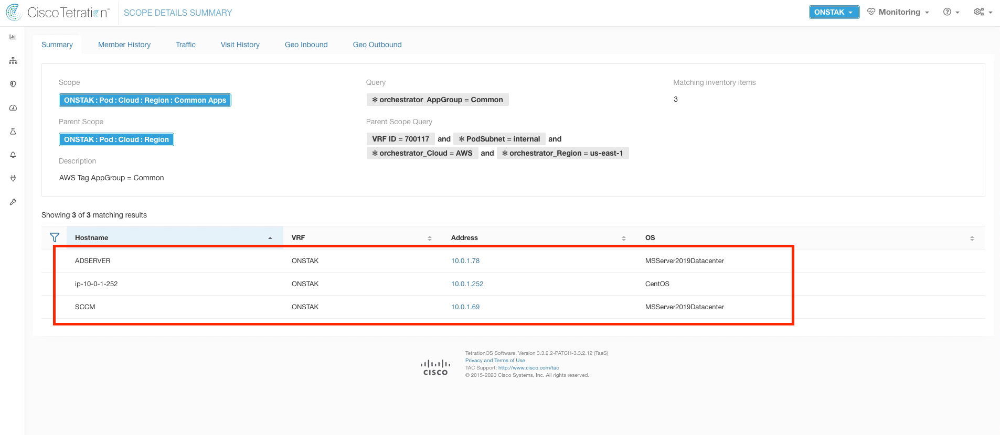</a>  


<div class="step" id="step-021"><a href="#step-021" style="font-weight:bold">Step 021</a></div>  

Click on the query *orchestrator_AppName = nopCommerce.

<a href="images/module07_021.png">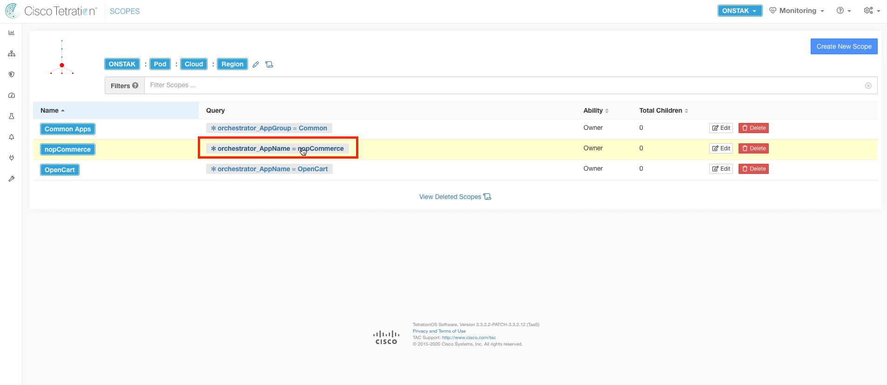</a>  


<div class="step" id="step-022"><a href="#step-022" style="font-weight:bold">Step 022</a></div>  

Here we should see the IIS and MSSqlServer Windows servers that make up the nopCommerce application.  Click back in the browser to return to the previous screen.

<a href="images/module07_022.png">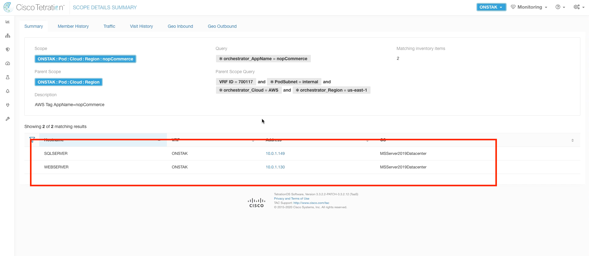</a>  


<div class="step" id="step-023"><a href="#step-023" style="font-weight:bold">Step 023</a></div>  

Click on the *orchestrator_AppName = OpenCart query.


<a href="images/module07_023.png">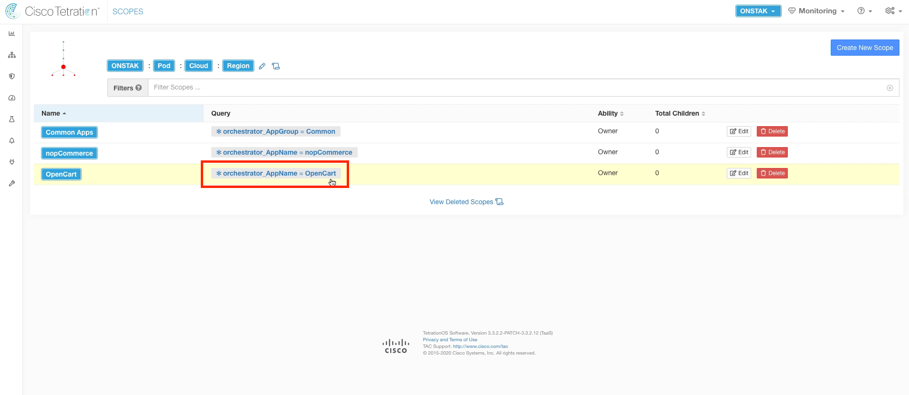</a>  


<div class="step" id="step-024"><a href="#step-024" style="font-weight:bold">Step 024</a></div>  

The workloads listed here are the Linux machines running Apache and MySQL that make up the OpenCart web application.

<a href="images/module07_024.png">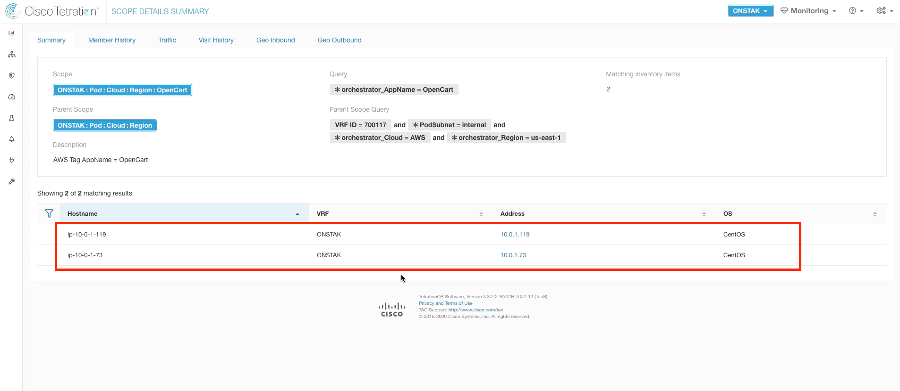</a>  


You have reached the end of this module.  


| [Return to Table of Contents](https://tetration.guru/labguide/) | [Go to Top of the Page]() | [Continue to the Next Module]() |
