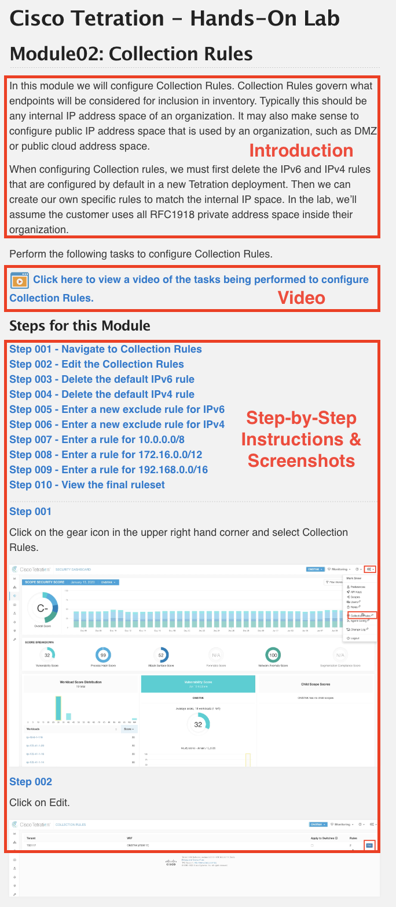
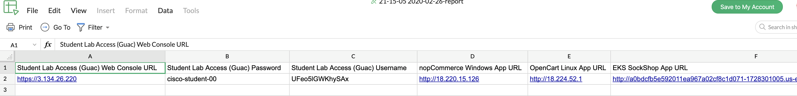
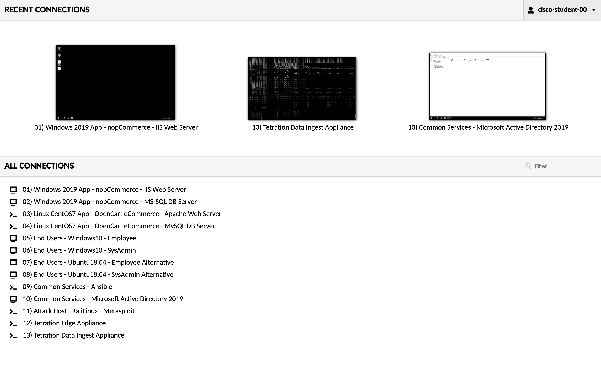
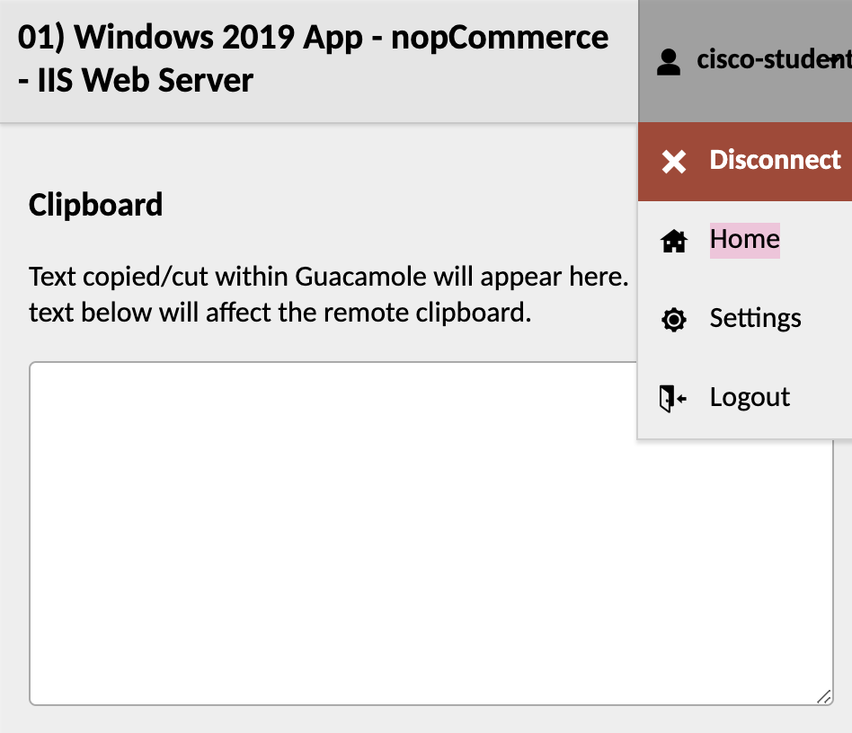

# Cisco Tetration Virtual Bootcamp
  
## Module 01.00 :: Lecture :: Introduction and Course Walkthru

This lab guide has been developed in close coordination with the Cisco Tetration product team in order to provide you, the learner, with a complete experience of deploying, configuring, and truly getting the most out of Cisco Tetration. 

Cisco Tetration is a powerful tool that allows organizations to easily define and maintain centralized, intent-driven policy, made possible by collecting advanced telemetry with complete visibility of every packet, action, and process happening across every single workload, regardless of floor tile. Whether your workloads live in your own data centers, someone elses such as a CoLo or even public cloud provider, or any combination thereof, Cisco Tetration has you covered. 

### Introduction - Table of Contents
<a href="https://deftcon-tetration-virtual-bootcamp.s3.us-east-2.amazonaws.com/lectures/Module_01.00__Lecture__Introduction_Course_and_Lab_Walkthrough.mp4" style="font-weight:bold">Introduction, Course, and Lab Walkthrough -- Video (WATCH ME!) </a>  
<a href="#Guide" style="font-weight:bold">How to Use This Lab Guide</a>  
<a href="#Credentials" style="font-weight:bold">Lab Environment Credentials</a>  
<a href="#CSV" style="font-weight:bold">Student/Pod-Specific Information - CSV File</a>  
<a href="#Access" style="font-weight:bold">Access to the Lab Environment - Guacamole</a>  
<a href="#Integrations" style="font-weight:bold">Integrations with Tetration</a>  
<a href="#Environment" style="font-weight:bold">Lab Environment</a>  
<a href="#Assets" style="font-weight:bold">Lab Assets</a>  

---

<a href="#Guide" style="font-weight:bold">How to Use This Lab Guide</a>

This lab is structured in a way that allows the learner to follow along a consistent path on the journey of designing and configuring Cisco Tetration to an effective working state. Throughout this guide, each module will begin with a video that walks through every task that the learner will accomplish. Following the video, screenshots along with instructions will highlight the important steps that the learner is intended to perform. It is important to note that while the screens should appear quite consistent with what the learner will experience in their own environment, the *values* input into those screens, such as IP addresses and even perhaps AWS regions may (and will likely, though not always) be quite different than those seen in the videos and accompanying screenshots. While hostnames are not usually very important in this lab, for the most part they should remain the same, with the possible exception of ISE. 

It's almost time to get started on the lab, and that warrants a very brief discussion on how to get the most out of using this lab guide. In every module you will find three essential sections, namely:

1. Introduction and Background
2. Video of Tasks Being Performed
3. Tasks, Instructions, and Screenshots to Perform Tasks

This image shows the three sections for a given module:

  

We highly recommend having a quick read on the intro, then possibly a quick watch of the video, followed by beginning to perform the tasks yourself in your own instance of TaaS. However, you may find it more advantageous to go ahead and begin following the instructions and performing the tasks yourself with the aid of the screenshots once you've reviewed the intro. Should you choose this method, you may at times find it nice to watch along as someone performs those tasks with you. To accomplish this you can choose to use the 'picture-in-picture' method which allows you to watch the video while you simultaneously perform the necessary tasks in TaaS. For this we highly recommend using [Google Chrome](https://www.google.com/chrome/){:target="_blank"} for the best browsing experience.

To use this method, simply click on the video you wish to watch, pause the video, click the virtical elipses at the bottom right of the player, click "Picture in Picture", switch to the browser tab or window logged into TaaS, resize as desired, unpause, and begin your task while watching along as we perform the same task. Pause as desired. Scrubbing the playhead to Rewind is only supported by going back full screen, although once you get the hang of it you should be able to do this rather quickly, when needed. 

<a href="https://cisco-tetration-hol-content.s3.amazonaws.com/videos/01c_pip_w_taas.mp4" style="font-weight:bold">Click here to watch a short video on how to perform tasks with picture-in-picture video.</a>

---

<a href="#Credentials" style="font-weight:bold">Lab Environment Credentials</a>

Credentials, specifically the *usernames* and *passwords* used in this lab are quite straightforward and are broken down into two very simple categories. 

1. Credentials used to __*access to the lab environment*__
   * Used **only** with your instance of Guacamole (and possibly TaaS) and is unique to every student (see CSV section below)
2. Credentials used __*once inside the lab environment*__
   * Once inside the environment, __*ALL*__ usernames and passwords are the same:
     * Username: `ciscolab`
     * Password:  `tet123$$!`

---

<a href="#CSV" style="font-weight:bold">Student/Pod-Specific Information - CSV File</a>

> NOTE: Values such as IP addresses **will be different** from student to student, and the learner **must always** refer to their own CSV or Excel spreadsheet for any IP addressing, public URLs, unique AWS credentials (Access & Secret keys), EKS cluster endpoints, etc. 

Every student will be provided with an Excel or CSV file from which to derive all pod-specific values from such as those noted in the NOTE section just above. 

  

A list of what you will find in this CSV file is as follows:

* Public URLs, including:
  * WebUI-based Pod Access (Guacamole)
    * Student Username (Guac only)
    * Student Password (Guac only)
  * nopCommerce Windows App
  * OpenCart Linux App
  * SockShop Container/K8S App
* All workload IPs, including:
  * Internal "Corporate" IP (inside ASA)
  * External "Internet" IP (outside ASA)
* AWS User API Credentials, including:
  * Access Key
  * Secret Key
* AWS Region
* S3 Bucket Name for VPC Flow Logs
* EKS Cluster Endpoint (FQDN)
* EKS Cluster Cert CA (likely will not need)

You are highly encouraged open a browser window to this [online CSV/Excel viewer](https://sheet.zoho.com/sheet/excelviewer){:target="_blank"}, drag & drop your CSV/XLS file there, and continue to reference that file throughout your interaction with this lab environment, as seen here in the short video below.

<a href="https://cisco-tetration-hol-content.s3.amazonaws.com/videos/01a_online_csv_viewer.mp4" style="font-weight:bold"> Click here to view a video of interaction with the student CSV and online viewer.</a>

---

<a href="#Access" style="font-weight:bold">Access to the Lab Environment - Guacamole</a>

Access to this lab environment will be done entirely from your web browser using the open-source [Apache Guacamole](https://guacamole.apache.org/){:target="_blank"}. We may occasionally refer to this sometimes as simply "Guac".

This will be either to the desktop via RDP in the case of a Windows machine or to the shell via SSH in the case of a Linux machine or Tetration Appliance (also linux). Access will always be via your web browser where RDP and SSH will be proxied. Note that copy/paste will work from your local laptop/workstation to the remote desktop or shell. This goes for file transfer, as well. For copy/paste, simply copy something to your local workstation clipboard, navigate to the RDP desktop via the web browser, and paste the item as usual using `Ctrl + V`. Similar functionality will exist for pasting to an SSH session via the browser, simply `right-click` to paste. Finally, to make a file transfer, simply drag a file from your local workstation over to the RDP or SSH session and the file should copy over remotely. 

This diagram depicts how you will gain access to the workloads running in your lab environment. 

  
  
The "Home" screen of Guac should look something like this:

  

From here you will be able to simply click on any one of the hosts in the "Connections" menu to connect to that virtual machine. If you would like to open each new connection in a new window, either right-click and choose "Open in New Tab/Window", or you may press `Ctrl-click` on Windows, or `Cmd-click` (`⌘ click`) on a Mac. 

If you do happen to find yourself seemingly *stuck* inside a single host connection to an RDP desktop or SSH shell session, you may always get back to the "Home" screen by pressing `Ctrl-Alt-Shift` on Windows, or `Ctrl-Option-Shift` (`⌃ ⌥ ⇧`) on a Mac, which should bring up a sidebar menu where you can then click on your student name (`cisco-student-xx`) at the top-right of that menu. This will then present you with an option to click "Home" and should look something like this:

  

Throughout this lab, there will come times when you must get files from your local workstation over to one of the hosts in your lab environment. The ability to copy files directly to and from the remote desktop or even to any linux shell session can be accomplished quite easily by simply dragging them from your local workstation desktop over to the web browser where Guac is already signed into a remote host and just dropping them there. For Windows or even Ubuntu Desktop this will use the native RDP copy/paste functionality, and for a linux shell session this will seamlessly instantiate a direct SFTP session. No further work is necessary on your part. Note that for Windows files may appear on the desktop or wherever you dragged and released them to. For Linux files will __*always*__ appear in `/home/ciscolab/`, no matter what directory you may be `cd` into. 

<a href="https://cisco-tetration-hol-content.s3.amazonaws.com/videos/01b_guac_user_access.mp4" style="font-weight:bold">Click here to view a video of interaction with the student Guacamole webUI console.</a>

---

<a href="#Integrations" style="font-weight:bold">Integrations with Tetration</a>

Included in this lab are multiple integrations with Tetration, including:

* Cisco Identity Services Engine (ISE) for user-based authentication with TrustSec SGTs
* Cisco ASAv Firewall with NAT Flow Stitching
* Windows Active Directory LDAP (currently via Tet Edge & ISE)
* AWS VPC Flow Logs (for visibility outside of agent communication)
* AWS Tags (for dynamic VM-based policy)
* Kubernetes Labels (for dynamic container-based policy)

---

<a href="#Environment" style="font-weight:bold">Lab Environment</a>

The lab environment accompanying this lab guide lives entirely in the cloud. This starts with the Cisco Tetration product itself which is a SaaS product - referred to throughout this lab guide as "TaaS" or "Tetration as a Service". As for the Windows, Linux, and Container-based applications and workloads that make them up, the end-user simulated machines, the ASA firewall that separates the simulated Internet from the simulated corporate environment, the Tetration appliances, and even the web-based proxy that gives you access to the whole thing - that all lives in the public cloud, as well. This was chosen as the most scalable and predictable way to allow this lab to be redistributed freely and ensure that the exact same experience was had by every learner, regardless of where in the world you happened to be. 

Every learner working with this Lab Guide has a __*complete*__ lab evironment for themselves. 

This consists of every item seen in the following diagram, which is enumerated in more detail below the diagram. The diagram below actually links to a live, interactive diagram that you may like to use throughout your lab experience, [which you can read more about here on the diagrams page](). There will also be more diagrams used throughout this lab guide, and they will all correspond with the Diagram ### found on that diagrams page. 

<a href="https://www.lucidchart.com/documents/view/425e1b97-194e-413a-b793-0df939a87501" target="_blank">Click on the image to open an interactive diagram</a>  

<a href="#Assets" style="font-weight:bold">Lab Assets</a>

Your complete lab environment consists of the following assets:

##### "Internal/Corporate" Subnet (inside firewall)

###### Apps
   * Windows app - "nopCommerce" 
      * IIS App server (Win19)
      * MS SQL DB server (Win19)
   * Linux app - "OpenCart" 
      * Apache App server (CentOS 7)
      * MySQL DB server (CentOS 7)
   * Container-based app on Kubernetes (microservices) - "Sock Shop"
      * AWS Elastic Load Balancer
      * AWS EKS Master Node
      * AWS EKS Worker Node (Ubuntu 16.04)
        * Containers/Services
          * Front End service
          * Payment service
          * Shipping service
          * Queuemaster service
          * RabbitMQ service
          * Orders service
            * Orders App
            * Orders DB
          * User service
            * User App
            * User DB
          * Catalog service
            * Catalog App
            * Catalog DB
          * Carts service
            * Carts App
            * Carts DB

###### LDAP
   * Active Directory (Win19)

###### Automation
   * Ansible (CentOS 7)

###### Tetration Appliances
   * Tetration Data Ingest (AWS VPC Flow Logs & ASAv NAT Stiching)
   * Tetration Edge (ISE TrustSec SGT to Active Directory user mapping)

##### "External/Internet" Subnet (outside firewall)

###### Corporate Employees Using VPN
   * Employee (Win10 or Ubuntu18 Desktop)
   * SysAdmin (Win10 or Ubuntu18 Desktop)

###### Attacker!
   * Metasploit Attack Machine (Kali Linux)

##### Straddling Internal Corporate & External Internet Subnets

###### Firewall / VPN
   * ASAv

###### Lab Environment Access
   * Apache Guacamole server (CentOS 7)

| [Return to Table of Contents](https://tetration.guru/bootcamp/) | [Go to Top of the Page]() | [Continue to the Next Module]() |