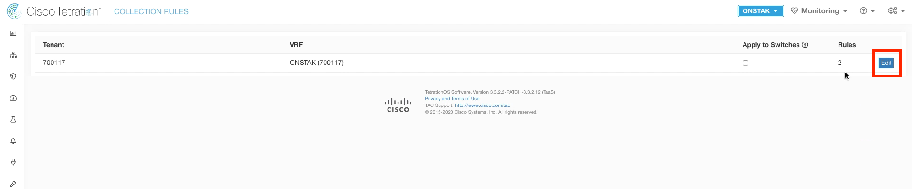
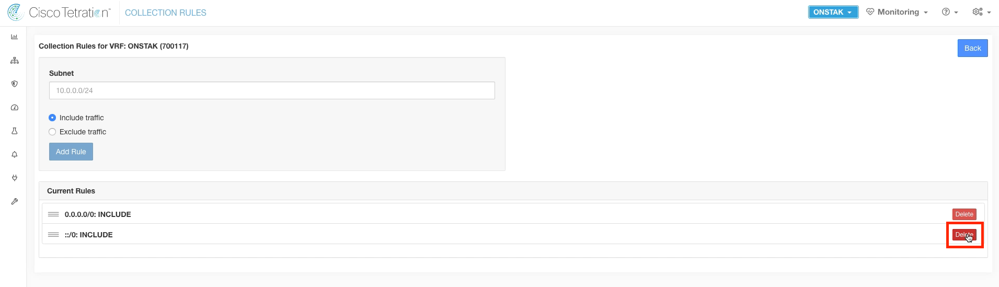
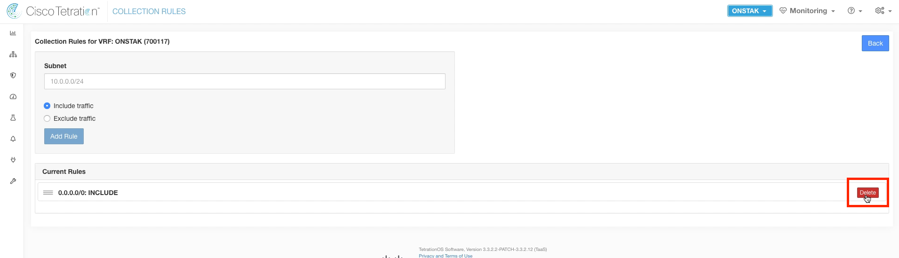
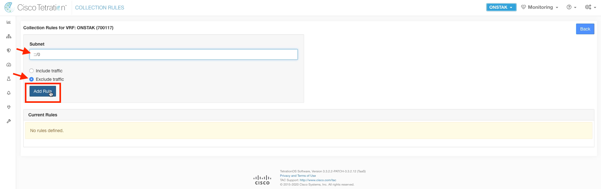
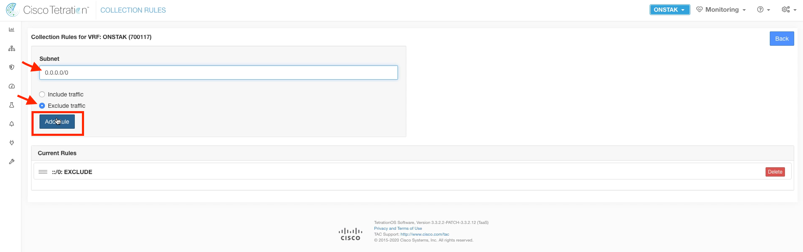
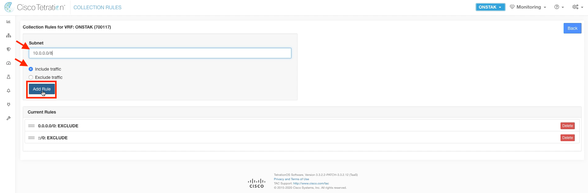
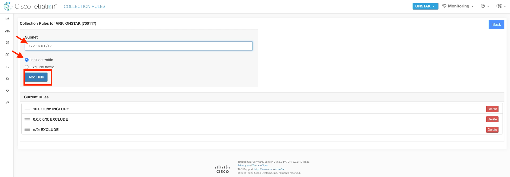
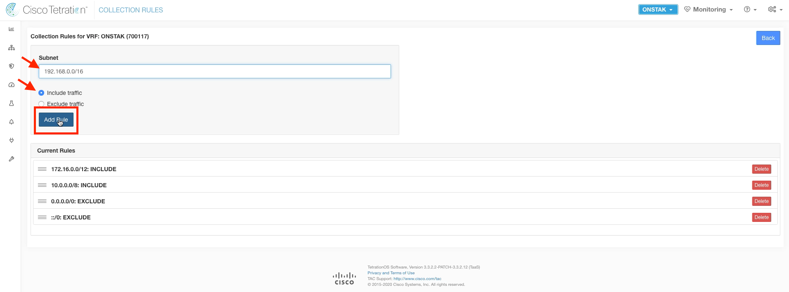
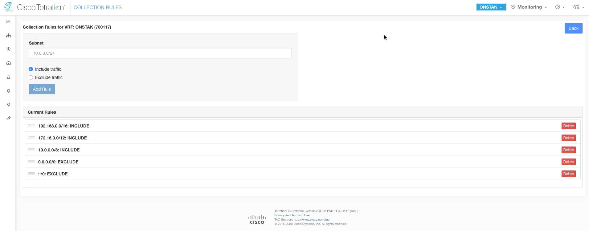

# Cisco Tetration - Hands-On Lab

## Module 03.01 -- Lecture -- Data Sources - Collection Rules
In this module we will configure Collection Rules.  Collection Rules govern what endpoints will be considered for inclusion in inventory.  Typically this should be any internal IP address space of an organization.  It may also make sense to configure public IP address space that is used by an organization,  such as DMZ or public cloud address space.  

When configuring Collection rules, we must first delete the IPv6 and IPv4 rules that are configured by default in a new Tetration deployment. Then we can create our own specific rules to match the internal IP space. In the lab,  we'll assume the customer uses all RFC1918 private address space inside their organization.

---

<a href="https://cisco-tetration-hol-content.s3.amazonaws.com/videos/02_collection_rules.mp4" style="font-weight:bold" title="Collection Rules Title"> Click here to view a video of the tasks being performed to configure Collection Rules.</a>

---

### Steps for this Module  

Perform the following tasks to configure Collection Rules.  

<a href="#step-001" style="font-weight:bold">Step 001 - Navigate to Collection Rules</a>  
<a href="#step-002" style="font-weight:bold">Step 002 - Edit the Collection Rules</a>  
<a href="#step-003" style="font-weight:bold">Step 003 - Delete the default IPv6 rule</a>  
<a href="#step-004" style="font-weight:bold">Step 004 - Delete the default IPv4 rule</a>  
<a href="#step-005" style="font-weight:bold">Step 005 - Enter a new exclude rule for IPv6</a>  
<a href="#step-006" style="font-weight:bold">Step 006 - Enter a new exclude rule for IPv4</a>  
<a href="#step-007" style="font-weight:bold">Step 007 - Enter a rule for 10.0.0.0/8</a>  
<a href="#step-008" style="font-weight:bold">Step 008 - Enter a rule for 172.16.0.0/12</a>  
<a href="#step-009" style="font-weight:bold">Step 009 - Enter a rule for 192.168.0.0/16</a>  
<a href="#step-010" style="font-weight:bold">Step 010 - View the final ruleset</a>  
  
---

<a href="#step-001" style="font-weight:bold">Step 001</a>

Click on the gear icon in the upper right hand corner and select Collection Rules.

  

<a href="#step-002" style="font-weight:bold">Step 002</a>

Click on Edit.  

  

<a href="#step-003" style="font-weight:bold">Step 003</a>

Click Delete to remove the default ::/0: IPv6 rule.  

  

<a href="#step-004" style="font-weight:bold">Step 004</a>
  

Click Delete to remove the default 0.0.0.0/0 IPv4 rule.

  

<a href="#step-005" style="font-weight:bold">Step 005</a>

Enter ::/0: in the Subnet field,  select "Exclude traffic" and then Add Rule.  

  

<a href="#step-006" style="font-weight:bold">Step 006</a>

 Enter 0.0.0.0/0 in the Subnet field, Select "Exclude traffic" and then Add Rule.  

  

<a href="#step-007" style="font-weight:bold">Step 007</a>

 Enter 10.0.0.0/8 in the Subnet field,  Select "include traffic" and then Add Rule.  

  

<a href="#step-008" style="font-weight:bold">Step 008</a>

Enter 172.16.0.0/12 in the Subnet field,  Select "include traffic" and then Add Rule.  

  

<a href="#step-009" style="font-weight:bold">Step 009</a>

Enter 192.168.0.0/16 in the Subnet field,  Select "include traffic" and then Add Rule.  

  

<a href="#step-010" style="font-weight:bold">Step 010</a>

Below is what the ruleset should look like when finished.

  

| [Return to Table of Contents](https://tetration.guru/labguide/) | [Go to Top of the Page]() | [Continue to the Introduction]() |
