# Cisco Tetration Virtual Bootcamp

## Module 03.02  Data Sources - Agents
Tetration agent (also called sensor) installation can be performed manually using a shell script for Linux and a Powershell script (.ps1) for Windows. These scripts can also be leveraged by 3rd party software configuration management systems such as Ansible, Puppet, Microsoft SCCM, etc. to automate deployment across multiple machines. The installation does not require any modification to run unattended, the scripts run without any interaction required from the administrator. It is important that the scripts be downloaded from the Tetration cluster, as they have specific information embedded to connect to the cluster.  When the script is executed, it will pull down the required software from the Tetration cluster based on the Operating System in use. This means that outbound connectivity from each server to the Tetration cluster is a requirement.

In this module, we'll download the installation scripts for Windows and Linux from the Tetration cluster and use Ansible to perform automated rollout of the sensors.

## --- Diagram Overview ---  
---  
This diagram depicts how you will deploy Tetration Agents out to each of your workloads in your lab environment. Deployment will occur by performing the following tasks:
   1. Connect to the Guac server via HTTPS
   2. Click on and connecting to the Ansible machine
   3. Verify and, if necessary, edit the inventory for deployment by first changing directories with `cd /opt/ansible-tetration-sensor/` running `sudo nano inventory/hosts` and when prompted with `[sudo] password for ciscolab:`, entering the standard lab password of `tet123$$!`. 

<a href="https://www.lucidchart.com/documents/view/425e1b97-194e-413a-b793-0df939a87501" target="_blank">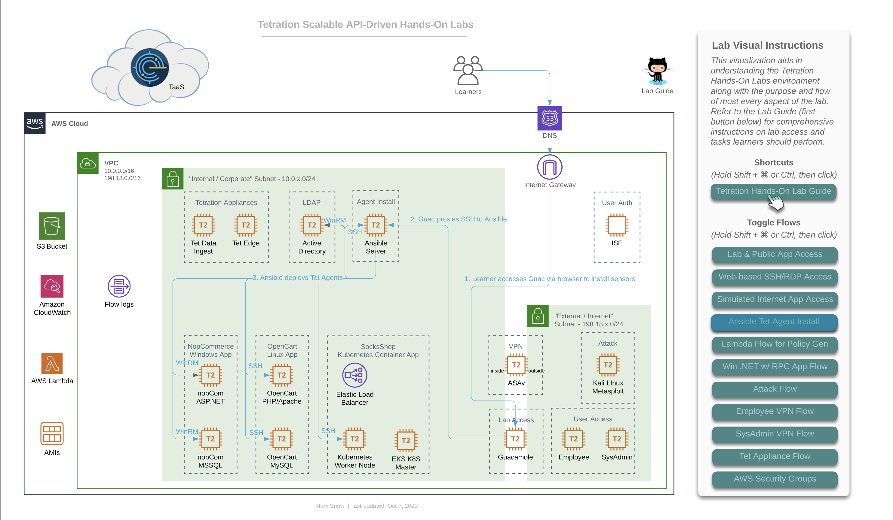</a>  

The Ansible machine is already configured to deploy agents out to the following workloads by OS:

   * Windows 2019
      * nopCommerce IIS server
      * nopCommerce MSSQL server
      * Active Directory server
   * CentOS 7
      * OpenCart Apache server
      * OpenCart MySQL server
      * Ansible Automation server (itself)
   * Ubuntu 16.04
      * EKS Worker Node
  

## --- Lecture Video ---  
---  
<a href="https://deftcon-tetration-virtual-bootcamp.s3.us-east-2.amazonaws.com/lectures/Module_03.02__Lecture__Data_Sources__Agents.mp4" style="font-weight:bold">Data Sources - Collection Rules :: Lecture Video :: Runtime: 13 mins</a>  
  
---  
  

## --- Demo Video ---  
---  
<a href="https://deftcon-tetration-virtual-bootcamp.s3.us-east-2.amazonaws.com/demos/Module_03.02__Demo__Data_Sources__Agents.mp4" style="font-weight:bold">Data Sources - Collection Rules :: Demo Video :: Runtime: 2 mins</a>  
  
---  

## --- Lab :: Agent Deployment via Ansible ---  
### Steps for this Lab  
<a href="#step-001" style="font-weight:bold">Step 001 - Navigate to Agent Config</a>  
<a href="#step-002" style="font-weight:bold">Step 002 - Click on Software Agent Download</a>  
<a href="#step-003" style="font-weight:bold">Step 003 - Select the Linux Enforcement Agent</a>  
<a href="#step-004" style="font-weight:bold">Step 004 - Save the Linux shell script</a>  
<a href="#step-005" style="font-weight:bold">Step 005 - Select the Windows Enforcement Agent</a>  
<a href="#step-006" style="font-weight:bold">Step 006 - Save the Windows Powershell script</a>  
<a href="#step-007" style="font-weight:bold">Step 007 - Open a session to the Ansible machine</a>  
<a href="#step-008" style="font-weight:bold">Step 008 - Copy the scripts to the Ansible machine</a>  
<a href="#step-009" style="font-weight:bold">Step 009 - Examine the Ansible inventory</a>  
<a href="#step-010" style="font-weight:bold">Step 010 - Run the Ansible playbook</a>  
<a href="#step-011" style="font-weight:bold">Step 011 - Verify Ansible playbook results</a>  
<a href="#step-012" style="font-weight:bold">Step 012 - Open a session to the IIS web server</a>  
<a href="#step-013" style="font-weight:bold">Step 013 - Locate the Services console</a>  
<a href="#step-014" style="font-weight:bold">Step 014 - Verify the Tetration services are active</a>  
<a href="#step-015" style="font-weight:bold">Step 015 - Open a session to the Apache web server</a>  
<a href="#step-016" style="font-weight:bold">Step 016 - Verify the Tetration services are active</a>  
<a href="#step-017" style="font-weight:bold">Step 017 - Navigate to Software Agents</a>  
<a href="#step-018" style="font-weight:bold">Step 018 - Verify the agents are registered</a>  

---  

<a href="#step-001" style="font-weight:bold">Step 001</a>
  

Navigate to Agent Config.

<a href="images/module_03-02_001.png">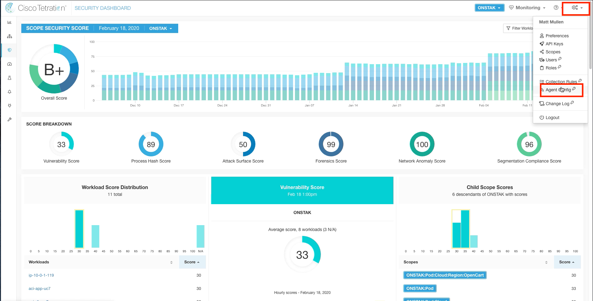</a>  

<a href="#step-002" style="font-weight:bold">Step 002</a>
  

Select the Software Agent Download tab.

  

<a href="#step-003" style="font-weight:bold">Step 003</a>
  

Select the Linux platform,  Enforcement Agent,  and then click Download Installer.

  

<a href="#step-004" style="font-weight:bold">Step 004</a>
  

Save the file to the desktop and rename it to `tet-linux.sh`.  

  

<a href="#step-005" style="font-weight:bold">Step 005</a>
  

Select the Windows platform, Enforcement Agent,  and then Download Installer.

<a href="images/module_03-02_005.png">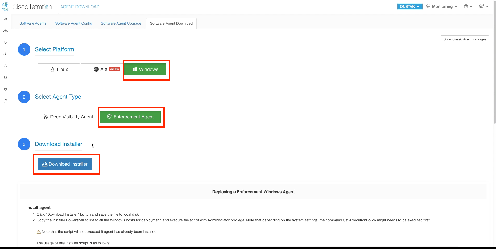</a>  

<a href="#step-006" style="font-weight:bold">Step 006</a>
  

Name the file `tet-win.ps1` and save the file to the desktop.

<a href="images/module_03-02_006.png">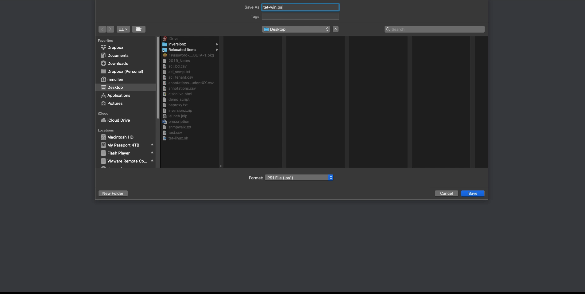</a>  

<a href="#step-007" style="font-weight:bold">Step 007</a>
  

Log into the Apache Guacamole server and open a session to the Ansible machine.

<a href="images/module_03-02_007.png">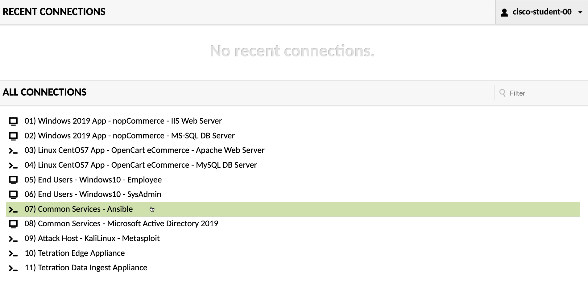</a>  

<a href="#step-008" style="font-weight:bold">Step 008</a>
  

Copy the scripts from the desktop to the Ansible machine by clicking and dragging them from the desktop to the Ansible console window.  A file copy dialogue should be displayed in the lower right-hand corner.   Once complete,  do an `ls` to list the directory on the Ansible machine and make sure the files are present.

<a href="images/module_03-02_008.png">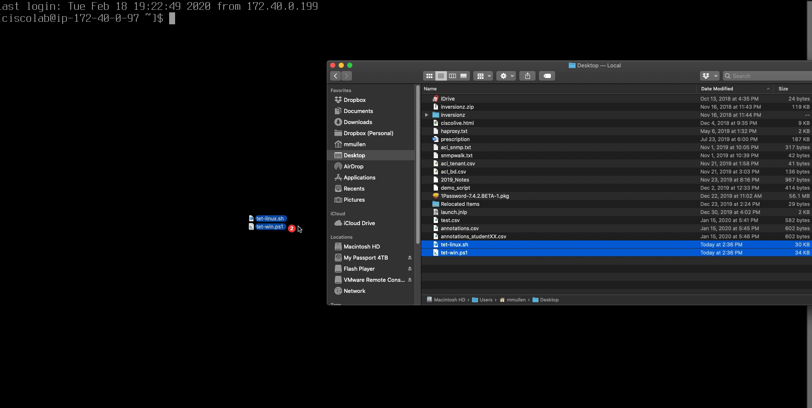</a>  

<a href="#step-009" style="font-weight:bold">Step 009</a>
  

Switch to the directory containing the Ansible playbooks with the command `cd /opt/ansible-tetration-sensor/` and then `cd inventory` to switch to the Inventory directory.  Type the command `cat hosts` and examine the contents in the inventory file. The Linux and Windows machine IP addresses as listed in your student spreadsheet should already be populated in the [centos] section for Linux and the [win] section for Windows.

  

<a href="#step-010" style="font-weight:bold">Step 010</a>
  

Type `cd ..` to exit the Inventory directory and run the following command to execute the Ansible playbook:

`ansible-playbook playbooks/clean-install-with-script.yml`

<a href="images/module_03-02_010.png">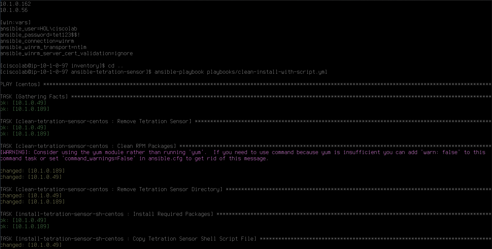</a>  

<a href="#step-011" style="font-weight:bold">Step 011</a>
  

The Ansible playbook will take a few minutes to complete.  When finished, you should see a PLAY RECAP section indicating the success or failure of installation on each machine.  

> Ignore the failure of host 10.1.0.162 in the image below, the machine was undergoing maintenance when the installation was performed.

  

> The playbook may display an error such as the one below for the Windows machines. Ignore the error,  the installation actually completed successfully but the connection from the Ansible machine was disrupted briefly by the sensor installation.  We are currently investigating workarounds to avoid the error in the future.    

<a href="#step-012" style="font-weight:bold">Step 012</a>
  

Open a session to the IIS Web Server.

<a href="images/module_03-02_012.png">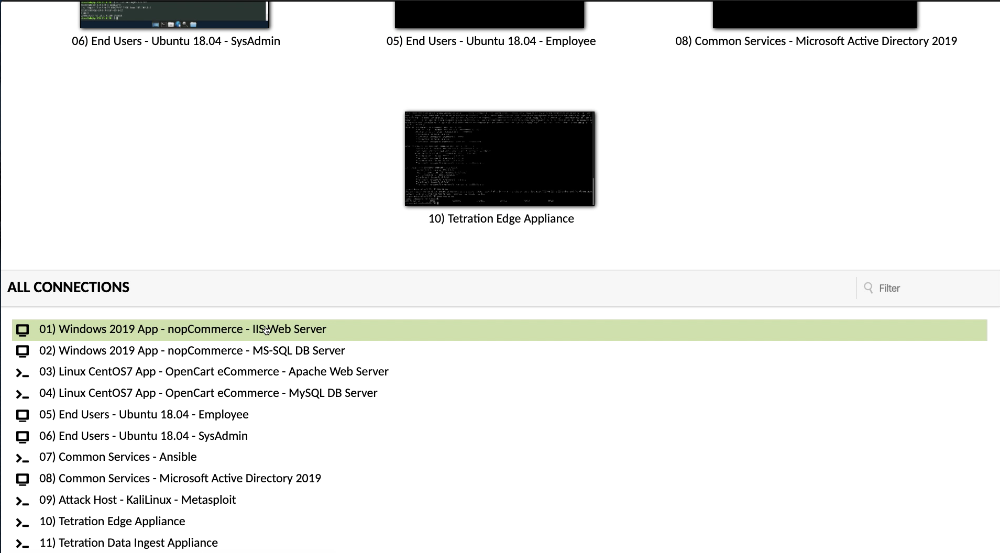</a>  

<a href="#step-013" style="font-weight:bold">Step 013</a>
  

Click on the Search button and enter "services",  and then open up Services Control Panel.

<a href="images/module_03-02_013.png">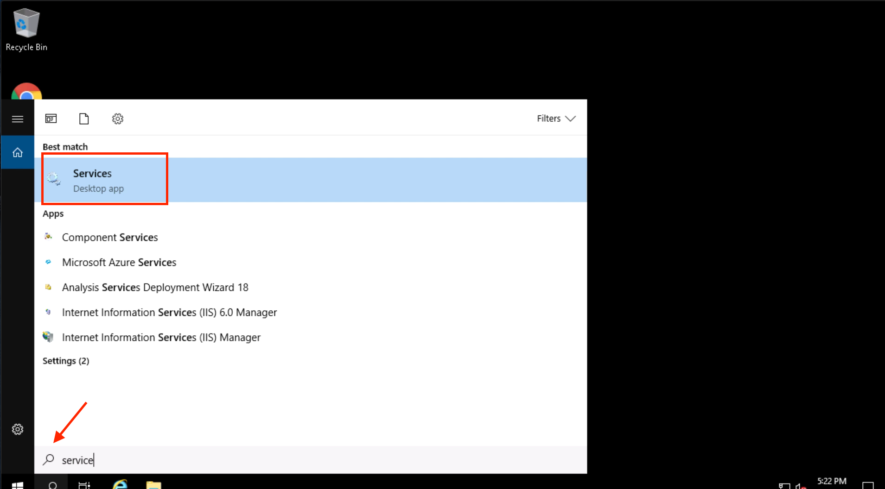</a>  

<a href="#step-014" style="font-weight:bold">Step 014</a>
  

Scroll down and locate the WindowsAgentEngine and WindowsTetEngine services and ensure they are in Running state.

<a href="images/module_03-02_014.png">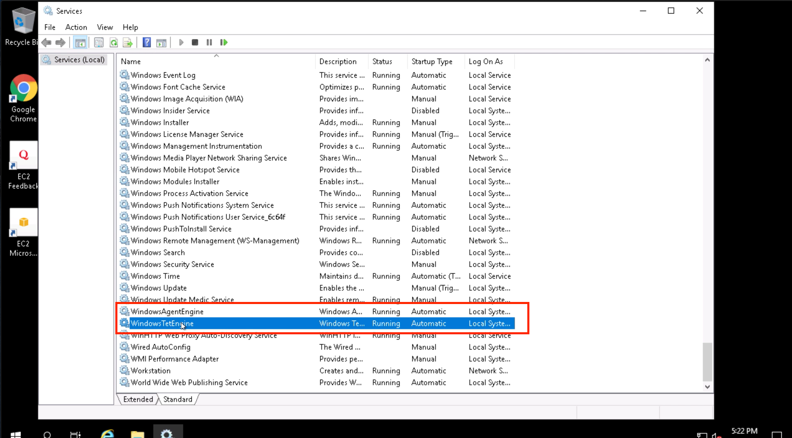</a>  

### REPEAT STEPS 012-14 FOR THE MS-SQL DB SERVER AND MICROSOFT ACTIVE DIRECTORY SERVER

<a href="#step-015" style="font-weight:bold">Step 015</a>
  

Open a session to the Apache Web Server.

<a href="images/module_03-02_015.png">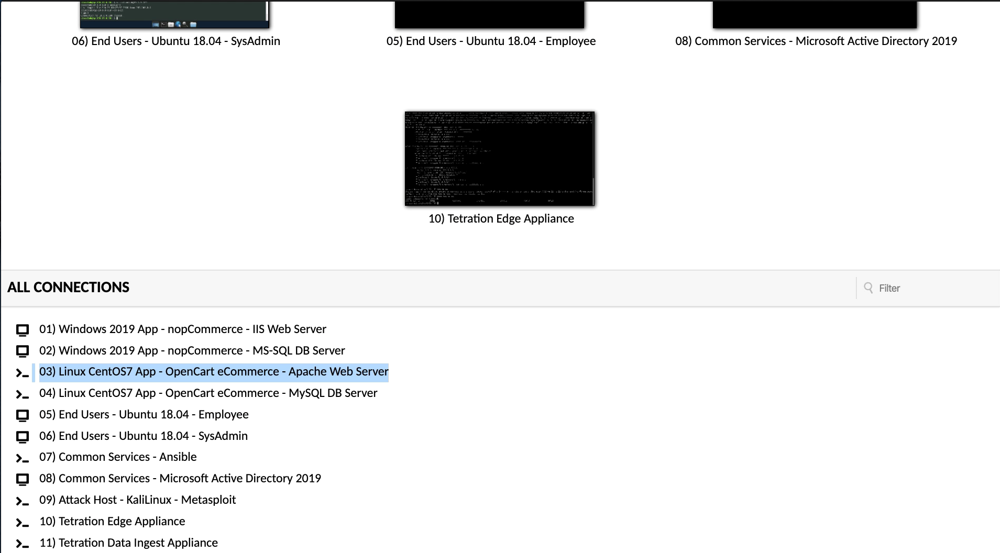</a>  

<a href="#step-016" style="font-weight:bold">Step 016</a>
  

Run the command `ps -ef | grep tet` and ensure that the tet-engine, and ensure that the tet-engine, tet-enforcer, and tet-sensor services are displayed.

<a href="images/module_03-02_016.png">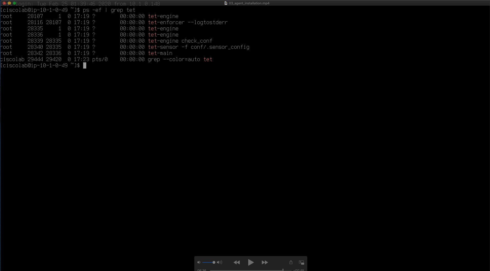</a>  

### REPEAT STEPS 15-16 FOR THE MYSQL DB SERVER

<a href="#step-017" style="font-weight:bold">Step 017</a>
  

Navigate to Agent Config. 

  

<a href="#step-018" style="font-weight:bold">Step 018</a>
  

Click on the Software Agents tab,  and ensure that all of the sensors that were installed are displayed.  

<a href="images/module_03-02_018.png">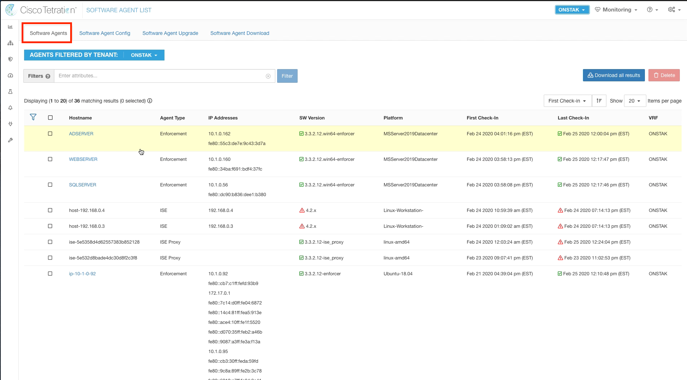</a>  

---  
  
## --- Lab :: Agent Config Intent ---  
Agent Config Intent defines what features will be enabled for a group of sensors.  The Config Intent can be tied to an Inventory Filter, which provides the capability to apply different configurations to different types of hosts.  For example, you could define a profile enabling a specific set of features to all Windows machines,  and a separate profile enabling a different set of features to all Linux machines.  We will see an example of doing just that in the exercise below.  

### Steps for this Lab  
<a href="#step-001" style="font-weight:bold">Step 019 - Navigate to Agent Config</a>  
<a href="#step-002" style="font-weight:bold">Step 020 - Create a Profile for Windows machines</a>  
<a href="#step-003" style="font-weight:bold">Step 021 - Configure Windows Profile Settings</a>  
<a href="#step-004" style="font-weight:bold">Step 022 - Configure Windows Profile Settings</a>  
<a href="#step-005" style="font-weight:bold">Step 023 - Create a Profile for Linux machines</a>  
<a href="#step-006" style="font-weight:bold">Step 024 - Configure Linux Profile Settings</a>  
<a href="#step-007" style="font-weight:bold">Step 025 - Configure Linux Profile Settings</a>  
<a href="#step-008" style="font-weight:bold">Step 026 - Create a Config Intent for Windows</a>  
<a href="#step-009" style="font-weight:bold">Step 027 - Create a new Inventory Filter</a>  
<a href="#step-010" style="font-weight:bold">Step 028 - Configure Inventory Filter for Windows OS</a>  
<a href="#step-011" style="font-weight:bold">Step 029 - Apply the Inventory Filter to the Config Intent</a>  
<a href="#step-012" style="font-weight:bold">Step 030 - Create a Config Intent for Linux</a>  
<a href="#step-013" style="font-weight:bold">Step 031 - Create a new Inventory Filter</a>  
<a href="#step-014" style="font-weight:bold">Step 032 - Configure Inventory Filter for Linux OS</a>  
<a href="#step-015" style="font-weight:bold">Step 033 - Apply the Inventory Filter to the Config Intent</a>  

---  

<a href="#step-019" style="font-weight:bold">Step 019</a>

Select the Gear icon and select Agent Config.  

<a href="images/module_03-02_019.png">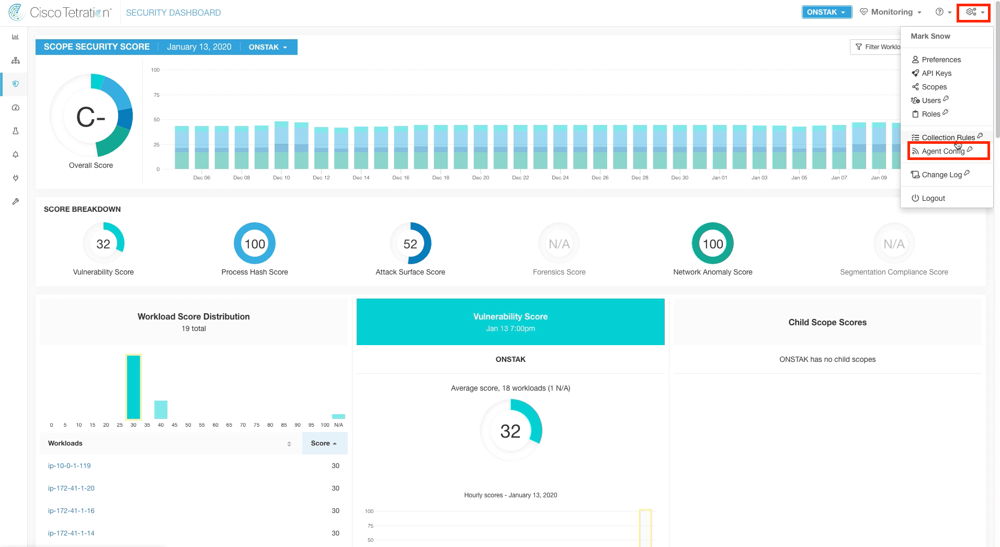</a>  

<a href="#step-020" style="font-weight:bold">Step 020</a>
  

Click Create Profile to being creating an Agent Config Profile that we will apply to Windows machines.

<a href="images/module_03-02_020.png">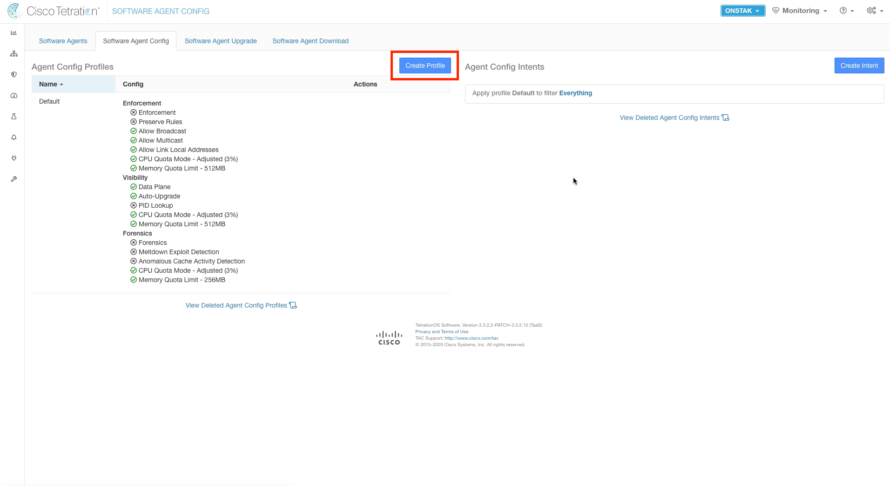</a>  

<a href="#step-021" style="font-weight:bold">Step 021</a>
  

Enter the name Windows for the profile name,  and select to enable Enforcement and Preserve rules.  

> Enforcement - This agent config intent setting provides the capability to enable/disable the enforcement feature.  This can be useful to prevent a situation where you have a set of machines that you would like to ensure cannot be put into enforcement inadvertently.

> Preserve Rules - When enabled,  this setting will preserve any manually configured firewall rules that might be present on the servers when going into enforcement.  It is common to set this to enabled, such as to preserve any rules that might have been previously configured.

<a href="images/module_03-02_021.png">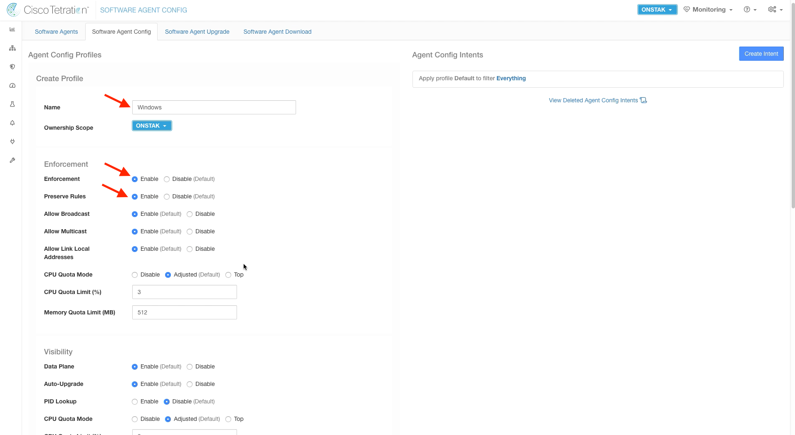</a>  

<a href="#step-022" style="font-weight:bold">Step 022</a>
  

Click to enable the following settings and then Save the configuration:
- PID Lookup
- Forensics
- Meltdown Exploit Detection
- Anamalous Cache Activity Detection

> NOTE: The Auto-Upgrade setting will cause the agents to be upgraded automatically when Tetration code is updated.  It is common to disable this feature in a production environment so that agents can be upgraded in a more controlled manner.

<a href="images/module_03-02_022.png">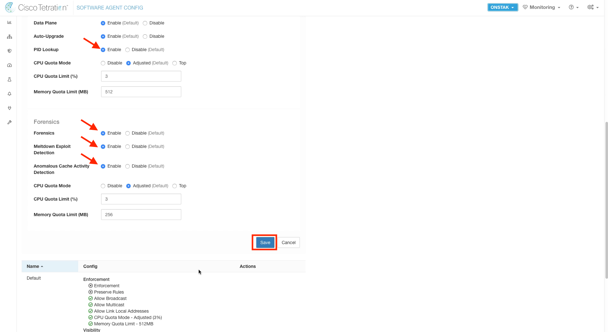</a>  

<a href="#step-023" style="font-weight:bold">Step 023</a>
  

Select Create Profile to create a new Agent Config Profile for Linux machines.

<a href="images/module_03-02_023.png">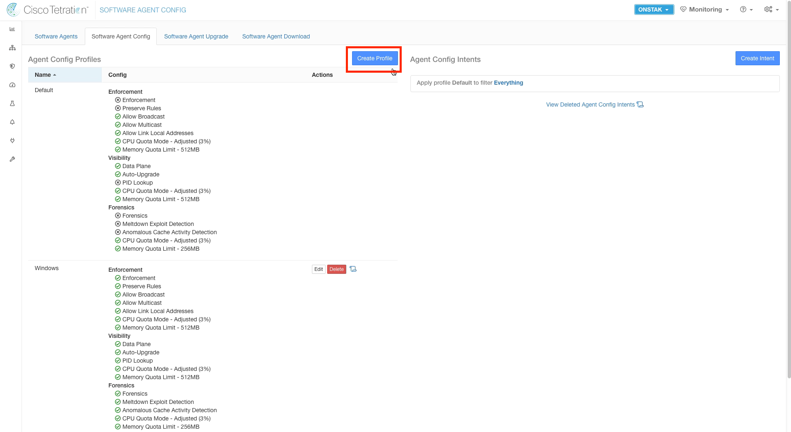</a>  

<a href="#step-024" style="font-weight:bold">Step 024</a>
  

Enter the profile name Linux,  and enable Enforcement and Preserve Rules features.

<a href="images/module_03-02_024.png">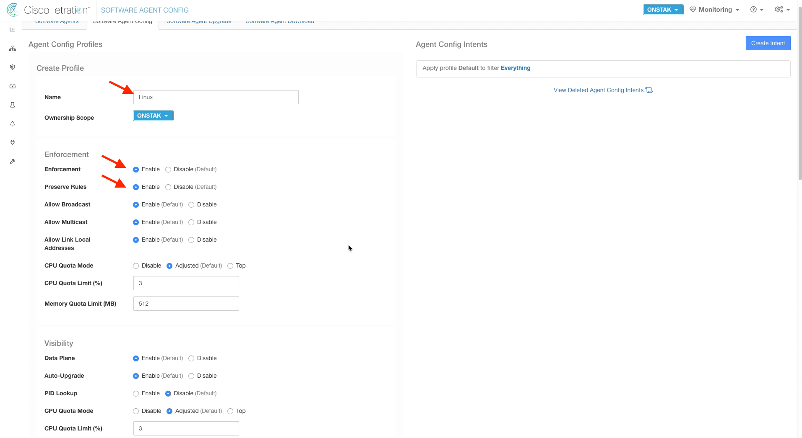</a>  

<a href="#step-025" style="font-weight:bold">Step 025</a>
  

Scroll down and Save the configuration.  

<a href="images/module_03-02_025.png">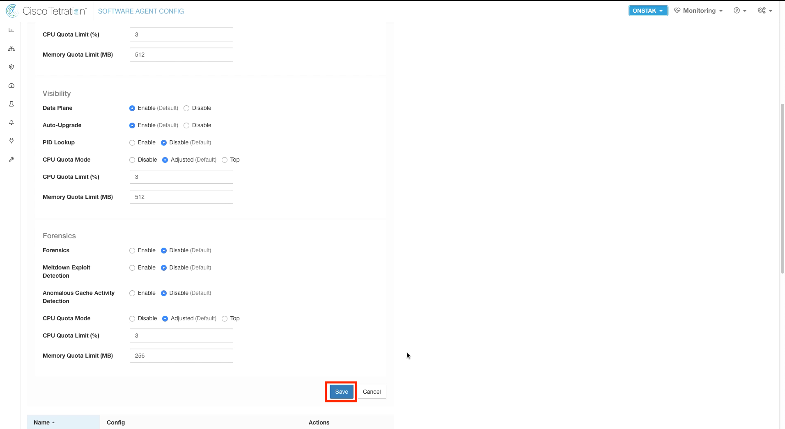</a>  

<a href="#step-026" style="font-weight:bold">Step 026</a>
  

Click Create Intent to begin creating the Windows Agent Config Intent.  

<a href="images/module_03-02_026.png">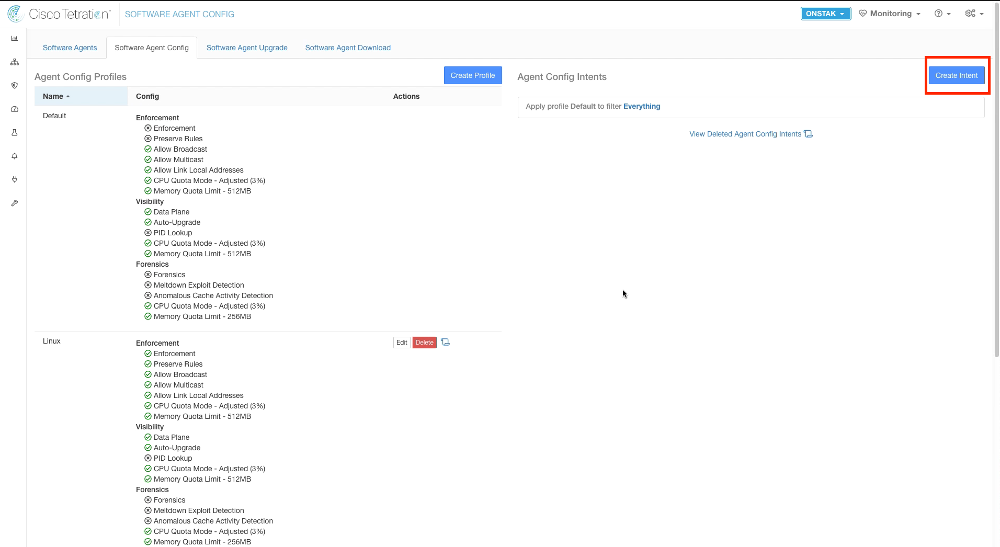</a>  

<a href="#step-027" style="font-weight:bold">Step 027</a>
  

Select to apply the profile that we just created called Windows,  and select to create a new filter.  This will create a new Inventory Filter that we will configure to match on the Windows Operating System.

<a href="images/module_03-02_027.png">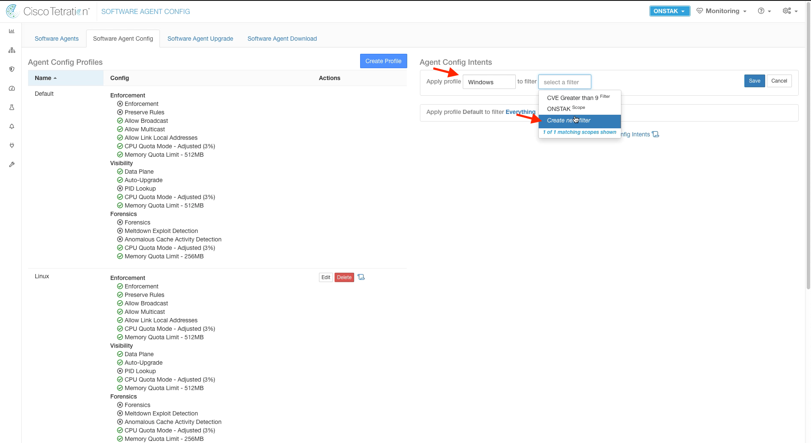</a>  

<a href="#step-028" style="font-weight:bold">Step 028</a>
  

Enter Windows for the name,  and enter the query "OS contains MS".  Then save the new filter.  This will match any machines with sensors installed that have "MS" in their Operating System name.  Also notice that the filter already matches inventory items (your number of matched items may differ from the image).  

<a href="images/module_03-02_028.png">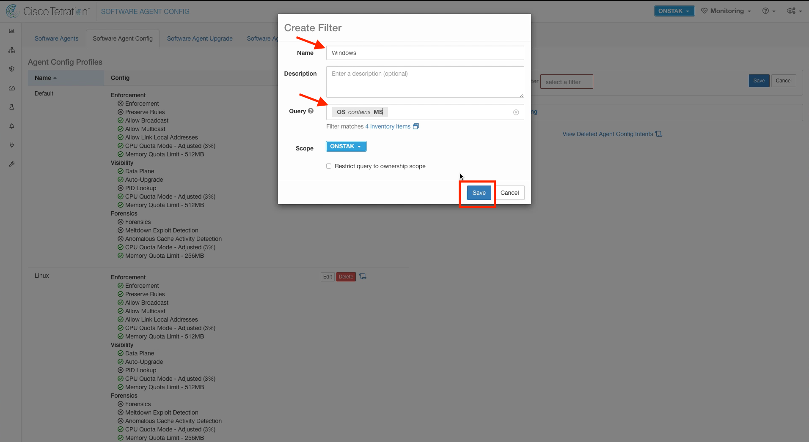</a>  

<a href="#step-029" style="font-weight:bold">Step 029</a>
  

Make sure the "to filter" field is set to the Windows inventory filter we just created,  and select Save.  We have now applied the new Config Intent.  Any Windows machines matching the inventory filter we created will now have the configuration applied.  

<a href="images/module_03-02_029.png">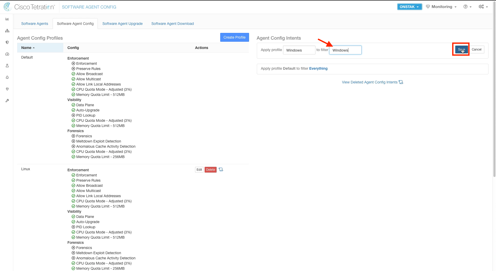</a>  

<a href="#step-030" style="font-weight:bold">Step 030</a>
  

Create a new Config Intent for Linux machines.

<a href="images/module_03-02_030.png">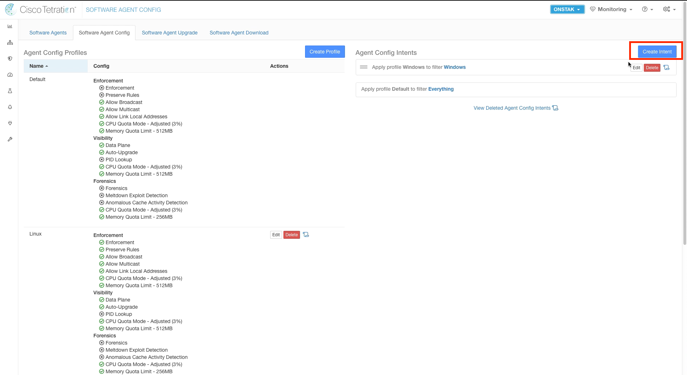</a>  

<a href="#step-031" style="font-weight:bold">Step 031</a>
  

Select to apply the Linux profile that we previously created,  and select Create new filter.

<a href="images/module_03-02_031.png">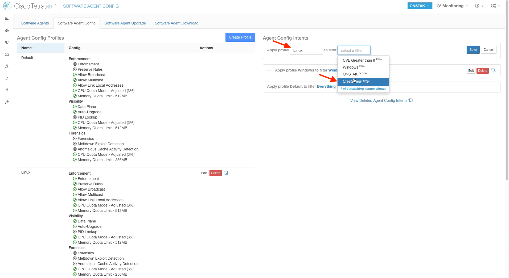</a>  

<a href="#step-032" style="font-weight:bold">Step 032</a>
  

Enter the name Linux and the query "OS contains CentOS".  This will match any machines with sensors installed that are running the CentOS Operating System.  Later we will see how we can add additional OS flavors to this Config Intent.

<a href="images/module_03-02_032.png">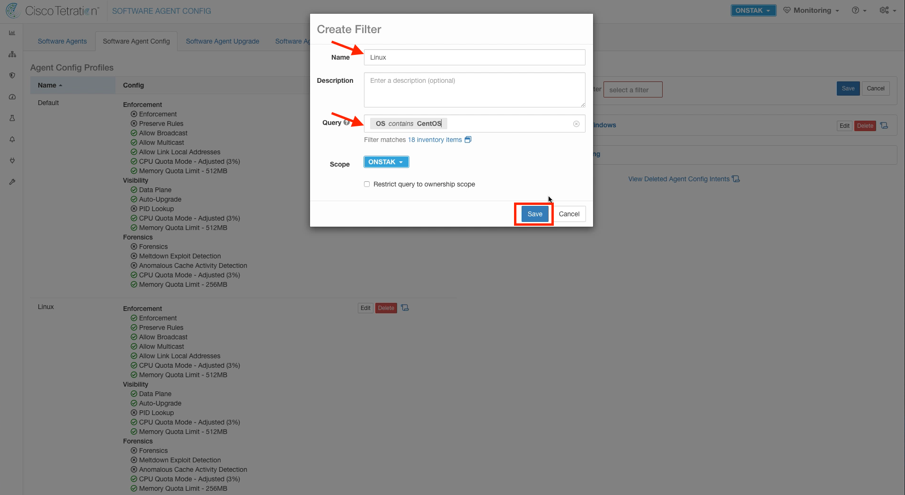</a>  

<a href="#step-033" style="font-weight:bold">Step 033</a>
  

Ensure that the Inventory Filter we just created called Linux is selected as the "to filter" and Save to apply the Config Intent.  

<a href="images/module_03-02_033.png">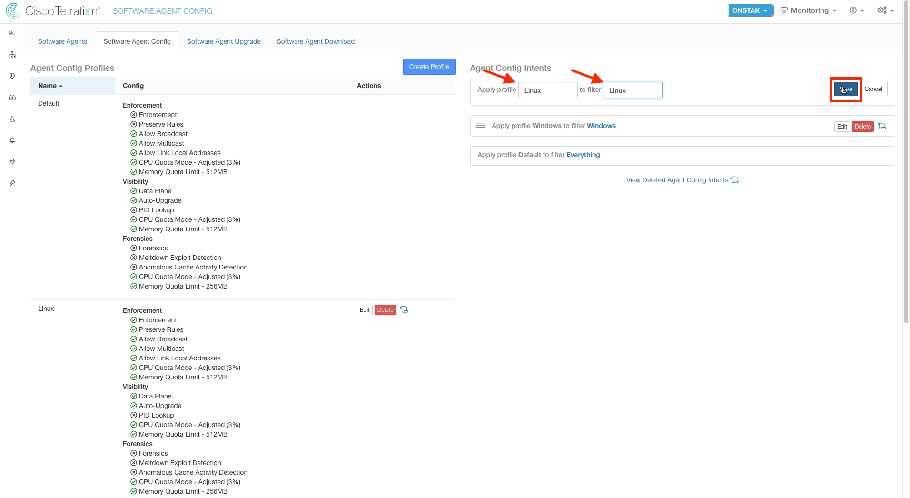</a>  

---  

| [Return to Table of Contents](https://tetration.guru/bootcamp/) | [Go to Top of the Page](readme.md) | [Continue to the Next Module](../module_03-01/) |
