# Cisco Tetration Virtual Bootcamp

## Module 03.03  Data Sources - Annotations
Annotations are metadata that can be associated with endpoint IP addresses that are stored in Tetration inventory. Traditionally, IP addresses and/or hostnames of devices have been the primary means of identifying devices in an environment. Annotations provide a mechanism by which we can provide more context about the IP addresses, and build search criteria and policy within the platform using language that is much more consumable and meaningful to humans. Each IP address can be annotated with up to 32 fields of metadata.  With annotations we can build policy that is dynamic; by changing an annotation we can potentially affect the policy that is being applied to a particular machine.  Take for an example a machine that has been identified by the security team as running a highly vulnerable version of software.  By creating a policy that matches an annotation of "Quarantine",  we can annotate the workload with the "Quarantine" annotation to cause it to be removed from the network so that the vulnerability can be patched.

In this module,  we'll configure Static Annotations for the endpoints in the lab environment.  Static Annotations are manually configured by the Tetration administrator by uploading a .CSV file,  or alternatively by configuring one at a time using the Assign Annotations wizard from the Inventory Upload screen.  Annotations can also be populated from external sources,  such as tags in VMware and AWS.  External annotations will be covered in the next section covering External Orchestrators.


## --- Lecture Video ---  
---  
<a href="https://deftcon-tetration-virtual-bootcamp.s3.us-east-2.amazonaws.com/lectures/Module_03.03__Lecture__Data_Sources__Annotations.mp4" style="font-weight:bold">Data Sources - Annotations :: Lecture Video :: Runtime: 58 mins</a>  
  
---  
  

## --- Demo Video ---  
---  
<a href="https://deftcon-tetration-virtual-bootcamp.s3.us-east-2.amazonaws.com/demos/Module_03.03__Demo__Data_Sources__Annotations.mp4" style="font-weight:bold">Data Sources - Annotations :: Demo Video :: Runtime: 3 mins</a>  
  
---  

## --- Lab ---
### Steps for this Lab  
<a href="#step-001" style="font-weight:bold">Step 001 - Open annotations file</a>  
<a href="#step-002" style="font-weight:bold">Step 002 - Modify annotations file with lab IP addresses</a>  
<a href="#step-003" style="font-weight:bold">Step 003 - Save the annotations file to the desktop</a>  
<a href="#step-004" style="font-weight:bold">Step 004 - Navigate to Inventory Uploads</a>  
<a href="#step-005" style="font-weight:bold">Step 005 - Select the annotations file from the desktop</a>  
<a href="#step-006" style="font-weight:bold">Step 006 - Specify the upload operation</a>  
<a href="#step-007" style="font-weight:bold">Step 007 - Examine the new annotations</a>  
<a href="#step-008" style="font-weight:bold">Step 008 - Navigate to Inventory Search</a>  
<a href="#step-009" style="font-weight:bold">Step 009 - View the annotations that can be filtered upon</a>  
<a href="#step-010" style="font-weight:bold">Step 010 - Search for inventory using annotations</a>  
<a href="#step-011" style="font-weight:bold">Step 011 - Navigate to Workload Profile</a>  
<a href="#step-012" style="font-weight:bold">Step 012 - View the annotations assigned to the workload</a>  
<a href="#step-013" style="font-weight:bold">Step 013 - Annotations on the workload</a>  


---

<div class="step" id="step-001"><a href="#step-001" style="font-weight:bold">Step 001</a></div>  

Open the provided annotations.csv file in a text editor.

<a href="images/module_03-03_001.png">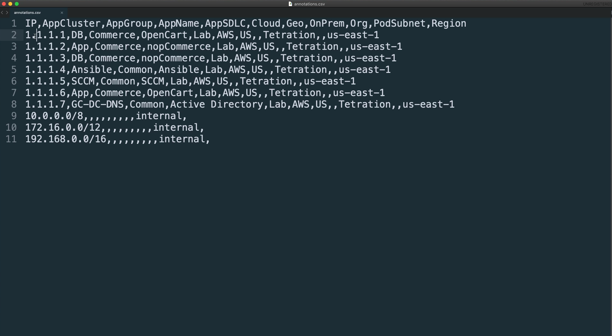</a>  


<div class="step" id="step-002"><a href="#step-002" style="font-weight:bold">Step 002</a></div>  

Change the 1.1.1.x addresses in the annotations file to the provided IP addresses for the lab.

<a href="images/module_03-03_002.png">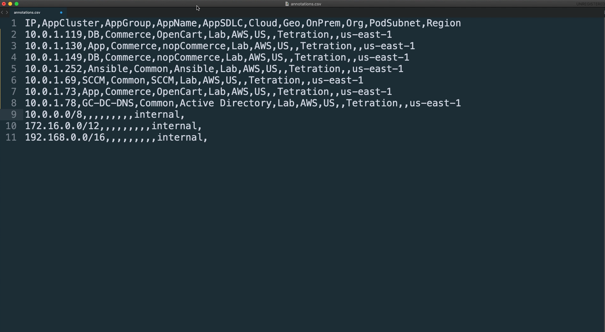</a>  


<div class="step" id="step-003"><a href="#step-003" style="font-weight:bold">Step 003</a></div>  

Save the annotations file to the desktop on the lab workstation.

<a href="images/module_03-03_003.png">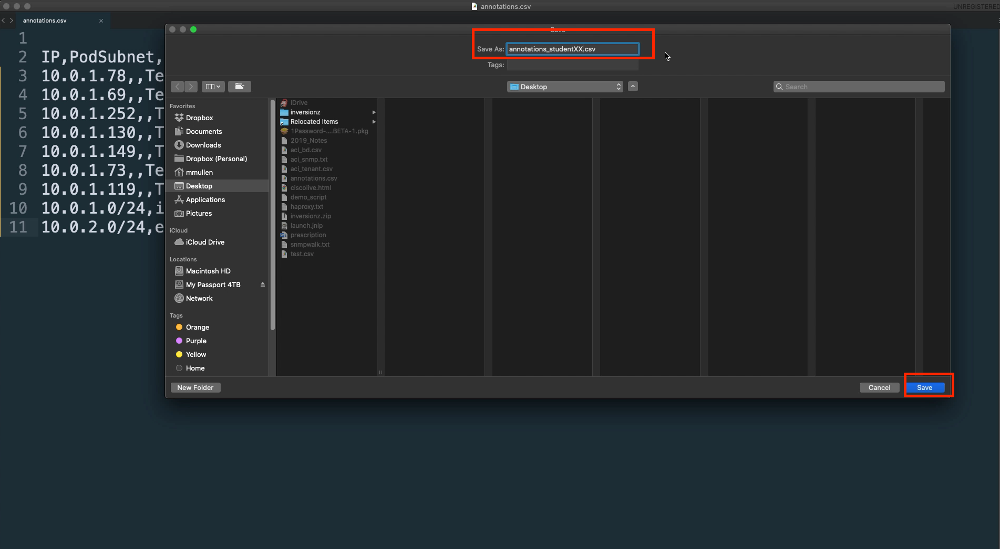</a>  


<div class="step" id="step-004"><a href="#step-004" style="font-weight:bold">Step 004</a></div>  

On the Tetration dashboard,  click on Visibility and Inventory Upload.

<a href="images/module_03-03_004.png">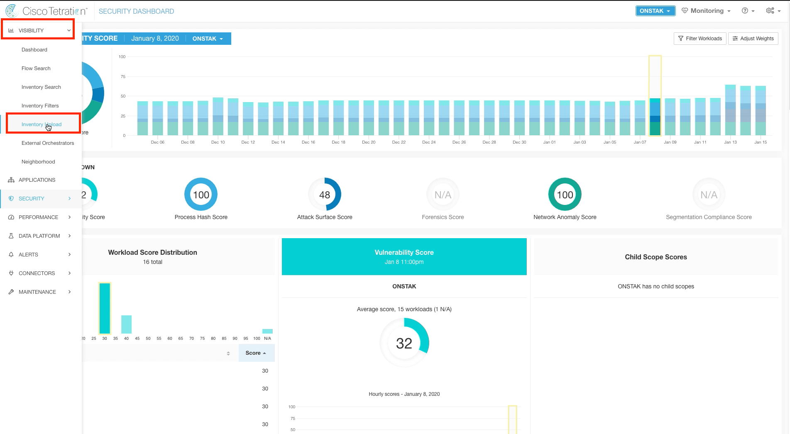</a>  


<div class="step" id="step-005"><a href="#step-005" style="font-weight:bold">Step 005</a></div>  

Click the Select File button and select the .csv file previously saved to the desktop.

<a href="images/module_03-03_005.png">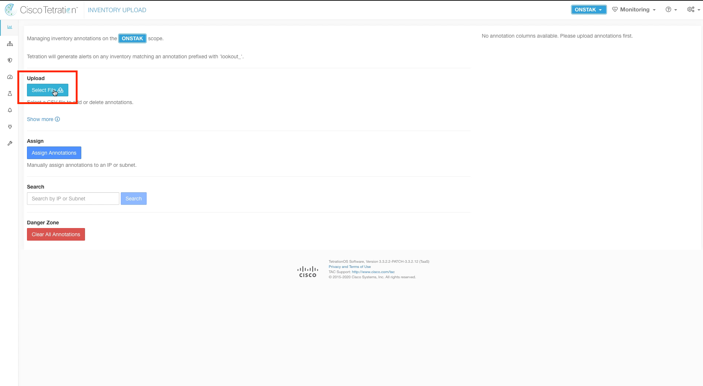</a>  


<div class="step" id="step-006"><a href="#step-006" style="font-weight:bold">Step 006</a></div>  

Click the dropdown arrow and select Add for the operation.  

<a href="images/module_03-03_006.png">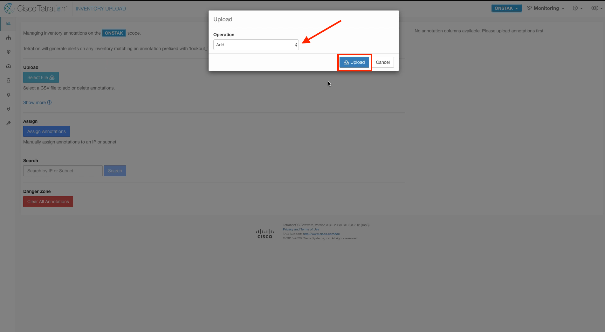</a>  


<div class="step" id="step-007"><a href="#step-007" style="font-weight:bold">Step 007</a></div>  

Notice the new annotation columns that have been imported into the cluster from the .csv file.  These map to the column headers in the .csv file.

<a href="images/module_03-03_007.png">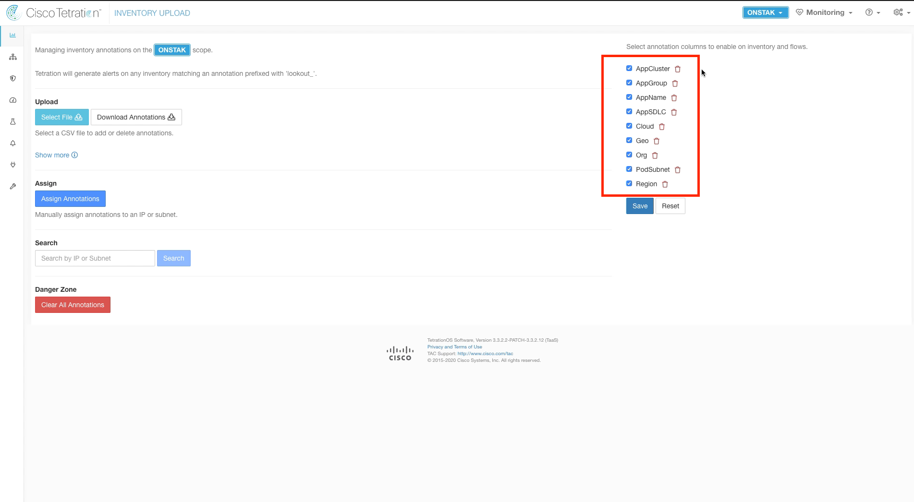</a>  


<div class="step" id="step-008"><a href="#step-008" style="font-weight:bold">Step 008</a></div>

Click on Visibility and Inventory Search.

<a href="images/module_03-03_008.png">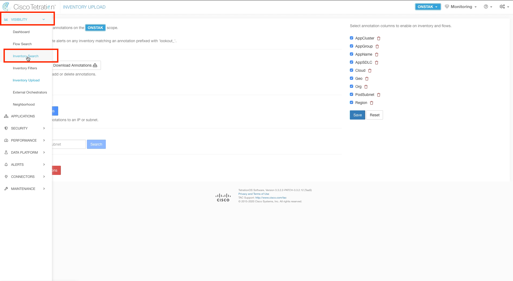</a>  


<div class="step" id="step-009"><a href="#step-009" style="font-weight:bold">Step 009</a></div>  

Here we can query for workloads using the annotations that we created.  Click on the question mark next to Filters to display the annotation columns. Tetration contains a number of default fields that can be filtered on,  however user annotations as well as annotations from external orchestrators are prepended with a * to differentiate from the system defaults.

> Note: It may take a few minutes for the newly uploaded annotations to show up in the Filters help screen.

<a href="images/module_03-03_009.png">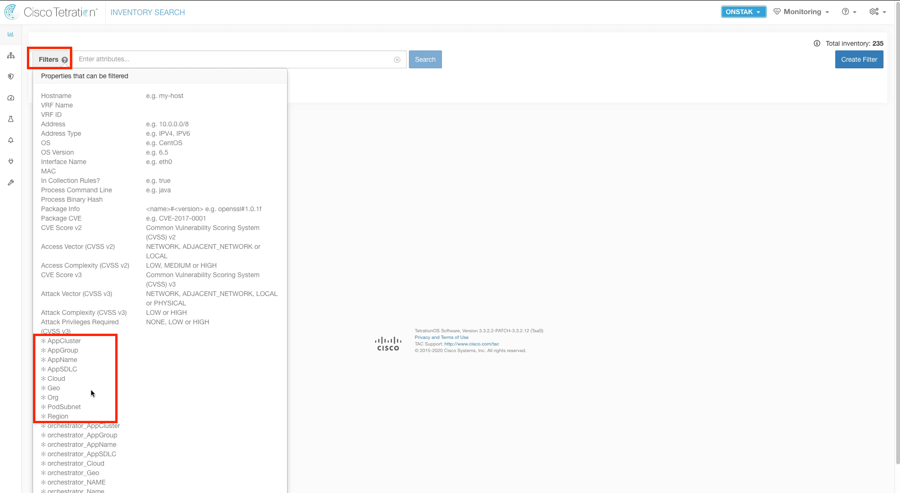</a>  


<div class="step" id="step-010"><a href="#step-010" style="font-weight:bold">Step 010</a></div>  

Enter the query: ```* AppName contains OpenCart``` and click Search. The Linux machine in your lab environment should be shown.   

<a href="images/module_03-03_010.png">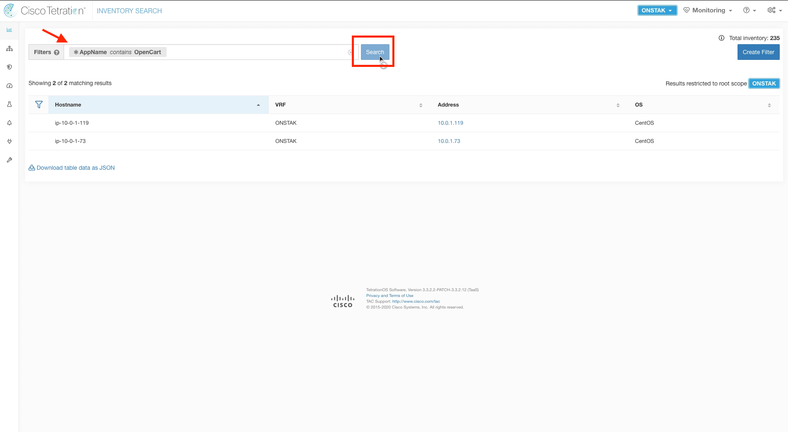</a>  

<div class="step" id="step-011"><a href="#step-011" style="font-weight:bold">Step 011</a></div>  

Click on the IP address of the Linux machine to go to the Workload Profile screen.

<a href="images/module_03-03_011.png">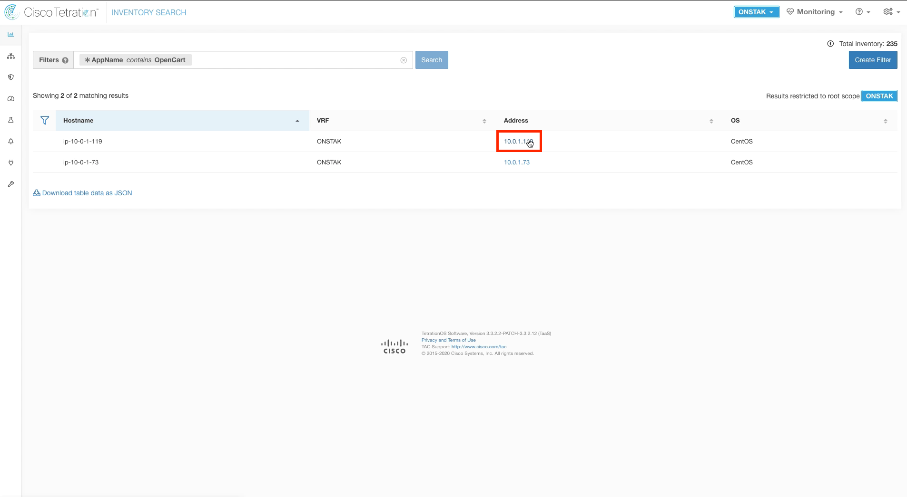</a>  

<div class="step" id="step-012"><a href="#step-012" style="font-weight:bold">Step 012</a></div>  

Click on the link under User Annotations to display the list of annotations.

<a href="images/module_03-03_012.png">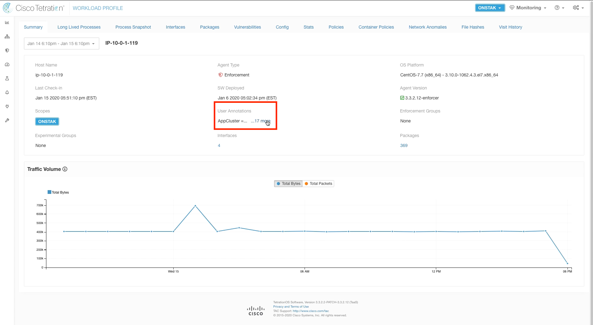</a>  

<div class="step" id="step-013"><a href="#step-013" style="font-weight:bold">Step 013</a></div>  

Here you should see the annotations and their values that were entered into the .csv file for this workload.

<a href="images/module_03-03_013.png">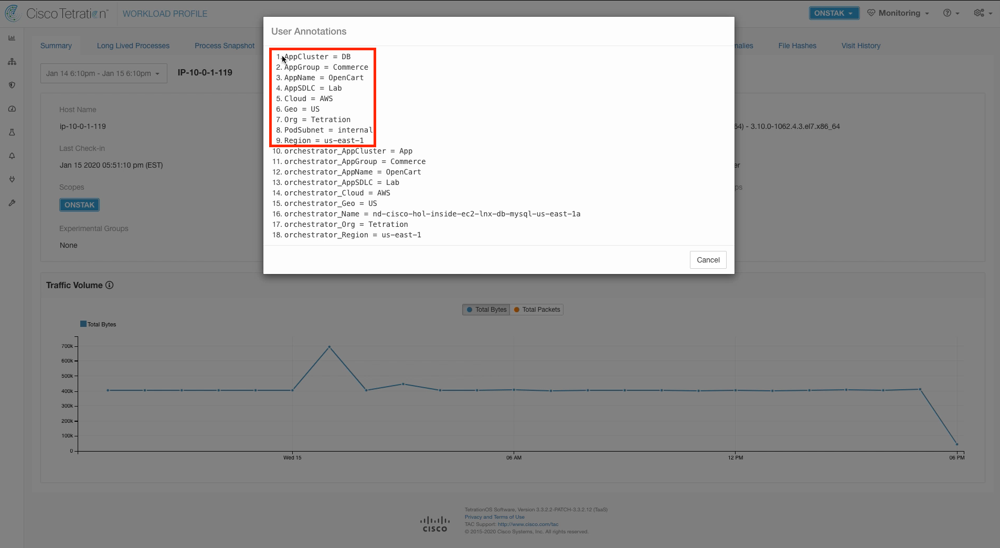</a>  


---  

| [Return to Table of Contents](https://tetration.guru/bootcamp/) | [Go to Top of the Page](README.md) | [Continue to the Next Module]() |
