# Cisco Tetration Virtual Bootcamp

## Module 03.04  Data Sources - External Orchestrators

In this section we will configure External Orchestrators.  Tetration provides the ability to pull in metadata such as tags and labels from various external sources such as VMware vCenter, AWS, Kubernetes, F5 Big-IP, Citrix Netscaler, Infoblox, DNS, and AVI Vantage.  The metadata from the External Orchestrators are then utilized to annotate the associated workloads in Tetration. These are in addition to static annotations which we configured in the previous module.  We'll be configuring AWS as an External Orchestrator since all of our lab instances are deployed there. Each workload is deployed with a series of tags that will be propagated into Tetration as annotations which will be used throughout the remainder of the exercises. In addition, we'll be configuring Kubernetes as an External Orchestrator to pull in the labels that are assigned to the microservices application as annotations.  

## --- Lecture Video ---  
---  
<a href="https://deftcon-tetration-virtual-bootcamp.s3.us-east-2.amazonaws.com/lectures/Module_03.04__Lecture__Data_Sources__External_Orchestrators.mp4" style="font-weight:bold">Data Sources - External Orchestrators :: Lecture Video :: Runtime: 16 mins</a>  
  
---  
  

## --- Demo Video ---  
---  
<a href="https://deftcon-tetration-virtual-bootcamp.s3.us-east-2.amazonaws.com/demos/Module_03.04__Demo__Data_Sources__External_Orchestrators.mp4" style="font-weight:bold">Data Sources - External Orchestrators :: Demo Video :: Runtime: 6 mins</a>  
  
---  

## --- Lab ---
### Steps for this Lab  
<a href="#step-001" style="font-weight:bold">Step 001 - Navigate to External Orchestrators</a>  
<a href="#step-002" style="font-weight:bold">Step 002 - Create New Configuration</a>  
<a href="#step-003" style="font-weight:bold">Step 003 - Specify AWS Parameters</a>  
<a href="#step-004" style="font-weight:bold">Step 004 - Specify AWS Parameters</a>  
<a href="#step-005" style="font-weight:bold">Step 005 - Verify AWS Status</a>  
<a href="#step-006" style="font-weight:bold">Step 006 - Verify AWS Status</a>  
<a href="#step-007" style="font-weight:bold">Step 007 - Create Kubernetes Configuration</a>  
<a href="#step-008" style="font-weight:bold">Step 008 - Ignore certificate checking</a>  
<a href="#step-009" style="font-weight:bold">Step 009 - Open a session to the Ansible machine</a>  
<a href="#step-010" style="font-weight:bold">Step 010 - Display the eks_credentials file</a>  
<a href="#step-011" style="font-weight:bold">Step 011 - Downloading the eks_credentials file</a>  
<a href="#step-012" style="font-weight:bold">Step 012 - Downloading the eks_credentials file</a>  
<a href="#step-013" style="font-weight:bold">Step 013 - Downloading the eks_credentials file</a>  
<a href="#step-014" style="font-weight:bold">Step 014 - Open the eks_credentials file</a>  
<a href="#step-015" style="font-weight:bold">Step 015 - Paste the eks_credentials contents</a>  
<a href="#step-016" style="font-weight:bold">Step 016 - Enter the hostname of the Kubernetes API server</a>  
<a href="#step-017" style="font-weight:bold">Step 017 - Verify Kubernetes orchestrator status</a>  
<a href="#step-018" style="font-weight:bold">Step 018 - Verify Kubernetes orchestrator status</a>  
<a href="#step-019" style="font-weight:bold">Step 019 - Navigate to Inventory Search</a>  
<a href="#step-020" style="font-weight:bold">Step 020 - Click on Filters</a>  
<a href="#step-021" style="font-weight:bold">Step 021 - View orchestrator annotations</a>  
<a href="#step-022" style="font-weight:bold">Step 022 - Search for nopCommerce workloads</a>  
<a href="#step-023" style="font-weight:bold">Step 023 - Search for nopCommerce web server</a>  
<a href="#step-024" style="font-weight:bold">Step 024 - Search for Sock Shop namespace</a>  
<a href="#step-025" style="font-weight:bold">Step 025 - Search for Sock Shop front-end container</a>  

---

<a href="#step-001" style="font-weight:bold">Step 001</a>
  

Navigate to External Orchestrators.

<a href="images/module_03-04_001.png">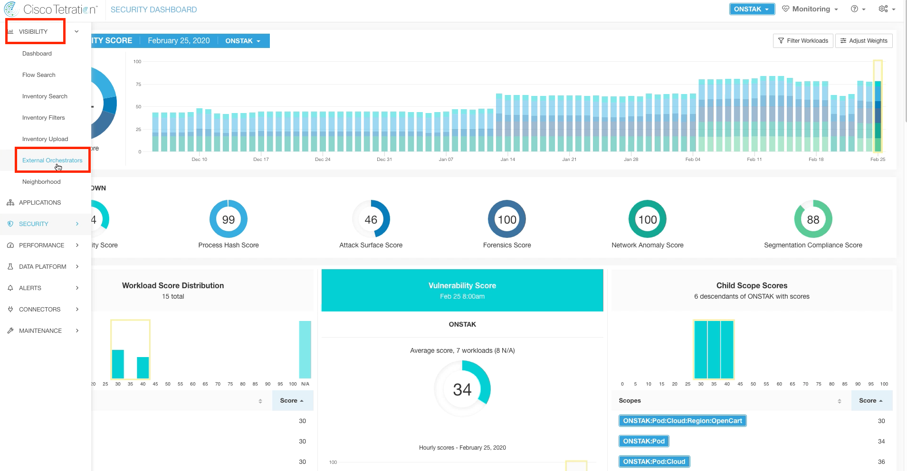</a>  

<a href="#step-002" style="font-weight:bold">Step 002</a>
  

Click on Create New Configuration.

<a href="images/module_03-04_002.png">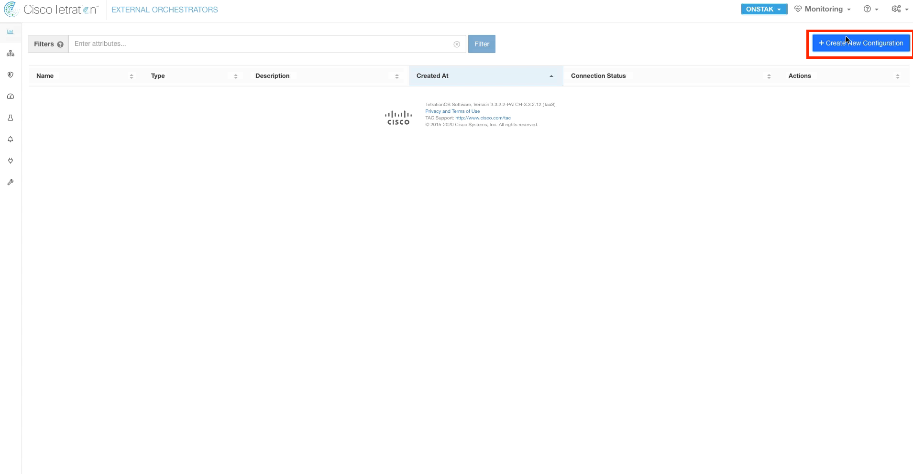</a>  

<a href="#step-003" style="font-weight:bold">Step 003</a>
  

Enter the type as AWS and fill in the Name field with AWS.  Enter the AWS Access Key ID and Secret from the provided student workbook.  

<a href="images/module_03-04_003.png">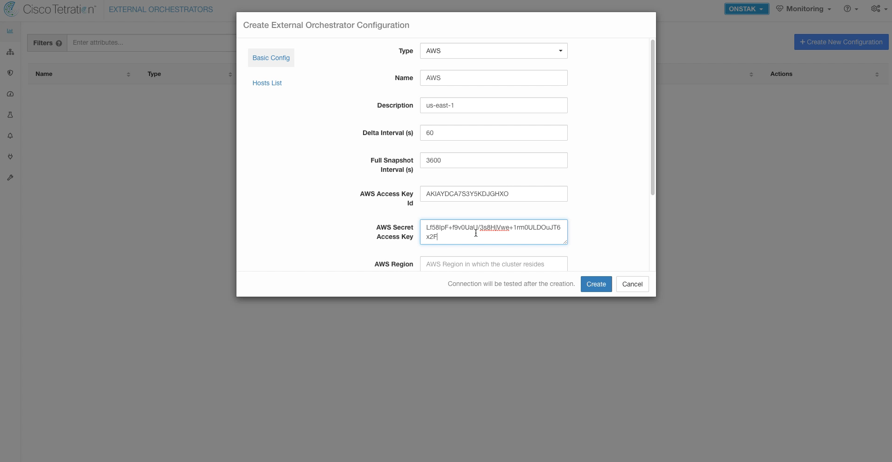</a>  

<a href="#step-004" style="font-weight:bold">Step 004</a>
  

Enter the AWS Region as us-east-1.  Uncheck the Secure Connector tunnel and ensure that Insecure is checked.  Then click Create.  

<a href="images/module_03-04_004.png">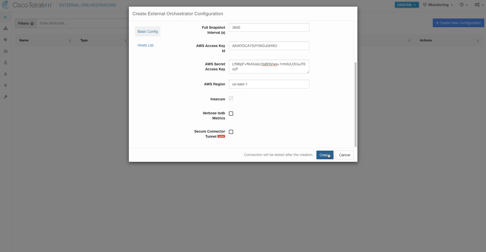</a>  

<a href="#step-005" style="font-weight:bold">Step 005</a>
  

Initially the configuration will show Failure status, this is normal and expected.  Click on the Failure status to display the details,  and the status should say "Waiting to connect"

> The connection will take a few minutes to come up. Keep refreshing the page until you see Success for Connection Status.  If Failed continues to be displayed, examine the Configuration Details to ensure that no other errors are being seen.  

<a href="images/module_03-04_005.png">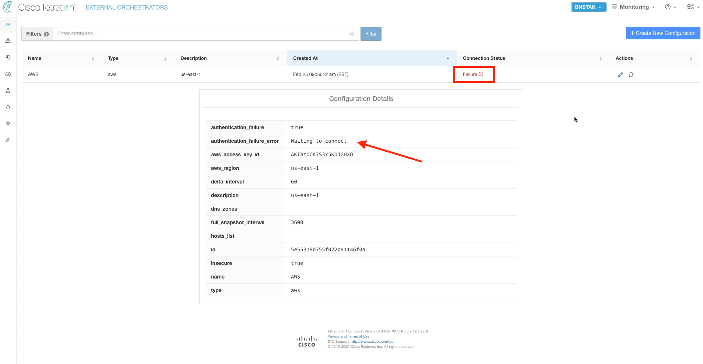</a>  

<a href="#step-006" style="font-weight:bold">Step 006</a>
  

No action required here, the Connection Status should be a green Success after a few minutes.

<a href="images/module_03-04_006.png">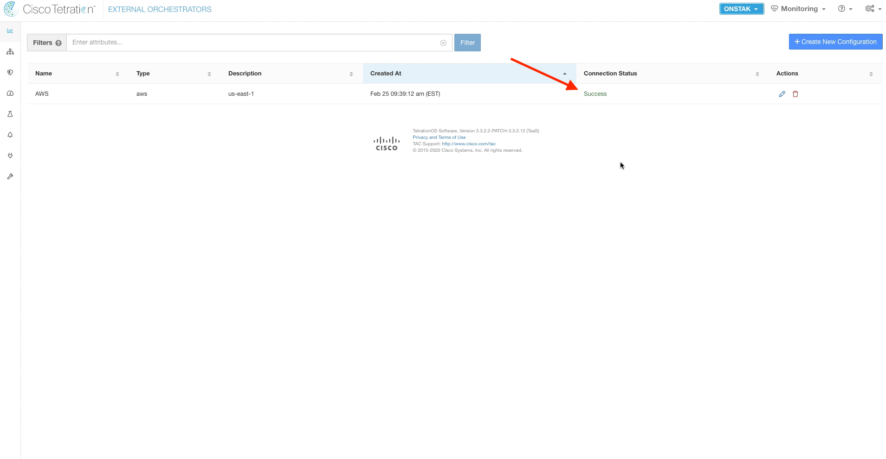</a>  

<a href="#step-007" style="font-weight:bold">Step 007</a>
  

Click on Create New Configuration and select Kubernetes as the type.  Enter a name and description. It is not required to enter a username, password, or certificate.  We will be using token-based authentication.

<a href="images/module_03-04_007.png">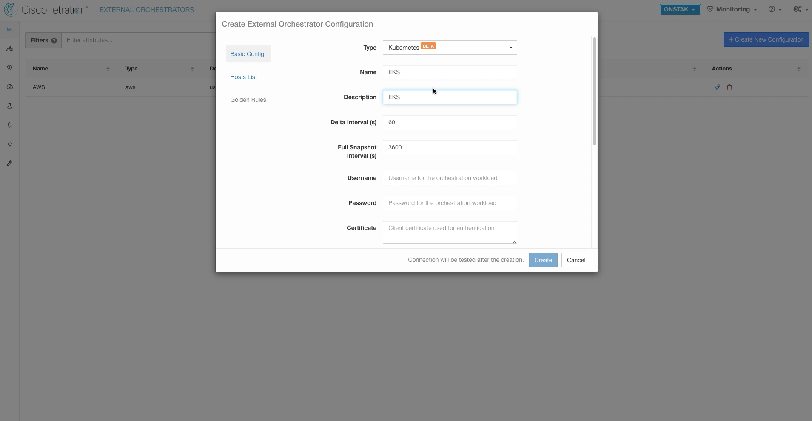</a>  

<a href="#step-008" style="font-weight:bold">Step 008</a>
  

Scroll down and check the Insecure check box.

<a href="images/module_03-04_008.png">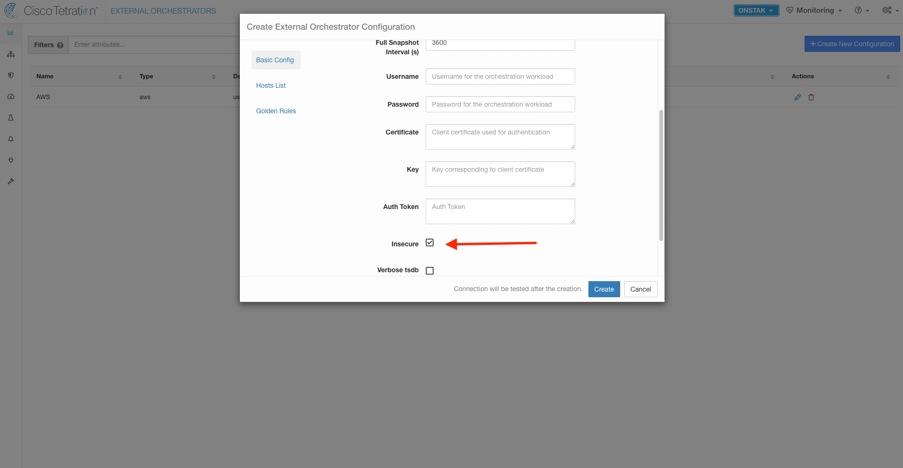</a>  

<a href="#step-009" style="font-weight:bold">Step 009</a>
  

Open a session to the Ansible machine through Apache Guacamole.  

<a href="images/module_03-04_009.png">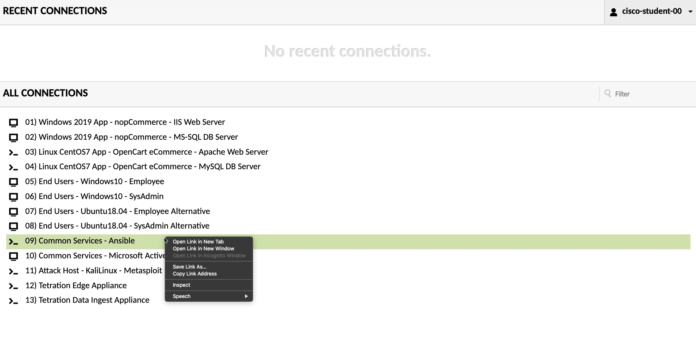</a>  

<a href="#step-010" style="font-weight:bold">Step 010</a>
  

There should be a file called `eks_credentials` in the home directory,  enter the command `ls` to list the directory and locate the file.  

<a href="images/module_03-04_010.png">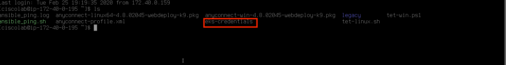</a>  

<a href="#step-011" style="font-weight:bold">Step 011</a>
  

With the focus still on the Ansible console, enter the sequence `CTRL-COMMAND-SHIFT` on a Mac or `CTRL-ALT-SHIFT` on a Windows machine to pop up an input menu on the left-hand side of the browser.  Double-click on Devices.  

<a href="images/module_03-04_011.png">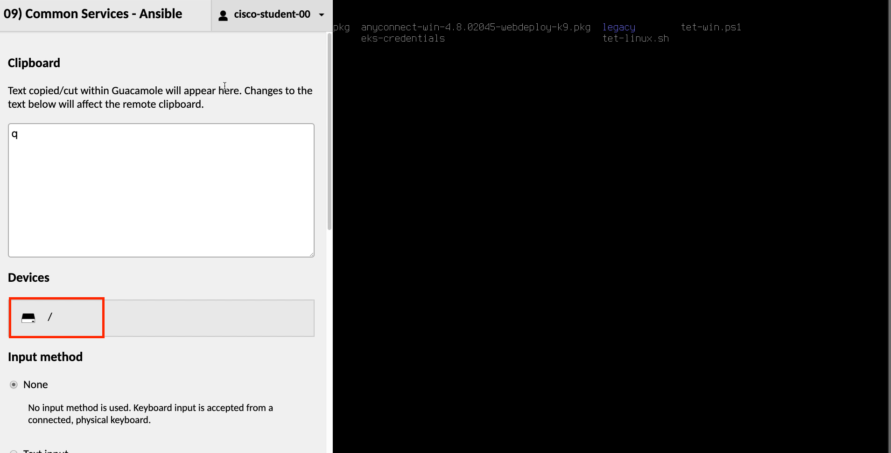</a>  

<a href="#step-012" style="font-weight:bold">Step 012</a>
  

Double-click on the home folder.

<a href="images/module_03-04_012.png">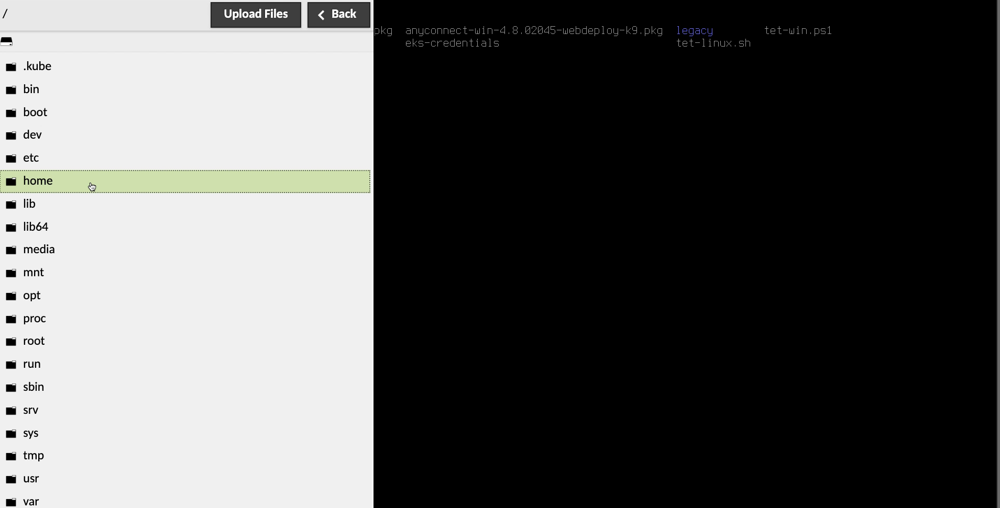</a>  

<a href="#step-013" style="font-weight:bold">Step 013</a>
  

Double-click on the eks-credentials file and save the file to your desktop.

<a href="images/module_03-04_013.png">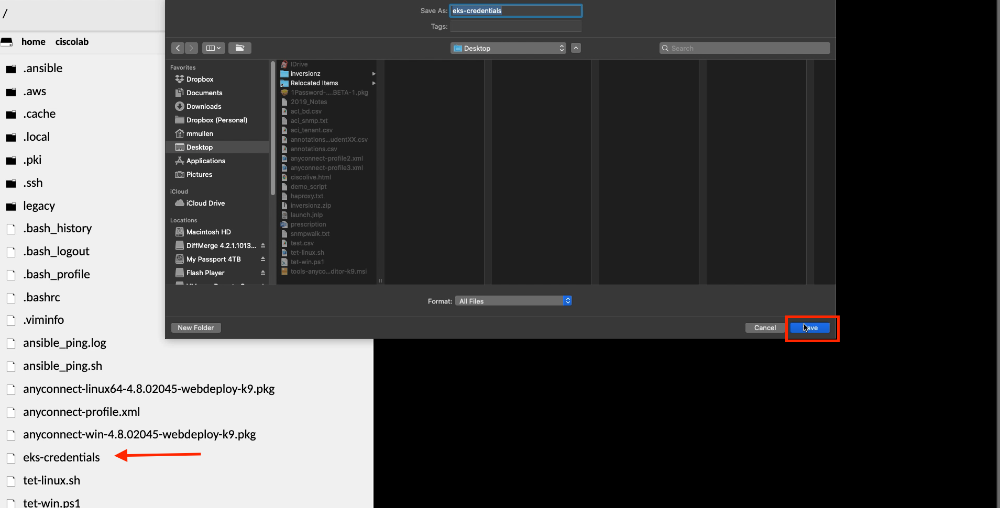</a>  

<a href="#step-014" style="font-weight:bold">Step 014</a>
  

Open the eks_credentials file in a text editor,  and copy the token to the clipboard.  

<a href="images/module_03-04_014.png">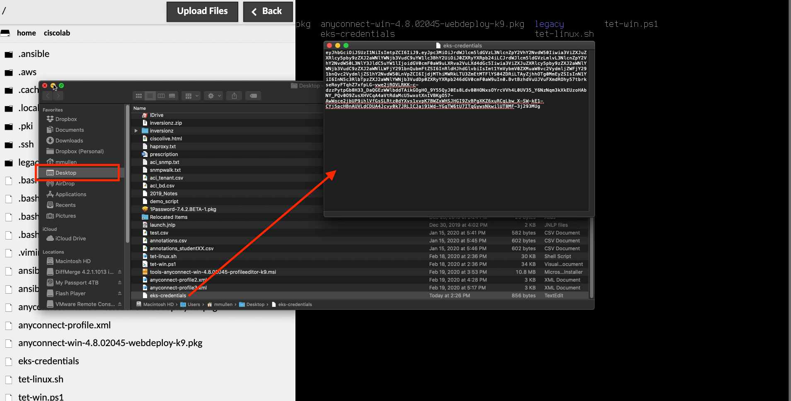</a>  

<a href="#step-015" style="font-weight:bold">Step 015</a>
  

Paste the copied token in the Auth Token field in the External Orchestrator Configuration.  Ensure that there are no blank spaces at the end of the string.

<a href="images/module_03-04_015.png">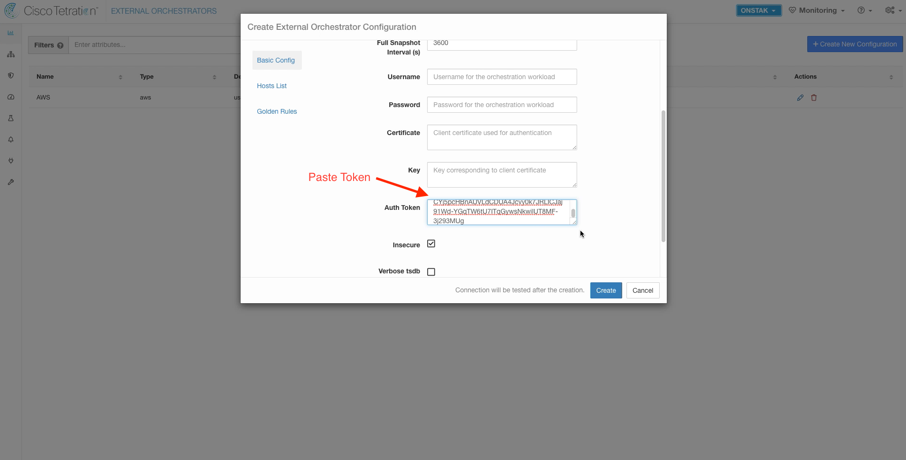</a>  

<a href="#step-016" style="font-weight:bold">Step 016</a>
  

Here we provide the path to the Kubernetes API running on the master node. Click on Hosts List,  and click the + icon to add a new host.  Enter the EKS endpoint, which is provided in the student worksheet.  Enter 443 as the TCP port,  then click Create.

<a href="images/module_03-04_016.png">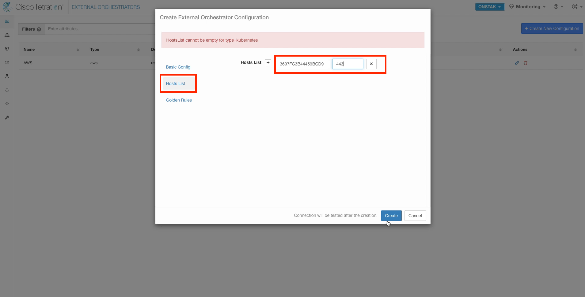</a>  

<a href="#step-017" style="font-weight:bold">Step 017</a>
  

The Connection Status will initial report Failure.  Click on the red Failure status and it should display status of "Waiting to connect".

<a href="images/module_03-04_017.png">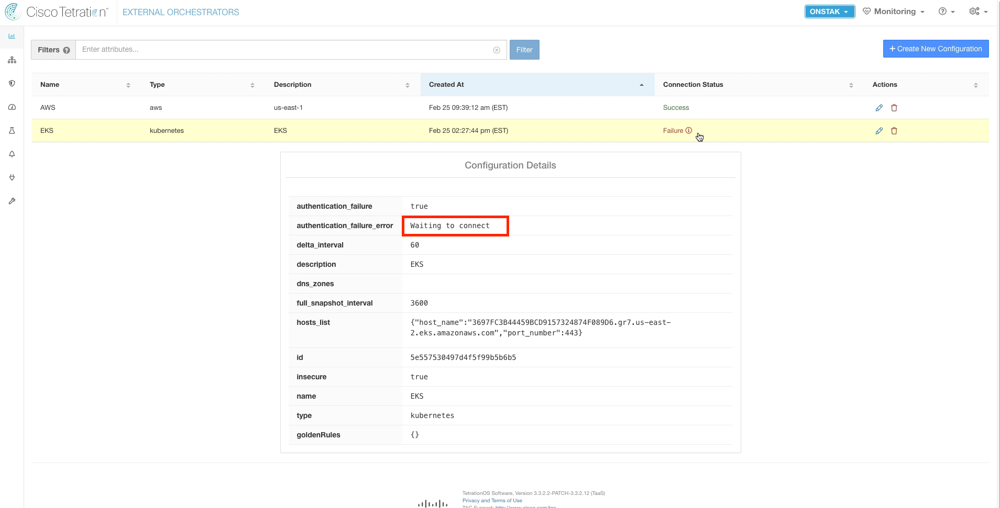</a>  

<a href="#step-018" style="font-weight:bold">Step 018</a>
  

It will take a few minutes for the connection to become active.  Refresh the screen until the status indicates Success.  

> If the Connection Status does not change to Success,  check the messages in the Configuration Details.

<a href="images/module_03-04_018.png">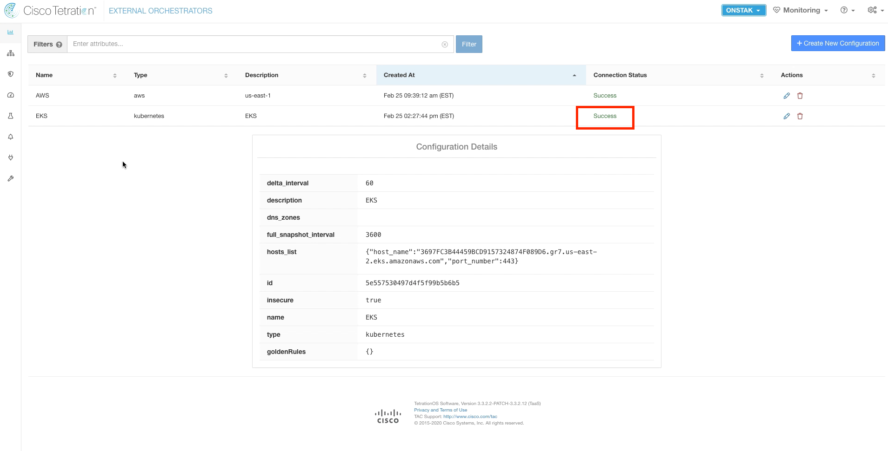</a>  

<a href="#step-019" style="font-weight:bold">Step 019</a>
  

Now that the External Orchestrators are configured, we can use the annotations that they provide as search criteria throughout the Tetration platform.   They can be used to search for workloads with Inventory Search or flows with Flow Search,  and can be used in matching criteria when defining Inventory Filters and Scopes. We will see many examples of this throughout the upcoming modules,  but for now we will use Inventory search to search for workloads that are annotated with the tags from the External Orchestrators.

Click on Visibility and Inventory Search.

<a href="images/module_03-04_019.png">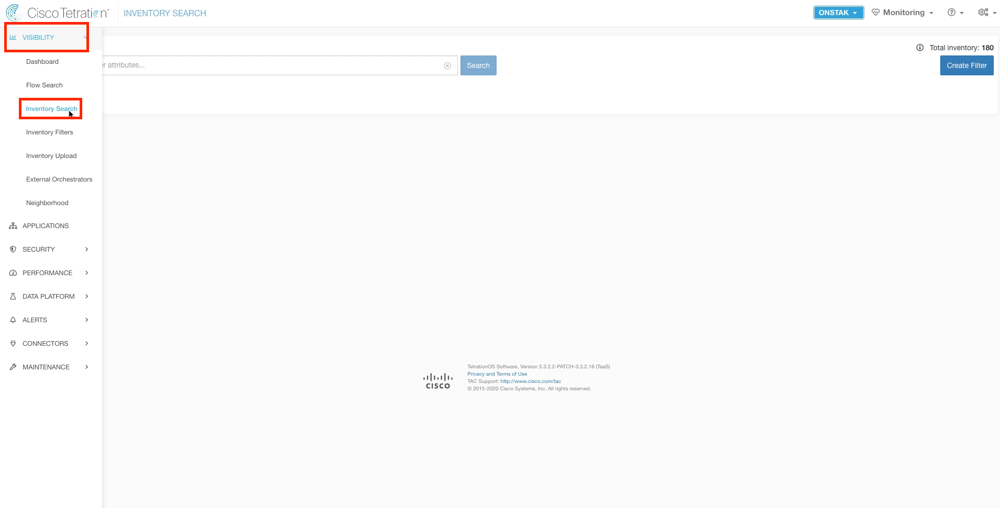</a>  

<a href="#step-020" style="font-weight:bold">Step 020</a>
  

Click on Filters to drop down the help for the available annotations that can be used as filter criteria.

<a href="images/module_03-04_020.png">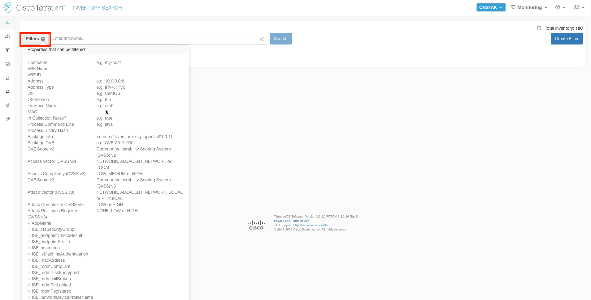</a>  

<a href="#step-021" style="font-weight:bold">Step 021</a>
  

Note the annotations coming from external orchestrators or static annotations will be prefixed with a *.

<a href="images/module_03-04_021.png">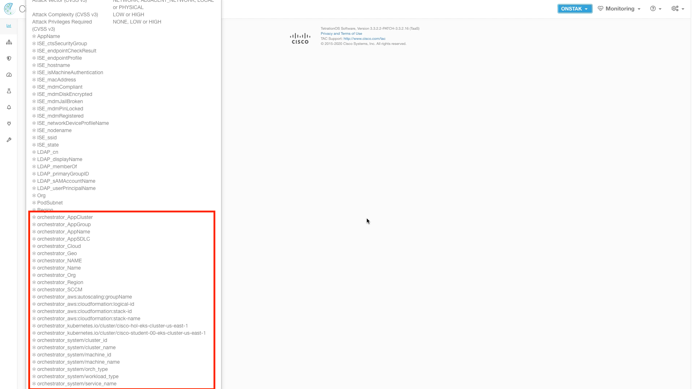</a>  

<a href="#step-022" style="font-weight:bold">Step 022</a>
  

Enter the search criteria `* orchestrator_AppName = nopCommerce` and select Search. This is matching on the AWS tag AppName,  which has been assigned the value of nopCommerce on the Microsoft IIS and Microsoft SQL servers in the AWS environment.

<a href="images/module_03-04_022.png">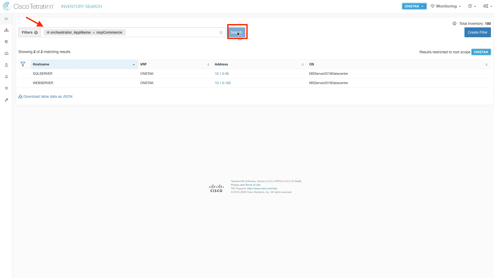</a>  

<a href="#step-023" style="font-weight:bold">Step 023</a>
  

Enter the search criteria `* orchestrator_AppCluster = App` and select Search. This query matches on the AWS tag AppCluster, which has been assiged the value App on the IIS Web Server and the Apache web server.

<a href="images/module_03-04_023.png">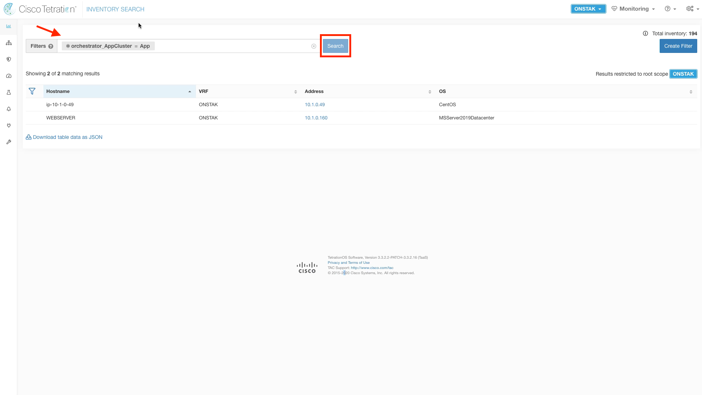</a>  

<a href="#step-024" style="font-weight:bold">Step 024</a>
  

Enter the search criteria `* orchestrator_system/namespace = sock-shop` and press Search. This query matches the Kubernetes namespace that has been created for the microservices application running on the EKS cluster.  The addresses returned are pods associated with the application tiers.  

<a href="images/module_03-04_024.png">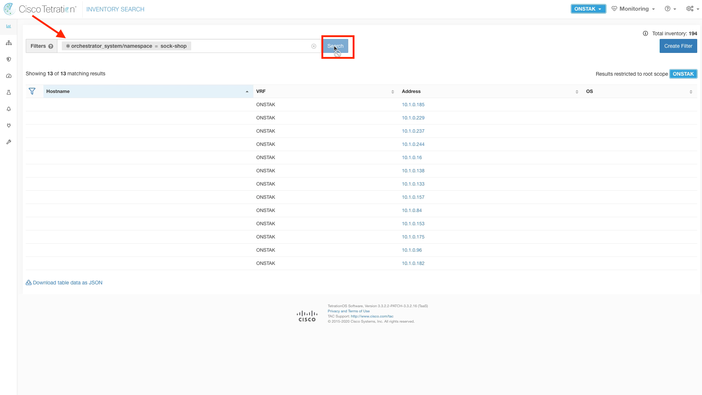</a>  

<a href="#step-025" style="font-weight:bold">Step 025</a>
  

Enter the search criteria `* orchestrator_AppCluster = front-end` and select Search.  This query matches the Kubernetes label placed on the pod providing front-end web services for the application.  Notice that in addition to being a Kubernetes label, the name AppCluster is also an AWS tag. The name overlap between the Kubernetes labels and AWS tags does not cause any issues.

<a href="images/module_03-04_025.png">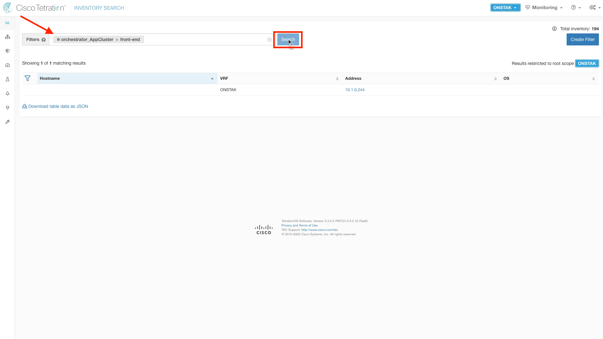</a>  

---  

| [Return to Table of Contents](https://tetration.guru/bootcamp/) | [Go to Top of the Page](README.md) | [Continue to the Next Module]() |
