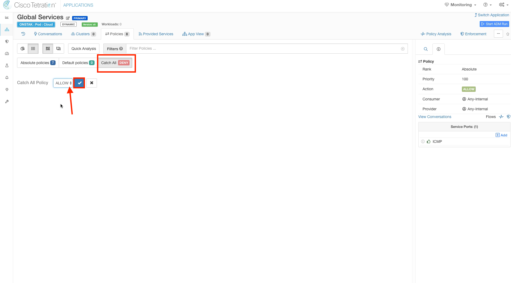

# Cisco Tetration Virtual Bootcamp

## Module 07.01  Segmentation - ADM, Policy Analysis, and Enforcement

In this module we will begin creating policies that will apply across all of the applications. We will accomplish this by creating an Application Workspace called Global Services and associating it with the Cloud Scope. The remaining Application Workspaces will be assigned to child scopes of the Cloud scope, and therefore will inherit the policies that we define in the Global Services workspace.  There are two types of policies that can be created; Default or Absolute.  Default policies can be overridden by rules in application workspaces that are defined at a lower level of the scope tree.  For example,  if we defined Default policies in Global Services, an administrator of an application workspace that is associated with a child of the Cloud scope could create Default policies that override the policy we created in Global Services.  Absolute policies cannot be overridden by policies defined in workspaces that are associated with child scopes.  This allows a security administrator to set a broad policy at a higher level of the scope tree, such as "Dev app can't talk to Prod database",  and that policy cannot be accidentally or purposely overridden in a child workspace.

In this module we'll be creating Absolute policies in the Global Services application workspace to permit common traffic that will apply across all applications.   
  
---  

## --- Lab - Global Policy ---
### Steps for this Lab  
<a href="#step-001" style="font-weight:bold">Step 001 - Navigate to Inventory Filters</a>  
<a href="#step-002" style="font-weight:bold">Step 002 - Create an Inventory Filter</a>  
<a href="#step-003" style="font-weight:bold">Step 003 - Enter Internet Filter details</a>  
<a href="#step-004" style="font-weight:bold">Step 004 - Create the Internet Filter</a>  
<a href="#step-005" style="font-weight:bold">Step 005 - Navigate to Applications</a>  
<a href="#step-006" style="font-weight:bold">Step 006 - Create a new Application Workspace</a>  
<a href="#step-007" style="font-weight:bold">Step 007 - Assign Scope to Global Services Workspace</a>  
<a href="#step-008" style="font-weight:bold">Step 008 - Create Absolute Policies</a>  
<a href="#step-009" style="font-weight:bold">Step 009 - Add rule Any-Internal to Internet</a>  
<a href="#step-010" style="font-weight:bold">Step 010 - Add service to outbound rule</a>  
<a href="#step-011" style="font-weight:bold">Step 011 - Add multiple services to rule</a>  
<a href="#step-012" style="font-weight:bold">Step 012 - Allow ICMP internally</a>  
<a href="#step-013" style="font-weight:bold">Step 013 - Change Catch-All to Allow</a>  
<a href="#step-014" style="font-weight:bold">Step 014 - View completed ruleset</a>  

<a href="#step-001" style="font-weight:bold">Step 001</a>
  

First we will create an Inventory Filter to describe IP address space external from the organization.  It will then be used to define policy to allow access from internal resources to the Internet.  

Click on Visibility and select Inventory Filters.

  

<a href="#step-002" style="font-weight:bold">Step 002</a>
  

Select Create Filter.

  

<a href="#step-003" style="font-weight:bold">Step 003</a>
  

Name the filter Internet, and enter the query `PodSubnet not equal internal`.  Keep the scope set to the root scope,  and select the checkboxes to restrict the query to ownership scope,  and provide a service external of the scope.  

  

<a href="#step-004" style="font-weight:bold">Step 004</a>
  

Click Create.

  

<a href="#step-005" style="font-weight:bold">Step 005</a>
  

Navigate to Applications.  

  

<a href="#step-006" style="font-weight:bold">Step 006</a>
  

Create a new Application Workspace.

  

<a href="#step-007" style="font-weight:bold">Step 007</a>
  

Enter the name "Global Services",  and select the Cloud scope.  Then click Create.

  

<a href="#step-008" style="font-weight:bold">Step 008</a>
  

For the Global Services workspace we will create Absolute policies. Absolute policies will take affect and override any Default policies that are set in Application Workspaces that are tied to child Scopes. This provides the ability to define rules that will be always be applied, regardless of the policy that might be defined at lower levels of the scope tree.  

Click on the Absolute policies tab.  

  

<a href="#step-009" style="font-weight:bold">Step 009</a>
  

Define a policy to allow Any-Internal to the Internet filter we previously created.

  

<a href="#step-010" style="font-weight:bold">Step 010</a>

Click on Services and click the Add button to add TCP/UDP ports.    

  

<a href="#step-011" style="font-weight:bold">Step 011</a>
  

Add the services shown in the image below.

  

<a href="#step-012" style="font-weight:bold">Step 012</a>
  

Add another rule allowing ICMP within the organization.  Select Any-Internal for both Provider and Consumer and configure ICMP as the Service.

  

<a href="#step-013" style="font-weight:bold">Step 013</a>
  

The Catch-All defines what happens to any traffic that doesn't match any of the specific rules.  For the Global Services policy, we want to set this to Allow.  The reason we set to Allow for Global Services is that this is the rule that all traffic that does not belong to any child scopes will hit.  Setting it to Allow will prevent blocking unexpected flows when moving into enforcement as Tetration is deployed.  Eventually, as Tetration is fully deployed within an organization there should be minimal flows hitting the Catch-All and at that point it can be set to Deny.   

  

<a href="#step-014" style="font-weight:bold">Step 014</a>
  

No action is required here, the image illustrates what the policy should look like when completed.

  

---   

[Go to Top of Page](README.md)
