# Cisco Tetration - Hands-On Lab

## Module 07.02  Segmentation - ADM - Common Services

In this module we'll be configuring an Application Workspace called Common Policy which will be tied to the Common Apps scope. This will be used to create policies controlling traffic to/from the Active Directory and Ansible servers toward the other application workloads in the lab environment.  We will first create the Application Workspace and run Application Discovery and Mapping (ADM) to automatically discover the workloads, group them into clusters, and provide initial policy recommendations based on the discovered flows in the environment. During ADM, Tetration will group servers together into a cluster based on their similarities from a traffic flow and process perspective.  We will review the suggested clusters,  and adjust the cluster queries to make the cluster membership more dynamic.  For example, we will configure our cluster query for Active Directory servers to match on the AWS tag GC-DC-DNS which will allow any new servers that are added with this tag to automatically be included in the cluster and have the policies applied. Once we have modified the cluster queries, we will then review the suggested policies created by ADM and manually refine them as necessary. 

---

This diagram depicts how AWS Lambda (aka 'serverless') plays nice with Tetration from a policy perspective. AWS allows you to assign Lambda event-driven functions to be sourced from either one of their public Internet IP addresses or from your own private RFC1918 subnet inside your VPC. In our lab, we have configured the triggering event to be time, specifically that every 60 seconds two functions are run using Node.js, each making a single HTTPS call, one to the Windows-based nopCommerce app and the other to the Linux-based OpenCart app. This is helpful in two ways - firstly in that it allows us to include the concept of adding logic to your Tetration policy that accounts for AWS Serverless technologies, and secondly in that it actually ensures that there is constant traffic hitting these two applications and ensuring that there is plenty of flow data present in the Tetration collectors when it's time for you to run ADM for each app in order to generate that policy. If you're wondering why we don't have a function calling the Container-based Sock Shop app, it's due to the fact that Tetration agents do not collect flow telemetry information from container workloads and therefore wouldn't have much value since running ADM for container apps is a moot point, and needing to manually generate policy for these apps to include allowing serverless sources such as Lambda would have already been covered by the other two apps.

  

---

<a href="https://cisco-tetration-hol-content.s3.amazonaws.com/videos/13_policy_creation_adm_clusters_common_services.mp4" style="font-weight:bold" title="Policy Analysis - Commom Policies"> Click here to view a video of the tasks necessary to create policy for the services provided by Commom apps.</a>

---

### Steps for this Module  
<a href="#step-001" style="font-weight:bold">Step 001 - Navigate to Applications</a>  
<a href="#step-002" style="font-weight:bold">Step 002 - Create App Workspace</a>  
<a href="#step-003" style="font-weight:bold">Step 003 - Create Workspace for Common Policy</a>  
<a href="#step-004" style="font-weight:bold">Step 004 - Initiate ADM</a>  
<a href="#step-005" style="font-weight:bold">Step 005 - Select a time range</a>  
<a href="#step-006" style="font-weight:bold">Step 006 - Display member workloads</a>  
<a href="#step-007" style="font-weight:bold">Step 007 - Set External Dependencies</a>  
<a href="#step-008" style="font-weight:bold">Step 008 - Set Cluster Granularity</a>  
<a href="#step-009" style="font-weight:bold">Step 009 - View ADM Results</a>  
<a href="#step-010" style="font-weight:bold">Step 010 - Verify discovered workloads </a>  
<a href="#step-011" style="font-weight:bold">Step 011 - Examine discovered policy</a>  
<a href="#step-012" style="font-weight:bold">Step 012 - Edit the cluster for Ansible</a>  
<a href="#step-013" style="font-weight:bold">Step 013 - Modify the Ansible Cluster query</a>  
<a href="#step-014" style="font-weight:bold">Step 014 - Edit the cluster for ADSERVER</a>  
<a href="#step-015" style="font-weight:bold">Step 015 - Modify the ADSERVER Cluster query</a>  
<a href="#step-016" style="font-weight:bold">Step 016 - Examine the policies</a>  
<a href="#step-017" style="font-weight:bold">Step 017 - Promote the Ansible cluster to a Filter</a>  
<a href="#step-018" style="font-weight:bold">Step 018 - Promote the Ansible cluster</a>  
<a href="#step-019" style="font-weight:bold">Step 019 - Promte the Common-GC-DC-DNS cluster to a Filter</a>  
<a href="#step-020" style="font-weight:bold">Step 020 - Promote the Common-GC-DC-DNS cluster</a>  
<a href="#step-021" style="font-weight:bold">Step 021 - Cluster view after promotion</a>  
<a href="#step-022" style="font-weight:bold">Step 022 - Examine policy after cluster promotion</a>  
<a href="#step-023" style="font-weight:bold">Step 023 - Navigate to Inventory Filters</a>  
<a href="#step-024" style="font-weight:bold">Step 024 - Locate the Common-GC-DC-DNS Filter</a>  
<a href="#step-025" style="font-weight:bold">Step 025 - Search for the Ansible Filter</a>  
<a href="#step-026" style="font-weight:bold">Step 026 - View results of Common-Ansible Filter</a>  
<a href="#step-027" style="font-weight:bold">Step 027 - Navigate to Applications</a>  
<a href="#step-028" style="font-weight:bold">Step 028 - Change the rule providing outbound access from Common-GC-DNS</a>  
<a href="#step-029" style="font-weight:bold">Step 029 - Display the services for the outbound access rule</a>  
<a href="#step-030" style="font-weight:bold">Step 030 - Remove TCP 138 from the outbound access rule</a>  
<a href="#step-031" style="font-weight:bold">Step 031 - Delete the rule providing UDP 67 (DHCP)</a>  
<a href="#step-032" style="font-weight:bold">Step 032 - Example error deleting rule before service</a>  
<a href="#step-033" style="font-weight:bold">Step 033 - Delete the UDP 67 service from the rule</a>  
<a href="#step-034" style="font-weight:bold">Step 034 - Delete the rule providing UDP 67 (DHCP)</a>  
<a href="#step-035" style="font-weight:bold">Step 035 - Change the Provider to Windows for the TCP 5896 service</a>  
<a href="#step-036" style="font-weight:bold">Step 036 - Change the Provider to Linux for the TCP 22 service</a>  
<a href="#step-037" style="font-weight:bold">Step 037 - Change the Consumer to Any-Internal for the UDP 53 service</a>  
<a href="#step-038" style="font-weight:bold">Step 038 - Change the Consumer from nopCommerce to Any-Internal for Windows Services </a>  
<a href="#step-039" style="font-weight:bold">Step 039 - Delete the Consumer OpenCart to Common-GC-DC-DNS on UDP 53</a>  
<a href="#step-040" style="font-weight:bold">Step 040 - Delete the Consumer OpenCart to Common-GC-DC-DNS on UDP 53</a>  
<a href="#step-041" style="font-weight:bold">Step 041 - Delete the Common-Ansible to Common-GC-DC-DNS rule with UDP 53 and TCP 5896 Services</a>  
<a href="#step-042" style="font-weight:bold">Step 042 - Delete the Common-Ansible to Common-GC-DC-DNS rule with UDP 53 and TCP 5896 Services</a>  
<a href="#step-043" style="font-weight:bold">Step 043 - Display the expanded ruleset</a>  
<a href="#step-044" style="font-weight:bold">Step 044 - Click Switch Application</a>  
<a href="#step-045" style="font-weight:bold">Step 045 - Select the Global Services App Workspace</a>  
<a href="#step-046" style="font-weight:bold">Step 046 - Add UDP 67 to the Any-Internal to Any-Internal rule</a>  
<a href="#step-047" style="font-weight:bold">Step 047 - Add a new rule for Guacamole to Any-Internal on TCP 3389 and TCP 22</a>  

---

<a href="#step-001" style="font-weight:bold">Step 001</a>
  

Navigate to Applications.

<a href="images/module13_001.png">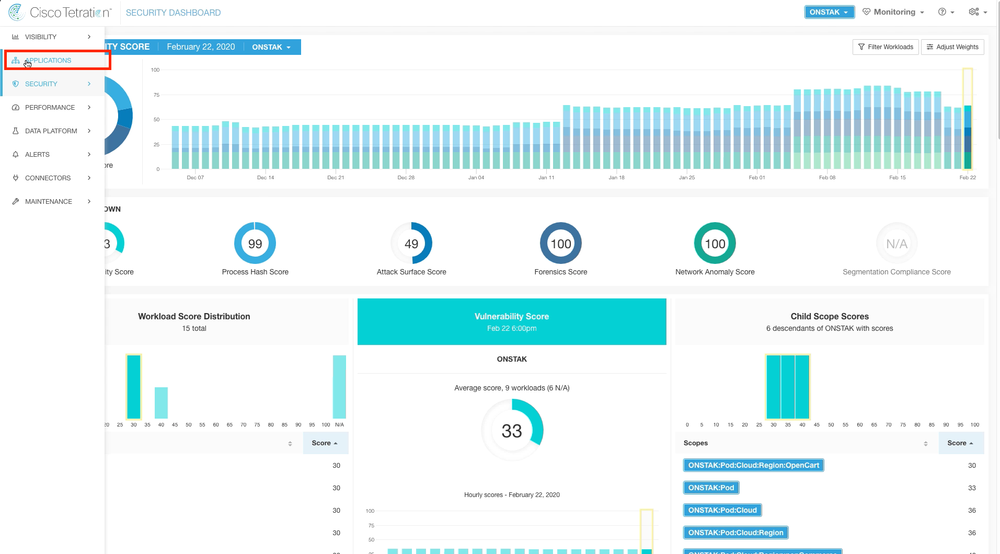</a>  

<a href="#step-002" style="font-weight:bold">Step 002</a>
  

Create a new Application Workspace.

<a href="images/module13_002.png">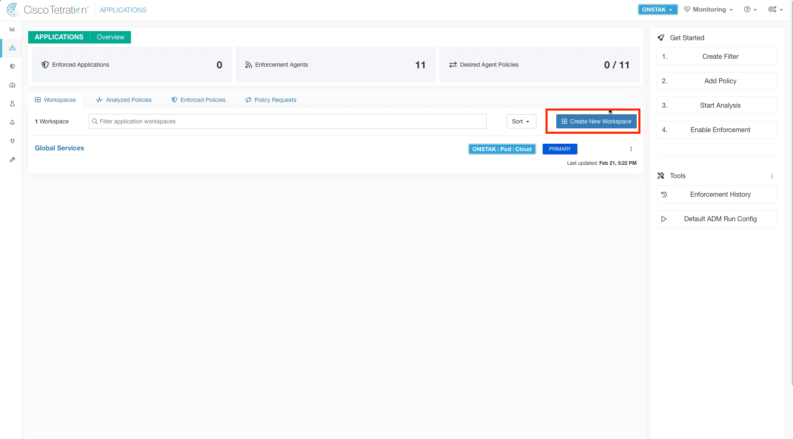</a>  

<a href="#step-003" style="font-weight:bold">Step 003</a>
  

Name the workspace Common Policy and assign to the Common Apps scope.

<a href="images/module13_003.png">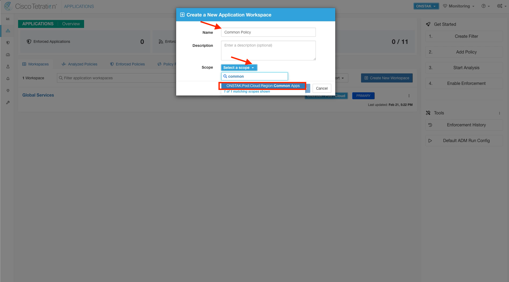</a>  

<a href="#step-004" style="font-weight:bold">Step 004</a>
  

Select Automatically Discover Policies.

> You could also select the Start ADM Run button to accomplish the same.

<a href="images/module13_004.png">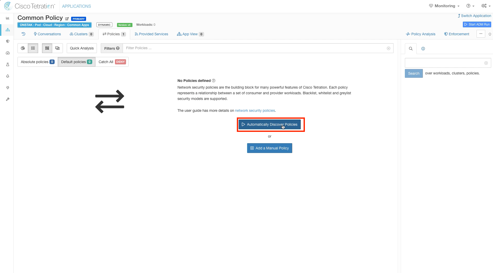</a>  

<a href="#step-005" style="font-weight:bold">Step 005</a>
  

Change the time range so that the ADM run takes into consideration the last six hours.  

> When doing ADM for a real application it would be recommended to select a much longer time range for analysis.  Six hours is being selected here to minimize how long it will take for the ADM run to complete.

<a href="images/module13_005.png">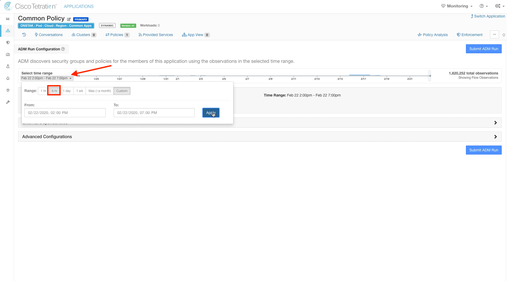</a>  

<a href="#step-006" style="font-weight:bold">Step 006</a>
  

Click on Show next to Member Workloads.  Here you should see the Active Directory server as well as the IP address for the Ansible machine.  This is because they are members of the Common Apps Scope.

<a href="images/module13_006.png">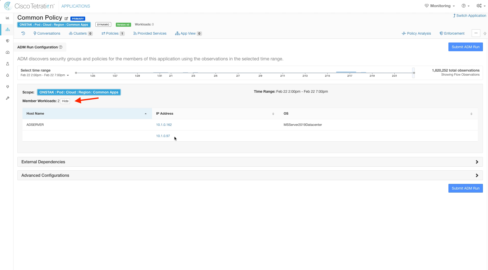</a>  

<a href="#step-007" style="font-weight:bold">Step 007</a>
  

Click on External Dependencies,  and click on Fine for the Root Scope.  Click on the link that says "1 dependent filters".  

<a href="images/module13_007.png">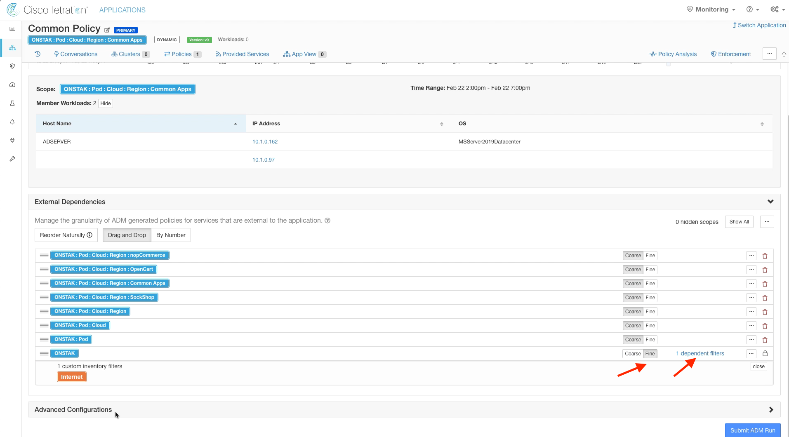</a>  

<a href="#step-008" style="font-weight:bold">Step 008</a>
  

Expand Advanced Configurations,  and select Very Fine for the cluster granularity.  Then Submit the ADM run.

> The ADM run will take several minutes to complete.  You can navigate away from this screen and come back later if desired,  the ADM run will continue to run in the background.

<a href="images/module13_008.png">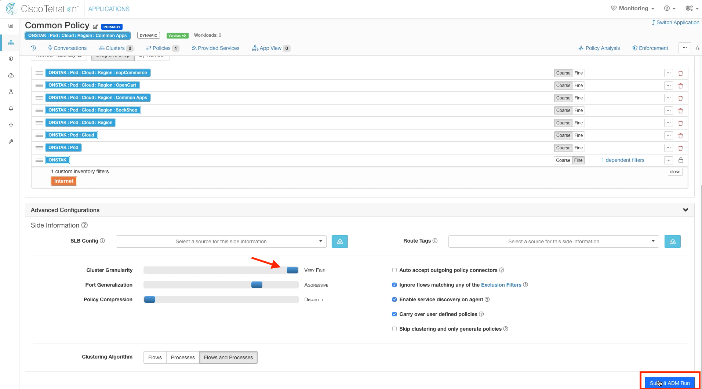</a>  

<a href="#step-009" style="font-weight:bold">Step 009</a>
  

Click on the link indicating ADM results available.

<a href="images/module13_009.png">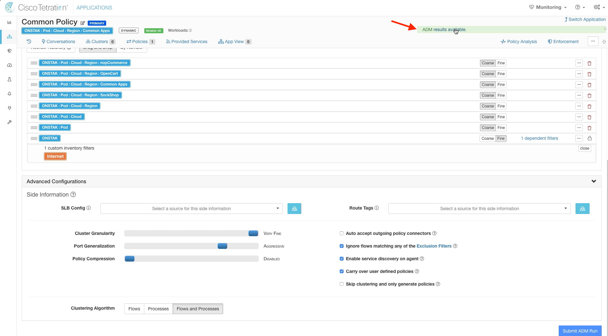</a>  

<a href="#step-010" style="font-weight:bold">Step 010</a>
  

Expand each of the discovered clusters.  There should be a cluster created containing the Ansible server and another cluster containing the Active Directory server.

<a href="images/module13_010.png">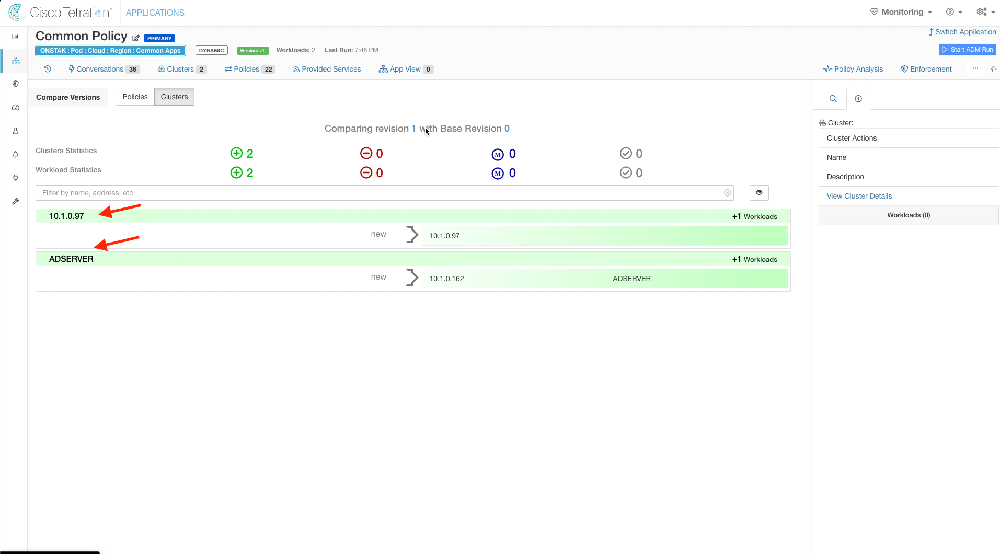</a>  

<a href="#step-011" style="font-weight:bold">Step 011</a>
  

Click on the Policies tab.  Examine the policies that were dynamically created by the ADM run.

<a href="images/module13_011.png">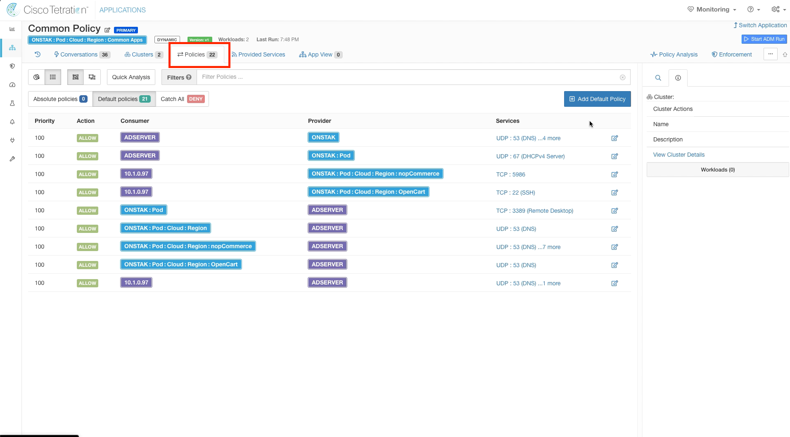</a>  

<a href="#step-012" style="font-weight:bold">Step 012</a>
  

In this step, we will rename the clusters and change the cluster queries so that cluster membership is dynamic based on the AWS tags assigned to the workloads.  Click on the IP address for the Ansible server.  Then click on Edit Cluster.  

<a href="images/module13_012.png">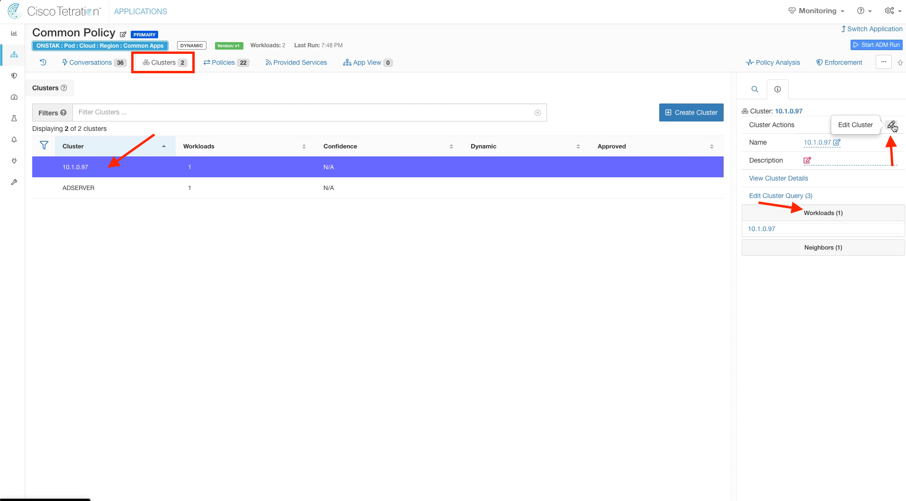</a>  

<a href="#step-013" style="font-weight:bold">Step 013</a>
  

Change the name to `Common-Ansible` and change the query to  `* orchestrator_AppCluster = Ansible`.  Then save the new cluster configuration.

<a href="images/module13_013.png">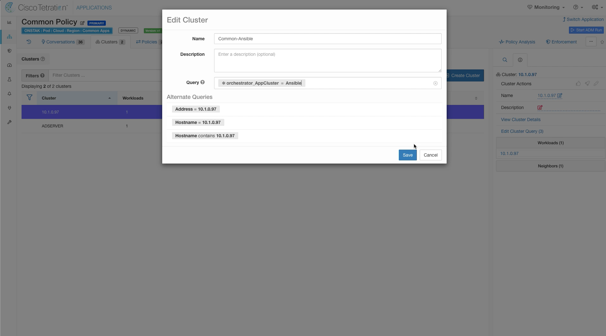</a>  

<a href="#step-014" style="font-weight:bold">Step 014</a>
  

Click on the ADSERVER cluster,  and then Edit the cluster.  

<a href="images/module13_014.png">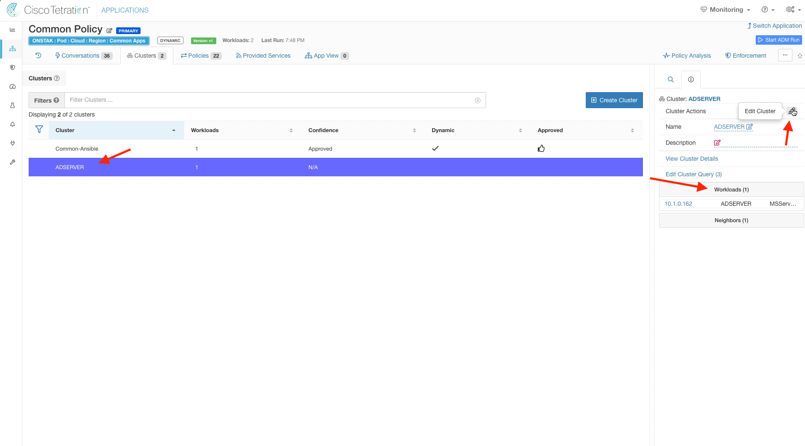</a>  

<a href="#step-015" style="font-weight:bold">Step 015</a>
  

Name the cluster `Common-GC-DC-DNS` and change the query to `* orchestrator_AppCluster = GC-DC-DNS`.  Save the new cluster configuration.

<a href="images/module13_015.png">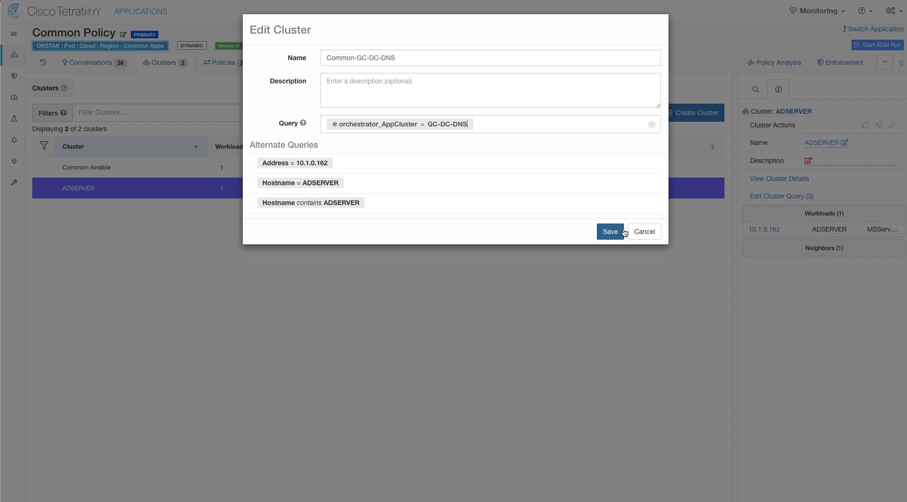</a>  

<a href="#step-016" style="font-weight:bold">Step 016</a>
  

Navigate back to the Policies tag. Notice that the names in the purple boxes have changed to the cluster names that we defined.  Also they are outlined in red, which indicates they were manually created by the administrator.

<a href="images/module13_016.png">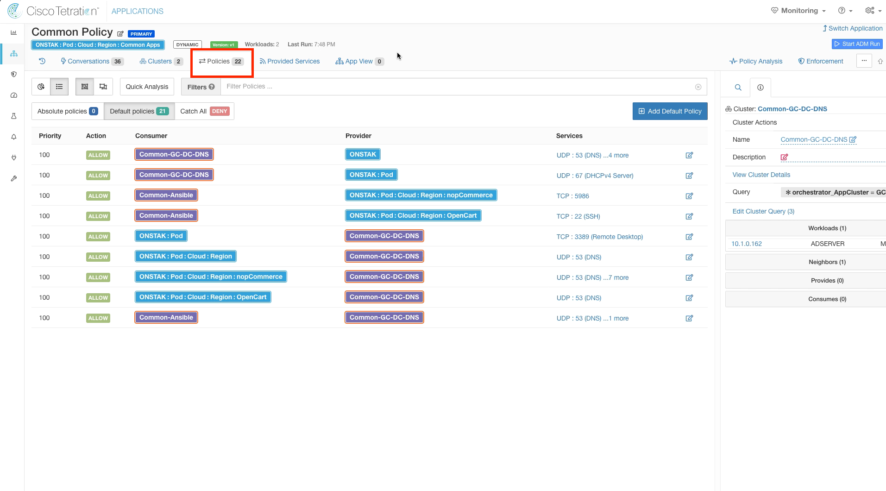</a>  

<a href="#step-017" style="font-weight:bold">Step 017</a>
  

Click on the Clusters tab and select the Common-Ansible cluster.  Click the rocket ship icon to promote the cluster to an Inventory Filter.  

<a href="images/module13_017.png">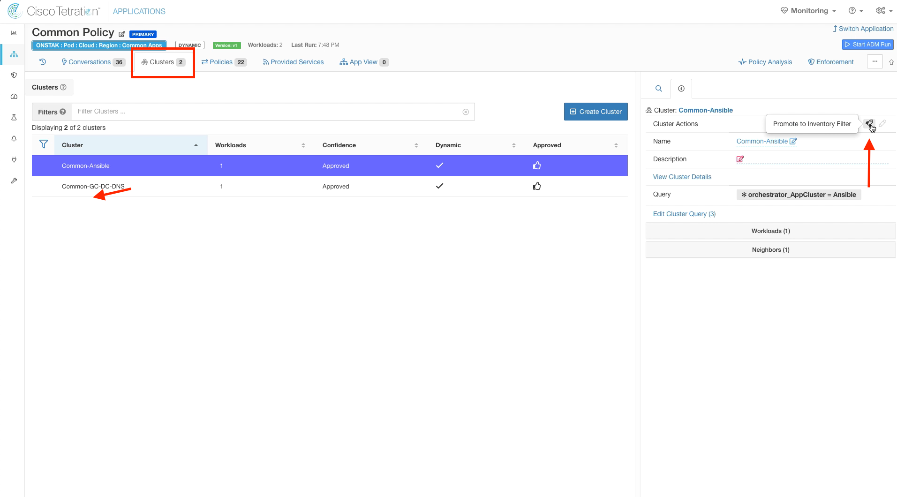</a>  

<a href="#step-018" style="font-weight:bold">Step 018</a>
  

Keep the settings as shown,  and select Promote Cluster.

Doing this automatically converts the cluster to an Inventory Filter and sets the parameters "restrict query to scope" and "provides a service external of its scope" in the Inventory Filter.  This allows other application workspaces to request creation of the rules needed to allow return traffic from workloads in this workspace.  We will see an example of this later.   

> The cluster will now disappear from being listed under Clusters.  We'll investigate where it went in just a moment.  

<a href="images/module13_018.png">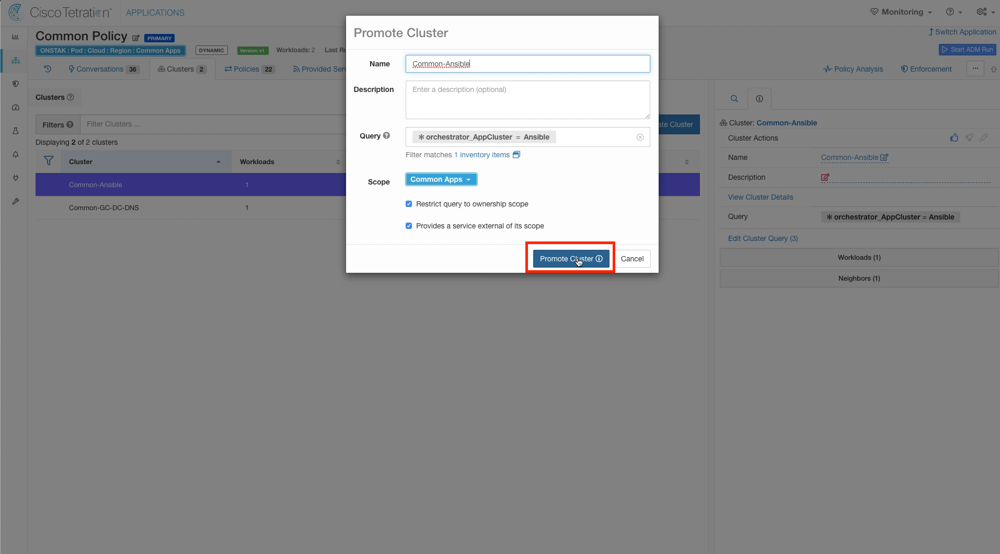</a>  

<a href="#step-019" style="font-weight:bold">Step 019</a>
  

Click on the cluster Common-GC-DC-DNS and select the rocket ship to promote it to an Inventory Filter.

<a href="images/module13_019.png">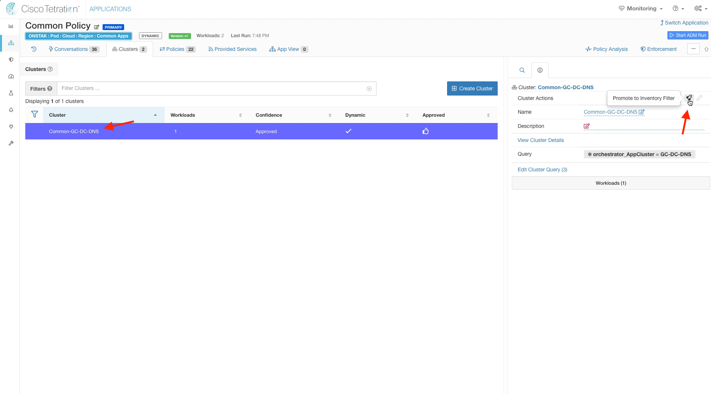</a>  

<a href="#step-020" style="font-weight:bold">Step 020</a>
  

Click Promote Cluster.

<a href="images/module13_020.png">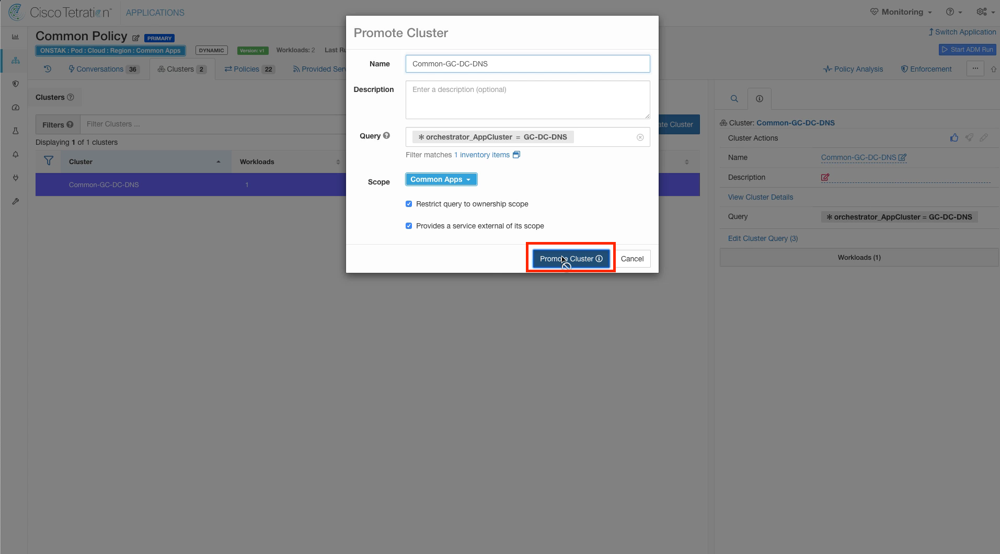</a>  

<a href="#step-021" style="font-weight:bold">Step 021</a>
  

The clusters are no longer visible because they have been converted to Inventory Filters.  Click on the Policies tab.

<a href="images/module13_021.png">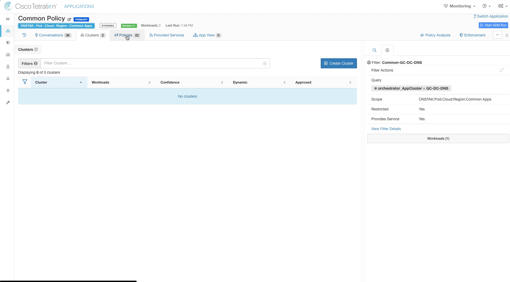</a>  

<a href="#step-022" style="font-weight:bold">Step 022</a>
  

Notice that the once purple boxes have now been converted to orange, indicating that they are Inventory Filters.  

<a href="images/module13_022.png">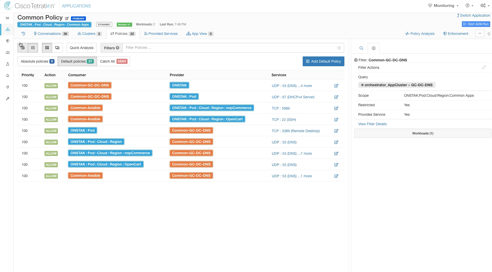</a>  

<a href="#step-023" style="font-weight:bold">Step 023</a>
  

Navigate to Inventory Filters.  

<a href="images/module13_023.png">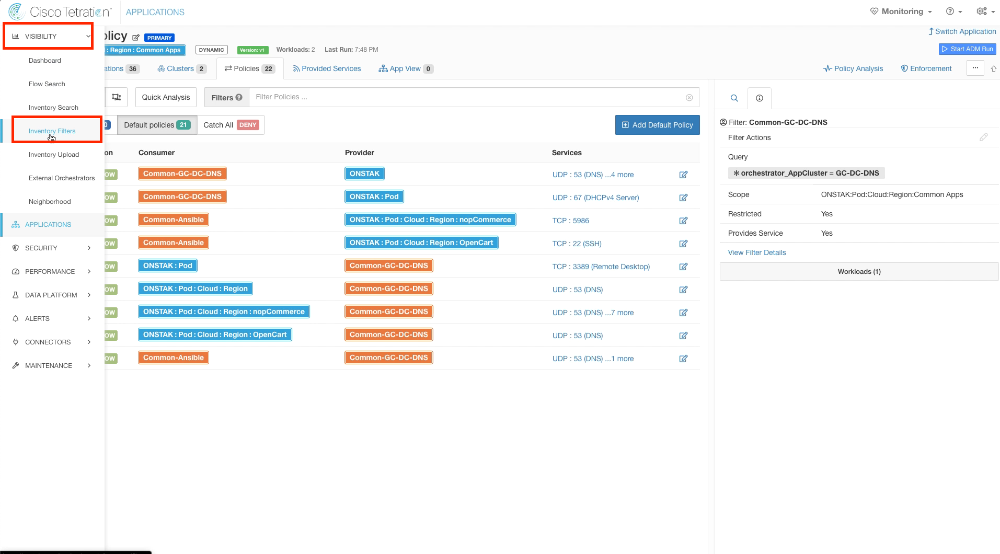</a>  

<a href="#step-024" style="font-weight:bold">Step 024</a>
  

Notice that the filters for Common-Ansible and Common-GC-DNS-DNS are present in the listing.

<a href="images/module13_024.png">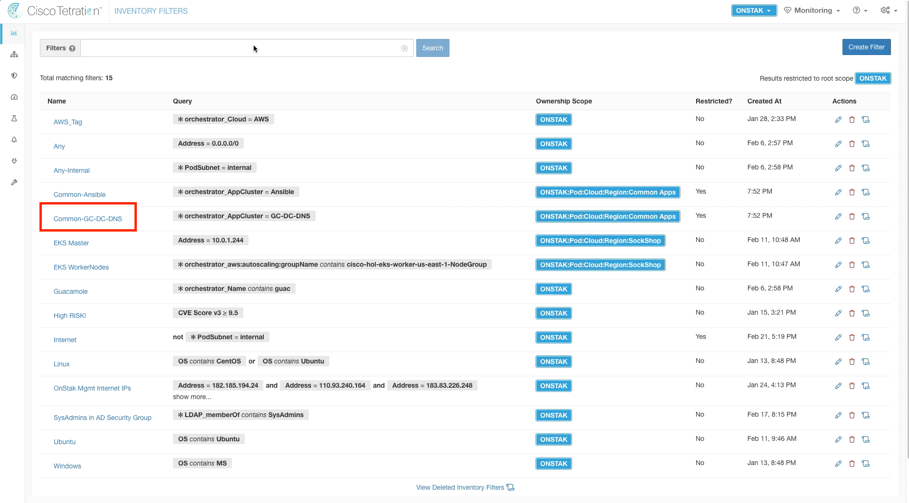</a>  

<a href="#step-025" style="font-weight:bold">Step 025</a>
  

You can also filter the results using the search field.  Enter the search `Name contains Ansible` and Search.  Only the Ansible cluster should be shown.

<a href="images/module13_025.png">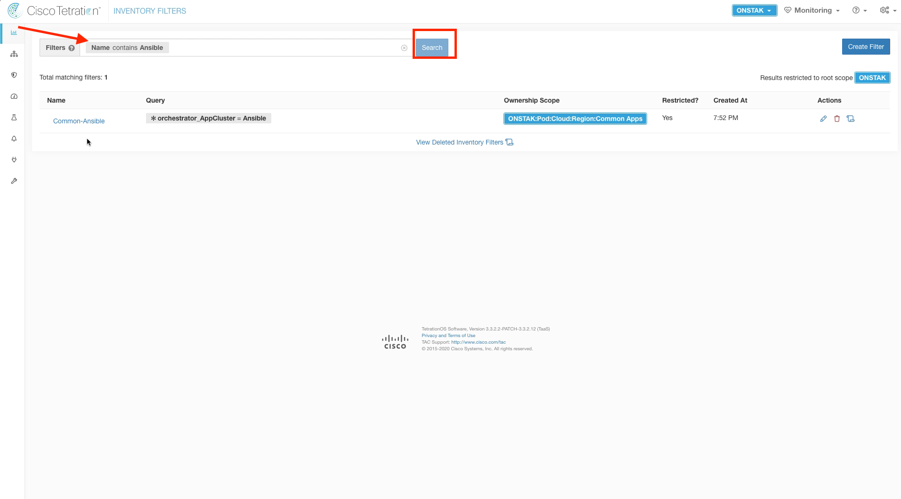</a>  

<a href="#step-026" style="font-weight:bold">Step 026</a>
  

Click on the Common-Ansible Inventory Filter to view workloads that match the query.

<a href="images/module13_026.png">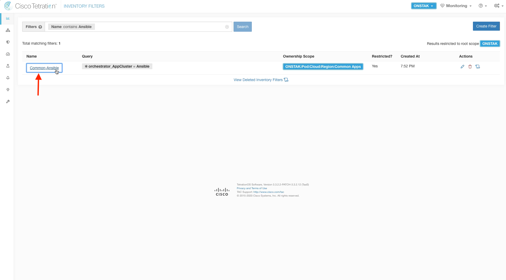</a>  

<a href="#step-027" style="font-weight:bold">Step 027</a>
  

Navigate back to Applications.

<a href="images/module13_027.png">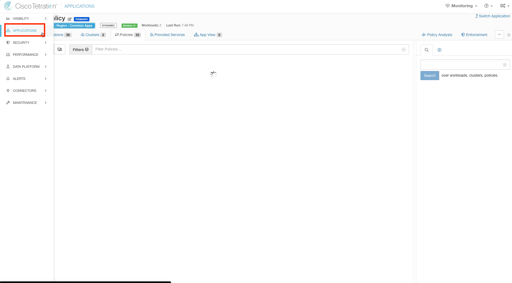</a>  

<a href="#step-028" style="font-weight:bold">Step 028</a>
  

Modify the rule showing Common-GC-DC-DNS as a consumer to the Root scope as a provider.  Change the provider field to Internet and click OK.  

<a href="images/module13_028.png">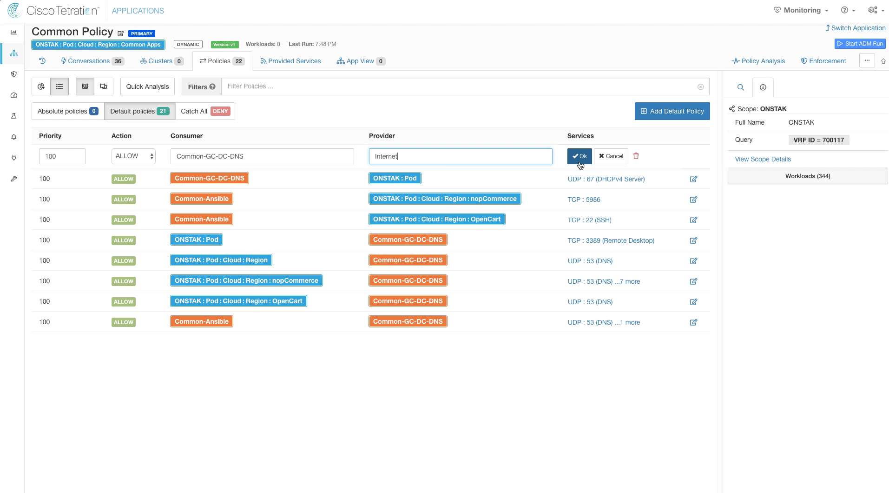</a>  

<a href="#step-029" style="font-weight:bold">Step 029</a>
  

On the same rule that we just edit,  select Services.  The list of Services configured for this rule will be listed in the right-hand pane.

<a href="images/module13_029.png">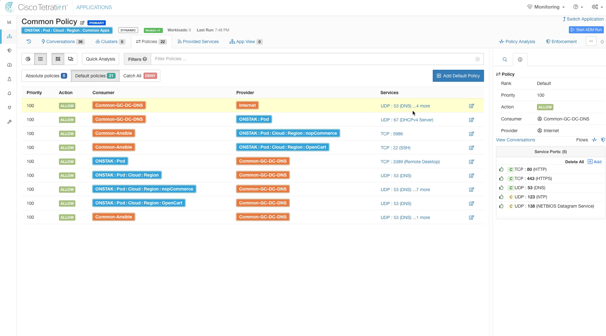</a>  

<a href="#step-030" style="font-weight:bold">Step 030</a>
  

Delete the UDP 138 port from the list of services.  

<a href="images/module13_030.png">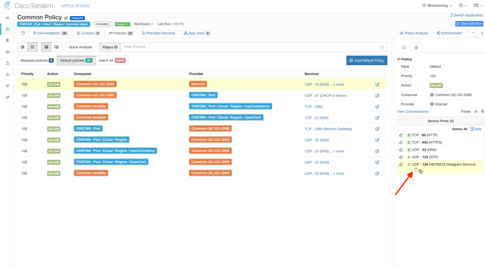</a>  

<a href="#step-031" style="font-weight:bold">Step 031</a>
  

On the policy rule with Common-GC-DNS as Consumer and Pod as a Provider,  click to edit the rule and then click the red garbage can to delete the rule.  

> You will see an error message stating you must remove all ports first. This is expected.

<a href="images/module13_031.png">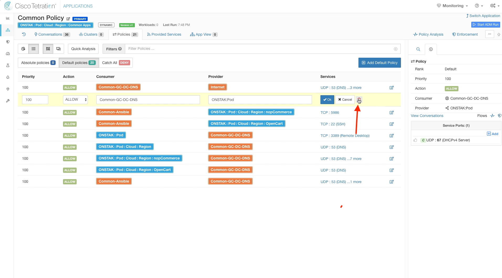</a>  

<a href="#step-032" style="font-weight:bold">Step 032</a>
  

You can't delete a policy rule without first deleting the services, so you will see the below error message.   

<a href="images/module13_032.png">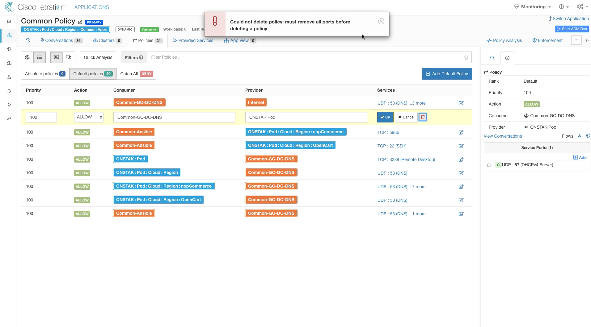</a>  

<a href="#step-033" style="font-weight:bold">Step 033</a>
  

Delete UDP 67 from the services.  

<a href="images/module13_033.png">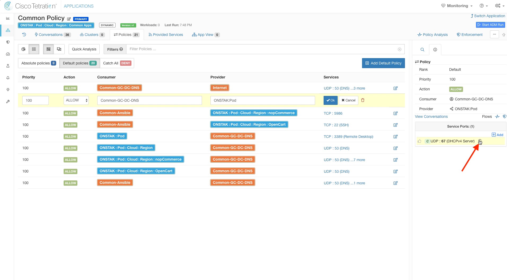</a>  

<a href="#step-034" style="font-weight:bold">Step 034</a>
  

Delete the rule.  We will add UDP 67 to the Global Services Absolute policies later.

<a href="images/module13_034.png">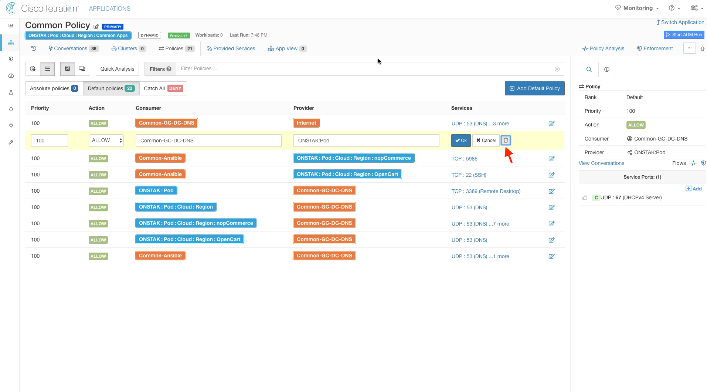</a>  

<a href="#step-035" style="font-weight:bold">Step 035</a>
  

On the rule with Common-Ansible as the Consumer and nopCommerce scope as the Provider,  change the Provider to Windows.  This will allow Ansible to access all Windows machines on TCP port 5986.  

> Note that when we say "all Windows machines",  we really mean all Windows machines that have Tetration agents. Tetration does not have any visibility to the Operating System running on a machine unless it has an agent installed.  Keep this in mind when creating policy with objects that are backed by queries on inventory attributes. This is different than annotations,  which can be applied to any IP address regardless of whether or not an agent is installed.  

<a href="images/module13_035.png">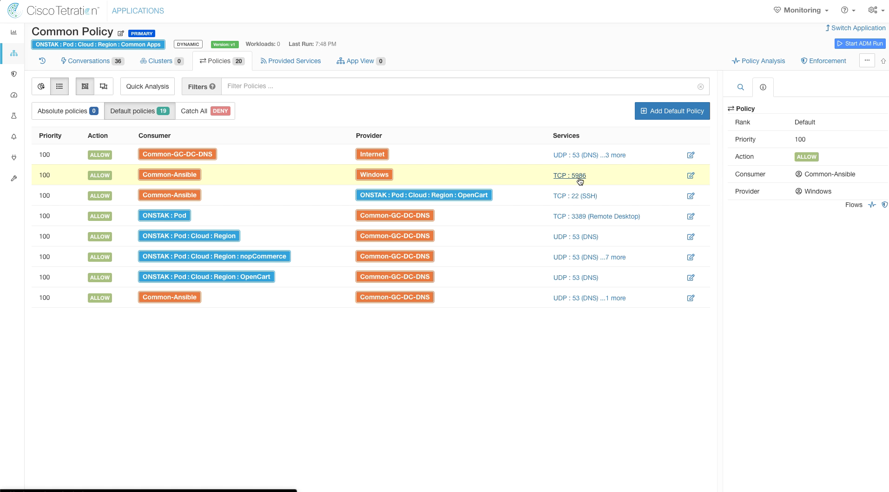</a>  

<a href="#step-036" style="font-weight:bold">Step 036</a>
  

Change the rule with Common-Ansible as Consumer and OpenCart as Provider with TCP 22 as a service so that the Provider is the Linux Inventory Filter.  

<a href="images/module13_036.png">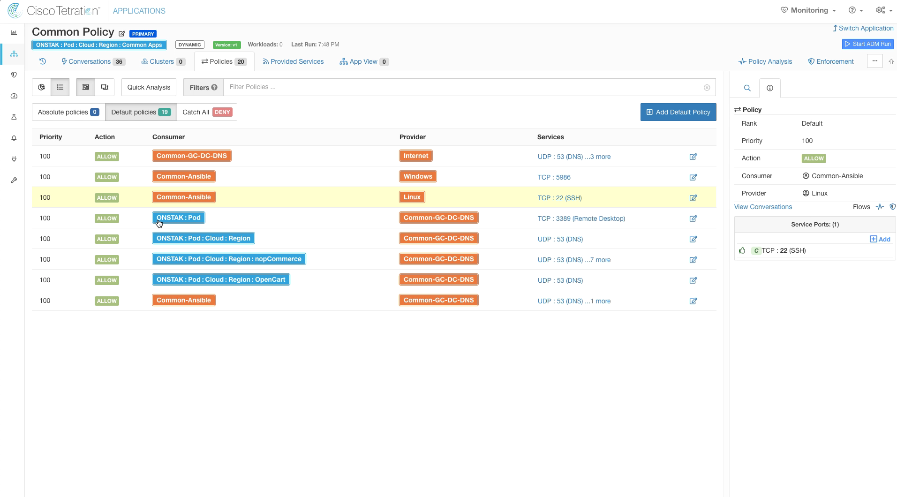</a>  

<a href="#step-037" style="font-weight:bold">Step 037</a>
  

Delete the rule with Consumer of Pod and Provider Common-GC-DNS with Service TCP port 3389.  We will create the required rule later in Global Services to allow the Guacamole server to RDP to the Windows servers and SSH to the Linux servers.  

<a href="images/module13_037.png">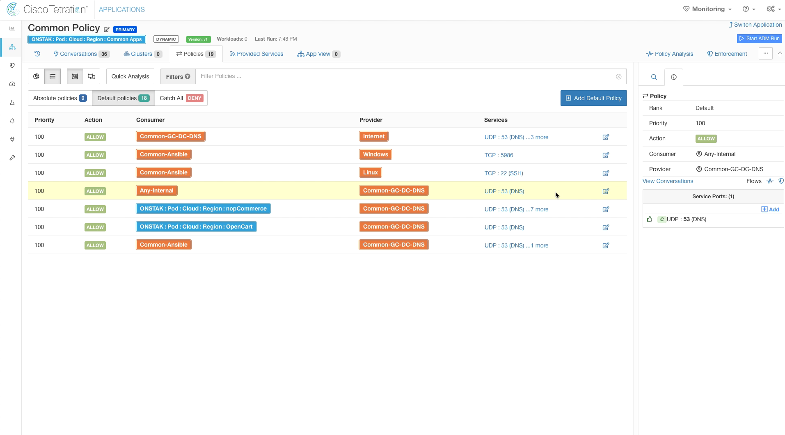</a>  

<a href="#step-038" style="font-weight:bold">Step 038</a>
  

Change the rule with nopCommerce as Consumer and Common-GC-DC-DNS as the Provider so that Windows is the Consumer.  

<a href="images/module13_038.png">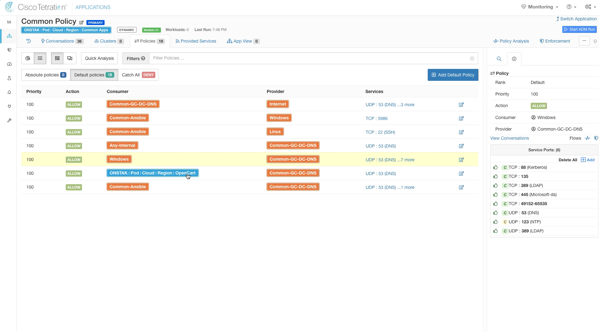</a>  

<a href="#step-039" style="font-weight:bold">Step 039</a>
  

Delete the rule with Consumer Opencart and Provider Common-GC-DNS and UDP 53 as service.  We have already covered this traffic with the previous rule change allowing Any-Internal to Common-GC-DC-DNS on UDP 53.  

First remove UDP 53 service.   

<a href="images/module13_039.png">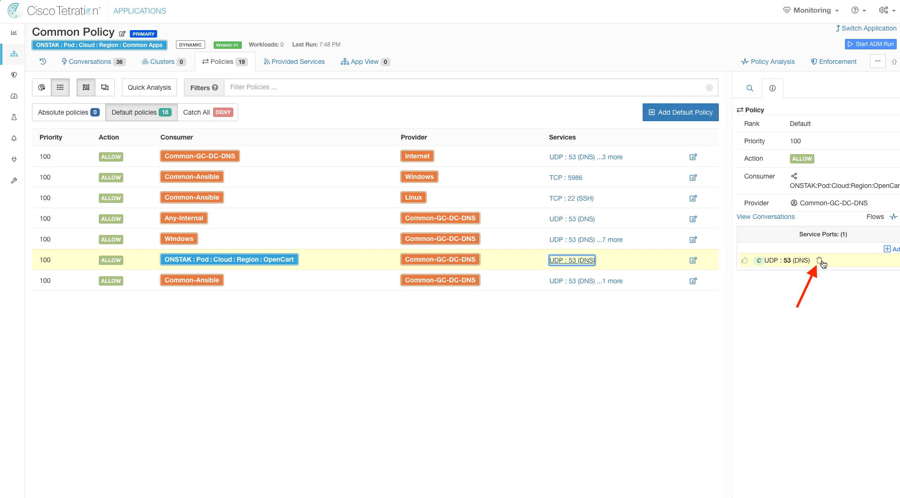</a>  

<a href="#step-040" style="font-weight:bold">Step 040</a>
  

Click the red trash bin to delete the rule.  

<a href="images/module13_040.png">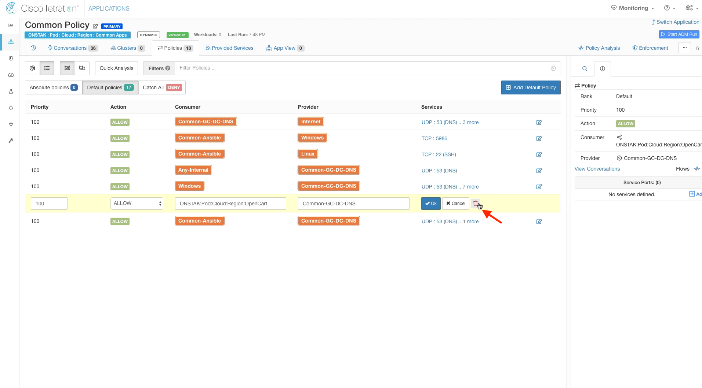</a>  

<a href="#step-041" style="font-weight:bold">Step 041</a>
  

Delete the rule with Common-Ansible as Consumer and Common-GC-DNS as Provider.  This rule has also been covered by our previous rule changes allowing Common-Ansible to talk to Windows and Linux machines on ports 5986 and 22 respectively.  Fist delete all of the services.  

<a href="images/module13_041.png">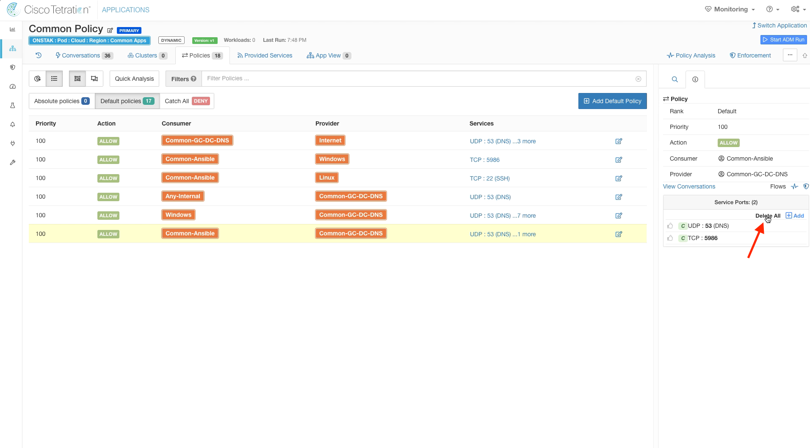</a>  

<a href="#step-042" style="font-weight:bold">Step 042</a>
  

Delete the rule.  

<a href="images/module13_042.png">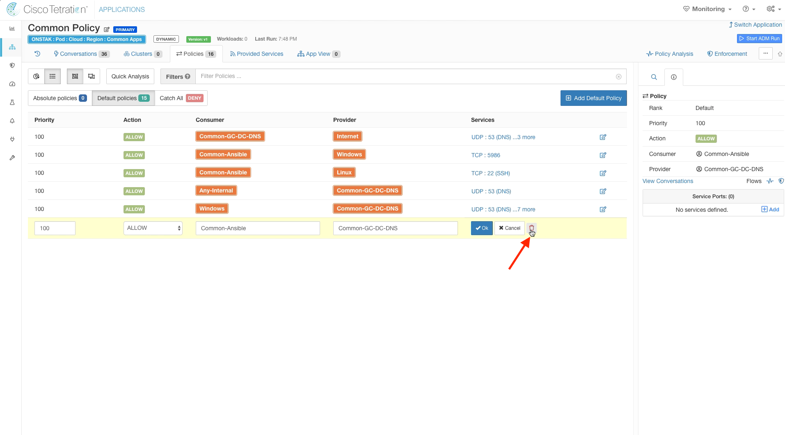</a>  

<a href="#step-043" style="font-weight:bold">Step 043</a>
  

Click the expand icon to expand out the services for each rule onto individual lines.  This is a great way to see all of the rules and the services being provided.  

<a href="images/module13_043.png">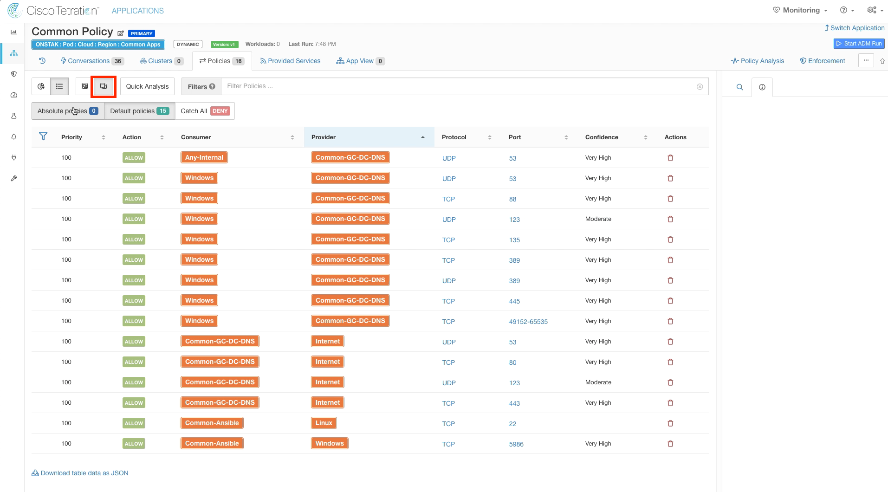</a>  

<a href="#step-044" style="font-weight:bold">Step 044</a>
  

Click on Switch Application.  

<a href="images/module13_044.png">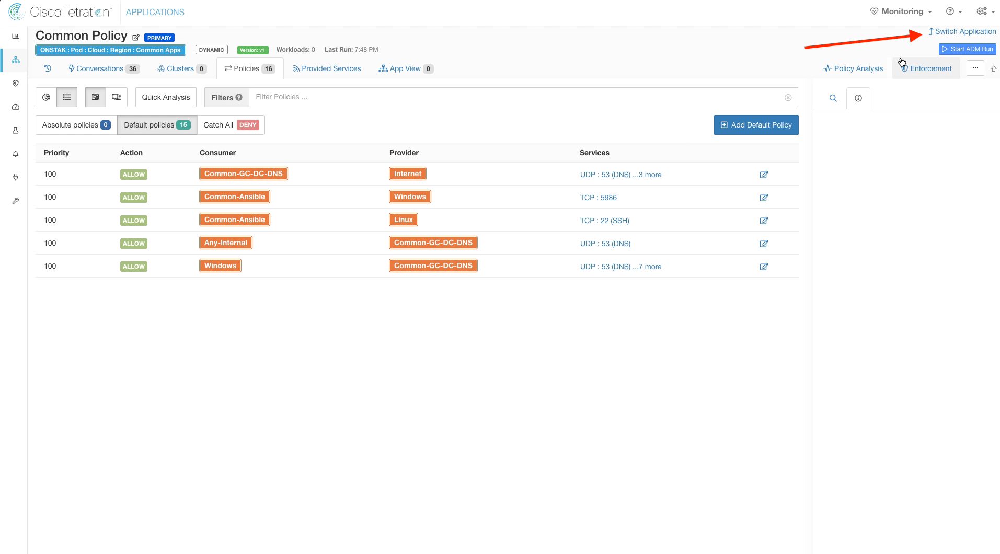</a>  

<a href="#step-045" style="font-weight:bold">Step 045</a>
  

Select the Global Services workspace.

<a href="images/module13_045.png">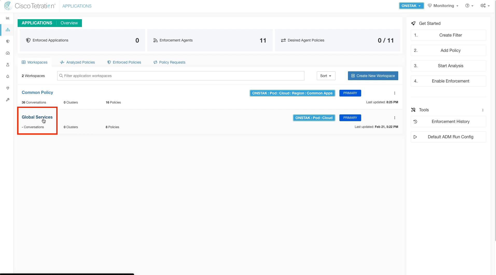</a>  

<a href="#step-046" style="font-weight:bold">Step 046</a>
  

Add UDP 67 to the services for the Any-Internal to Any-Internal rule.  

<a href="images/module13_046.png">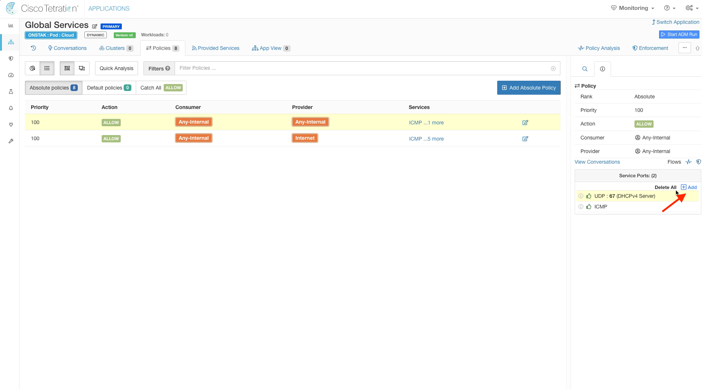</a>  

<a href="#step-047" style="font-weight:bold">Step 047</a>
  

Create a new rule allowing Guacamole to talk to Any-Internal on TCP ports 3389 and 22.  

<a href="images/module13_047.png">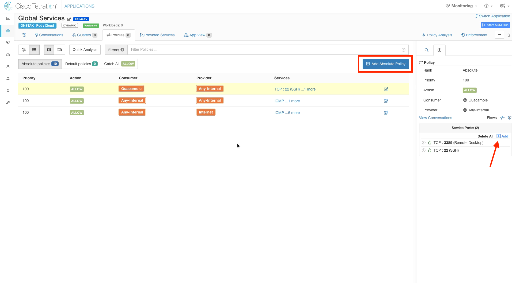</a>  

YOU HAVE FINISHED THIS MODULE

| [Return to Table of Contents](https://tetration.guru/bootcamp/) | [Go to Top of the Page]() | [Continue to the Next Module]() |
