# Cisco Tetration Virtual Bootcamp

## Module 07.03  Segmentation - ADM - Windows App

In this module we will create an Application Workspace for the NopCommerce application which consists of an IIS web server and a MS-SQL database server. We will first run ADM, and then adjust the discovered cluster queries to use AWS tags. Then we will refine the discovered policies.  We will also take a look at Policy Requests. When policies are created that allow a cluster in one application workspace to talk to a cluster in a different application workspace, policies must be created in both workspaces to allow the communication.  Policy requests are a way to notify the administrator of the other workspace that matching policies need to be created.  The administrator must then go into the other workspace and accept the policy requests.  By accepting the requests,  the rules are automatically created in the other workspace.  Auto-pilot rules can also be set up to automatically accept any incoming policy requests to an application workspace.

In this module, we'll be configuring rules from the Windows IIS and MSSQL servers to the Common Policy workspace to allow communications such as Microsoft RPC, Kerberos, LDAP, DNS, and etc. The rules will be initially discovered by ADM,  and will be created in the Common Policy workspace using the Policy Request functionality described above.  
  
---  

## --- Lab ---
### Steps for this Lab  
<a href="#step-001" style="font-weight:bold">Step 001 - Navigate to Applications</a>  
<a href="#step-002" style="font-weight:bold">Step 002 - Create a new Workspace</a>  
<a href="#step-003" style="font-weight:bold">Step 003 - Assign Workspace to nopCommerce Scope</a>  
<a href="#step-004" style="font-weight:bold">Step 004 - Begin ADM Run</a>  
<a href="#step-005" style="font-weight:bold">Step 005 - Examine member workloads</a>  
<a href="#step-006" style="font-weight:bold">Step 006 - Modify External Dependencies</a>  
<a href="#step-007" style="font-weight:bold">Step 007 - Modify Cluster Granularity</a>  
<a href="#step-008" style="font-weight:bold">Step 008 - Change ADM time range</a>  
<a href="#step-009" style="font-weight:bold">Step 009 - View ADM results</a>  
<a href="#step-010" style="font-weight:bold">Step 010 - Expand clusters </a>  
<a href="#step-011" style="font-weight:bold">Step 011 - Edit SQLSERVER cluster </a>  
<a href="#step-012" style="font-weight:bold">Step 012 - Modify cluster name and query</a>  
<a href="#step-013" style="font-weight:bold">Step 013 - Edit WEBSERVER cluster</a>  
<a href="#step-014" style="font-weight:bold">Step 014 - Modify cluster name and query</a>  
<a href="#step-015" style="font-weight:bold">Step 015 - Promote App cluster to Inventory Filter</a>  
<a href="#step-016" style="font-weight:bold">Step 016 - Select Promote Cluster</a>  
<a href="#step-017" style="font-weight:bold">Step 017 - Promote DB cluster to Inventory filter</a>  
<a href="#step-018" style="font-weight:bold">Step 018 - Select Promote Cluster</a>  
<a href="#step-019" style="font-weight:bold">Step 019 - Delete services for nopCommerce-App to Root scope rule</a>  
<a href="#step-020" style="font-weight:bold">Step 020 - Delete nopCommerce-App to Root scope rule</a>  
<a href="#step-021" style="font-weight:bold">Step 021 - Delete services for nopCommerce-DB to Root scope rule</a>  
<a href="#step-022" style="font-weight:bold">Step 022 - Delete nopCommerce-DB to Root scope rule</a>  
<a href="#step-023" style="font-weight:bold">Step 023 - Delete individual ports in Win ephemeral port range</a>  
<a href="#step-024" style="font-weight:bold">Step 024 - Add Windows ephemeral port range</a>  
<a href="#step-025" style="font-weight:bold">Step 025 - Delete individual ports and add Windows ephemeral port range</a>  
<a href="#step-026" style="font-weight:bold">Step 026 - Modify Root scope to nopCommerce App rule for TCP 80, 443</a>  
<a href="#step-027" style="font-weight:bold">Step 027 - Change Root scope to Any</a>  
<a href="#step-028" style="font-weight:bold">Step 028 - Select to Switch Application</a>  
<a href="#step-029" style="font-weight:bold">Step 029 - Navigate to Common Policy</a>  
<a href="#step-030" style="font-weight:bold">Step 030 - Click on Provided Services</a>  
<a href="#step-031" style="font-weight:bold">Step 031 - View Policy Requests</a>  
<a href="#step-032" style="font-weight:bold">Step 032 - Accept all Policy Requests</a>  
<a href="#step-033" style="font-weight:bold">Step 033 - View Policies</a>  
<a href="#step-034" style="font-weight:bold">Step 034 - View the rules and services created by accepting the Policy Requests - Common Policy
</a>
<a href="#step-035" style="font-weight:bold">Step 035 - View the rules and services created by accepting the Policy Requests - Common Policy</a>                                                                                                                
<a href="#step-036" style="font-weight:bold">Step 036 - View the rules and services created by accepting the Policy Requests - nopCommerce
</a>  

---

<a href="#step-001" style="font-weight:bold">Step 001</a>
  

Navigate to Applications.

<a href="images/module_07-03_001.png">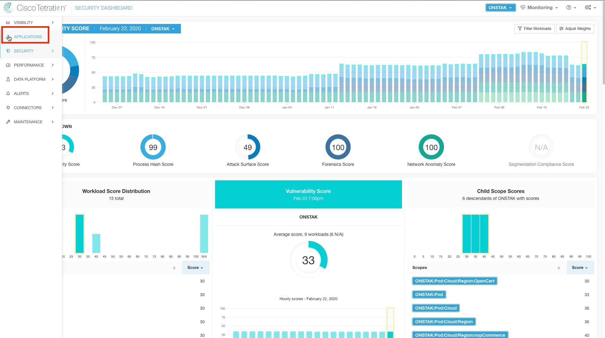</a>  

<a href="#step-002" style="font-weight:bold">Step 002</a>
  

Create a new Application Workspace.

<a href="images/module_07-03_002.png">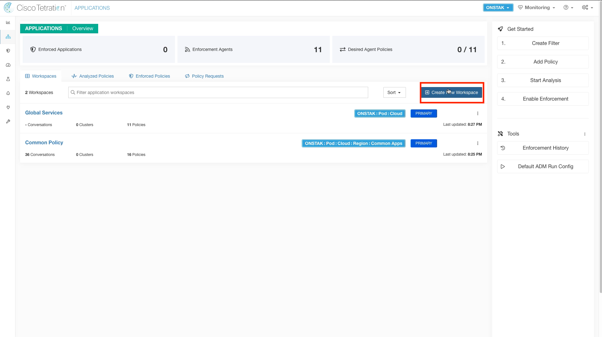</a>  

<a href="#step-003" style="font-weight:bold">Step 003</a>
  

Name the Application Workspace `nopCommerce` and set the Scope to nopCommerce.

<a href="images/module_07-03_003.png">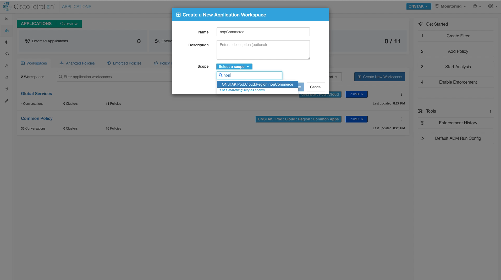</a>  

<a href="#step-004" style="font-weight:bold">Step 004</a>
  

Select Start ADM Run.

<a href="images/module_07-03_004.png">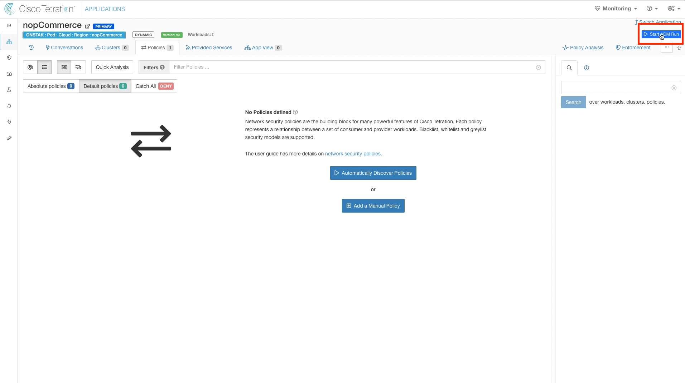</a>  

<a href="#step-005" style="font-weight:bold">Step 005</a>
  

Click the Show button under Member workloads to display the associated machines.  The Microsoft IIS and SQL servers should be shown here.

<a href="images/module_07-03_005.png">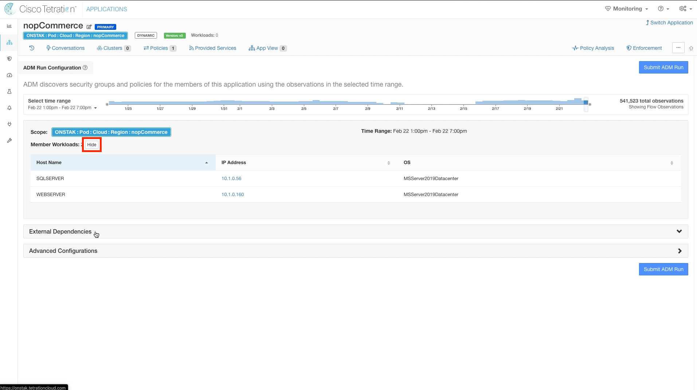</a>  

<a href="#step-006" style="font-weight:bold">Step 006</a>
  

Expand External Dependencies and set the scopes for Common Apps and the Root scope to Fine.  

>  The External Dependencies Coarse/Fine setting controls whether rules that include inventory that exists in other Scopes will be toward the Scope or toward clusters.  Since we have promoted the clusters in the Common Policy scope to Inventory Filters,  it makes sense to change this setting to Fine so any rules will be built toward the individual clusters rather than the entire scope.  Leaving the default setting of Coarse will create a more broad policy which would allow access to all workloads in the target Scope, regardless of the cluster grouping.  

<a href="images/module_07-03_006.png">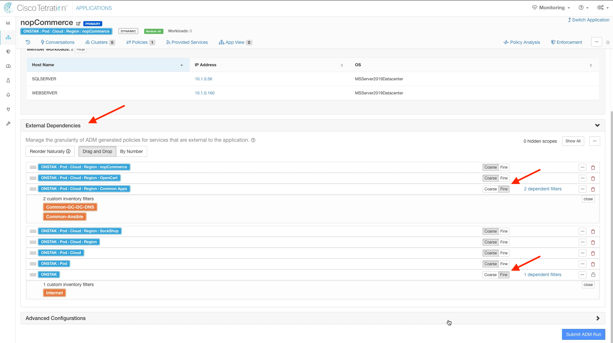</a>  

<a href="#step-007" style="font-weight:bold">Step 007</a>
  

Expand Advanced Configurations and set the Cluster Granularity to Very Fine.  

<a href="images/module_07-03_007.png">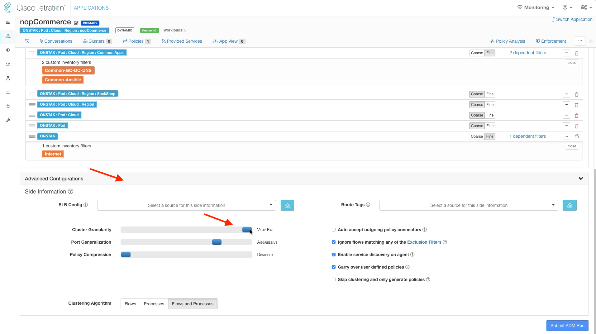</a>  

<a href="#step-008" style="font-weight:bold">Step 008</a>
  

Change the time range for the ADM run to six hours,  and then submit the ADM run.

<a href="images/module_07-03_008.png">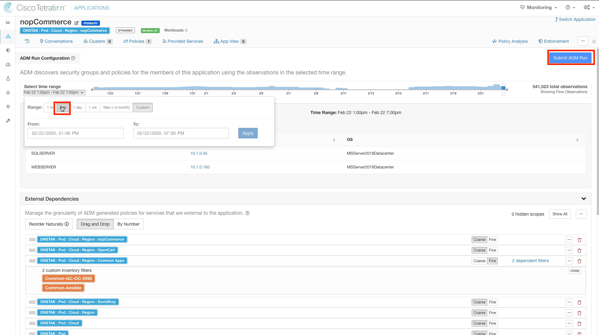</a>  

<a href="#step-009" style="font-weight:bold">Step 009</a>
  

Once the ADM run is complete,  select the ADM results available link.  

<a href="images/module_07-03_009.png">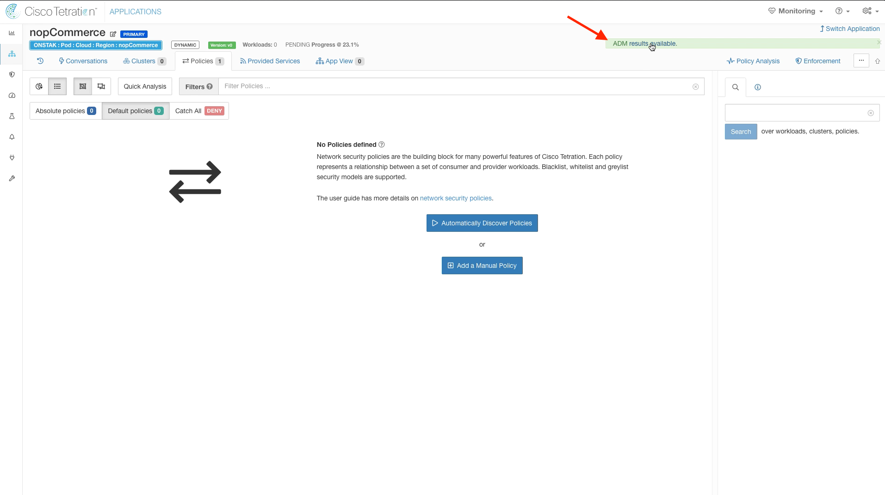</a>  

<a href="#step-010" style="font-weight:bold">Step 010</a>
  

Click to expand the SQLSERVER and WEBSERVER clusters.  The clusters should contain the MS SQL server IP and the IIS server IP addresses respectively.  

<a href="images/module_07-03_010.png">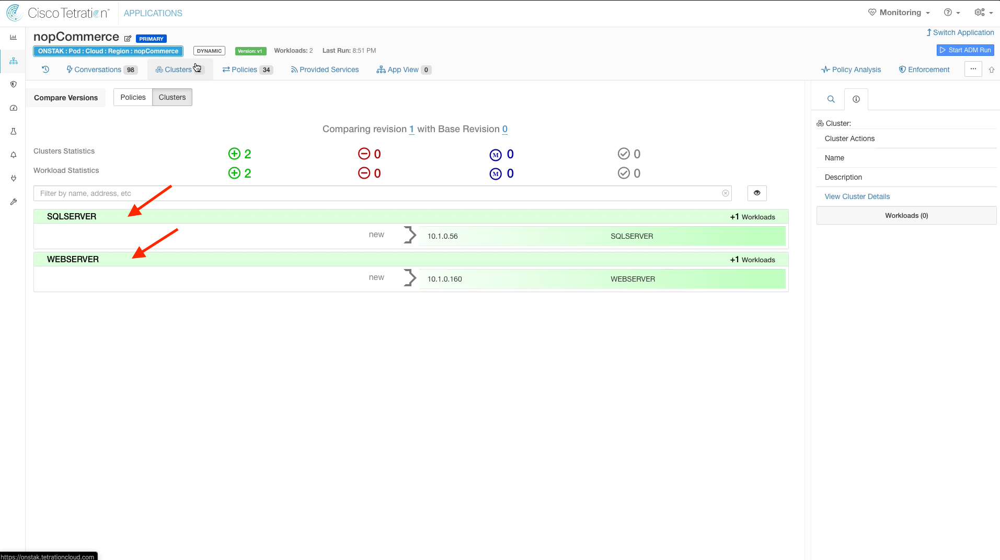</a>  

<a href="#step-011" style="font-weight:bold">Step 011</a>
  

Click on the SQLSERVER cluster and select the pencil icon to edit the cluster.  

<a href="images/module_07-03_011.png">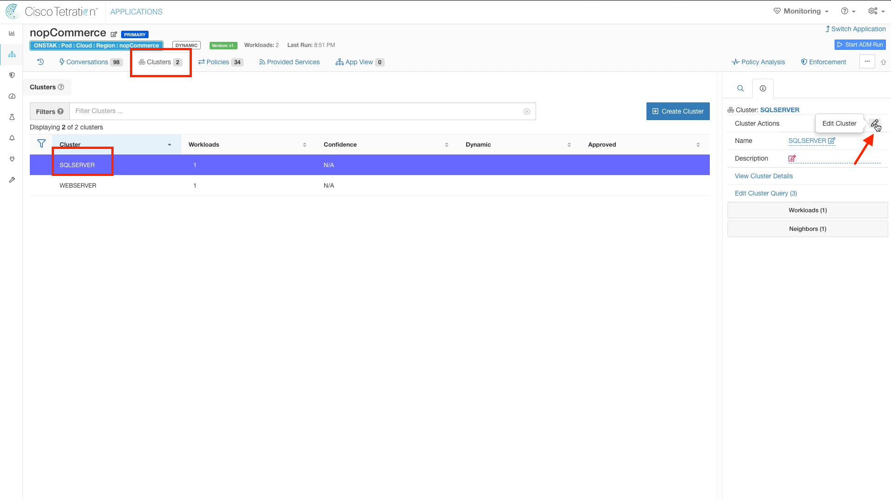</a>  

<a href="#step-012" style="font-weight:bold">Step 012</a>
  

Enter the cluster name and query as shown in the below image.

<a href="images/module_07-03_012.png">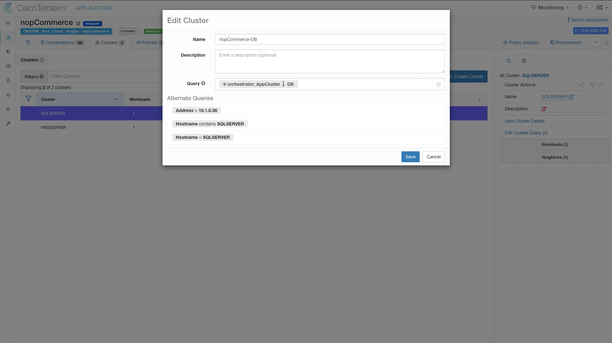</a>  

<a href="#step-013" style="font-weight:bold">Step 013</a>
  

Click on the WEBSERVER cluster and select the pencil icon to edit the cluster.

<a href="images/module_07-03_013.png">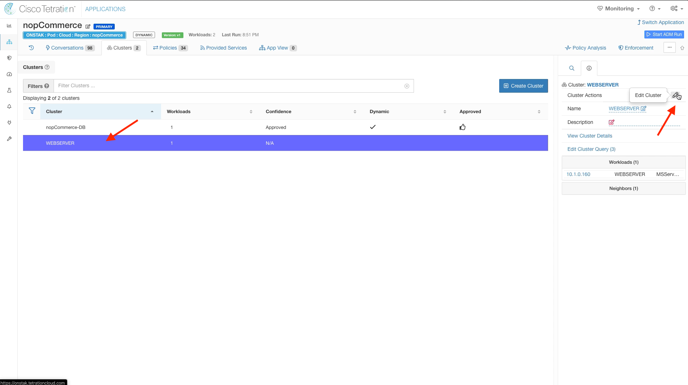</a>  

<a href="#step-014" style="font-weight:bold">Step 014</a>
  

Enter the cluster name and query as shown in the below image.  

<a href="images/module_07-03_014.png">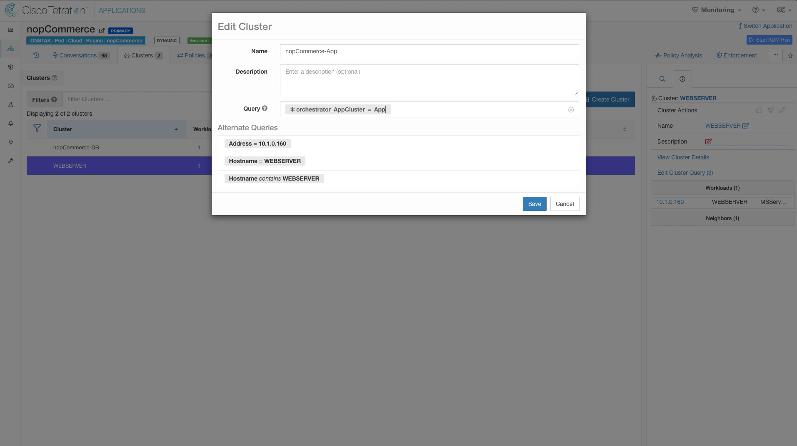</a>  

<a href="#step-015" style="font-weight:bold">Step 015</a>
  

Click the rocket ship icon to promote the nopCommerce-App cluster to an Inventory Filter.

<a href="images/module_07-03_015.png">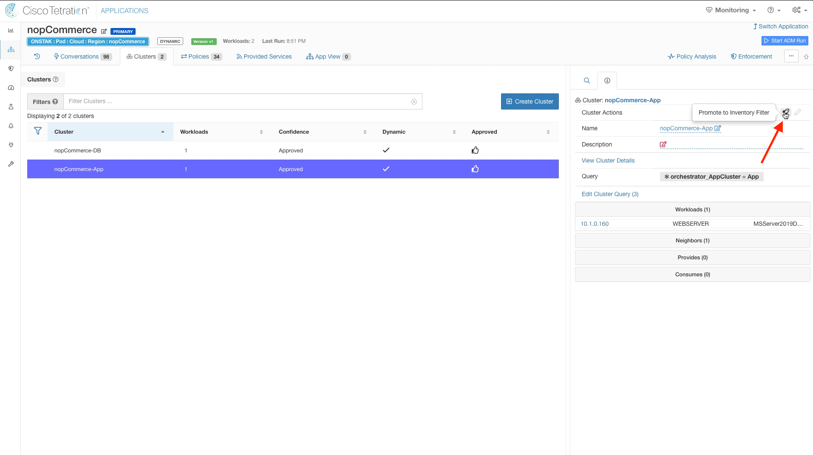</a>  

<a href="#step-016" style="font-weight:bold">Step 016</a>
  

No changes are required here,  select Promote Cluster.

<a href="images/module_07-03_016.png">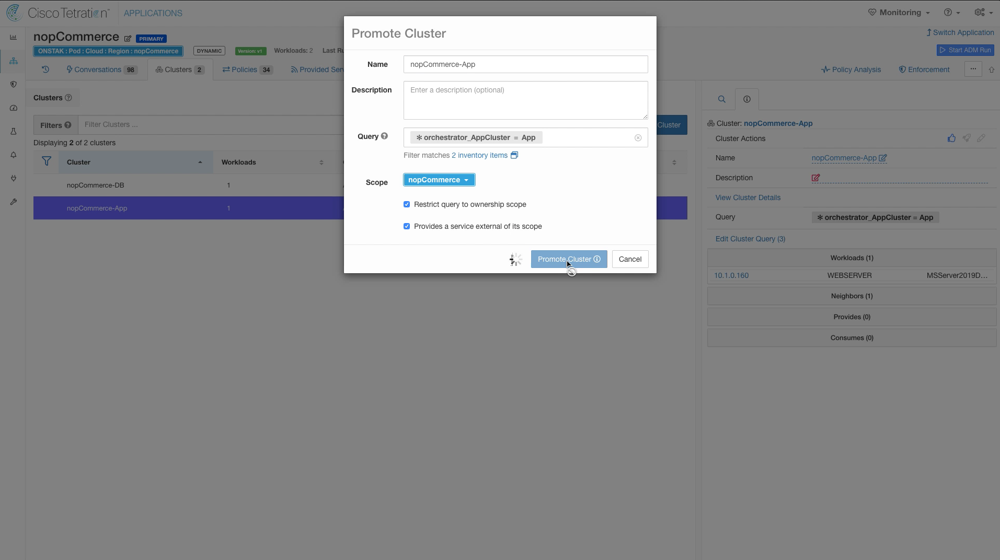</a>  

<a href="#step-017" style="font-weight:bold">Step 017</a>
  

Select the nopCommerce-DB cluster and promote it to an Inventory Filter.

<a href="images/module_07-03_017.png">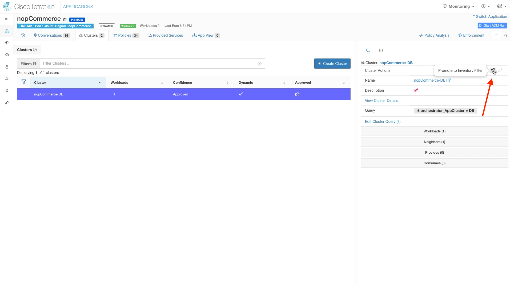</a>  

<a href="#step-018" style="font-weight:bold">Step 018</a>
  

No changes are required here, click on Promote Cluster.

<a href="images/module_07-03_018.png">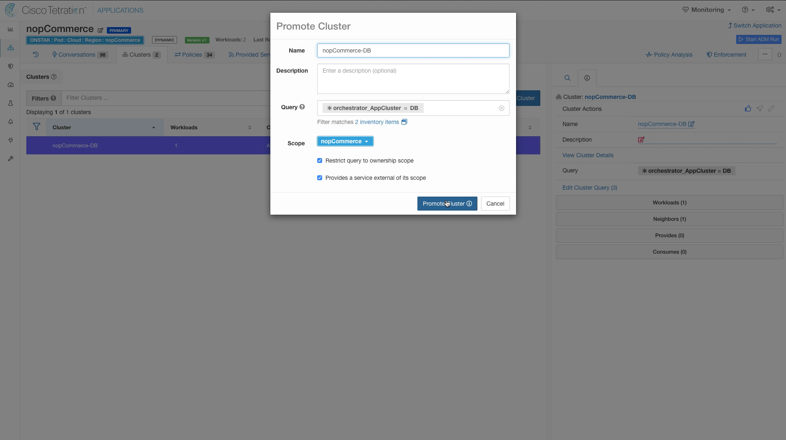</a>  

<a href="#step-019" style="font-weight:bold">Step 019</a>
  

We will now begin manually tuning the policies that were generated by the ADM run.  Click on the Policies tab.  We can delete the first two rules that are from nopCommerce-App and nopCommerce-DB to the Root Scope on TCP ports 80, 443, 123, and 138.  Recall that these rules are actually covered by our Global Services policies permitting outbound access to the Internet on these ports from Any-Internal.   

Delete all services from the rule with nopCommerce-App as Consumer and the Root scope as Provider.

<a href="images/module_07-03_019.png">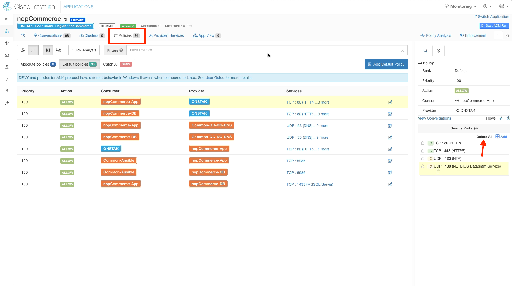</a>  

<a href="#step-020" style="font-weight:bold">Step 020</a>
  

Click to edit the rule and then click the trash can to delete it.  

<a href="images/module_07-03_020.png">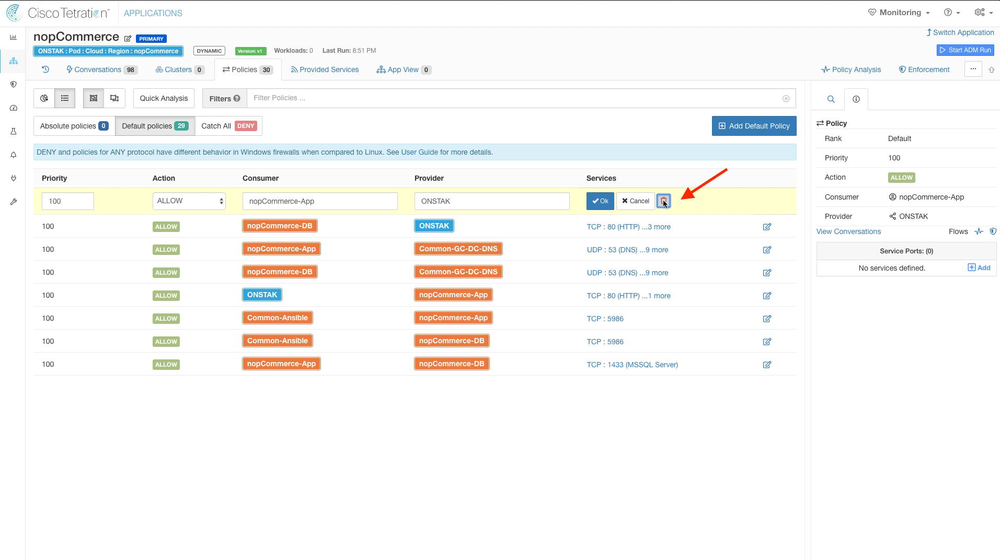</a>  

<a href="#step-021" style="font-weight:bold">Step 021</a>
  

Delete all services from the rule with nopCommerce-DB as Consumer and the Root scope as Provider.  

<a href="images/module_07-03_021.png">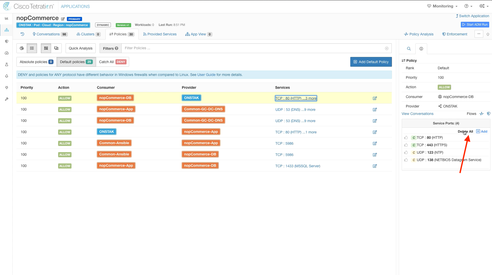</a>  

<a href="#step-022" style="font-weight:bold">Step 022</a>
  

Click to edit the rule, and then click the trash can to delete the rule.

<a href="images/module_07-03_022.png">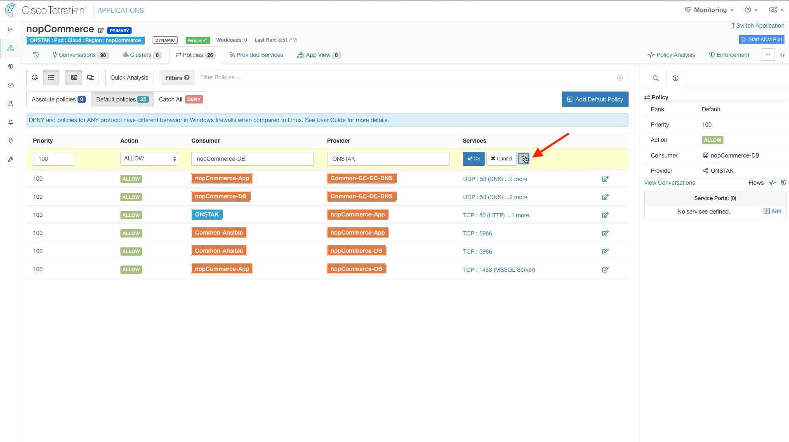</a>  

<a href="#step-023" style="font-weight:bold">Step 023</a>
  

On the policy rule with nopCommerce-App as Consumer and Common-GC-DC-DNS,  the ADM run has discovered communication on a few of the ports in the Windows ephemeral port range 49158-65535.  Since Windows may open up communication on any ports in this range, we should delete the individual ports and enter the entire range in our rules.  

Click to delete the TCP ports within the 49158-65535 range.  The ports discovered in your ADM run may be different from the image, as Windows may have opened up different ports for the workloads in your student environment.  

<a href="images/module_07-03_023.png">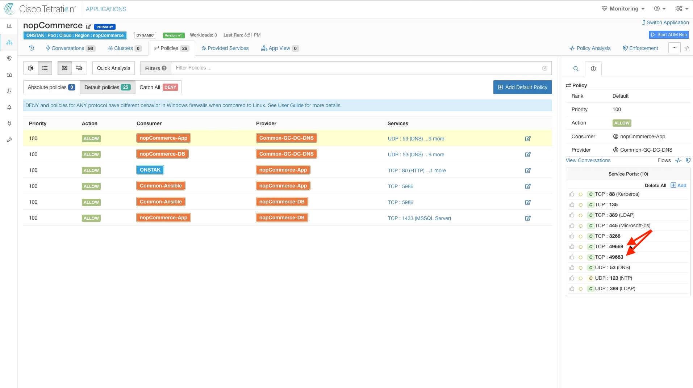</a>  

<a href="#step-024" style="font-weight:bold">Step 024</a>
  

Add the Windows ephemeral port range 49158-65535 to the Service Ports.  

<a href="images/module_07-03_024.png">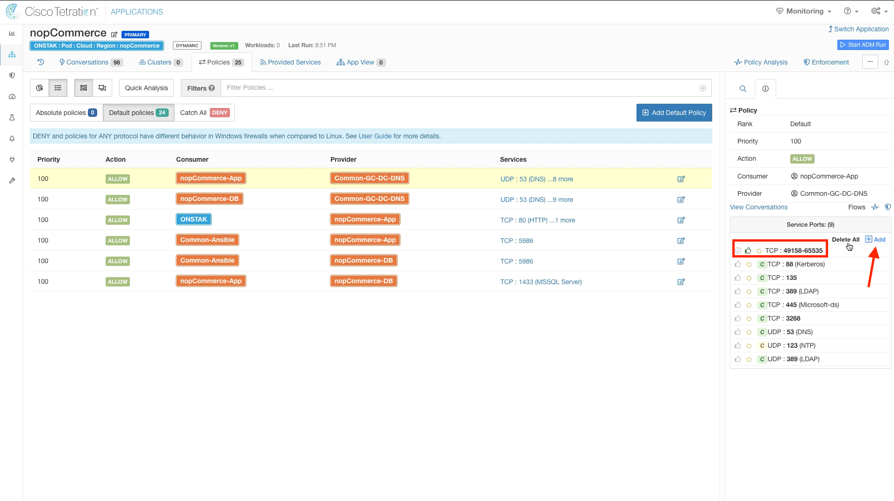</a>  

<a href="#step-025" style="font-weight:bold">Step 025</a>
  

We must repeat the same tasks for the rule with nopCommerce-DB as Consumer and Common-GC-DC-DNS as the provider.  Delete the individual ports within the Windows ephemeral range 49158-65535,  and then add the range 49158-65535 to the Service Ports.  

> Notice the orange circle next to the all of the Service Ports.  This means that there are outstanding Policy Requests that have been issued to another workspace.  If you click on the orange circle, it will tell you to which workspace the outgoing Policy Requests are pending. Whenever communication is required between workloads that are members of clusters in different workspaces,  there must be matching rules in both workspaces in order for the rules to take affect.  In this case we have configured rules in the nopCommerce workspace from nopCommerce-App and nopCommerce-DB to the Common-GC-DC-DNS cluster in the Common Policy workspace,  but there are not yet matching rules in the Common Policy workspace.  A Policy Request is sent by the nopCommerce workspace to the Common Policy workspace to create the rules in the Common Policy workspace. An administrator must review and approve the Policy Requests, as we will see in just a moment.

<a href="images/module_07-03_025.png">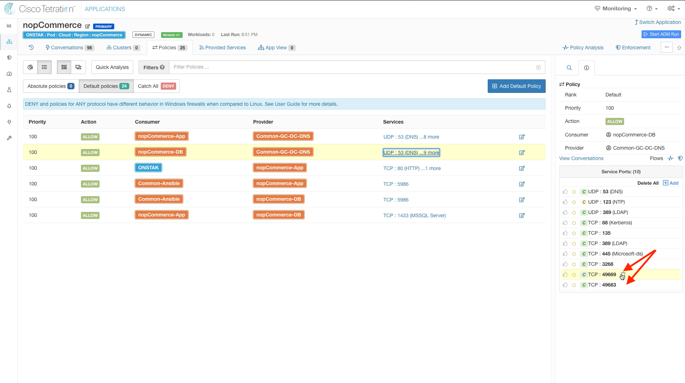</a>  

<a href="#step-026" style="font-weight:bold">Step 026</a>
  

Edit the rule where the Root scope is a Consumer to nopCommerce-App as Provider for TCP ports 80 and 443.  This is to allow inbound access to the web application both internally and externally,  thus we will set the Consumer to Any.  Change the Consumer from the root scope to Any.  

<a href="images/module_07-03_026.png">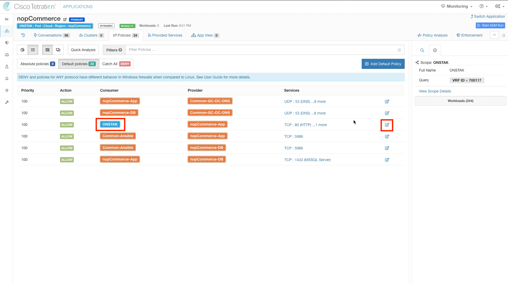</a>  

<a href="#step-027" style="font-weight:bold">Step 027</a>
  

The Consumer should now be set to Any as shown below.   

<a href="images/module_07-03_027.png">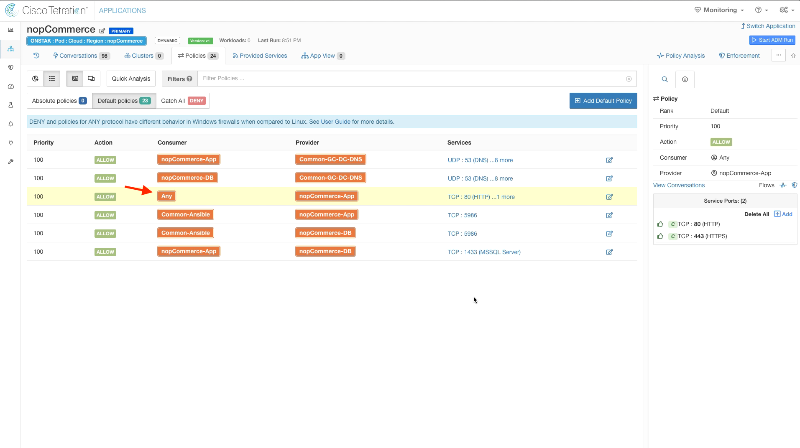</a>  

<a href="#step-028" style="font-weight:bold">Step 028</a>
  

Now we will address the outgoing Policy Requests for this application workspace to the Common Policy workspace.  When the rules were created by ADM toward the Common-GC-DC-DNS Inventory Filter which is tied to the Common Policy scope,  Policy Requests were sent to the Common Policy workspace to create matching rules within the Common Policy workspace. The outgoing Policy Requests are indicated by the orange circle next to the ports in the list of Services for the rules. Matching rules in the Common Policy workspace are required in order to allow the intended communication.

Click on Switch Application.  

<a href="images/module_07-03_028.png">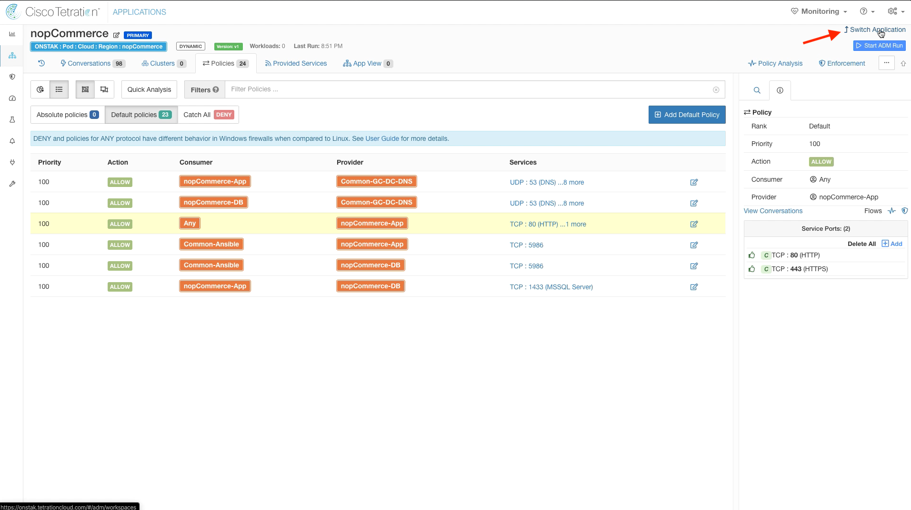</a>  

<a href="#step-029" style="font-weight:bold">Step 029</a>
  

Select the Common Policy App Workspace.

<a href="images/module_07-03_029.png">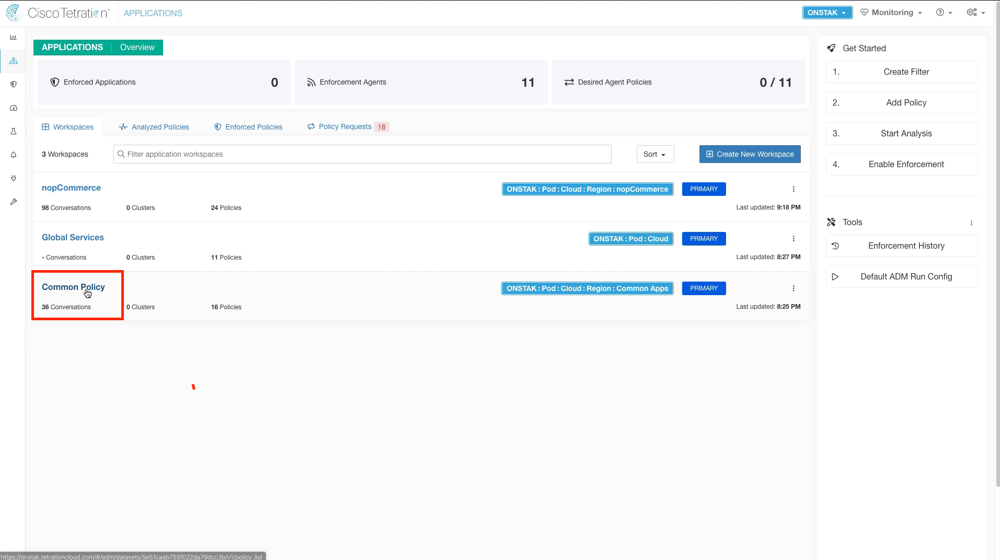</a>  

<a href="#step-030" style="font-weight:bold">Step 030</a>
  

Click on Provided Services.  

<a href="images/module_07-03_030.png">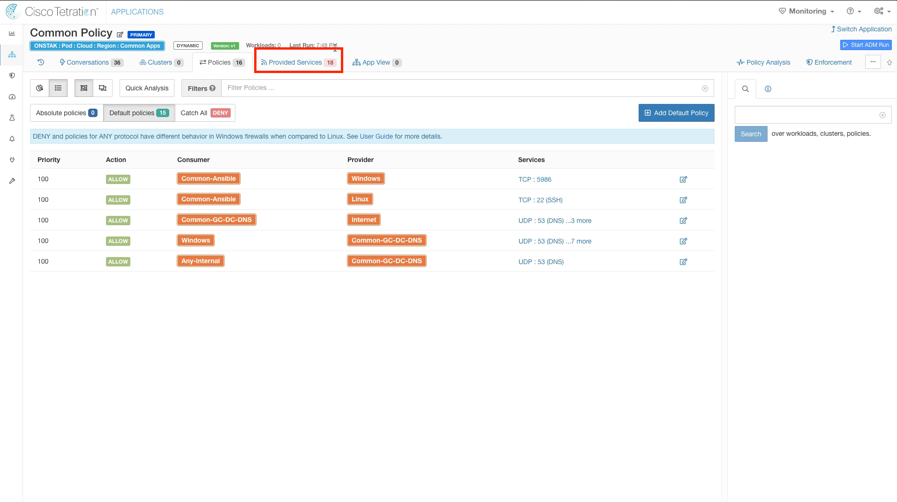</a>  

<a href="#step-031" style="font-weight:bold">Step 031</a>
  

Notice that we have 18 incoming Policy Requests that are in Pending state.  The administrator of this workspace must accept the requests to allow the policies to be created in the Common Policy workspace to complete the configuration.  It is also possible to set up Auto-Pilot rules so that incoming Policy Requests for specific TCP/UDP ports are automatically accepted.

<a href="images/module_07-03_031.png">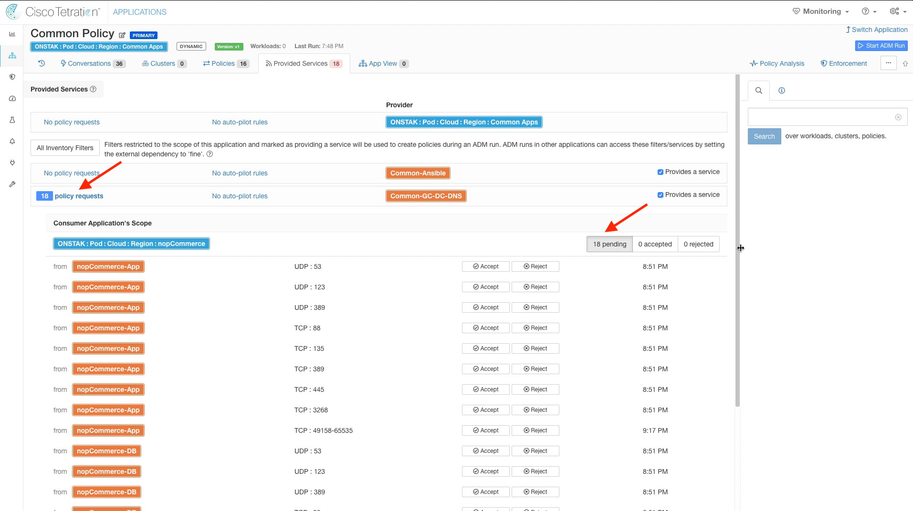</a>  

<a href="#step-032" style="font-weight:bold">Step 032</a>
  

Click Accept on each of the 18 Policy Requests.  

<a href="images/module_07-03_032.png">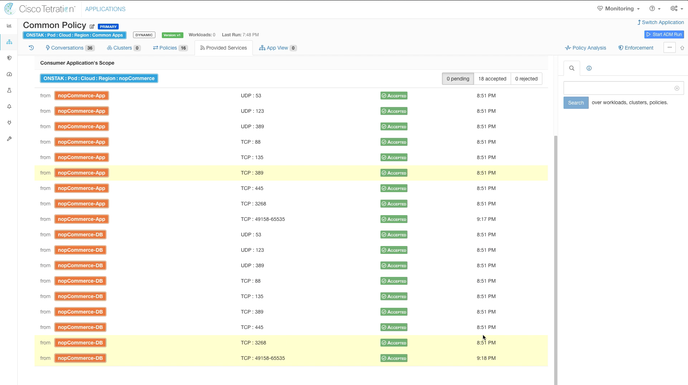</a>  

<a href="#step-033" style="font-weight:bold">Step 033</a>
  

Click on Policies to view the policies in the Common Policy workspace.

<a href="images/module_07-03_033.png">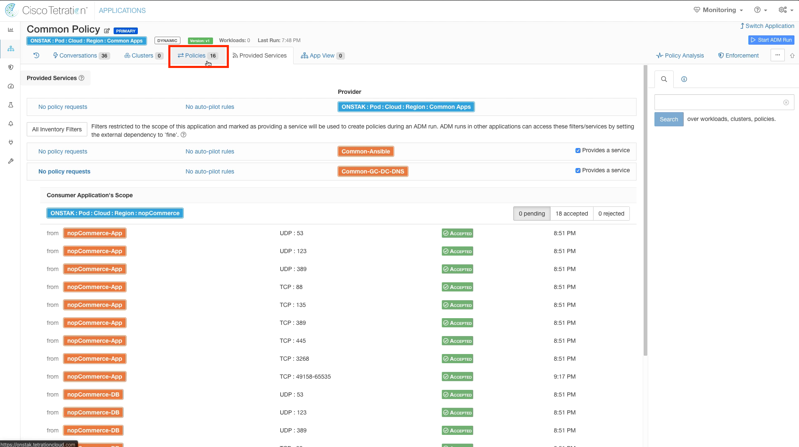</a>  

<a href="#step-034" style="font-weight:bold">Step 034</a>
  

There are now two new rules that have been created,  one from nopCommerce-App to Common-GC-DC-DNS each with 9 services as shown in the below image.

<a href="images/module_07-03_034.png">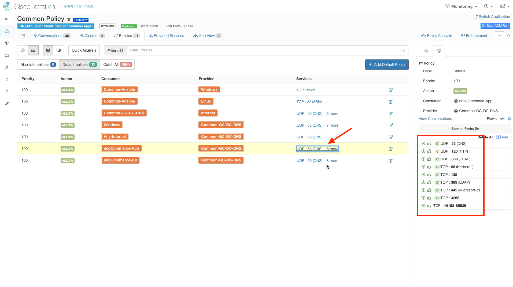</a>  

<a href="#step-035" style="font-weight:bold">Step 035</a>
  

 Below shows the services in the second rule from nopCommerce-DB to Common-GC-DC-DNS.  Notice that the services all show a thumbs up and are colored green,  this indicates that they have been approved by an administrator.  

<a href="images/module_07-03_035.png">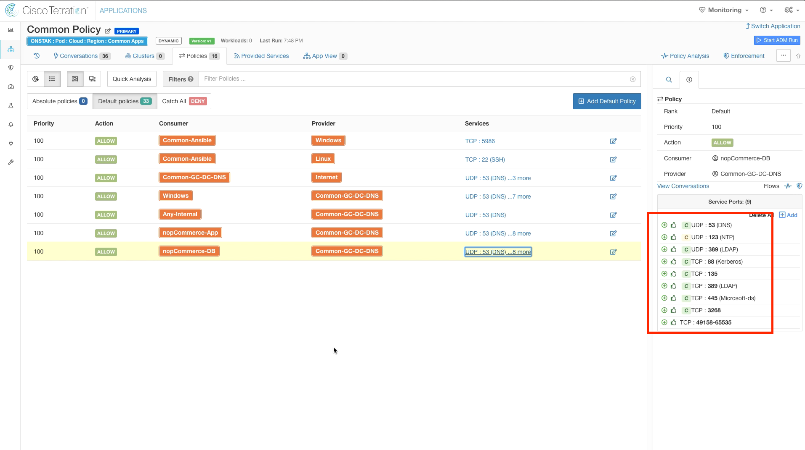</a>  

<a href="#step-036" style="font-weight:bold">Step 036</a>
  

Switch Application and go back to the nopCommerce Application Workspace.  Select the rule from nopCommerce-App to Common-GC-DC-DNS and select Services.  Notice that the orange circles next to each service have now disappeared.

<a href="images/module_07-03_036.png">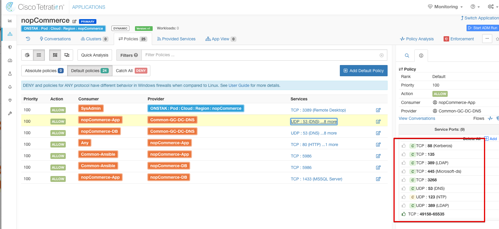</a>  

> The above exercise was intended to demonstrate Provided Services and Policy Requests. In a real world scenario where there could be hundreds or possibly even thousands of workspaces in an organization, the strategy shown of creating specific rules from each workspace to the Common Policy workspace would not be desirable. Instead, we would recommend creating more broad rules in the Common Policy workspace to cover all workspaces accessing common services.  For example, in our Common Policy we could have collapsed the rules allowing nopCommerce-App and nopCommerce-DB to Common-GC-DC-DNS to a single more broad rule such as Windows to Common-GC-DC-DNS.  This would keep the size of the Common Policy ruleset more manageable.  

---   

[Go to Top of Page](README.md)
