# Cisco Tetration Virtual Bootcamp

## Module 07.04  Segmentation - ADM - Linux App

In this module we will create an Application Workspace for the OpenCart application which consists of a Linux server running Apache web server as the front end talking to a Linux server running MySQL for the back-end database.  We will run ADM,  change the cluster queries,  and tune the discovered policies as needed.  We will also accept any Policy Requests made from the OpenCart application workspace to the Common Policy workspace.  

---   

## --- Demo Video ---  
---  
<a href="https://deftcon-tetration-virtual-bootcamp.s3.us-east-2.amazonaws.com/demos/Module_07.04__Demo__Segmentation__ADM_Linux_App.mp4" style="font-weight:bold">Segmentation - ADM - Linux App :: Demo Video :: Runtime: 6 mins</a>  
  
---  

## --- Lab ---
### Steps for this Lab  
<a href="#step-001" style="font-weight:bold">Step 001 - Create a new App Workspace</a>  
<a href="#step-002" style="font-weight:bold">Step 002 - Configure the OpenCart Workspace</a>  
<a href="#step-003" style="font-weight:bold">Step 003 - Begin ADM run</a>  
<a href="#step-004" style="font-weight:bold">Step 004 - Set the ADM time range</a>  
<a href="#step-005" style="font-weight:bold">Step 005 - Examine Member Workloads</a>  
<a href="#step-006" style="font-weight:bold">Step 006 - Set External Dependencies</a>  
<a href="#step-007" style="font-weight:bold">Step 007 - Set Cluster Granularity to Fine</a>  
<a href="#step-008" style="font-weight:bold">Step 008 - View ADM run results</a>  
<a href="#step-009" style="font-weight:bold">Step 009 - View discovered clusters</a>  
<a href="#step-010" style="font-weight:bold">Step 010 - Edit the MySQL cluster</a>  
<a href="#step-011" style="font-weight:bold">Step 011 - Rename the cluster and define new query</a>  
<a href="#step-012" style="font-weight:bold">Step 012 - Edit the Apache cluster</a>  
<a href="#step-013" style="font-weight:bold">Step 013 - Rename the cluster and define new query</a>  
<a href="#step-014" style="font-weight:bold">Step 014 - Promote App cluster to Inventory Filter</a>  
<a href="#step-015" style="font-weight:bold">Step 015 - Promote to Inventory Filter details</a>  
<a href="#step-016" style="font-weight:bold">Step 016 - Promote DB cluster to Inventory Filter</a>  
<a href="#step-017" style="font-weight:bold">Step 017 - Promote to Inventory Filter details</a>  
<a href="#step-018" style="font-weight:bold">Step 018 - Delete rules for outbound access</a>  
<a href="#step-019" style="font-weight:bold">Step 019 - Change Root Scope to Any</a>  
<a href="#step-020" style="font-weight:bold">Step 020 - Verify Root Scope changed to Any</a>  
<a href="#step-021" style="font-weight:bold">Step 021 - Delete TCP 8080 from the inbound web services</a>  
<a href="#step-022" style="font-weight:bold">Step 022 - Switch to the Common Policy workspace</a>  
<a href="#step-023" style="font-weight:bold">Step 023 - Approve the Policy Request</a>  
<a href="#step-024" style="font-weight:bold">Step 024 - View the new rule created by the approved Policy Request</a>  

---

<a href="#step-001" style="font-weight:bold">Step 001</a>
  

Navigate to Applications and create a new workspace.

<a href="images/module_07-04_001.png">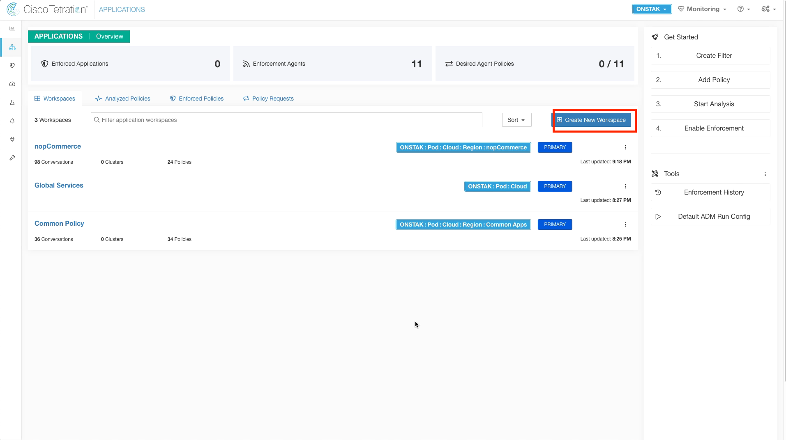</a>  

<a href="#step-002" style="font-weight:bold">Step 002</a>
  

Name the new Application Workspace OpenCart and select the OpenCart scope.

<a href="images/module_07-04_002.png">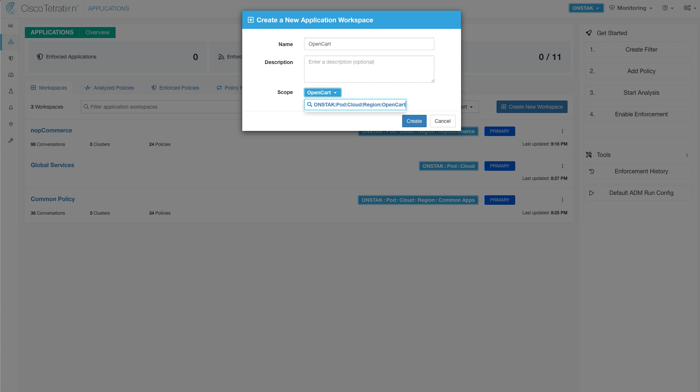</a>  

<a href="#step-003" style="font-weight:bold">Step 003</a>
  

Click Automatically Discover Policies to begin the ADM run process.

<a href="images/module_07-04_003.png">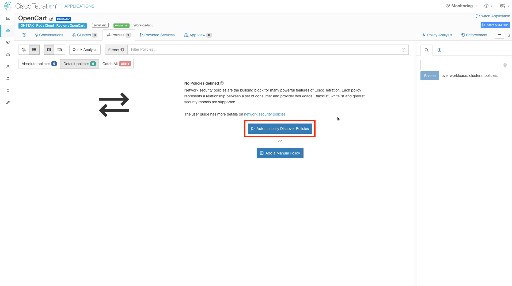</a>  

<a href="#step-004" style="font-weight:bold">Step 004</a>
  

Configure the time range to consider the last 6 hours of traffic.

<a href="images/module_07-04_004.png">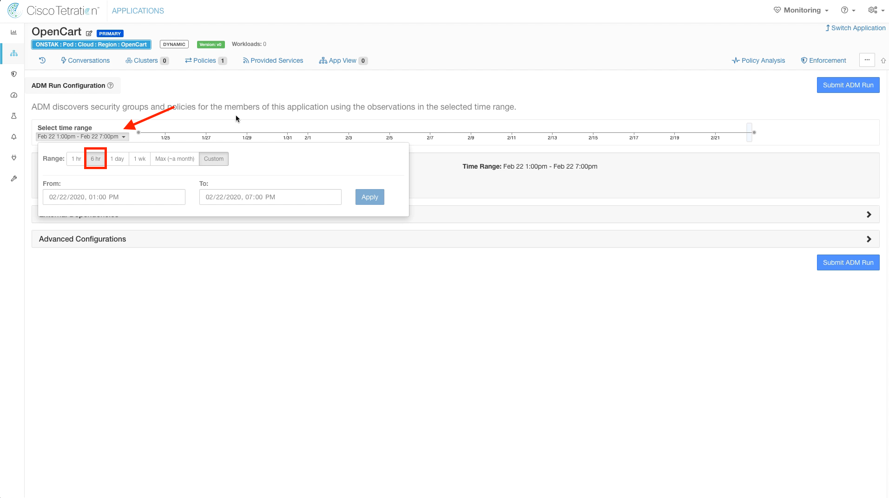</a>  

<a href="#step-005" style="font-weight:bold">Step 005</a>
  

Click Show to reveal the member workloads.  The IP addresses of the Apache web server and MySQL database servers should be shown.

<a href="images/module_07-04_005.png">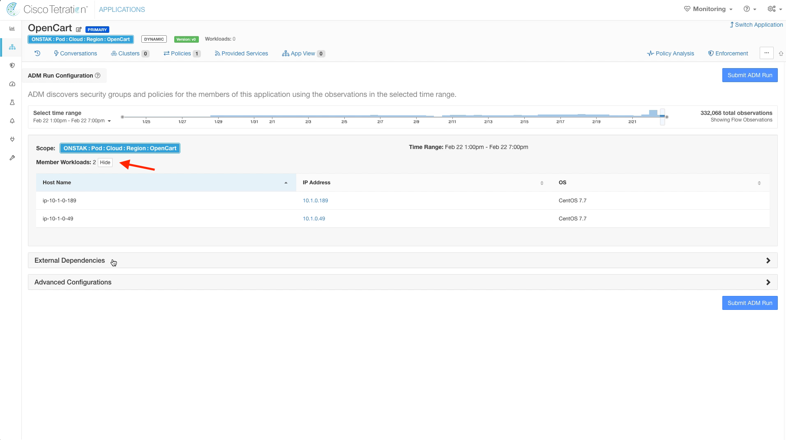</a>  

<a href="#step-006" style="font-weight:bold">Step 006</a>
  

Expand External Dependencies and set Common Apps and the Root scope to Fine.  

<a href="images/module_07-04_006.png">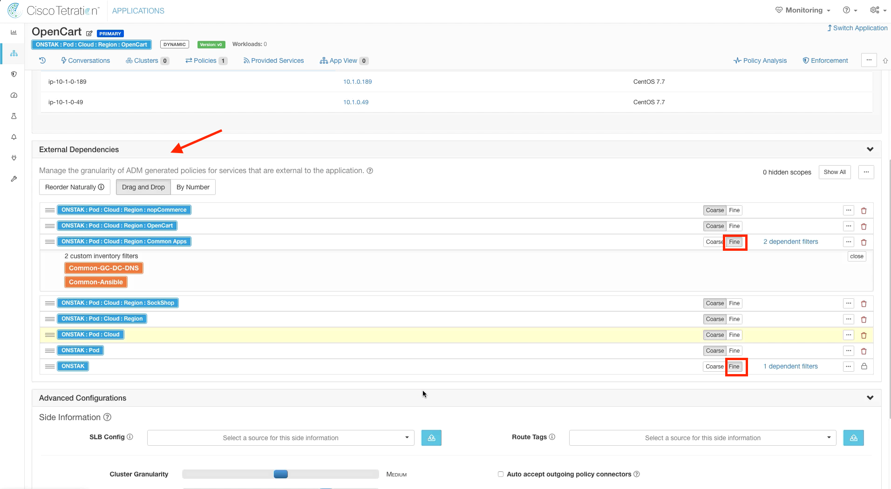</a>  

<a href="#step-007" style="font-weight:bold">Step 007</a>
  

Set Cluster Granularity to Very Fine and then submit the ADM run.

<a href="images/module_07-04_007.png">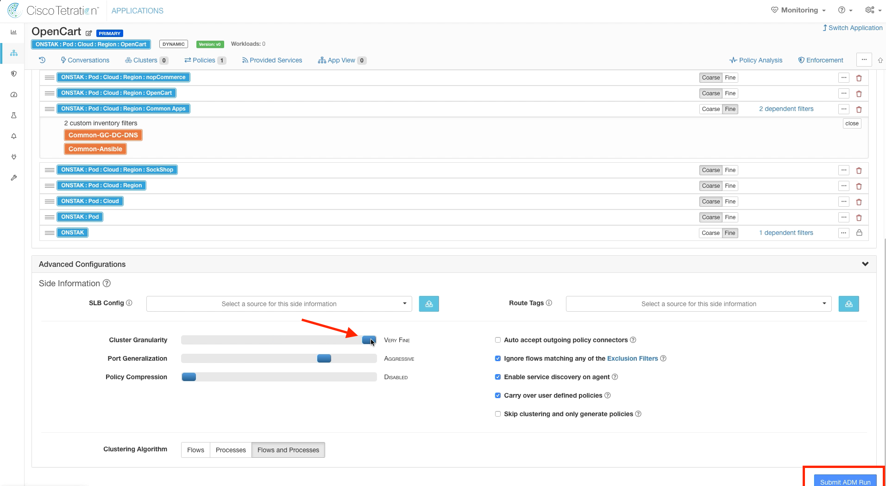</a>  

<a href="#step-008" style="font-weight:bold">Step 008</a>
  

When the ADM run completes,  select the link for ADM results available.

<a href="images/module_07-04_008.png">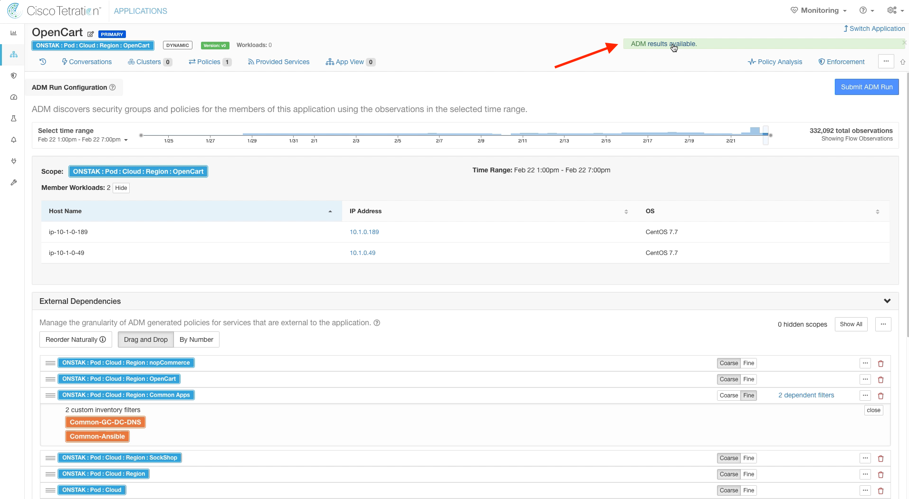</a>  

<a href="#step-009" style="font-weight:bold">Step 009</a>
  

Expand the discovered clusters to see the cluster members.  There should be two clusters, one containing the Apache web server and the other containing the MySQL database server.

<a href="images/module_07-04_009.png">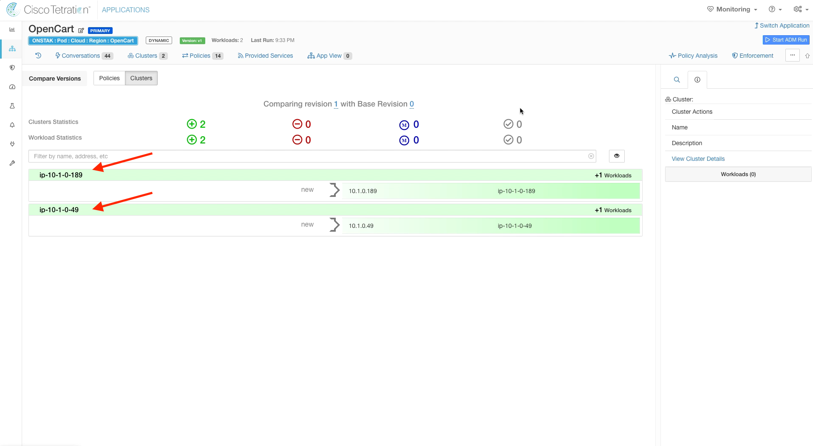</a>  

<a href="#step-010" style="font-weight:bold">Step 010</a>
  

Click on Clusters,  select the cluster that displays the IP address of the MySQL database server and edit the cluster.  

<a href="images/module_07-04_010.png">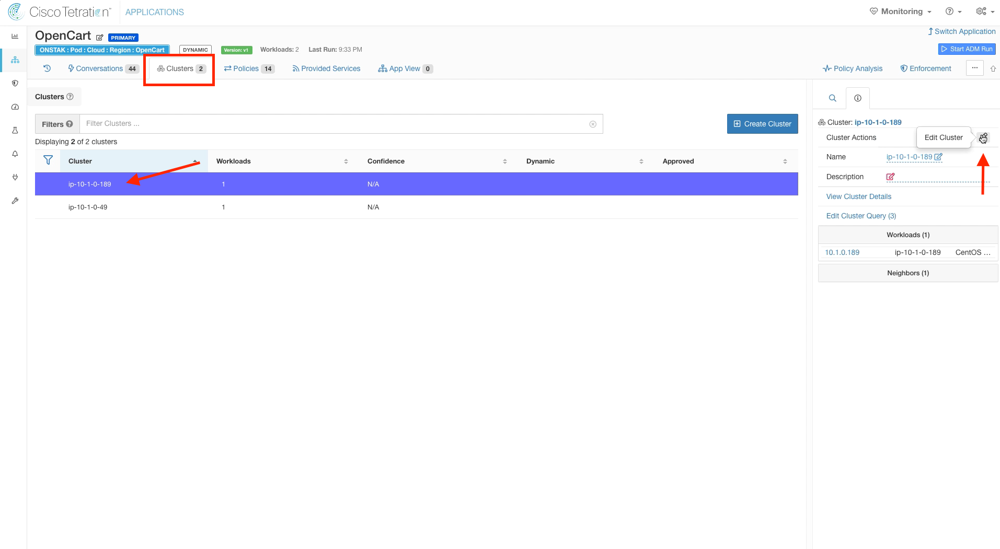</a>  

<a href="#step-011" style="font-weight:bold">Step 011</a>
  

Change the cluster name and query as shown in the below image.

<a href="images/module_07-04_011.png">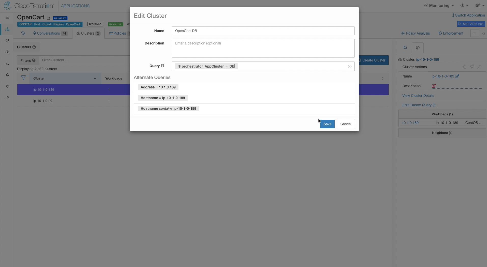</a>  

<a href="#step-012" style="font-weight:bold">Step 012</a>
  

Select the cluster containing the IP address of the Apache web server and edit the cluster.

<a href="images/module_07-04_012.png">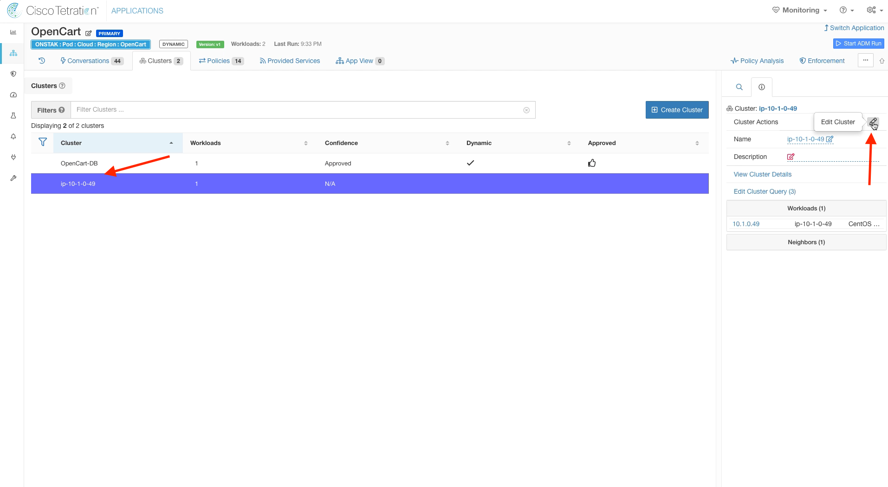</a>  

<a href="#step-013" style="font-weight:bold">Step 013</a>
  

Edit the cluster name and query as shown in the image below.

<a href="images/module_07-04_013.png">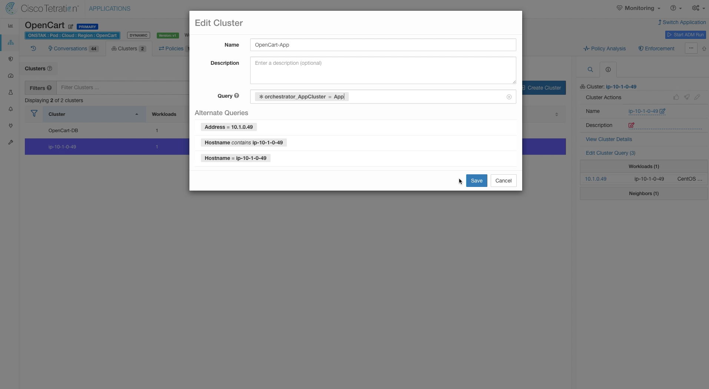</a>  

<a href="#step-014" style="font-weight:bold">Step 014</a>
  

Highlight the OpenCart-App cluster and select the rocket shop icon to promote the cluster to an Inventory Filter.

<a href="images/module_07-04_014.png">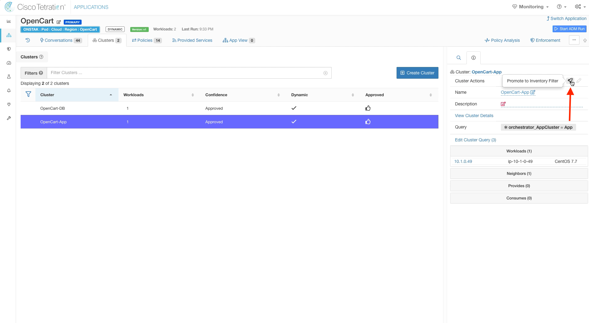</a>  

<a href="#step-015" style="font-weight:bold">Step 015</a>
  

Leave the default settings here and click Promote Cluster.

<a href="images/module_07-04_015.png">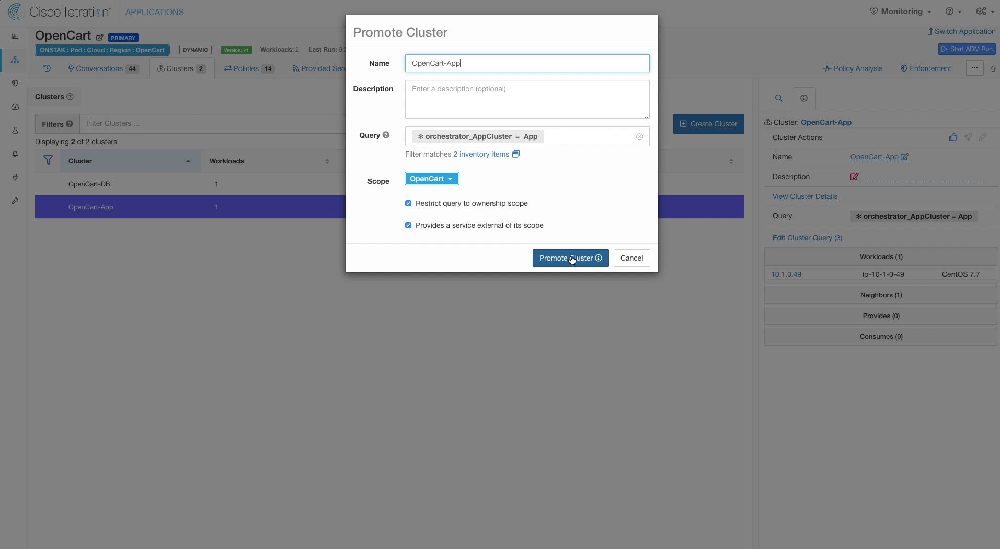</a>  

<a href="#step-016" style="font-weight:bold">Step 016</a>
  

Select the OpenCart-DB cluster and promote it to an Inventory Filter.  

<a href="images/module_07-04_016.png">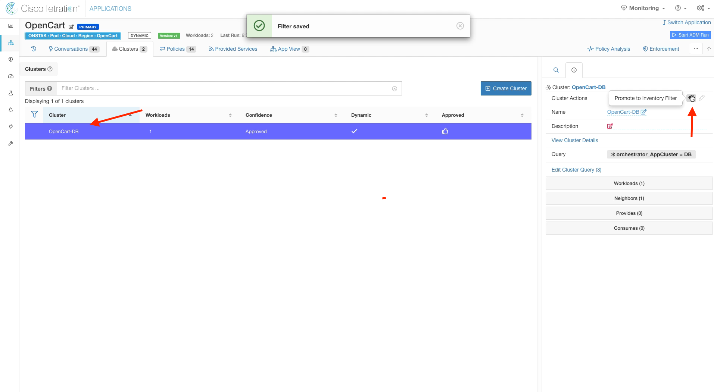</a>  

<a href="#step-017" style="font-weight:bold">Step 017</a>
  

Keep the default settings here and select Promote Cluster.

<a href="images/module_07-04_017.png">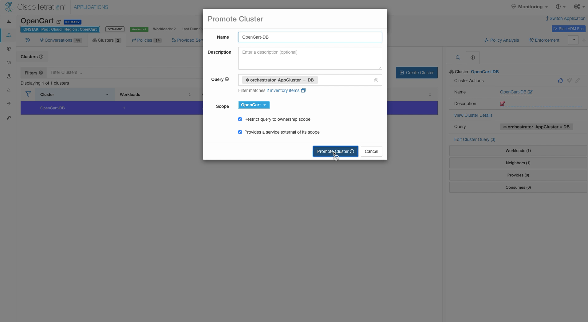</a>  

<a href="#step-018" style="font-weight:bold">Step 018</a>
  

Delete the two lines which provide outbound access from the OpenCart-DB and OpenCart-App clusters to the Root scope on TCP ports 80, 443 and UDP 123.  These outbound policies are covered in our Global Services Absolute policies, so this traffic should be allowed.   

<a href="images/module_07-04_018.png">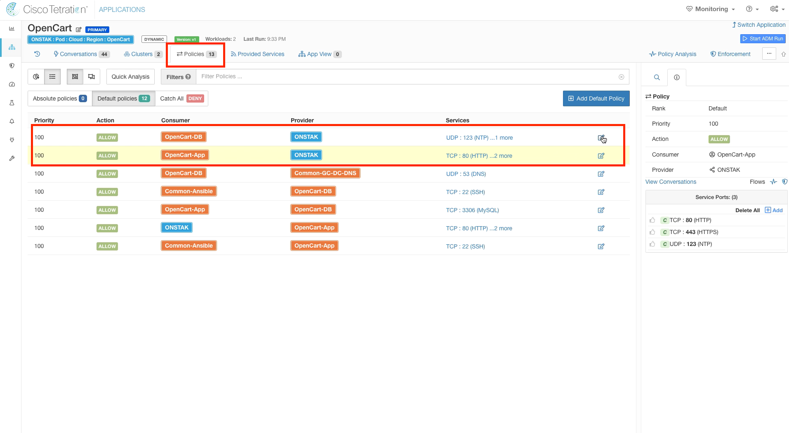</a>  

<a href="#step-019" style="font-weight:bold">Step 019</a>
  

Modify the rule allowing the Root scope as Consumer access to the OpenCart-App as Provider on TCP 80, 443 and 8080.  Click to edit the rule and change the Root scope to Any.  

<a href="images/module_07-04_019.png">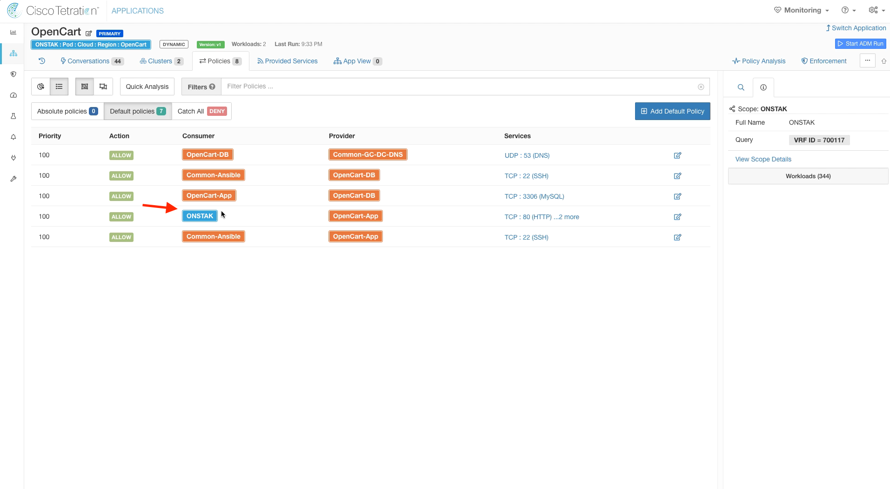</a>  

<a href="#step-020" style="font-weight:bold">Step 020</a>
  

The rule should now say Consumer Any to OpenCart-App on TCP 80, 443, and 8080.  

<a href="images/module_07-04_020.png">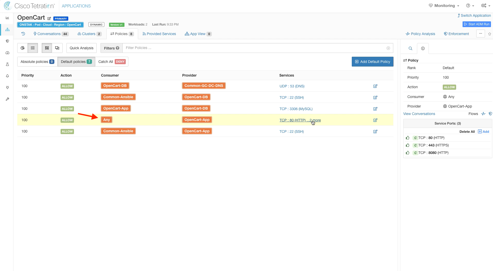</a>  

<a href="#step-021" style="font-weight:bold">Step 021</a>
  

Recall that in Module10 on Forensics,  the attacker came from the outside against port 8080.  Since we know that the software is vulnerable and can be easily exploited,  we want to make sure not to allow access to the app on port 8080 from the outside world.  Click the trash can to delete port 8080 from the rule.  

> Since the Catch All is set to Deny,  anything not explicitly permitted will be denied.  Catch-all of Deny is the default on all application workspaces. This can be thought of just like an implicit deny at the end of an access-list or firewall rule.  Anything not explicitly permitted will be denied.  By removing port 8080,  we cause that traffic to be dropped by the Catch-All.  We could also configure an explicit Deny rule if desired.

<a href="images/module_07-04_021.png">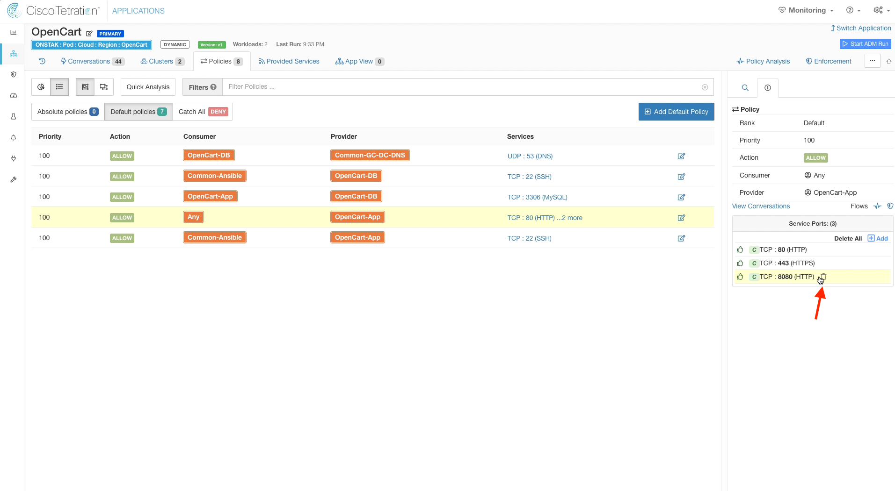</a>  

<a href="#step-022" style="font-weight:bold">Step 022</a>
  

Switch to the Common Policy Application Workspace.

<a href="images/module_07-04_022.png">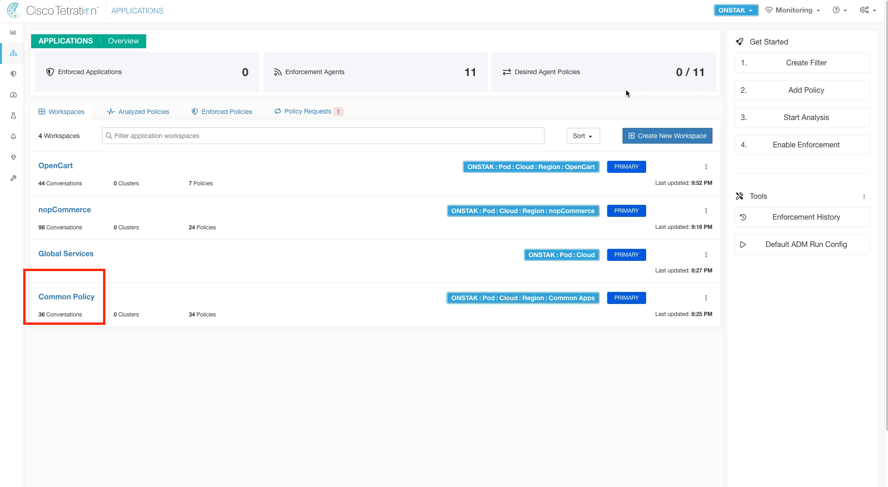</a>  

<a href="#step-023" style="font-weight:bold">Step 023</a>
  

Click on the Provided Services tab,  click on policy requests and accept the pending policy request from OpenCart-DB on UDP port 53.

<a href="images/module_07-04_023.png">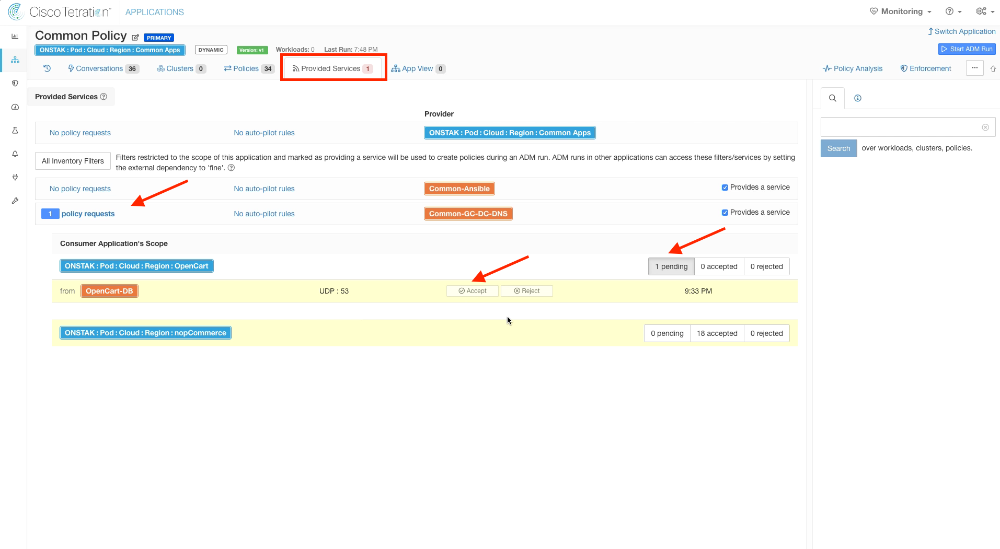</a>  

<a href="#step-024" style="font-weight:bold">Step 024</a>
  

Click on the Policies tab and notice the new rule that has been created from OpenCart-DB to Common-GC-DC-DNS with UDP 53 as the service.

<a href="images/module_07-04_024.png">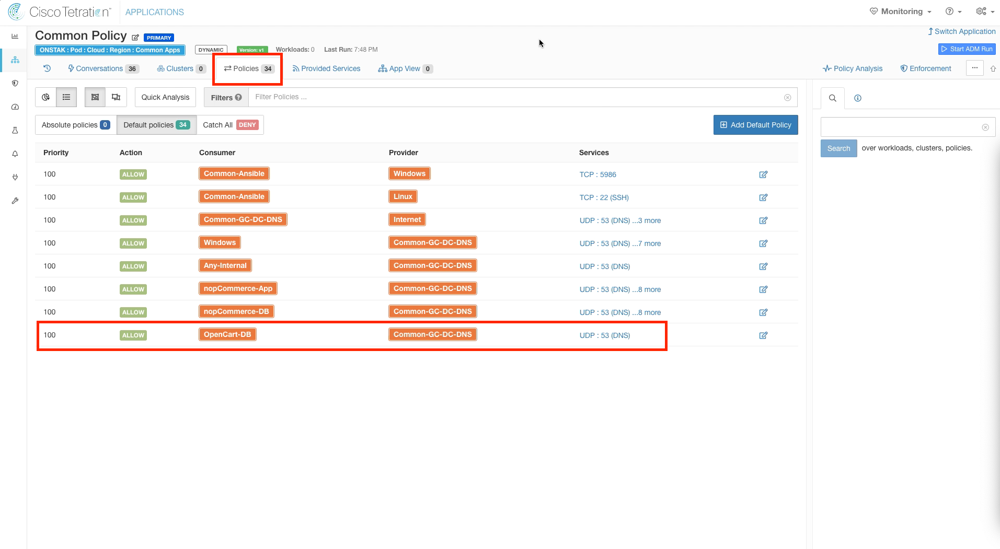</a>  

---   

| [Return to Table of Contents](https://tetration.guru/bootcamp/) | [Go to Top of the Page](README.md) | [Continue to the Next Module](../module_07-05/) |
