# Cisco Tetration - Hands-On Lab

## Module 07.05  Segmentation - User-Based Policy

In this module we will configure policies that are based on the ISE Security Group tags that are propagated into Tetration from ISE when a user logs in.  There are two desktop machines, one which will be assigned to Employees and one which will be assigned to SysAdmins.  The users will log in from the desktop machines using the Cisco AnyConnect VPN client and will be authenticated by ISE. A Security Group Tag will then be propagated into Tetration as an annotation on IP address of the desktop machine.  We will set up our policies such that Employees can gain access to the web front-end of our applications,  but will not have any other access.  SysAdmins, on the other hand will additionally have access to manage the servers using Remote Desktop for the Windows servers and SSH for the Linux servers.  

This diagram depicts the flow of traffic that will be used during the lab that has you use the general "Employee" machine outside of the ASAv firewall in your lab-simulated "Internet" to VPN into the organization and gain access via user-identification based policy which relies on ISE authenticating to Windows Active Directory and mapping the AD Security Group (AD-SG) to the ISE TrustSec Security Group (TrustSec-SG). Upon successful authentication and mapping of an AD-SG to an ISE TrustSec-SG, a SGT or Security Group Tag will be assigned, which is a numerical value. This SGT is what will be used by Tetration in creating policy to allow certain users access to certain defined resources. Whenever a user gets both authenticated (ID verification) and authorized (permissions granted via group mapping) by ISE to a SGT, ISE will update its ["pxGrid" or "Platform Group Exchange Grid"](https://www.cisco.com/c/en/us/products/security/pxgrid.html){:target="_blank"} and those subscribed to that grid -which in this case is Tetration- will get an updated list of Users, their SGTs, and their IP Addresses, among a slew of other information. Tetration will then use the IP addresses of these hosts to update various workload firewall rules where enforcement is in place.

In this lab diagram, Employees get standard access to the app front-ends and no more - essentially what everyone else gets.

  

In this lab diagram, SysAdmins not only get standard access to the app front-ends, but they also gain RDP and/or SSH access to each app's frontend workload as well as the backend databases, so that they can properly perform necessary administration.

  

---

<a href="https://cisco-tetration-hol-content.s3.amazonaws.com/videos/16_policy_creation_user_based_policy.mp4" style="font-weight:bold" title="Policy Analysis - nopCommerce Policies"> Click here to view a video of the tasks necessary to configure dynamic user-based policy.</a>

---

### Steps for this Module  
<a href="#step-001" style="font-weight:bold">Step 001 - Navigate to Inventory Filters</a>  
<a href="#step-002" style="font-weight:bold">Step 002 - Create a new Inventory filter for SysAdmins"</a>  
<a href="#step-003" style="font-weight:bold">Step 003 - Review workloads and create</a>  
<a href="#step-004" style="font-weight:bold">Step 004 - Create an new Inventory Filter for Employees</a>  
<a href="#step-005" style="font-weight:bold">Step 005 - Review workloads and create</a>  
<a href="#step-006" style="font-weight:bold">Step 006 - Navigate to the nopCommerce App Workspace and Add Default Policy</a>  
<a href="#step-007" style="font-weight:bold">Step 007 - Add SysAdmins to nopCommerce rule</a>  
<a href="#step-008" style="font-weight:bold">Step 008 - Add TCP 3389 service to the rule</a>  
<a href="#step-009" style="font-weight:bold">Step 009 - Review the new rule</a>  
<a href="#step-010" style="font-weight:bold">Step 010 - Navigate to the OpenCart App Workspace and add a Default Policy</a>  
<a href="#step-011" style="font-weight:bold">Step 011 - Add a rule from SysAdmins to the OpenCart Scope</a>  
<a href="#step-012" style="font-weight:bold">Step 012 - Add a rule from Employees to the OpenCart-App cluster</a>  
<a href="#step-013" style="font-weight:bold">Step 013 - Add TCP port 8080 to the Employees to OpenCart-App rule</a>  

---

<a href="#step-001" style="font-weight:bold">Step 001</a>
  

Navigate to Inventory Filters and create a new filter.  

<a href="images/module16_001.png">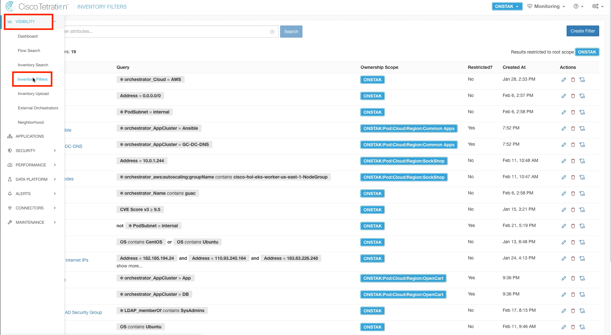</a>  

<a href="#step-002" style="font-weight:bold">Step 002</a>
  

Enter the name SysAdmin for the Inventory Filter and the query `* ISE_ctsSecurityGroup = SysAdmins`.  This query will match on the ISE Security Group Tag called SysAdmins,  which is in turn mapped to a group in Active Directory called SysAdmins.  

<a href="images/module16_002.png">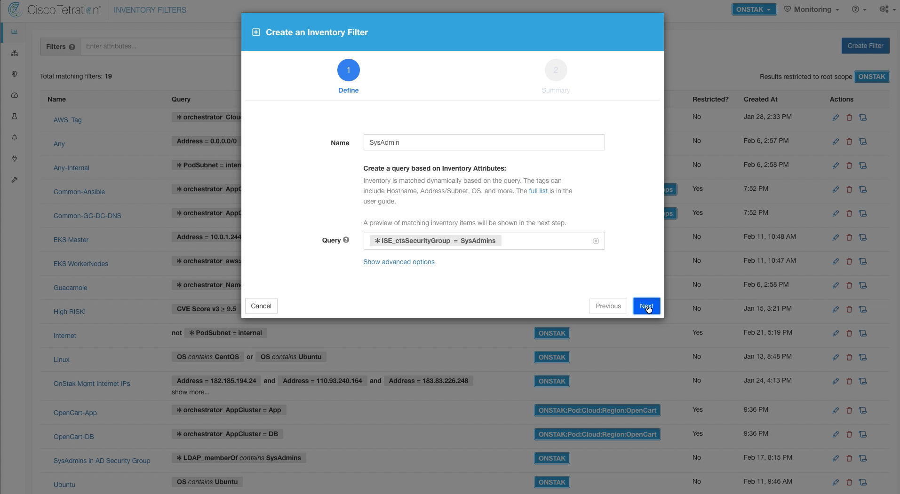</a>  

<a href="#step-003" style="font-weight:bold">Step 003</a>
  

There will most likely not be any inventory items returned yet on this screen. Later we will demonstrate a user who is a member of SysAdmins logging into a workstation using the Cisco AnyConnect VPN Client.  At that point, Tetration will receive the required information from ISE to annotate the IP address of the workstation the user logged into with the ISE security group tag SysAdmins.  

<a href="images/module16_003.png">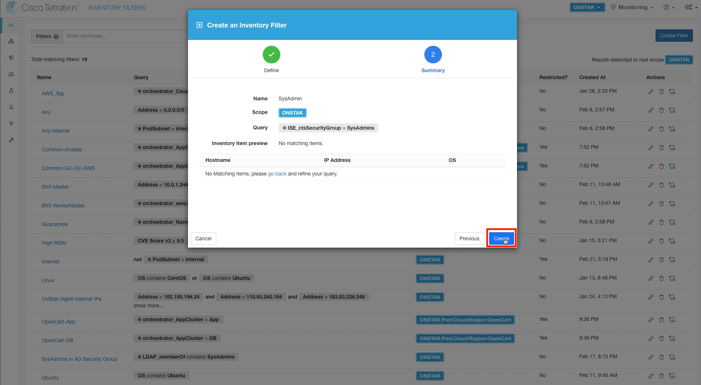</a>  

<a href="#step-004" style="font-weight:bold">Step 004</a>
  

Create another Inventory Filter for Employees.  Enter the name Employees and set the query to `* ISE_ctsSecurityGroup = Employees`.  

<a href="images/module16_004.png">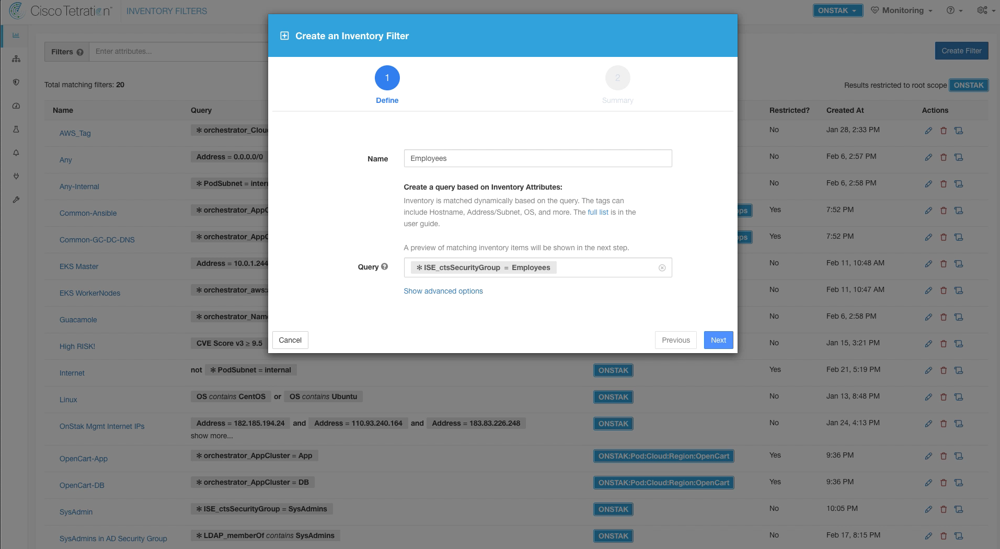</a>  

<a href="#step-005" style="font-weight:bold">Step 005</a>
  

Click Create.  

<a href="images/module16_005.png">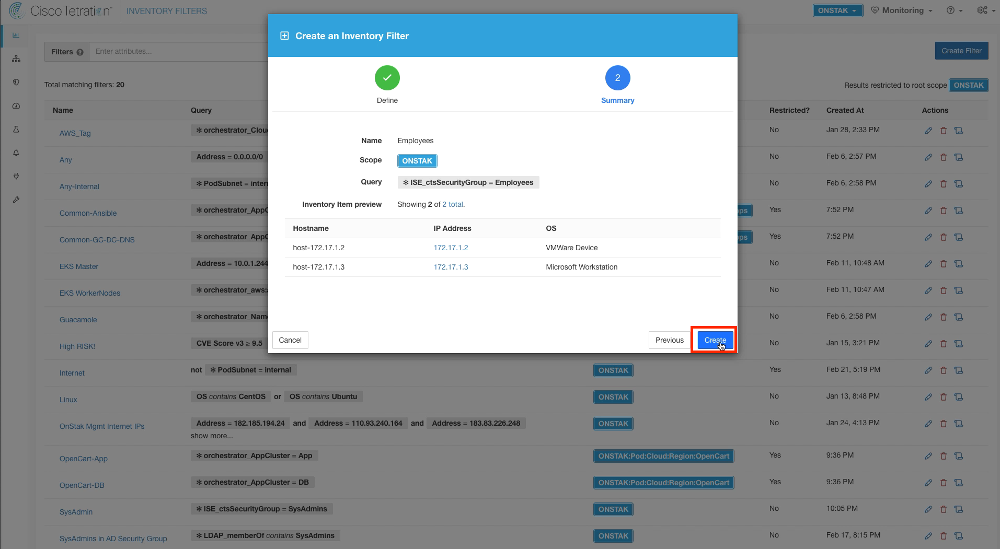</a>  

<a href="#step-006" style="font-weight:bold">Step 006</a>
  

Navigate to the nopCommerce App Workspace and add a Default Policy.  

<a href="images/module16_006.png">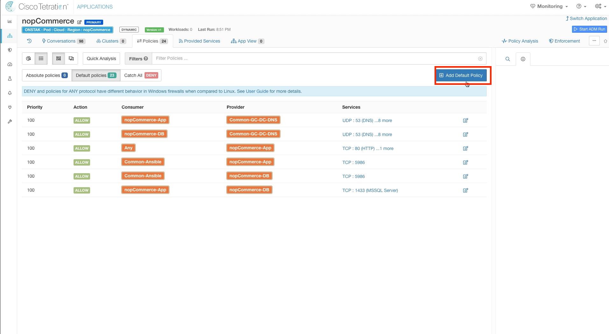</a>  

<a href="#step-007" style="font-weight:bold">Step 007</a>
  
In the new rule, configure SysAdmin as the Consumer and set the Provider to the nopCommerce scope.  We are using the scope here as the provider because SysAdmins should be able to manage any workloads in the nopCommerce scope, regardless of their cluster membership.  

<a href="images/module16_007.png">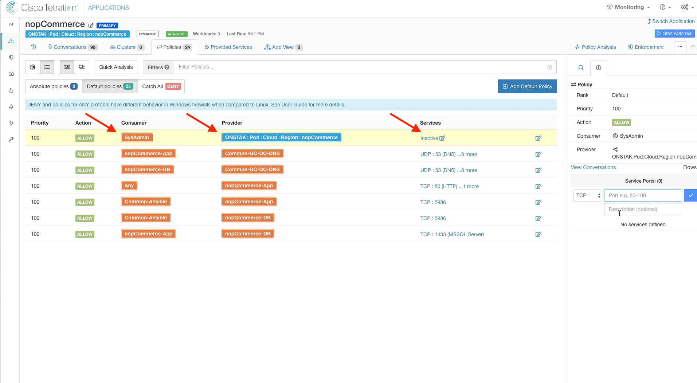</a>  

<a href="#step-008" style="font-weight:bold">Step 008</a>

Add the service TCP 3389 to the rule to allow SysAdmins to be able to Remote Desktop to the servers.  

<a href="images/module16_008.png">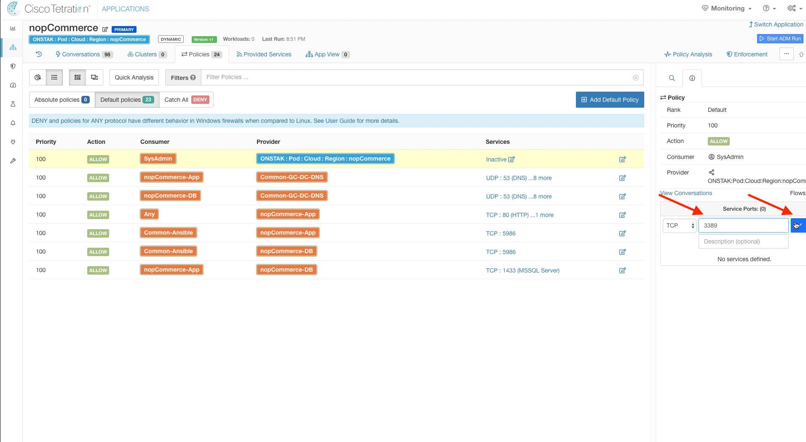</a>  

<a href="#step-009" style="font-weight:bold">Step 009</a>
  

The below image shows the new rule once completed.

<a href="images/module16_009.png">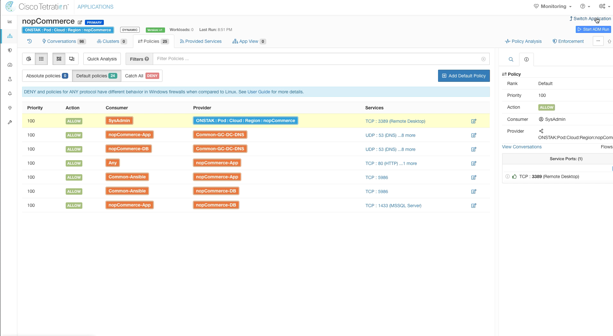</a>  

<a href="#step-010" style="font-weight:bold">Step 010</a>
  

Navigate to the OpenCart Application Workspace and create a new Default Policy.

<a href="images/module16_010.png">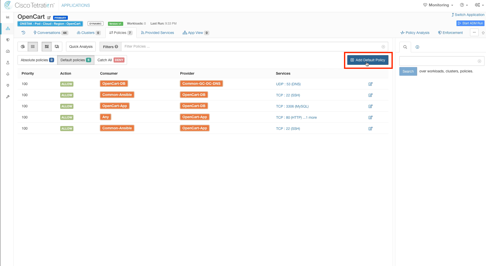</a>  

<a href="#step-011" style="font-weight:bold">Step 011</a>
  

Enter SysAdmin for the Consumer and the OpenCart scope as the provider.  Then add TCP 3306 and 22 to the list of Services.  

<a href="images/module16_011.png">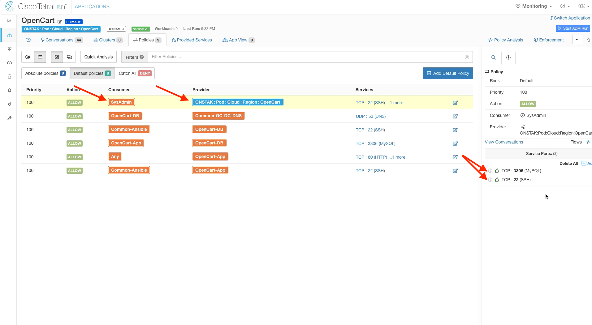</a>  

<a href="#step-012" style="font-weight:bold">Step 012</a>
  

Add another Default Policy with Employees as the Consumer and OpenCart-App as the Provider.  

<a href="images/module16_012.png">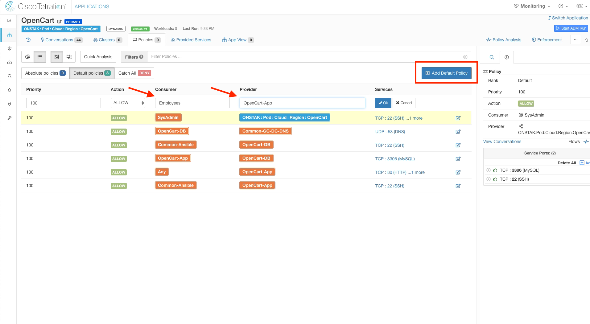</a>  

<a href="#step-013" style="font-weight:bold">Step 013</a>
  

Add TCP 8080 as a service on the new rule.  Recall that previously the attacker had exploited the Apache Struts application running on TCP port 8080 remotely. This rule will make the application available to internal employees,  while still disallowing the application from being accessed externally.  We will validate this later when we move into enforcement.

<a href="images/module16_013.png">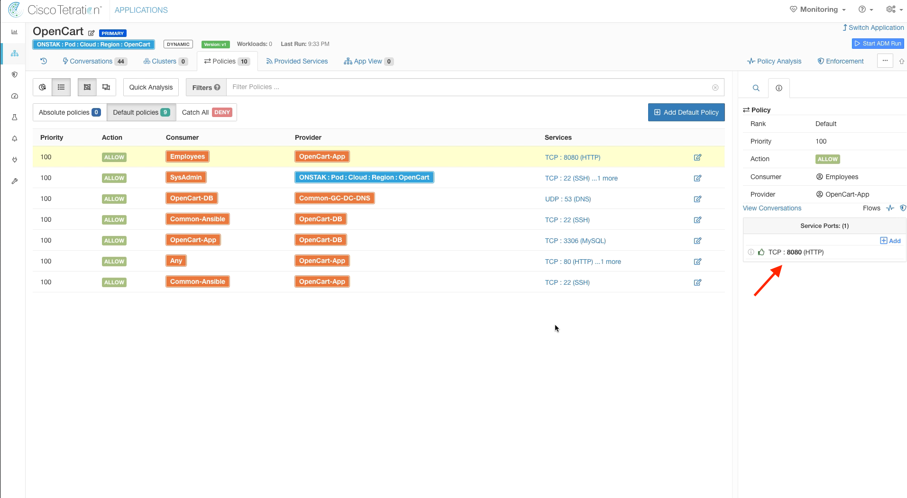</a>  

YOU HAVE COMPLETED THIS MODULE

| [Return to Table of Contents](https://tetration.guru/bootcamp/) | [Go to Top of the Page]() | [Continue to the Next Module]() |
