# Cisco Tetration - Hands-On Lab

## Module 07.06  Segmentation - Policy Analysis - Global Services

In this module we will begin performing Policy Analysis. Policy Analysis is a powerful feature of Tetration that allows you to determine what the impact of implementing a ruleset would be based on current and historical traffic flows. Policy Analysis is helpful prior to initially enabling enforcement, as well as to gauge the impact of ongoing policy changes.  It greatly reduces the chances of creating business-impacting outages caused by missing or incorrect policy rules, and decreases the need to roll back ruleset changes.  Implemented policies are also versioned, and rollback to a previous policy can be done easily if needed.

In this module we will first enable Policy Analysis for each workspace,  and then in each of the sub-sequent modules we will use Policy Analysis to determine the impact of our ruleset and make required changes based on the findings.  

---
<a href="https://cisco-tetration-hol-content.s3.amazonaws.com/videos/17_policy_analysis_global_services.mp4" style="font-weight:bold" title="Policy Analysis - OpenCart Policies"> Click here to view a video of the tasks necessary to perform policy analysis for the Global policy.</a>  

---

### Steps for this Module  
<a href="#step-001" style="font-weight:bold">Step 001 - Navigate to the Global Services App Workspace</a>  
<a href="#step-002" style="font-weight:bold">Step 002 - Click on Policy Analysis</a>  
<a href="#step-003" style="font-weight:bold">Step 003 - Begin Policy Analysis</a>  
<a href="#step-004" style="font-weight:bold">Step 004 - Configure Policy Analysis reason</a>  
<a href="#step-005" style="font-weight:bold">Step 005 - Switch to the Common Policy App Workspace</a>  
<a href="#step-006" style="font-weight:bold">Step 006 - Navigate to Policy Analysis</a>  
<a href="#step-007" style="font-weight:bold">Step 007 - Begin Policy Analysis for Common Policy</a>  
<a href="#step-008" style="font-weight:bold">Step 008 - Switch to the nopCommerce App Workspace</a>  
<a href="#step-009" style="font-weight:bold">Step 009 - Begin Policy Analysis for nopCommerce</a>  
<a href="#step-010" style="font-weight:bold">Step 010 - Enter Policy Analysis reason</a>  
<a href="#step-011" style="font-weight:bold">Step 011 - Switch to OpenCart App workspace</a>  
<a href="#step-012" style="font-weight:bold">Step 012 - Begin Policy Analysis for Opencart</a>  
<a href="#step-013" style="font-weight:bold">Step 013 - Enter Policy Analysis reason</a>  
<a href="#step-014" style="font-weight:bold">Step 014 - Switch to Global Services app workspace</a>  
<a href="#step-015" style="font-weight:bold">Step 015 - Navigate to Policy Analysis</a>  
<a href="#step-016" style="font-weight:bold">Step 016 - Observe the time that Policy Analysis was started</a>  
<a href="#step-017" style="font-weight:bold">Step 017 - Change Policy Analysis time range</a>  
<a href="#step-018" style="font-weight:bold">Step 018 - Observe the Policy Analysis graph</a>  
<a href="#step-019" style="font-weight:bold">Step 019 - View graph change after Policy Analysis enabled</a>  

---

Policy Analysis is by default disabled on each application workspace.  To begin analyzing the impact of our new policies, Policy Analysis needs to be enabled.  Since Policy Analysis data takes about five minutes for the results to be displayed on the graph, we will first enable Policy Analysis for all of our application workspaces.  Then we will come back to each application workspace and observe the results.

<a href="#step-001" style="font-weight:bold">Step 001</a>
  

Navigate to the Global Services Application Workspace.

<a href="images/module17_001.png">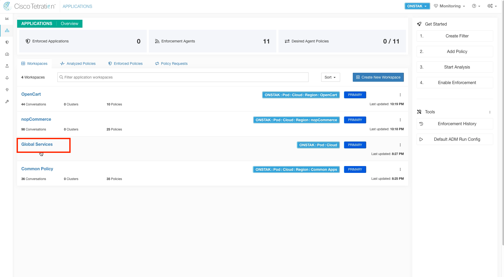</a>  

<a href="#step-002" style="font-weight:bold">Step 002</a>
  

Click on Policy Analysis.

<a href="images/module17_002.png">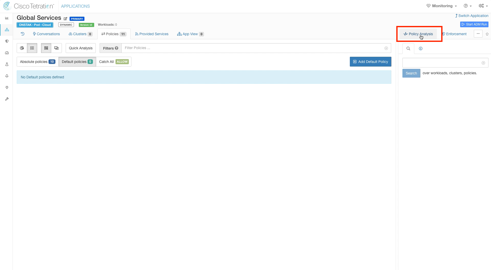</a>  

<a href="#step-003" style="font-weight:bold">Step 003</a>
  

Click on Start Policy Analysis.

<a href="images/module17_003.png">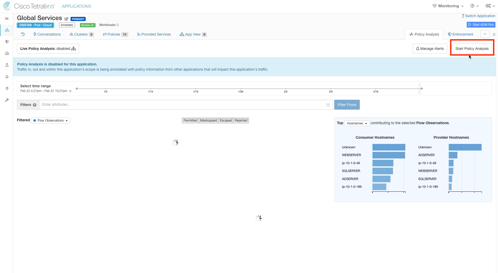</a>  

<a href="#step-004" style="font-weight:bold">Step 004</a>
  

Enter a reason for enabling Policy Analysis.  You can also optionally enter a name and a description.  These fields will be visible in the historical view of events for the workspace.  

<a href="images/module17_004.png">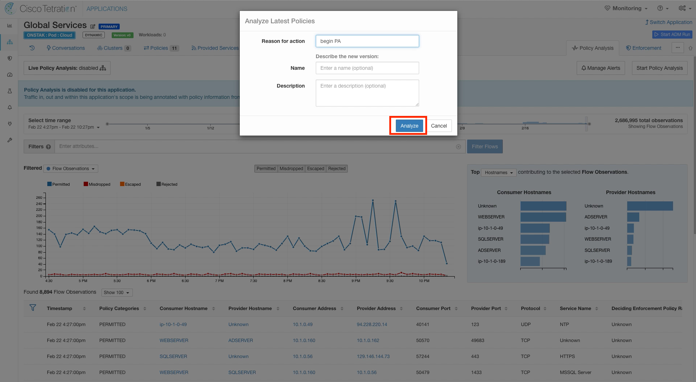</a>  

<a href="#step-005" style="font-weight:bold">Step 005</a>
  

Switch to the Common Policy Application Workspace.  

<a href="images/module17_005.png">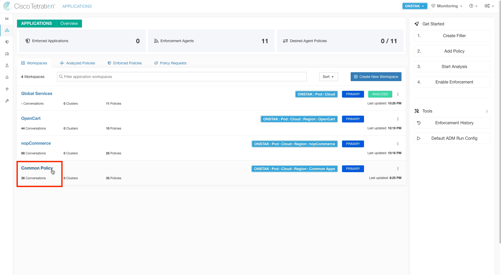</a>  

<a href="#step-006" style="font-weight:bold">Step 006</a>
  

Click on Policy Analysis and Start Policy Analysis.  

<a href="images/module17_006.png">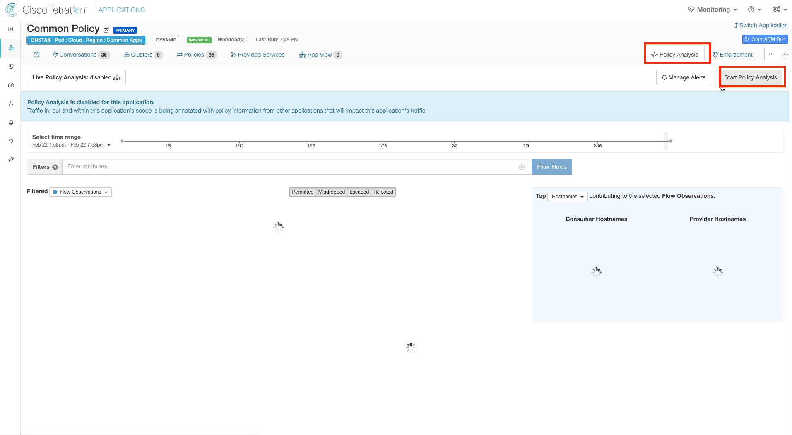</a>  

<a href="#step-007" style="font-weight:bold">Step 007</a>
  

Enter a reason and click Analyze.

<a href="images/module17_007.png">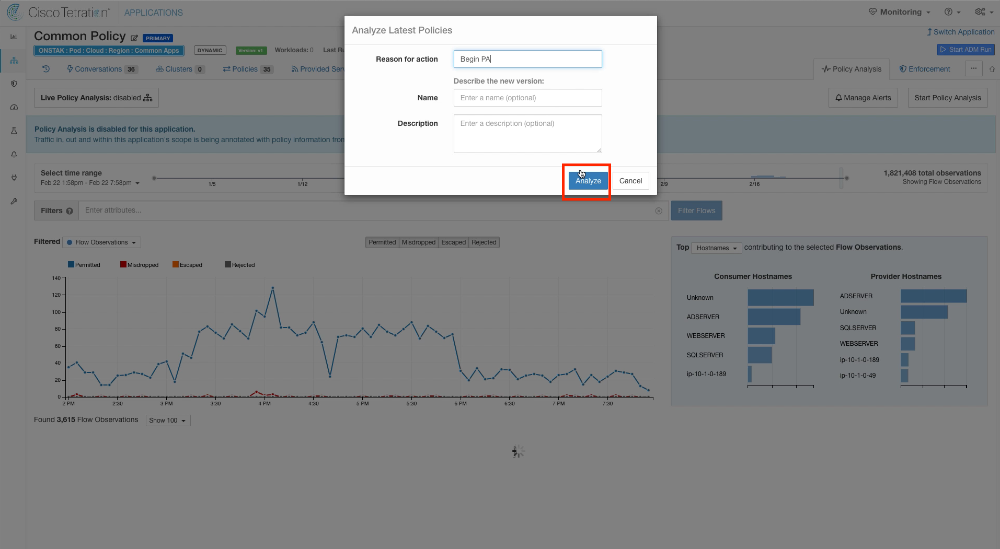</a>  

<a href="#step-008" style="font-weight:bold">Step 008</a>
  

Switch to the nopCommerce Application Workspace.

<a href="images/module17_008.png">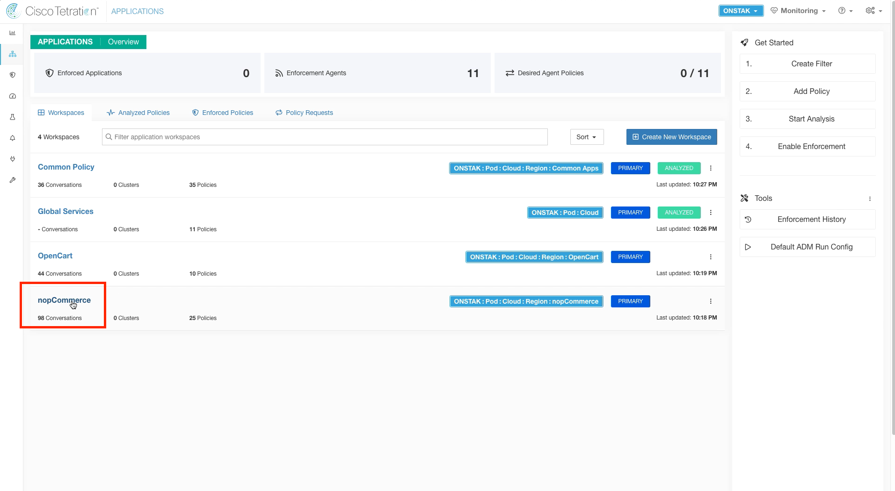</a>  

<a href="#step-009" style="font-weight:bold">Step 009</a>
  

Click on Policy Analysis and Start Policy Analysis.

<a href="images/module17_009.png">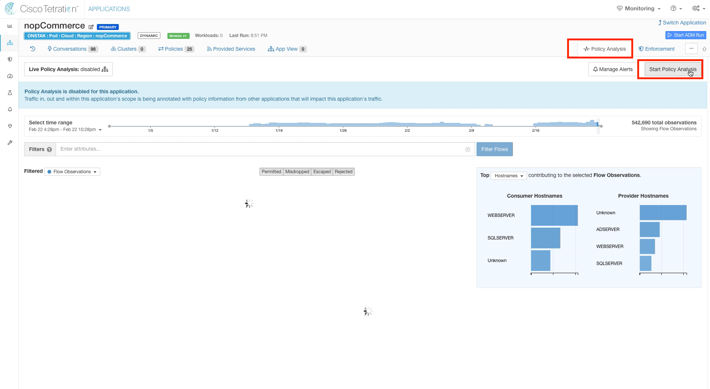</a>  

<a href="#step-010" style="font-weight:bold">Step 010</a>
  

Enter a reason and select Analyze.

  

<a href="#step-011" style="font-weight:bold">Step 011</a>
  

Navigate to the OpenCart application workspace.

<a href="images/module17_011.png">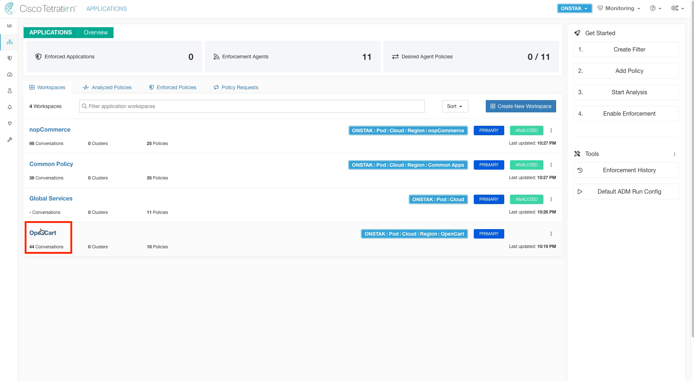</a>  

<a href="#step-012" style="font-weight:bold">Step 012</a>
  

Click on Policy Analysis and Start Policy Analysis.

<a href="images/module17_012.png">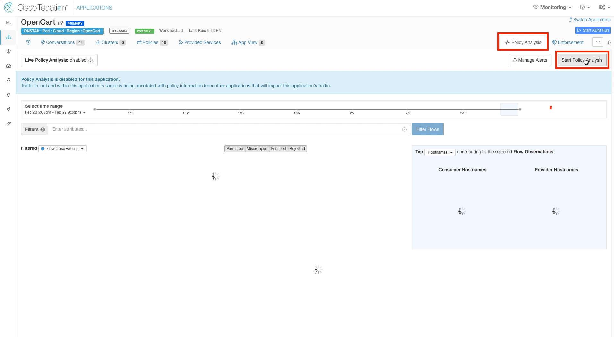</a>  

<a href="#step-013" style="font-weight:bold">Step 013</a>
  

Enter a reason and click Analyze.

<a href="images/module17_013.png">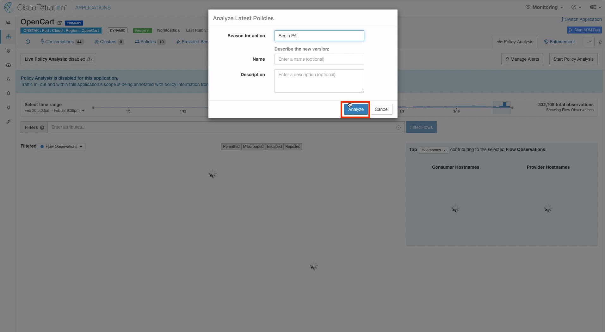</a>  

<a href="#step-014" style="font-weight:bold">Step 014</a>
  

Switch back to the Global Services application workspace.  

<a href="images/module17_014.png">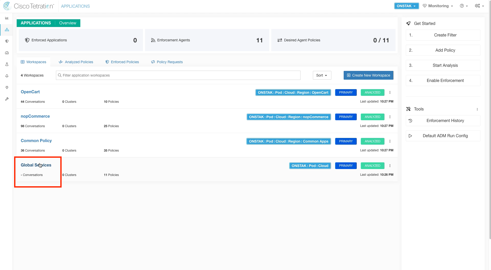</a>  

<a href="#step-015" style="font-weight:bold">Step 015</a>
  

Click on Policy Analysis. The graph that is shown will likely be showing the results prior to enabling Policy Analysis.  We always want to begin analyzing policy from the time Policy Analysis was started to the current time.  

> In a real Tetration deployment, it would be recommended to enable Policy Analysis and let it run for a week or more to ensure that you have captured all the flows to and from the application before moving the application into enforcement.

<a href="images/module17_015.png">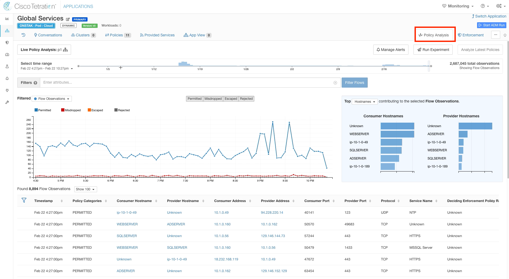</a>  

<a href="#step-016" style="font-weight:bold">Step 016</a>
  

Click on the clock icon.  This shows the Application Activity Log.  Note the time that you began Policy Analysis.

<a href="images/module17_016.png">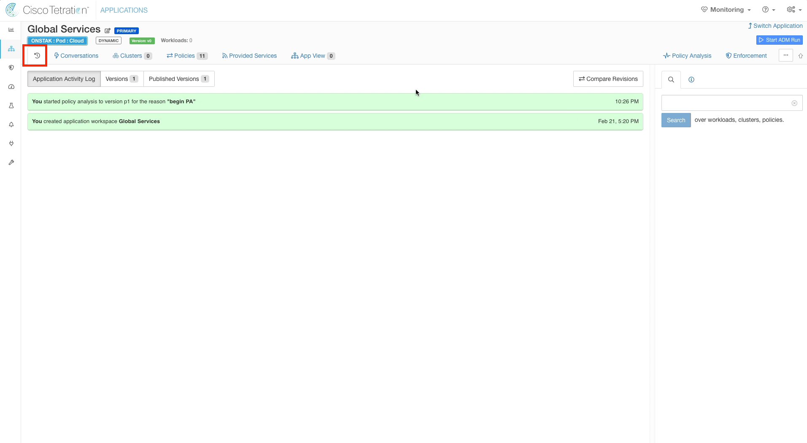</a>  

<a href="#step-017" style="font-weight:bold">Step 017</a>
  

Click on the Policy Analysis tab,  and click the drop-down menu under Select time range.  Click 1hr to view flows for the last hour.  

<a href="images/module17_017.png">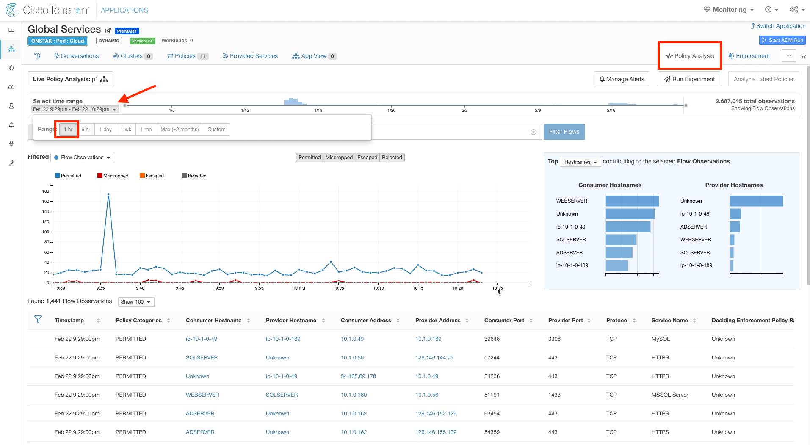</a>  

<a href="#step-018" style="font-weight:bold">Step 018</a>
  

Notice that in the image below,  the data isn't yet available on the graph at the point where we enabled Policy Analysis (10:26pm in our case,  your time will be different).  The data we are looking at on the graph and the flows shown are prior to enabling Policy Analysis, and therefore the dispositions (Permitted, Midropped, Escaped, Rejected) for the flows shown are based on no policy being defined.  Once the time horizon on the graph moves past the time that Policy Analysis was enabled,  we will then be seeing flows and analyzing the disposition of flows for the current policies that we defined.     

> There are four possible Flow Dispositions;  Permitted, Misdropped, Escaped, or Rejected.  The flow dispositions indicate what would happen to traffic if we implemented the current policy being analyzed.  

> Permitted - Flow is currently permitted and would continue to be allowed by the policy.  

> Misdropped - Flow would be allowed by the policy, but is currently being dropped.  Flows that are misdropped will become permitted when the policy is implemented.  Misdropped can also mean that there is an intermediate device such as a firewall or network ACL that is dropping the traffic between the Consumer and Provider. Misdropped flows are also reported when the receiver of a flow is offline.  

> Escaped - Flow would be dropped by the policy, but is currently being permitted.  Flows that are escaped will become rejected when the policy is implemented.  

> Rejected - Flow is currently being denied and would continue to be denied by the policy   

<a href="images/module17_018.png">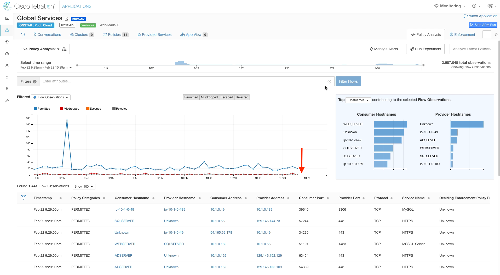</a>  

<a href="#step-019" style="font-weight:bold">Step 019</a>
  

Once the time horizon on the chart has caught up to when you enabled Policy Analysis,  click on the point in the graph when you enabled Policy Analysis.  Observe the Permitted flows,  and then filter out the Permitted flows by clicking on the Permitted button.  Are there any Misdropped,  Escaped, or Rejected flows?  We should see at least a few Rejected flows because we have not defined policy for Netbios (UDP 138).

<a href="images/module17_019.png">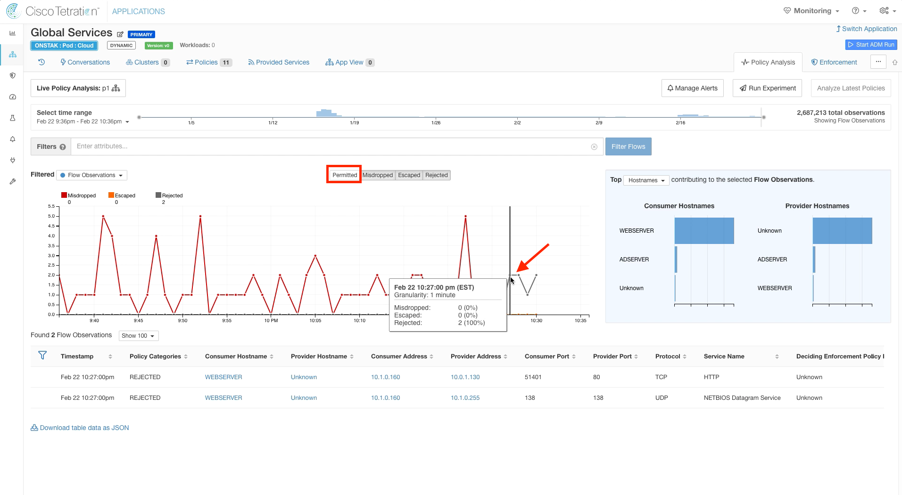</a>  

> In our lab environment, we saw some unexpected traffic from the current student web server to a different student web server.  This is the flow from 10.1.0.160 to 10.0.1.130 on port 80 in the above image.  You may or may not see those flows in your environment.   

YOU HAVE COMPLETED THIS MODULE

| [Return to Table of Contents](https://tetration.guru/bootcamp/) | [Go to Top of the Page]() | [Continue to the Next Module]() |
