# Cisco Tetration Virtual Bootcamp

## Module 07.07  Segmentation - Policy Analysis - Common Services
In this module we will perform Policy Analysis for the Common Policy workspace which contains the Active Directory and Ansible server workloads. We will identify any errors in our ruleset that might have caused disruption had we put the workspace into enforcement,  and make corrections as necessary.  

---   

## --- Demo Video ---  
---  
<a href="https://deftcon-tetration-virtual-bootcamp.s3.us-east-2.amazonaws.com/demos/Module_07.07__Demo__Segmentation__Policy_Analysis_Common_Services.mp4" style="font-weight:bold">Segmentation - Policy Analysis - Common  Services :: Demo Video :: Runtime: 9 mins</a>  
  
---  

## --- Lab ---
### Steps for this Lab  
<a href="#step-001" style="font-weight:bold">Step 001 - Navigate to the Common Policy app workspace</a>  
<a href="#step-002" style="font-weight:bold">Step 002 - Click on Policy Analysis</a>  
<a href="#step-003" style="font-weight:bold">Step 003 - Filter out Permitted flows</a>  
<a href="#step-004" style="font-weight:bold">Step 004 - Click on Escaped flows in the graph</a>  
<a href="#step-005" style="font-weight:bold">Step 005 - Perform Quick Policy Analysis</a>  
<a href="#step-006" style="font-weight:bold">Step 006 - Observe Quick Policy Analysis results</a>  
<a href="#step-007" style="font-weight:bold">Step 007 - Navigate to the OpenCart application workspace</a>  
<a href="#step-008" style="font-weight:bold">Step 008 - Find the rule that is causing the Escaped flows</a>  
<a href="#step-009" style="font-weight:bold">Step 009 - Change the Consumer from a Filter to Scope</a>  
<a href="#step-010" style="font-weight:bold">Step 010 - Click on Policy Analysis and Analyze Latest Policies</a>  
<a href="#step-011" style="font-weight:bold">Step 011 - Enter a reason</a>  
<a href="#step-012" style="font-weight:bold">Step 012 - Return to the Common Policy app workspace</a>  
<a href="#step-013" style="font-weight:bold">Step 013 - Click on the Escaped flows in the graph</a>  
<a href="#step-014" style="font-weight:bold">Step 014 - Run Quick Policy Analysis</a>  
<a href="#step-015" style="font-weight:bold">Step 015 - Observe the new policy result</a>  

---  

<a href="#step-001" style="font-weight:bold">Step 001</a>
  

Navigate to the Common Policy application workspace.

<a href="images/module_07-07_001.png">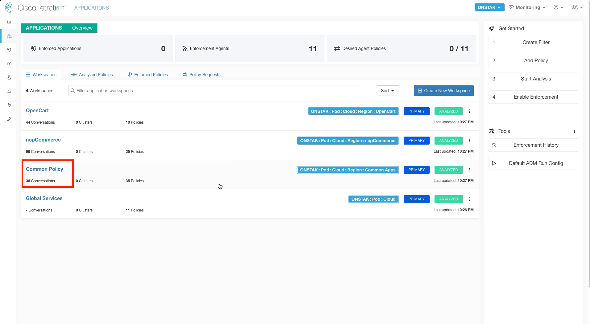</a>  

<a href="#step-002" style="font-weight:bold">Step 002</a>
  

Click on Policy Analysis.

<a href="images/module_07-07_002.png">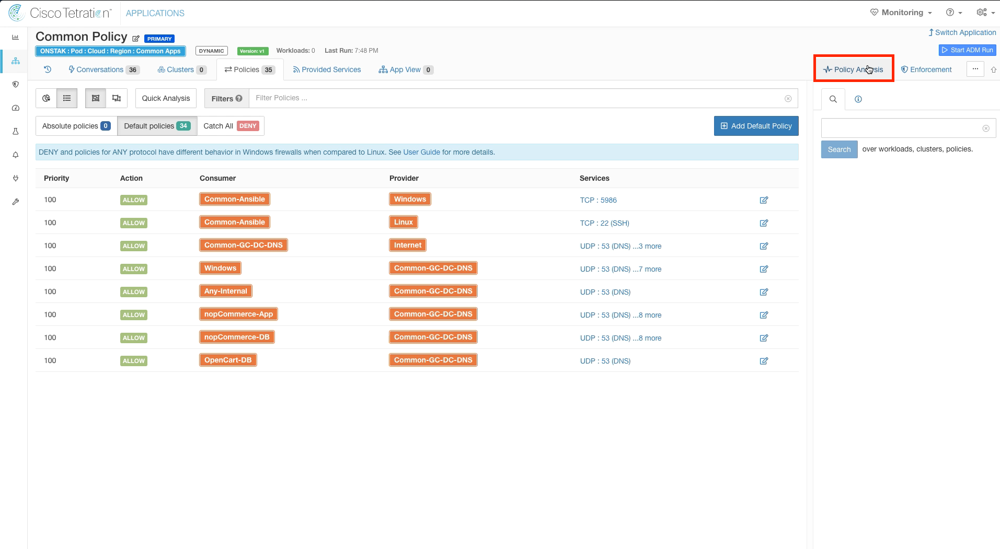</a>  

<a href="#step-003" style="font-weight:bold">Step 003</a>
  

Filter out Permitted flows and then click on one of the points in the graph where there is an orange peak, indicating Escaped flows.  An escaped flow will be present that is the Apache web server sending DNS traffic to the Active Directory server.  Recall that Escaped means that this traffic would be dropped if we were to implement this policy.  

> If you don't see any escaped flows being indicated on the diagram,  adjust the time range to the last 1 hour to see the most recent data.  

<a href="images/module_07-07_003.png">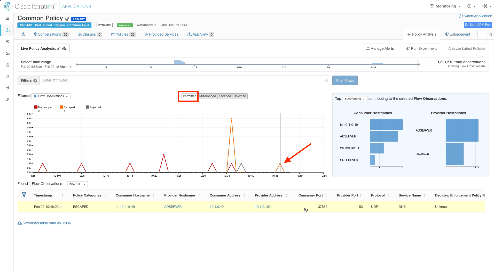</a>  

<a href="#step-004" style="font-weight:bold">Step 004</a>
  
 Under Flow Observations,  click on the Escaped flow from the Apache Linux to the Active Directory server on UDP port 53.

<a href="images/module_07-07_004.png">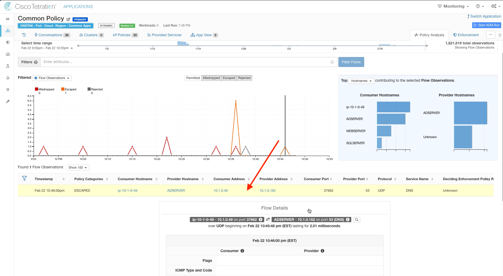</a>  

<a href="#step-005" style="font-weight:bold">Step 005</a>
  
The Flow Details screen shows a wealth of information about the flow including source/destination addresses and hostnames, number of packets/bytes, and the process on the machine that is sending/receiving traffic.

We can also see here that the flow is being denied by the Consumer Outbound Policy, which is the OpenCart application.  We can gain more insight by doing Quick Policy Analysis.  Click the Quick Policy Analysis button.  

<a href="images/module_07-07_005.png">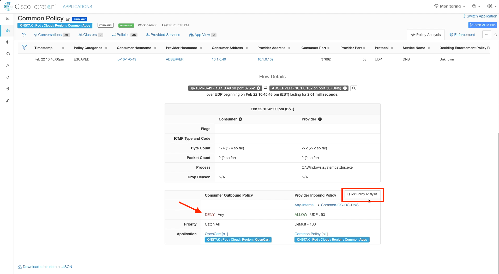</a>  

<a href="#step-006" style="font-weight:bold">Step 006</a>
  
The Consumer and Provider IP addresses as well as Protocol and Provider port will be pre-populated automatically.  Click on Find Matching Policies.  Here we can see a specific rule under Provider Inbound Policies that is configured in our Common Policy workspace that allows UDP 53 from Any-Internal to Common-GC-DC-DNS.  However,  there is no matching policy in the OpenCart workspace to allow the traffic.  In this case, the traffic is hitting the Catch-All in the OpenCart workspace which is set to DENY.  We need to head over to the OpenCart workspace to correct this.  

<a href="images/module_07-07_006.png">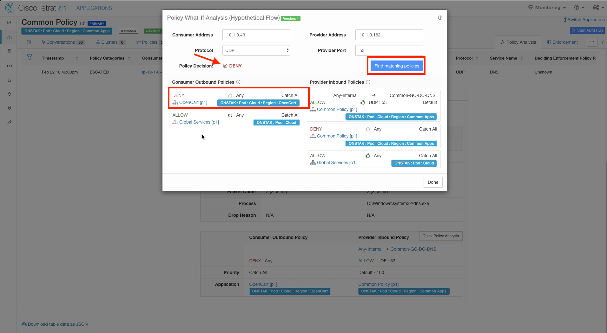</a>  

<a href="#step-007" style="font-weight:bold">Step 007</a>
  
Switch to the OpenCart Application Workspace.

<a href="images/module_07-07_007.png">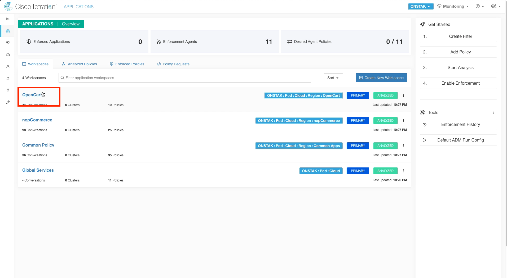</a>  

<a href="#step-008" style="font-weight:bold">Step 008</a>
  

Locate the rule that has OpenCart-DB to Common-GC-DC-DNS on UDP port 53.  Notice that there are no other rules allowing UDP port 53,  so we have accidentally omitted the OpenCart-App cluster from talking to the Common-GC-DC-DNS cluster on UDP port 53 which would certainly be required for DNS resolution!

<a href="images/module_07-07_008.png">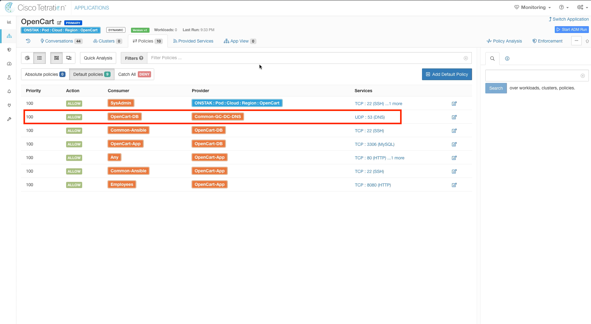</a>  

<a href="#step-009" style="font-weight:bold">Step 009</a>
  

To correct this, we could create a separate rule allowing OpenCart-App to Common-GC-DC-DNS on UDP port 53.  However,  since both of our clusters will need to talk to Common-GC-DC-DNS on UDP 53 we can simply set the Consumer on the existing rule to the OpenCart scope.  This will allow any clusters tied to the OpenCart scope to talk to Common-GC-DC-DNS on UDP 53.   Change the OpenCart-DB inventory filter in the rule identified above to the OpenCart Scope.  

<a href="images/module_07-07_009.png">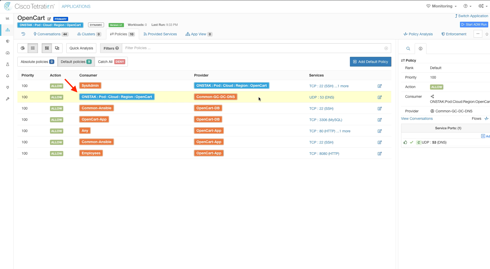</a>  

<a href="#step-010" style="font-weight:bold">Step 010</a>
  

Click on Policy Analysis,  and Analyze Latest Policies.  This will ensure when we later come back and look at Policy Analysis for the OpenCart application,  we will be looking at flows based on the policy we just modified.  If we didn't do this,  we would be only seeing results based on our original policy.

<a href="images/module_07-07_010.png">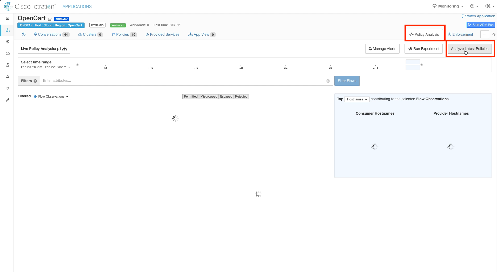</a>  

<a href="#step-011" style="font-weight:bold">Step 011</a>
  

Enter a reason and click Analyze.

<a href="images/module_07-07_011.png">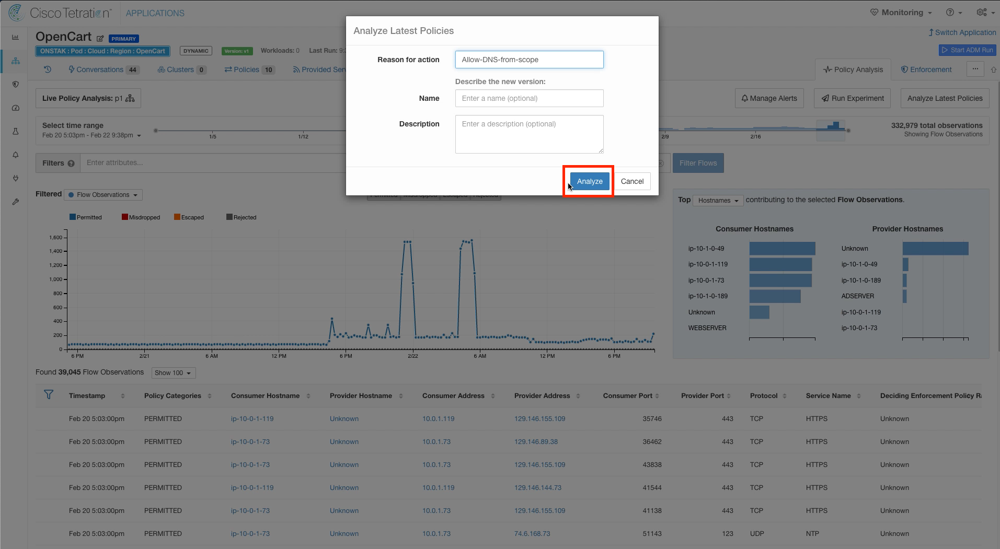</a>  

<a href="#step-012" style="font-weight:bold">Step 012</a>
  

Switch back to the Common Policy application workspace.

  

<a href="#step-013" style="font-weight:bold">Step 013</a>
  

The time on the graph will not yet be showing the results of our policy change,  but we can use Quick Policy Analysis to see the results of our change.  Click on one of the points on the graph with Escaped flows.   

<a href="images/module_07-07_013.png">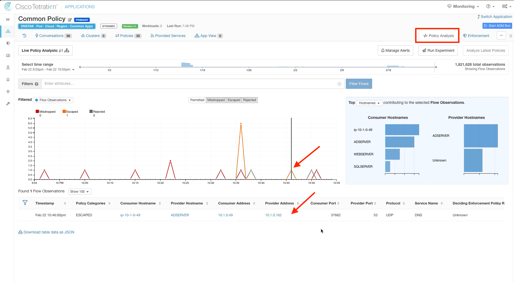</a>  

<a href="#step-014" style="font-weight:bold">Step 014</a>
  
On the Flow Details screen click Quick Policy Analysis.

<a href="images/module_07-07_014.png">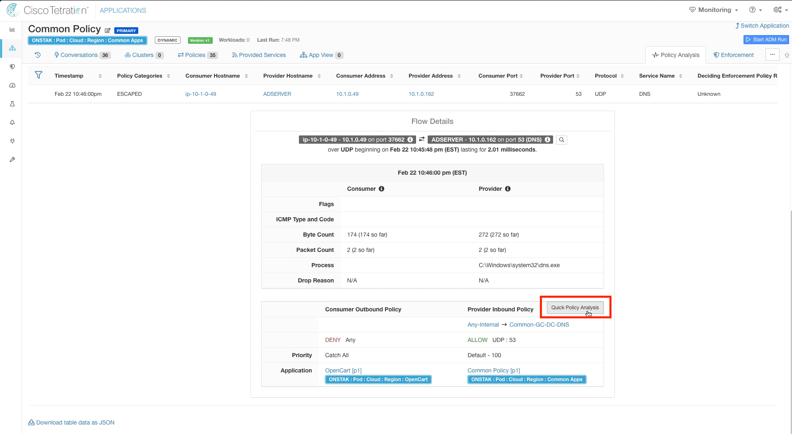</a>  

<a href="#step-015" style="font-weight:bold">Step 015</a>
  
Click on Find matching policies.  Notice that we can now see the new rule under Consumer Outbound Policies in the OpenCart application workspace that is allowing the traffic.  The Policy Decision also indicates ALLOW, indicating that the traffic would be allowed by the policy.

<a href="images/module_07-07_015.png">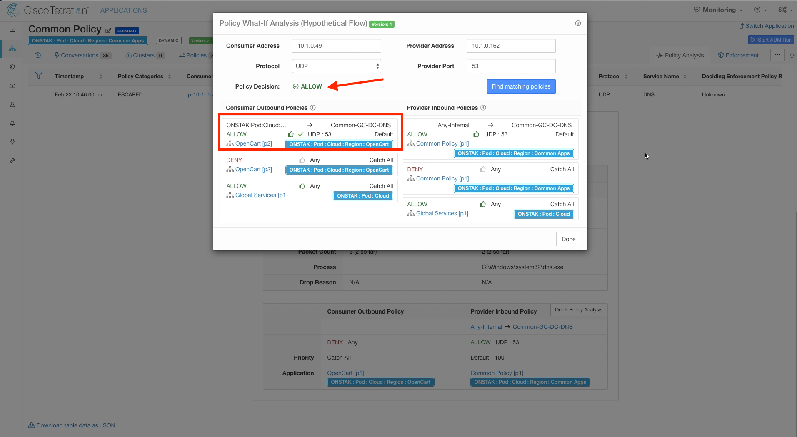</a>  

---   

| [Return to Table of Contents](https://tetration.guru/bootcamp/) | [Go to Top of the Page](readme.md) | [Continue to the Next Module]() |
