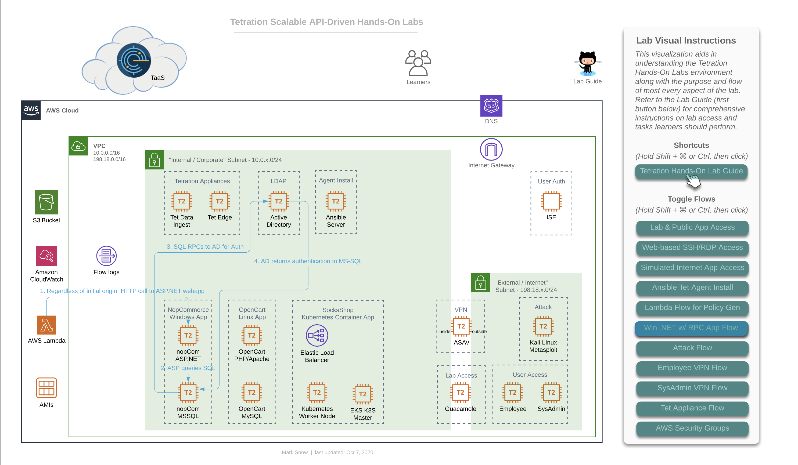

# Cisco Tetration Virtual Bootcamp

## Module 07.08  Segmentation - Policy Analysis - Windows App

In this module we will perform Policy Analysis for the NopCommerce Windows application. We will analyze the ruleset that we tuned previously, learn how to filter out unnecessary flows from cluttering the Policy Analysis view, and also purposely create Escaped flows to gain insight into their cause and learn how to remediate them.

The below diagram is an important one because it depicts the flow that is both specific to, and critical for Microsoft server applications. Microsoft uses a range of 16,383 ports for a technology known as "RPC" or "Remote Procedure Calls". Specifically, they use TCP ports 49195-65535.  While RPC is not a Microsoft protocol and not unique to only Microsoft workloads, it is most commonly found in environments that have Windows servers. In fact, it could easily be said that almost _every_ data center and cloud environment that has Windows server workloads will almost certainly be utilizing their version of RPC - namely MSRPC. Since the destination port for RPC is dynamically chosen at execution time, and because that port can fall anywhere in the above mentioned range, it is critical that policy generated by Tetration includes these destination port ranges for virtually any Windows server that needs to communicate with an Active Directory Domain Controller using Windows Server domains protocols - such as authentication. While not every server necessarily needs to authenticate often, when necessary it is critical that it be allowed to do so. We want to ensure that these AD servers have policy instantiated that allow other windows servers (and workstation clients) to communicate with them on these ports.

In our case, we have the MS-SQL server set to use Domain Authentication rather than the built-in SA (System Account) user, which we have seen time and again in corporate environments, because it allows DBAs and domain admins to easily update passwords in a central location that databases distributed across the organization all use, rather than reaching out to every SQL server and updating the local SA account password when necessary (say in the event that a DBA moves on from the org).

Another common place you may find RPC in use is with NFS. You will likely encounter the usage of RPC in many other environments and should be on the lookout for it and other ephemeral port-range protocols like it. A quick parting thought is that you should look out for other ephemeral port "hopping" protocols besides RPC, when building policy in a production deployment of Tetration. A quick example that comes to mind is "RTP" or "Real Time Protocol". RTP and its sister - RTCP (Real Time Control Protocol) together use a range of UCP ports from 16384-32767, and will likely be found anywhere that VoIP is used - such as with IP Phones and Telepresence units talking to one another as well as a slew of other devices such as voice gateways and call recorders.

  

  
---  

## --- Lab ---
### Steps for this Lab  
<a href="#step-001" style="font-weight:bold">Step 001 - Navigate to the nopCommerce App Workspace</a>  
<a href="#step-002" style="font-weight:bold">Step 002 - Click on Policy Analysis</a>  
<a href="#step-003" style="font-weight:bold">Step 003 - Filter on a MISDROPPED: PERMITTED flow</a>  
<a href="#step-004" style="font-weight:bold">Step 004 - Filter out flows with TCP RST or FIN</a>  
<a href="#step-005" style="font-weight:bold">Step 005 - View filtered results</a>  
<a href="#step-006" style="font-weight:bold">Step 006 - Delete TCP 1433 from the policies</a>  
<a href="#step-007" style="font-weight:bold">Step 007 - Filter for flows with TCP port 1433</a>  
<a href="#step-008" style="font-weight:bold">Step 008 - View current flows for TCP port 1433</a>  
<a href="#step-009" style="font-weight:bold">Step 009 - Run Quick Policy Analysis on a flow</a>  
<a href="#step-010" style="font-weight:bold">Step 010 - Observe Quick Policy Analysis results</a>  
<a href="#step-011" style="font-weight:bold">Step 011 - Click on Analyze Latest Policies</a>  
<a href="#step-012" style="font-weight:bold">Step 012 - Enter a reason</a>  
<a href="#step-013" style="font-weight:bold">Step 013 - View the revision history</a>  
<a href="#step-014" style="font-weight:bold">Step 014 - Filter for Escaped flows</a>  
<a href="#step-015" style="font-weight:bold">Step 015 - Run Quick Policy Analysis </a>  
<a href="#step-016" style="font-weight:bold">Step 016 - View Quick Policy Analysis results</a>  
<a href="#step-017" style="font-weight:bold">Step 017 - Add TCP port 1433 back to the policy</a>  
<a href="#step-018" style="font-weight:bold">Step 018 - Analyze latest policies</a>  
<a href="#step-019" style="font-weight:bold">Step 019 - Enter a reason</a>  
<a href="#step-020" style="font-weight:bold">Step 020 - Click on the point in the graph where we had escaped flows</a>  
<a href="#step-021" style="font-weight:bold">Step 021 - Perform Quick Policy Analysis</a>  

---

<a href="#step-001" style="font-weight:bold">Step 001</a>

Navigate to the nopCommerce application workspace.

  

<a href="#step-002" style="font-weight:bold">Step 002</a>
  

Click on Policy Analysis and click to filter out Permitted flows.  Hover your mouse over points in the graph.  A popup will be displaced showing how many Misdropped, Escaped, and Rejected flows were detected at that point on the graph.  

  

<a href="#step-003" style="font-weight:bold">Step 003</a>
  

You should see some flows that have a disposition of MISDROPPED:PERMITTED.  Click on one of those flows.  This is seen typically on Windows machines and occurs during the end of a connection.  Notice the TCP flags of FIN and RST in the flow details.

  

<a href="#step-004" style="font-weight:bold">Step 004</a>
  

The flows with TCP RST and/or FIN flags set can be ignored,  so let's filter them out.  In the Filters field,  enter the following: `not Fwd TCP Flags contain RST` `not Rev TCP Flags contains RST`.  Then click Filter Flows.

  

<a href="#step-005" style="font-weight:bold">Step 005</a>
  

Click on the graph on a point past the point that we last analyzed policy,  and observe any rejected or misdropped flows.  There should be minimal, if any misdropped and some rejected for Netbios traffic.  

  

<a href="#step-006" style="font-weight:bold">Step 006</a>
  

Click on Policies.  To show how Escaped flows can be seen based on changes in the policy, we are going to cause some Escaped flows to show up by deleting TCP port 1433 from the nopCommerce-App to nopCommerce-DB rule.  

> Note that this would break the application under normal circumstances if this was a live version of the polciies. We aren't in enforcement yet so we aren't affecting the application.  In addition, even if we were in enforcement we can safely experiment with policies by modifying them and then analyzing via Policy Analysis.  The changes would not be implemented until we enforced the new version of the policy.  

  

<a href="#step-007" style="font-weight:bold">Step 007</a>
  

Return to Policy Analysis and enter the filter enter `Provider Port = 1433`, then click Filter Flows.  Click the Permitted button to enable viewing of permitted flows.  

  

<a href="#step-008" style="font-weight:bold">Step 008</a>
  

Click on a point in the graph and then click on one of the flows under Flow Observations.  

  

<a href="#step-009" style="font-weight:bold">Step 009</a>
  

Click on Quick Policy Analysis.  

  

<a href="#step-010" style="font-weight:bold">Step 010</a>
  

Click on Find Matching Policies.  Notice that although the graph is currently showing permitted,  the current policies will Deny the traffic as expected.  This allows us to examine previous traffic against current policy.     

  

<a href="#step-011" style="font-weight:bold">Step 011</a>
  

Click on Policy Analysis and select Analyze Latest Policies.  

  

<a href="#step-012" style="font-weight:bold">Step 012</a>
  

Enter a reason.

  

<a href="#step-013" style="font-weight:bold">Step 013</a>
  

In a few minutes, we should begin to see Escaped flows over on the right side of the graph.  Click on the clock icon and note the time you enabled Policy Analysis.

  

<a href="#step-014" style="font-weight:bold">Step 014</a>
  

Click back on the graph and filter for Escaped flows by turning off the Permitted,  Misdropped, and Rejected buttons. Set the time range to the last 1 hr.  

> You may have to wait a few minutes to see the escaped flows indicated on the graph.  It usually takes the graph about 5 minutes to catch up from the time you publish new policies (by clicking Analyze Latest Policies).  

  

<a href="#step-015" style="font-weight:bold">Step 015</a>
  

Click on the escaped flow for TCP port 1433.  Notice that this time the Consumer Outbound Policy indicates DENY.  Click Quick Policy Analysis.

  

<a href="#step-016" style="font-weight:bold">Step 016</a>
  

Click Find Matching Policies,  and the Policy Decision should be DENY.  The rule denying the traffic is the Catch-All, since we removed TCP 1433 from the ruleset.

  

<a href="#step-017" style="font-weight:bold">Step 017</a>
  

Return to Default Policies and re-add TCP port 1433 to the nopCommerce-App to nopCommerce-DB rule.  

  

<a href="#step-018" style="font-weight:bold">Step 018</a>
  

Click on Policy Analysis, and Analyze Latest Policies.  

  

<a href="#step-019" style="font-weight:bold">Step 019</a>
  

Add a reason.  

  

<a href="#step-020" style="font-weight:bold">Step 020</a>
  

Click on the Escaped flow in the diagram.  

  

<a href="#step-021" style="font-weight:bold">Step 021</a>
  

Click on the flow and do a Quick Policy Analysis.  The Policy Decision should now be ALLOW.  

  

---   

[Go to Top of Page](README.md)
