# Cisco Tetration Virtual Bootcamp

## Module 07.09  Segmentation - Policy Analysis - Linux App

In this module we will perform Policy Analysis for the OpenCart application and adjust policy as necessary based on the results. We will also run an Experiment which analyzes the current policy against historical flows that occurred during a specified time range. This can be useful to see what the policy results would have been over a period of weeks or even months based on the traffic observed during that time frame, even before Policy Analysis was enabled for the application.  

---   

## --- Demo Video ---  
---  
<a href="https://deftcon-tetration-virtual-bootcamp.s3.us-east-2.amazonaws.com/demos/Module_07.09__Demo__Segmentation__Policy_Analysis_Linux_App.mp4" style="font-weight:bold">Segmentation - Policy Analysis - Linux App :: Demo Video :: Runtime: 2 mins</a>  
  
---  

## --- Lab ---
### Steps for this Lab  
<a href="#step-001" style="font-weight:bold">Step 001 - Navigate to the OpenCart application workspace</a>  
<a href="#step-002" style="font-weight:bold">Step 002 - Click on Policy Analysis</a>  
<a href="#step-003" style="font-weight:bold">Step 003 - Filter out Permitted flows</a>  
<a href="#step-004" style="font-weight:bold">Step 004 - Click on the Escaped flow</a>  
<a href="#step-005" style="font-weight:bold">Step 005 - Perform Quick Policy Analysis</a>  
<a href="#step-006" style="font-weight:bold">Step 006 - View application activity log</a>  
<a href="#step-007" style="font-weight:bold">Step 007 - Change time range to 1hr</a>  
<a href="#step-008" style="font-weight:bold">Step 008 - Re-enable viewing of Permitted flows</a>  
<a href="#step-009" style="font-weight:bold">Step 009 - Click on Run Experiment</a>  
<a href="#step-010" style="font-weight:bold">Step 010 - Select Start/End Date for Experiment</a>  
<a href="#step-011" style="font-weight:bold">Step 011 - View progress of experiment</a>  
<a href="#step-012" style="font-weight:bold">Step 012 - View experiment results</a>  
<a href="#step-013" style="font-weight:bold">Step 013 - Filter out permitted flows </a>  
<a href="#step-014" style="font-weight:bold">Step 014 - Click on a Rejected flow to TCP port 8080</a>  
<a href="#step-015" style="font-weight:bold">Step 015 - Run Quick Policy Analysis </a>  
<a href="#step-016" style="font-weight:bold">Step 016 - View Quick Policy Analysis results</a>  

---

<a href="#step-001" style="font-weight:bold">Step 001</a>
  

Navigate to the OpenCart application workspace.

<a href="images/module_07-09_001.png">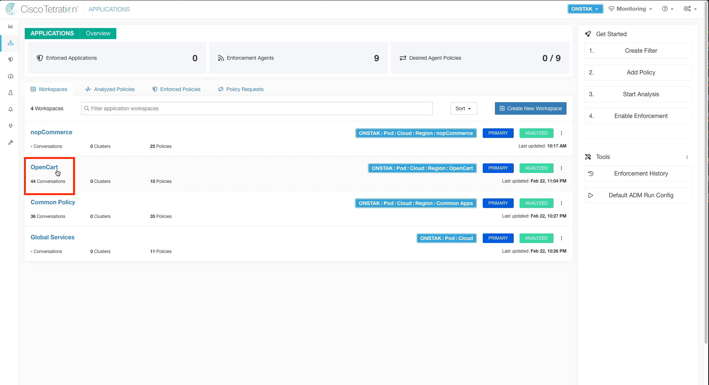</a>  

<a href="#step-002" style="font-weight:bold">Step 002</a>
  

Click on Policy Analysis.

<a href="images/module_07-09_002.png">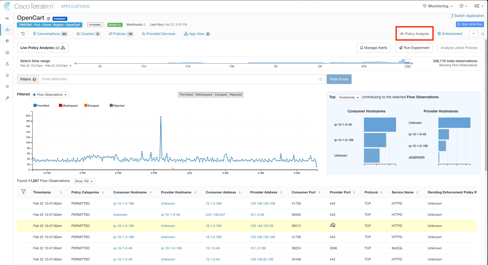</a>  

<a href="#step-003" style="font-weight:bold">Step 003</a>
  

Filter out Permitted flows, and click on the point in the graph where there are Escaped flows (denoted in orange).

<a href="images/module_07-09_003.png">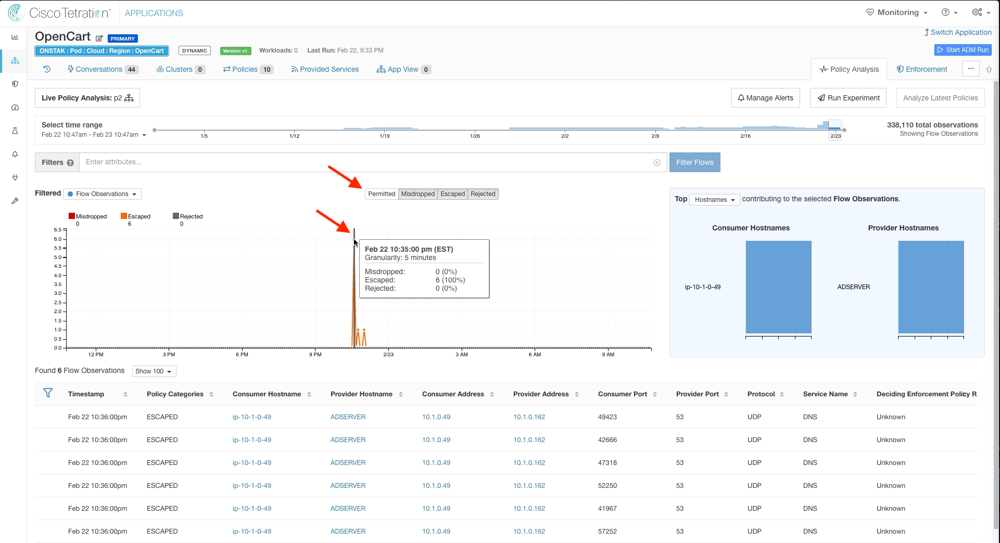</a>  

<a href="#step-004" style="font-weight:bold">Step 004</a>
  

Click on one of the escaped flows,  and select Quick Policy Analysis.  

<a href="images/module_07-09_004.png">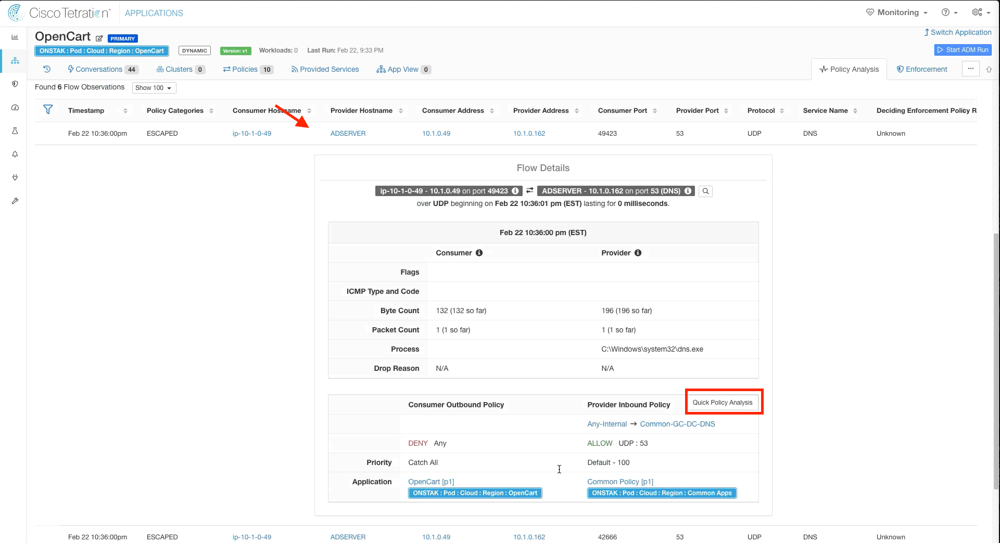</a>  

<a href="#step-005" style="font-weight:bold">Step 005</a>
  

Click on Find matching policies.  Note that the Policy Decision is ALLOW.  Why is the flow indicating escaped but the flow is ALLOW in our policy?

> Hint: We haven't changed the time range!  We are looking at a point in the graph prior to our policy change we made earlier in the OpenCart application workspace to allow the OpenCart scope to talk to Common-GC-DC-DNS on UDP port 53.  

<a href="images/module_07-09_005.png">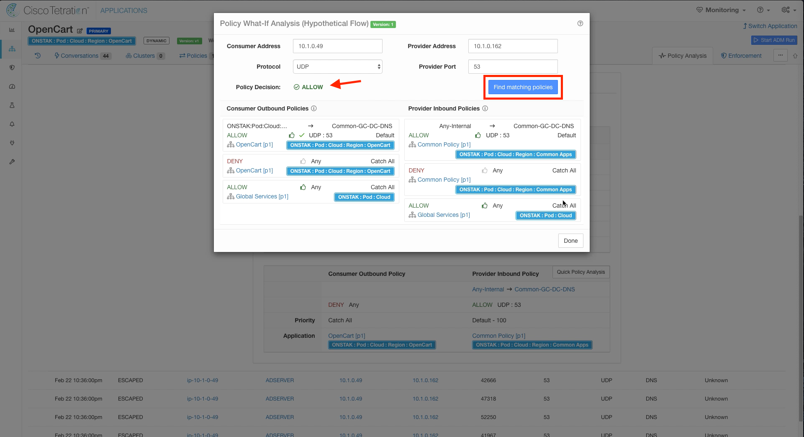</a>  

<a href="#step-006" style="font-weight:bold">Step 006</a>
  

Click on the clock icon and note the last time policy was changed and the reason.  

<a href="images/module_07-09_006.png">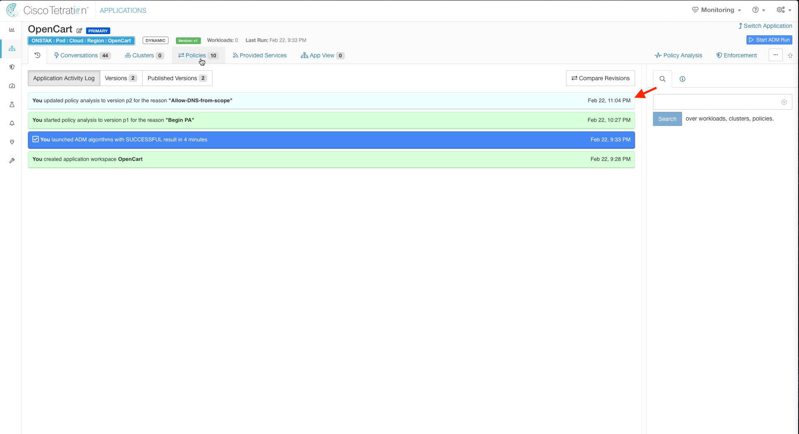</a>  

<a href="#step-007" style="font-weight:bold">Step 007</a>
  

Click on Policy Analysis and change the time range to 1 hour.  

<a href="images/module_07-09_007.png">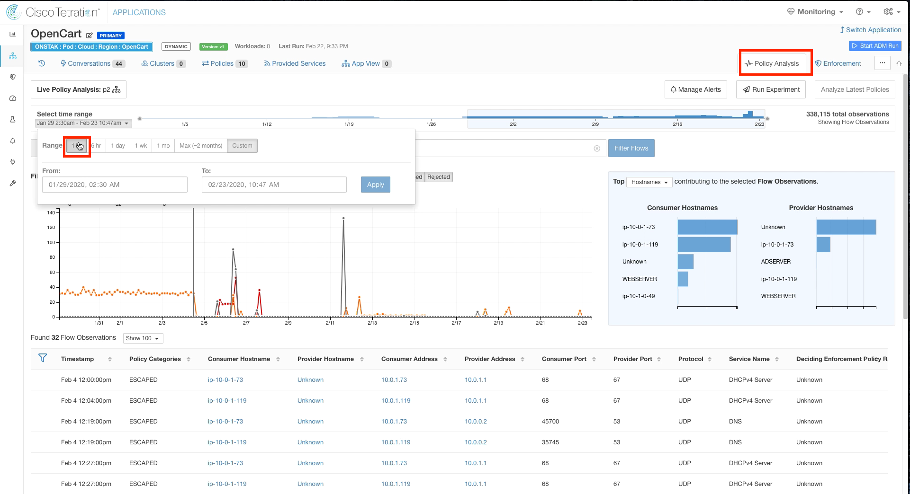</a>  

<a href="#step-008" style="font-weight:bold">Step 008</a>
  

Click on a point in the graph past the time when the policy was last published.  Here you should see the flows that were indicated as Escaped showing as Permitted.  

<a href="images/module_07-09_008.png">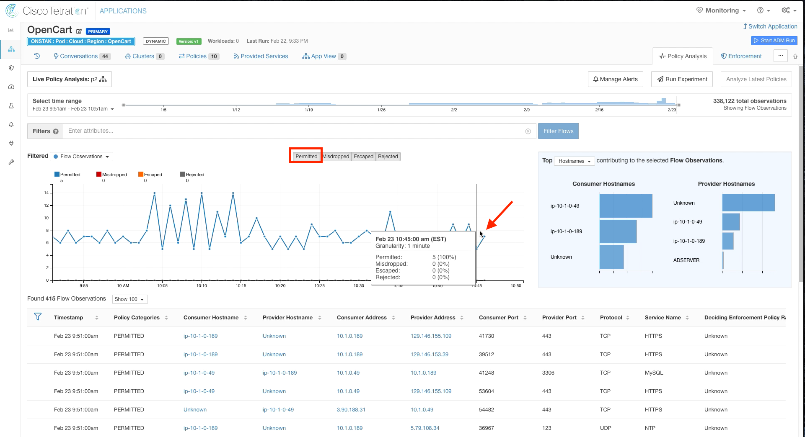</a>  

<a href="#step-009" style="font-weight:bold">Step 009</a>
  

Click on Run Experiment.

> An experiment allows you to compare the current policy against historical traffic.  It helps you answer the question, what would have happened to the historical flows if the current policy was applied.

<a href="images/module_07-09_009.png">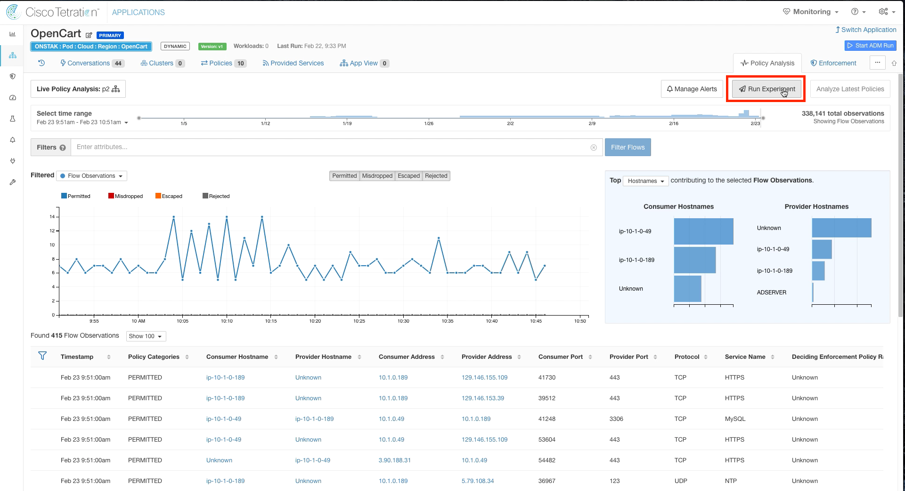</a>  

<a href="#step-010" style="font-weight:bold">Step 010</a>
  

Select the last 24 hours for Start Date and End Date, and then select Run.

> The experiment will take a few minutes to complete.

<a href="images/module_07-09_010.png">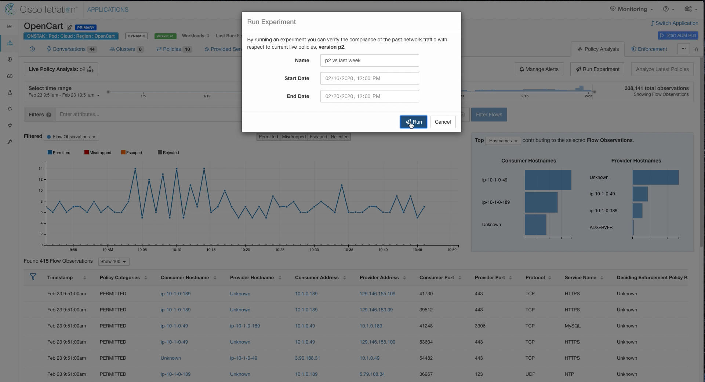</a>  

<a href="#step-011" style="font-weight:bold">Step 011</a>
  

Click on Live Policy Analysis to view the status of the experiment.  

<a href="images/module_07-09_011.png">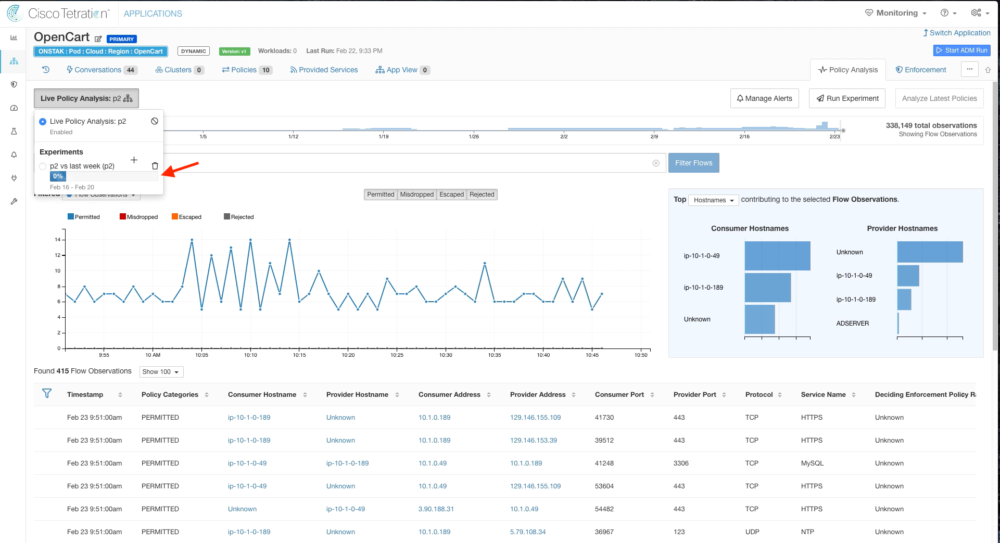</a>  

<a href="#step-012" style="font-weight:bold">Step 012</a>
  

Once the experiment is complete, click on it to view the results.

<a href="images/module_07-09_012.png">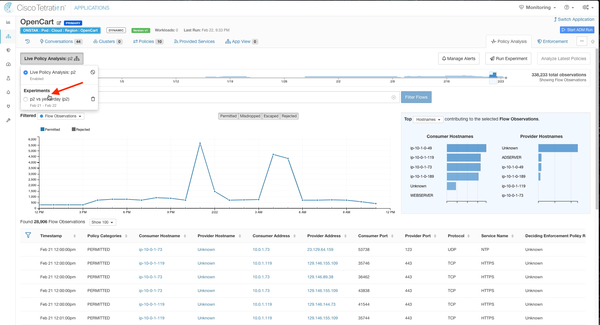</a>  

<a href="#step-013" style="font-weight:bold">Step 013</a>
  

Filter oput Permitted flows.  

<a href="images/module_07-09_013.png">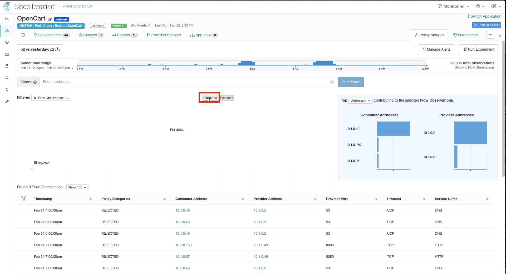</a>  

<a href="#step-014" style="font-weight:bold">Step 014</a>
  

Notice that there are some rejected flows to TCP port 8080.    

<a href="images/module_07-09_014.png">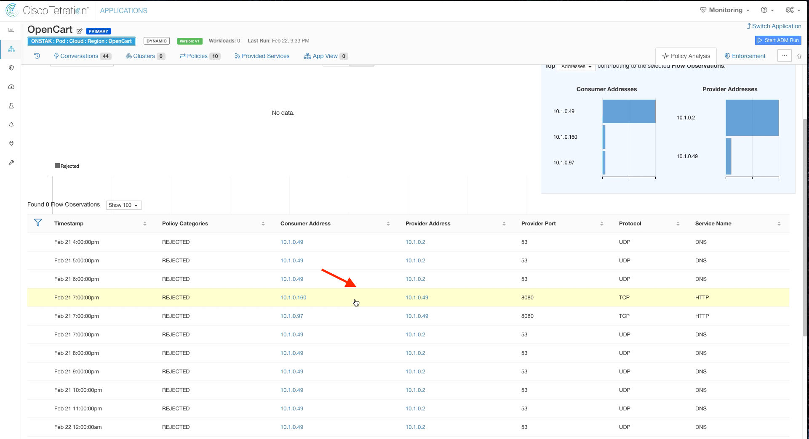</a>  

<a href="#step-015" style="font-weight:bold">Step 015</a>
  

Click on the flow to TCP port 8080 and select Quick Policy Analysis.  

<a href="images/module_07-09_015.png">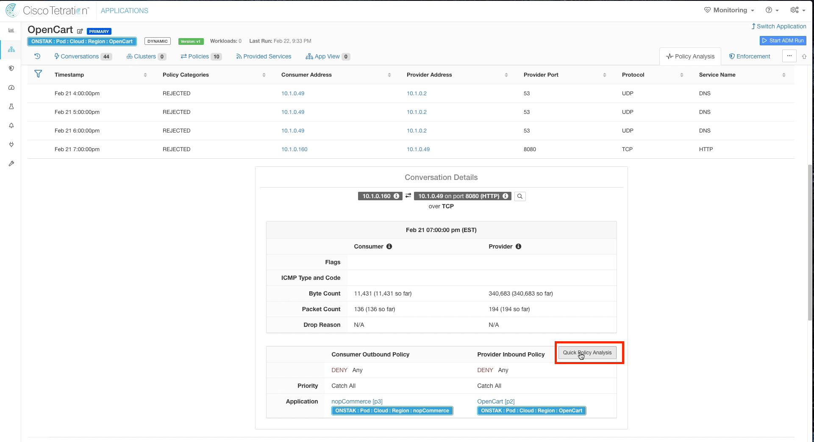</a>  

<a href="#step-016" style="font-weight:bold">Step 016</a>
  

The Policy Decision is deny.   This is the desired outcome for this traffic because it will block the attacker from coming in on that port to the Apache Struts application.

<a href="images/module_07-09_016.png">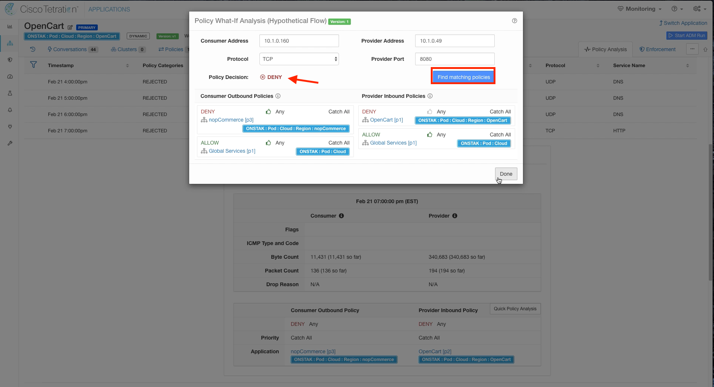</a>  

---   

| [Return to Table of Contents](https://tetration.guru/bootcamp/) | [Go to Top of the Page](readme.md) | [Continue to the Next Module]() |
