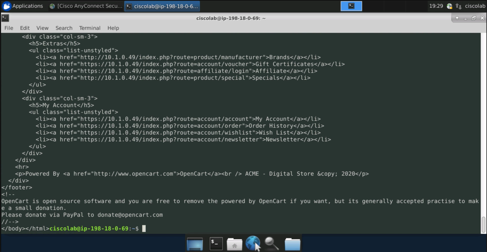

# Cisco Tetration Virtual Bootcamp

## Module 07.10  Segmentation - Enforcement - Pre Enforcement Checks

In this module we will test access to the applications and workloads prior to enabling enforcement to ensure that everything worked as expected prior to enforcement.  Later when we enable enforcement we will re-run these same tests to ensure that the desired intent was achieved. 

<a href="https://cisco-tetration-hol-content.s3.amazonaws.com/videos/21_policy_enforcement_pre-enforcement.mp4" style="font-weight:bold" title="Enforcement Policy Tuning"> Click here to view a video of tasks performed to go through a series of pre-enforcement checks prior to taking all workloads into enforcement mode.</a>

### Steps for this Module  
<a href="#step-001" style="font-weight:bold">Step 001 - Test public access to the IIS web server</a>  
<a href="#step-002" style="font-weight:bold">Step 002 - Test public access to the Apache web server</a>  
<a href="#step-003" style="font-weight:bold">Step 003 - Open a session to the IIS web server</a>  
<a href="#step-004" style="font-weight:bold">Step 004 - Test outbound access to the Internet</a>  
<a href="#step-005" style="font-weight:bold">Step 005 - Open a browser to the Apache web server</a>  
<a href="#step-006" style="font-weight:bold">Step 006 - Continue opening a browser to the Apache web server </a>  
<a href="#step-007" style="font-weight:bold">Step 007 - Browser loaded to the Apache web server</a>  
<a href="#step-008" style="font-weight:bold">Step 008 - Open a session to the Apache web server</a>  
<a href="#step-009" style="font-weight:bold">Step 009 - Test outbound access to the Internet via ping</a>  
<a href="#step-010" style="font-weight:bold">Step 010 - Test outbound access to the Internet using HTTP</a>  
<a href="#step-011" style="font-weight:bold">Step 011 - Test HTTP connection to the IIS web server</a>  
<a href="#step-012" style="font-weight:bold">Step 012 - Open a session to the Employee desktop</a>  
<a href="#step-013" style="font-weight:bold">Step 013 - Open the Cisco Anyconnect client</a>  
<a href="#step-014" style="font-weight:bold">Step 014 - Connect to VPN</a>  
<a href="#step-015" style="font-weight:bold">Step 015 - Ignore the security warning and connect</a>  
<a href="#step-016" style="font-weight:bold">Step 016 - Enter employee credentials</a>  
<a href="#step-017" style="font-weight:bold">Step 017 - Test access to the IIS web server via HTTP</a>  
<a href="#step-018" style="font-weight:bold">Step 018 - Test access to the IIS web server via HTTPS</a>  
<a href="#step-019" style="font-weight:bold">Step 019 - View HTTPS output</a>  
<a href="#step-020" style="font-weight:bold">Step 020 - Test connectivity to the Apache web server via HTTP</a>  
<a href="#step-021" style="font-weight:bold">Step 021 - Test connectivity to the Apache web server via HTTPS</a>  
<a href="#step-022" style="font-weight:bold">Step 022 - Review the HTTPS output</a>  
<a href="#step-023" style="font-weight:bold">Step 023 - Test SSH access to the Apache web server</a>  
<a href="#step-024" style="font-weight:bold">Step 024 - Open the Remmina RDP application</a>  
<a href="#step-025" style="font-weight:bold">Step 025 - Test RDP to the IIS web server</a>  

---

<a href="#step-001" style="font-weight:bold">Step 001</a>
  

Test public access to the IIS web server.

  

<a href="#step-002" style="font-weight:bold">Step 002</a>
  

Test public access to the Apache web server.

  

<a href="#step-003" style="font-weight:bold">Step 003</a>
  

Open a session to the IIS web server.

  

<a href="#step-004" style="font-weight:bold">Step 004</a>
  

Test outbound access to the Internet from the IIS web server.

  

<a href="#step-005" style="font-weight:bold">Step 005</a>
  

Next we will test access from the IIS web server to the Apache web server.  This is traffic that should be blocked once we implement our policy. Browse to the IP address of the Apache web server.  Click Advanced on the security warning.

  

<a href="#step-006" style="font-weight:bold">Step 006</a>
  

Click on Proceed to continue.  

  

<a href="#step-007" style="font-weight:bold">Step 007</a>
  

The ACME Digital Store web site should be displayed.  

  

<a href="#step-008" style="font-weight:bold">Step 008</a>
  

Open a session to the Apache web server.  

  

<a href="#step-009" style="font-weight:bold">Step 009</a>
  

Test outbound Internet access by issuing ping commands to well-known web sites.  

  

<a href="#step-010" style="font-weight:bold">Step 010</a>
  

Use the curl command to initiate an outbound HTTP connection to well-known web sites.

  

<a href="#step-011" style="font-weight:bold">Step 011</a>
  

Use the curl command to create an HTTP session from the Apache web server to the IIS web server.

  

<a href="#step-012" style="font-weight:bold">Step 012</a>
  

Open a session to the Employee desktop.  

  

<a href="#step-013" style="font-weight:bold">Step 013</a>
  

Click on the Cisco AnyConnect VPN Client icon on the desktop.  

  

<a href="#step-014" style="font-weight:bold">Step 014</a>
  

Click Connect.  

  

<a href="#step-015" style="font-weight:bold">Step 015</a>
  

Select Connect Anyway on the security warning.  

  

<a href="#step-016" style="font-weight:bold">Step 016</a>
  

Log in using your employee credentials.

  

<a href="#step-017" style="font-weight:bold">Step 017</a>
  

Open the terminal application and use the curl command to open an HTTP connection to the IIS web server.  The terminal application can be launched by clicking the black icon in the bottom middle of the screen.  

  

<a href="#step-018" style="font-weight:bold">Step 018</a>
  

Use curl to open an HTTPS session to the IIS web server. This can be accomplished by using the -k flag and https for the URL as shown in the below image.   

  

<a href="#step-019" style="font-weight:bold">Step 019</a>
  

The below image shows the output of the curl command which is a text-based representation of the web site.

  

<a href="#step-020" style="font-weight:bold">Step 020</a>
  

Test an HTTP connection to the Apache web server using the curl command.    

  

<a href="#step-021" style="font-weight:bold">Step 021</a>
  

Test an HTTPS connection to the Apache web server using the curl command.

  

<a href="#step-022" style="font-weight:bold">Step 022</a>
  

The below image shows the text-based representation of the web site that is returned from the previous curl command.

  

<a href="#step-023" style="font-weight:bold">Step 023</a>
  

Connect to the Apache web server using SSH.  The connection should be successful.  

  

<a href="#step-024" style="font-weight:bold">Step 024</a>
  
Click on the Search icon at the bottom of the screen and search for the Remmina application.  This is an Remote Desktop application for Ubuntu.  Click on Remmina,  and select Launch.  

  

<a href="#step-025" style="font-weight:bold">Step 025</a>
  

Enter the IP address of the IIS web server and click Connect.  A userid/password dialogue should be display.  This indicates that the connection was successful to the IIS server.  There is no need to log into the RDP session.  Close the login dialogue.

  

REPEAT STEPS 12-25 ON THE SYSADMIN MACHINE.  

YOU HAVE FINISHED THIS MODULE

| [Return to Table of Contents](https://tetration.guru/bootcamp/) | [Go to Top of the Page](readme.md) | [Continue to the Next Module]() |
