# Cisco Tetration Virtual Bootcamp

## Module 07.11  Segmentation - Enforcement - Global and Common

In this module we will enable Enforcement on the Global Services and Common Policies application workspaces. This will cause rules to be generated on the hosts in Windows Firewall in the case of Windows and iptables on the Linux hosts. 
    
---  

## --- Lab ---
### Steps for this Lab  
<a href="#step-001" style="font-weight:bold">Step 001 - Open a session to the MS Active Directory server</a>  
<a href="#step-002" style="font-weight:bold">Step 002 - Search for and open Windows Firewall</a>  
<a href="#step-003" style="font-weight:bold">Step 003 - View Inbound Rules</a>  
<a href="#step-004" style="font-weight:bold">Step 004 - Examine Tetration rules</a>  
<a href="#step-005" style="font-weight:bold">Step 005 - Navigate to Inventory Search</a>
<a href="#step-006" style="font-weight:bold">Step 006 - Search for AD server</a>  
<a href="#step-007" style="font-weight:bold">Step 007 - Navigate to Policies</a>  
<a href="#step-008" style="font-weight:bold">Step 008 - View current Policies</a>  
<a href="#step-009" style="font-weight:bold">Step 009 - Enable enforcement for Global Services</a>  
<a href="#step-010" style="font-weight:bold">Step 010 - Choose policy version to enforce</a>  
<a href="#step-011" style="font-weight:bold">Step 011 - Navigate to the Common Policy app workspace</a>  
<a href="#step-012" style="font-weight:bold">Step 012 - Enable enforcement on Common Policy</a>  
<a href="#step-013" style="font-weight:bold">Step 013 - Choose policy version to enforce</a>  
<a href="#step-014" style="font-weight:bold">Step 014 - Navigate to Inventory Search</a>  
<a href="#step-015" style="font-weight:bold">Step 015 - Enter workload profile for the AD server</a>  
<a href="#step-016" style="font-weight:bold">Step 016 - Navigate to Policies</a>  
<a href="#step-017" style="font-weight:bold">Step 017 - View the Policies</a>  
<a href="#step-018" style="font-weight:bold">Step 018 - View new rules created in Windows Firewall</a>  

---

<a href="#step-001" style="font-weight:bold">Step 001</a>
  

Open a session to the Active Directory server.

<a href="images/module_07-11_001.png">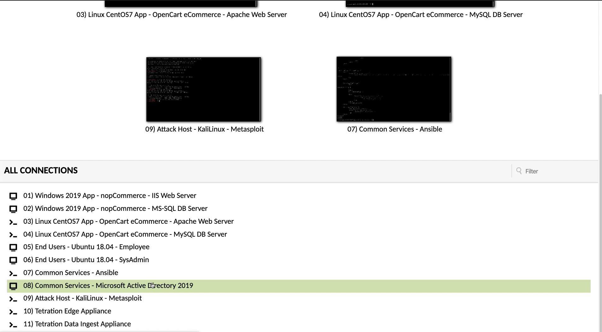</a>  

<a href="#step-002" style="font-weight:bold">Step 002</a>
  

Click on the Search icon in the toolbar and search for "Firewall".  Open the Windows Defender Firewall control panel.

<a href="images/module_07-11_002.png">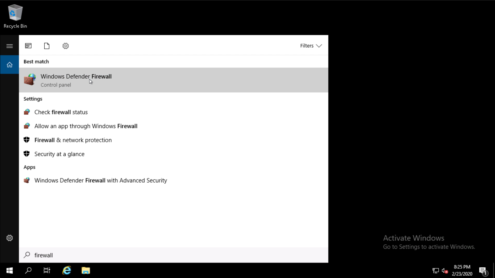</a>  

<a href="#step-003" style="font-weight:bold">Step 003</a>
  

Click on Inbound Rules.

<a href="images/module_07-11_003.png">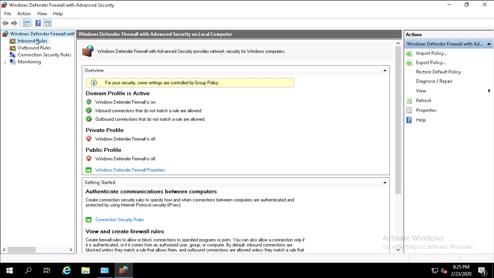</a>  

<a href="#step-004" style="font-weight:bold">Step 004</a>

Scroll down to locate the Tetration rules. There will be a few rules that are created by default by Tetration.

<a href="images/module_07-11_004.png">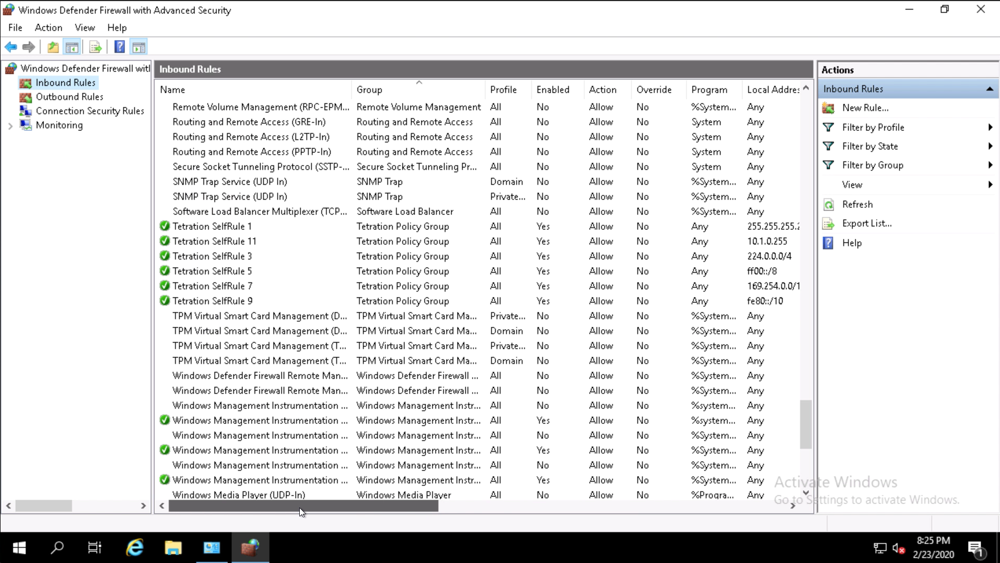</a>  

<a href="#step-005" style="font-weight:bold">Step 005</a>
  

Navigate to Inventory Search.  

<a href="images/module_07-11_005.png">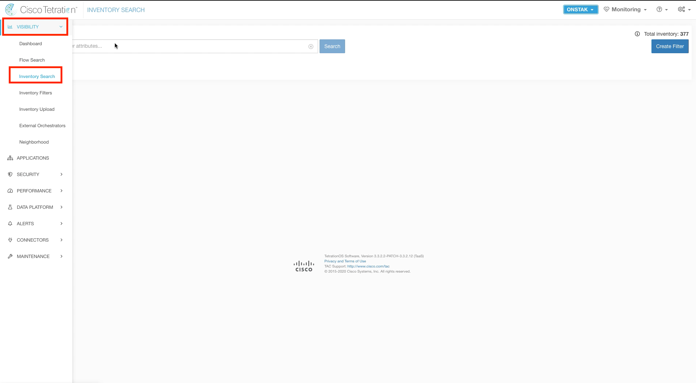</a>  

<a href="#step-006" style="font-weight:bold">Step 006</a>
  

Enter the Filter `Hostname contains AD` and click on the AD server IP address.  

<a href="images/module_07-11_006.png">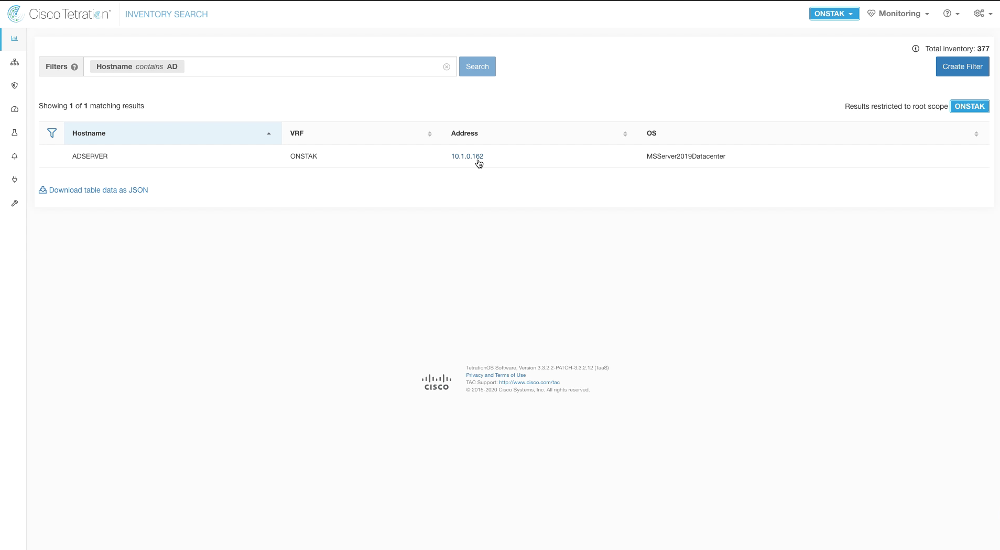</a>  

<a href="#step-007" style="font-weight:bold">Step 007</a>
  

Click on Policies.

<a href="images/module_07-11_007.png">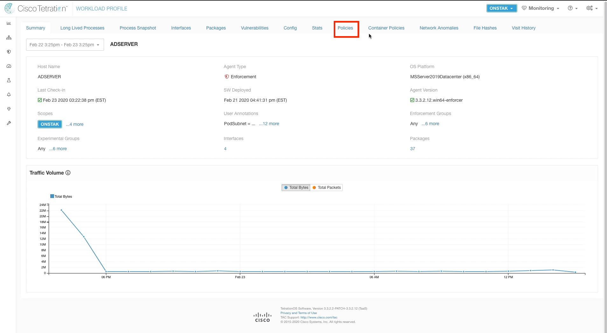</a>  

<a href="#step-008" style="font-weight:bold">Step 008</a>
  

Notice there are only two ALLOW rules here with any to allow communication on all ports and protocols.  

<a href="images/module_07-11_008.png">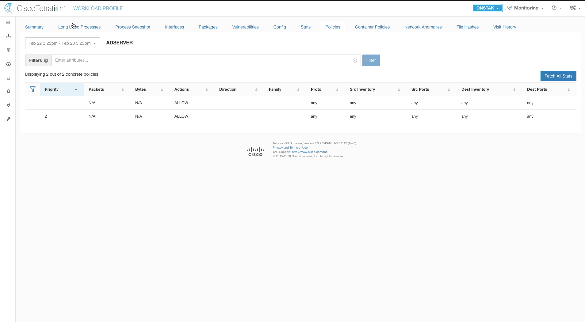</a>  

<a href="#step-009" style="font-weight:bold">Step 009</a>
  

Navigate to the Global Services app workspace and click on the Enforcement tab.  Click on Enforce Policies.  

<a href="images/module_07-11_009.png">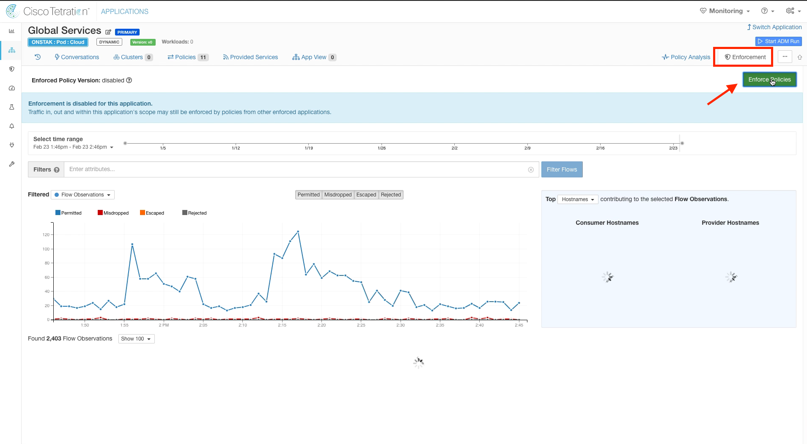</a>  

<a href="#step-010" style="font-weight:bold">Step 010</a>
  

Choose the version of policy to be enforced.  Normally this would be the latest analyzed policy,  however this could be used to revert an already enforced policy back to a previous version if needed.

<a href="images/module_07-11_010.png">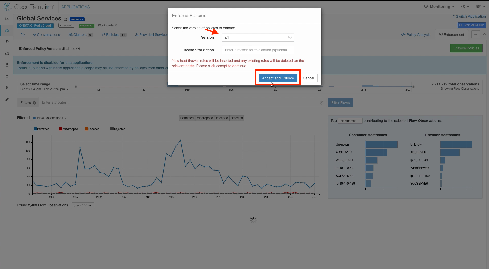</a>  

<a href="#step-011" style="font-weight:bold">Step 011</a>
  

Navigate to the Common Policy application workspace.

<a href="images/module_07-11_011.png">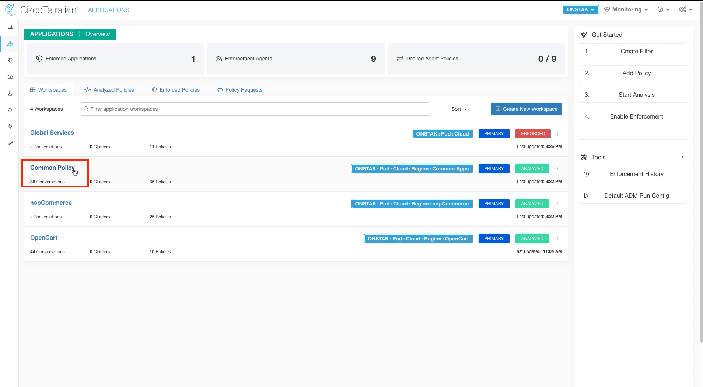</a>  

<a href="#step-012" style="font-weight:bold">Step 012</a>
  

Click on the Enforcement tab and click Enforce Policies.  

<a href="images/module_07-11_012.png">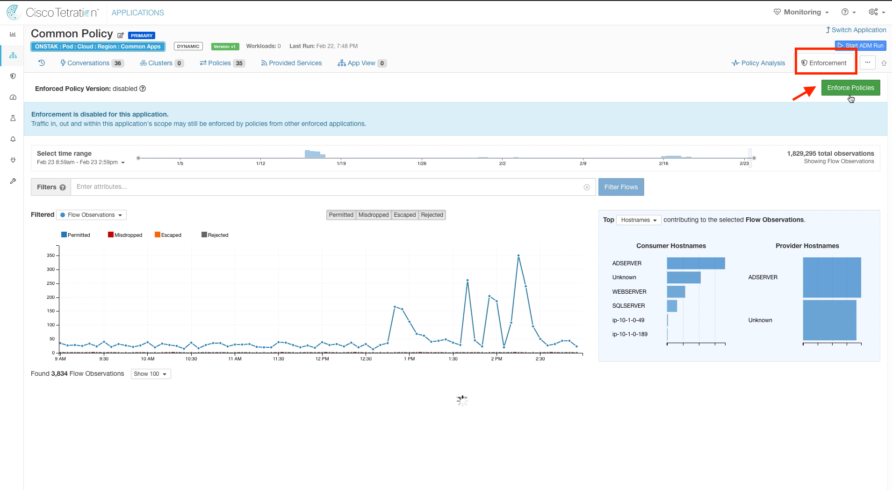</a>  

<a href="#step-013" style="font-weight:bold">Step 013</a>
  

Select the latest version of policy and click Accept and Enforce.  

<a href="images/module_07-11_013.png">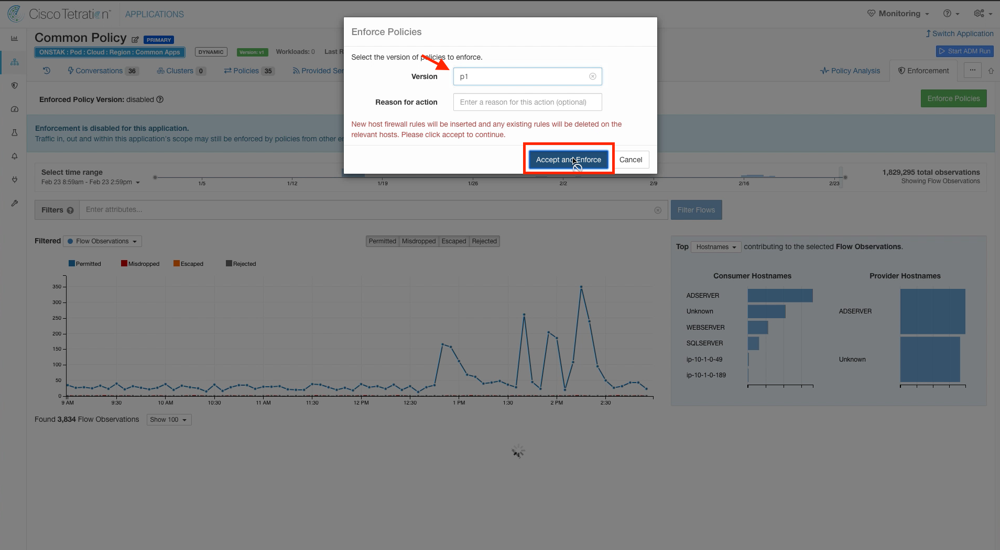</a>  

<a href="#step-014" style="font-weight:bold">Step 014</a>
  

Navigate to Inventory Search.  

<a href="images/module_07-11_014.png">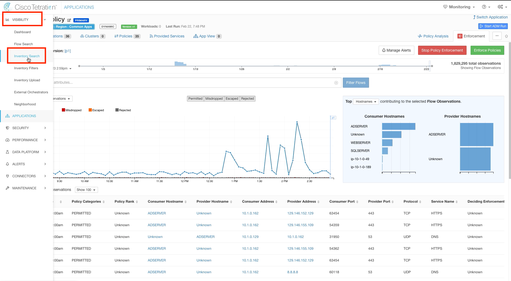</a>  

<a href="#step-015" style="font-weight:bold">Step 015</a>
  

Enter the Filter `Hostname contains AD`,  click Search and then click on the AD server IP address.

<a href="images/module_07-11_015.png">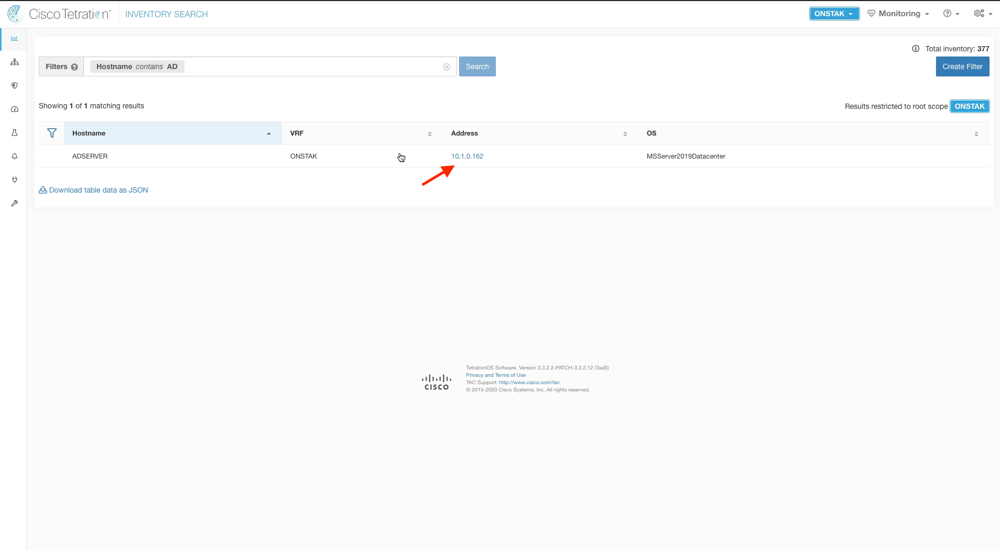</a>  

<a href="#step-016" style="font-weight:bold">Step 016</a>
  

On the workload profile screen click on Policies.  

<a href="images/module_07-11_016.png">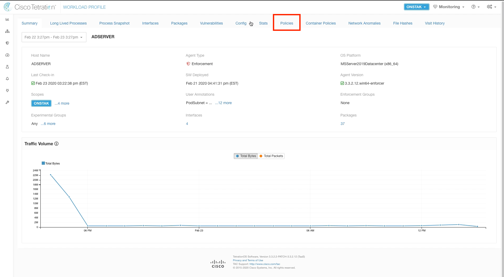</a>  

<a href="#step-017" style="font-weight:bold">Step 017</a>
  

There should now be many more rules listed here.  It may take a minute or so before the new policies are shown.  Adjust the time range and refresh the screen as necessary until the new policies show up.  These are a representation of the firewall rules that were created in Windows Firewall.

<a href="images/module_07-11_017.png">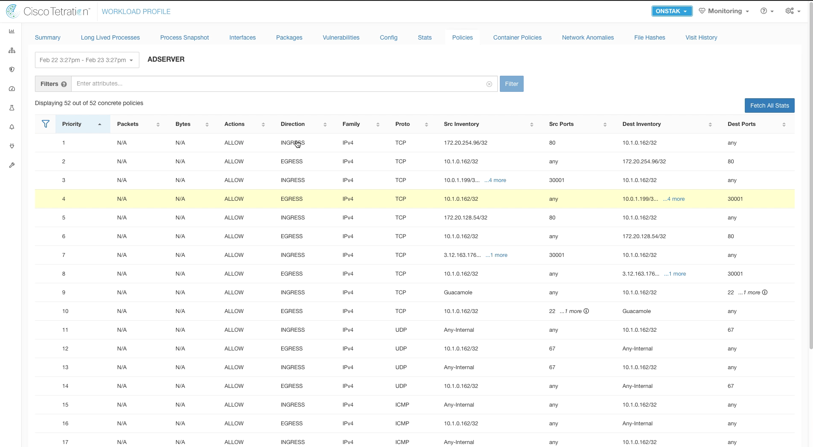</a>  

<a href="#step-018" style="font-weight:bold">Step 018</a>
  

Go back to the session to the AD server, and examine the Inbound Rules in Windows Firewall.  There should be many more rules created by Tetration.  

<a href="images/module_07-11_018.png">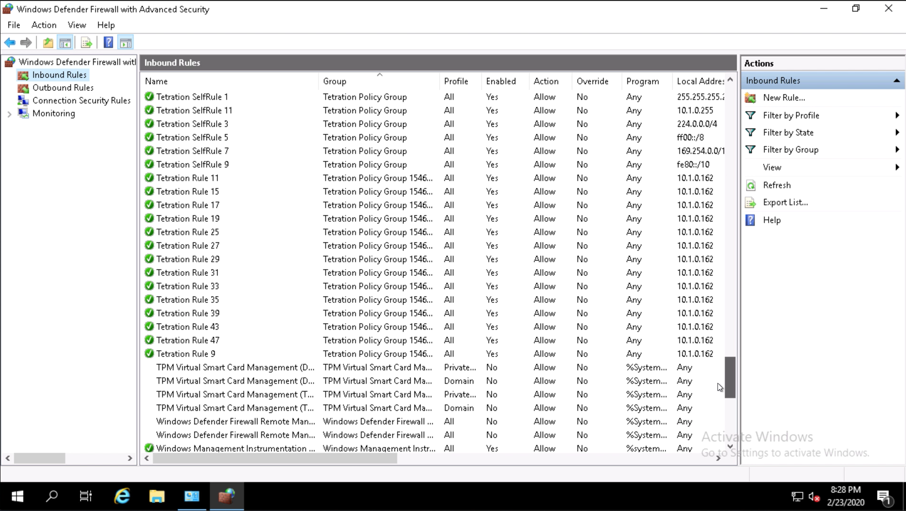</a>  

---   

[Go to Top of Page](README.md)
