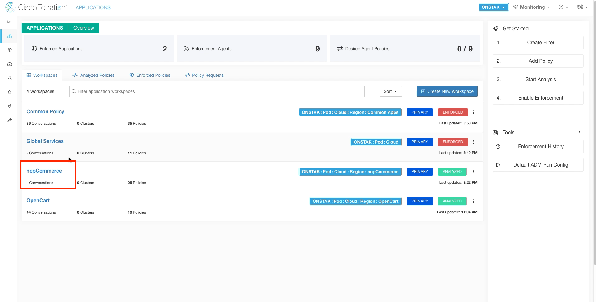

# Cisco Tetration Virtual Bootcamp

## Module 07.12  Segmentation - Enforcement - Windows App

In this module we will enable enforcement on the nopCommerce application workspace. First we will review the current policies in place on the IIS web server, and will come back to review the policies after enabling enforcement. Once in enforcement, we'll resolve a common error that can occur when using the Preserve Rules feature.  Then we will test the application, as well as test the user-based policy that was created based on ISE Security Group tags in <a href="">Module 16</a>  

---   

## --- Demo Video ---  
---  
<a href="https://deftcon-tetration-virtual-bootcamp.s3.us-east-2.amazonaws.com/demos/Module_07.12__Demo__Segmentation__Enforcement_Windows_App.mp4" style="font-weight:bold">Segmentation - Enforcement - Windows App :: Demo Video :: Runtime: 10 mins</a>  
  
---  

## --- Lab ---
### Steps for this Lab  
<a href="#step-001" style="font-weight:bold">Step 001 - Navigate to Inventory Search</a>  
<a href="#step-002" style="font-weight:bold">Step 002 - Search for the IIS web server</a>  
<a href="#step-003" style="font-weight:bold">Step 003 - Click on Policies</a>  
<a href="#step-004" style="font-weight:bold">Step 004 - Note the current number of Policies</a>  
<a href="#step-005" style="font-weight:bold">Step 005 - Navigate to the nopCommerce app workspace</a>  
<a href="#step-006" style="font-weight:bold">Step 006 - Enter enforcement for the nopCommerce app</a>  
<a href="#step-007" style="font-weight:bold">Step 007 - Choose the version of policy to enforce</a>  
<a href="#step-008" style="font-weight:bold">Step 008 - Navigate to Agent Config</a>  
<a href="#step-009" style="font-weight:bold">Step 009 - Select the IIS server from Software Agents</a>  
<a href="#step-010" style="font-weight:bold">Step 010 - View the Policies</a>  
<a href="#step-011" style="font-weight:bold">Step 011 - Examine the increased number of policies</a>  
<a href="#step-012" style="font-weight:bold">Step 012 - Test public access to the IIS server</a>  
<a href="#step-013" style="font-weight:bold">Step 013 - Open sessions to the Employee desktop </a>  
<a href="#step-014" style="font-weight:bold">Step 014 - Open the Cisco Anyconnect VPN Client</a>  
<a href="#step-015" style="font-weight:bold">Step 015 - Connect to VPN</a>  
<a href="#step-016" style="font-weight:bold">Step 016 - Ignore the security warning</a>  
<a href="#step-017" style="font-weight:bold">Step 017 - Enter employee credentials</a>  
<a href="#step-018" style="font-weight:bold">Step 018 - Navigate to Inventory Search</a>  
<a href="#step-019" style="font-weight:bold">Step 019 - Search for the Employee SGT</a>  
<a href="#step-020" style="font-weight:bold">Step 020 - View annotations</a>  
<a href="#step-021" style="font-weight:bold">Step 021 - Locate SGT tag in annotations</a>  
<a href="#step-022" style="font-weight:bold">Step 022 - Test HTTP connectivity to the IIS web server</a>  
<a href="#step-023" style="font-weight:bold">Step 023 - Test HTTPS connectivity to the IIS web server</a>  
<a href="#step-024" style="font-weight:bold">Step 024 - View HTTPS response</a>  
<a href="#step-025" style="font-weight:bold">Step 025 - Open the Remote Desktop application</a>  
<a href="#step-026" style="font-weight:bold">Step 026 - Attempt an RDP session to the IIS web server</a>  
<a href="#step-027" style="font-weight:bold">Step 027 - Navigate to the nopCommerce application workspace</a>  
<a href="#step-028" style="font-weight:bold">Step 028 - Examine Policy Analysis for the employee IP address</a>  
<a href="#step-029" style="font-weight:bold">Step 029 - Discover the escaped flows for the employee traffic</a>  
<a href="#step-030" style="font-weight:bold">Step 030 - Perform Quick Policy Analysis</a>  
<a href="#step-031" style="font-weight:bold">Step 031 - Determine policy decision</a>  
<a href="#step-032" style="font-weight:bold">Step 032 - Open a session to the IIS web server</a>  
<a href="#step-033" style="font-weight:bold">Step 033 - Open the Windows Firewall control panel</a>  
<a href="#step-034" style="font-weight:bold">Step 034 - Examine Inbound Rules</a>  
<a href="#step-035" style="font-weight:bold">Step 035 - Locate the policy rule for Remote Desktop </a>  
<a href="#step-036" style="font-weight:bold">Step 036 - Examine the Remote Desktop rule</a>  
<a href="#step-037" style="font-weight:bold">Step 037 - Test RDP connection from the Employee desktop</a>  
<a href="#step-038" style="font-weight:bold">Step 038 - Open a session to the SysAdmin Desktop</a>  
<a href="#step-039" style="font-weight:bold">Step 039 - Connect to Remote Desktop on the IIS web server</a>  
<a href="#step-040" style="font-weight:bold">Step 040 - Navigate to Inventory Search</a>  
<a href="#step-041" style="font-weight:bold">Step 041 - Filter for the SysAdmin SGT </a>  
<a href="#step-042" style="font-weight:bold">Step 042 - Examine annotations</a>  
<a href="#step-043" style="font-weight:bold">Step 043 - Locate the SysAdmins security group</a>    
<a href="#step-044" style="font-weight:bold">Step 044 - Validation of SGTs for User Segmentation</a>

---

<a href="#step-001" style="font-weight:bold">Step 001</a>
  

Navigate to Inventory Search.

  

<a href="#step-002" style="font-weight:bold">Step 002</a>
  

Filter for the IIS web server using filter `Hostname contains WEBSERVER`. Then click on the IP address of the web server.

  

<a href="#step-003" style="font-weight:bold">Step 003</a>
  

Click on Policies.

  

<a href="#step-004" style="font-weight:bold">Step 004</a>
  

Note the number of policies currently displayed. These are the policies that were implemented as part of the Common Policy and Global Services application workspaces that were moved to enforcement earlier.  We will see the number of policies increase further after we enable enforcement for the application.  

  

<a href="#step-005" style="font-weight:bold">Step 005</a>
  

Navigate to the nopCommerce application workspace.

  

<a href="#step-006" style="font-weight:bold">Step 006</a>
  

Click on the Enforcement tab and then select Enforce Policies.  

  

<a href="#step-007" style="font-weight:bold">Step 007</a>
  

Select the latest version of policy to enforce and then Accept and Enforce.

  

<a href="#step-008" style="font-weight:bold">Step 008</a>
  

Navigate to Agent Config.  

  

<a href="#step-009" style="font-weight:bold">Step 009</a>
  

Select the Software Agents tab,  and then locate and click on the IIS web server.  This is an alternative way to get to the Workload Profile screen.

  

<a href="#step-010" style="font-weight:bold">Step 010</a>
  

Click on the Policies tab.

  

<a href="#step-011" style="font-weight:bold">Step 011</a>
  

Notice the increased number of policies that are now displayed.  Tetration has pushed the additional rules into Windows firewall to implement our configured policy for the application.  

> It may take a few minutes for the additional rules to be displayed.  

  

<a href="#step-012" style="font-weight:bold">Step 012</a>
  

Open a browser and point to the public IP address of the IIS web server.  We should see that the web application is still accessible after moving into enforcement.

  

<a href="#step-013" style="font-weight:bold">Step 013</a>
  

Open a session to the Employee desktop.  

  

<a href="#step-014" style="font-weight:bold">Step 014</a>
  

Click on the Cisco Anyconnect VPN Client icon on the desktop.  

  

<a href="#step-015" style="font-weight:bold">Step 015</a>
  

Connect to VPN, if not already connected.  

  

<a href="#step-016" style="font-weight:bold">Step 016</a>
  

Select Connect Anyway when presented with the security warning.  

  

<a href="#step-017" style="font-weight:bold">Step 017</a>
  

Enter the employee credentials.  The password is `tet123$$!`.

  

<a href="#step-018" style="font-weight:bold">Step 018</a>
  

Navigate to Inventory Search.

  

<a href="#step-019" style="font-weight:bold">Step 019</a>
  

Enter the following filter: `* ISE_ctsSecurityGroup contains Employee`.  You should see the IP address that is assigned to the Anyconnect VPN Client appear in the list.  You can check this IP address by going to the statistics view in the Anyconnect VPN Client on the employee desktop.  

> It takes a few minutes after connecting to VPN for the IP address of the VPN client to become annotated with the ISE Security Group Tag.  

    

<a href="#step-020" style="font-weight:bold">Step 020</a>
  

Click on the IP address of the employee desktop to access the Workload Profile screen.  Then click on the link next to User Annotations.

  

<a href="#step-021" style="font-weight:bold">Step 021</a>
  

This shows all of the annotations that are placed on the IP address,  including the ctsSecurityGroup which is the Security Group assigned to the IP address.  

  

<a href="#step-022" style="font-weight:bold">Step 022</a>
  

Open a terminal session from the employee desktop and test HTTP connectivity to the IIS web server using the curl command as shown in the image below.  The response should be an HTTP redirect to the HTTPS URL of the web server.  This shows that we are still able to access the web application using HTTP after moving to enforcement.

  

<a href="#step-023" style="font-weight:bold">Step 023</a>
  

Test HTTPS connectivity to the web server using the curl command as shown in the image below.  The response should be a text representation of the web site.  

  

<a href="#step-024" style="font-weight:bold">Step 024</a>
  

The below output shows the output of the previous curl command using HTTPS.  

  

<a href="#step-025" style="font-weight:bold">Step 025</a>
  

Click on the magnifying glass at the bottom of the screen to search for an application,  and search for Remmina.  Remmina is a Remote Desktop application that can be used to connect to Microsoft servers running Terminal Services on TCP port 3389.  Click on Remmina and select Launch.

  

<a href="#step-026" style="font-weight:bold">Step 026</a>
  

Enter the IP address of the IIS web server and click connect.  You should be presented with a login dialogue.  This is not what we expected to see,  we actually expected the connection to time out.  Recall that our policy is configured to allow SysAdmins,  but not Employees to connect to the IIS server on TCP 3389.  Let's investigate further to see why we are being permitted to access RDP as an Employee.  

  

<a href="#step-027" style="font-weight:bold">Step 027</a>
  

Navigate to the nopCommerce application.  

  

<a href="#step-028" style="font-weight:bold">Step 028</a>
  

Click on the Policy Analysis tab,  and filter for the IP address of the employee desktop VPN.

  

<a href="#step-029" style="font-weight:bold">Step 029</a>
  

Turn off Permitted flows, and you should see some Escaped flows to the IIS web server.  Click on one of those flows.  

  

<a href="#step-030" style="font-weight:bold">Step 030</a>
  

Click on Quick Policy Analysis.  

  

<a href="#step-031" style="font-weight:bold">Step 031</a>
  

Click on Find matching policies,  and you should see that the Policy Decision is DENY.  This means our policy is configured correctly, the traffic should be getting denied but for some reason is being allowed.  To troubleshoot further,  we have to examine the Windows Firewall rules.  

  

<a href="#step-032" style="font-weight:bold">Step 032</a>
  

Open a session to the IIS Web Server.  

  

<a href="#step-033" style="font-weight:bold">Step 033</a>
  

Click on the Search button in the toolbar and search for firewall.  Then open the Windows Firewall control panel.  

  

<a href="#step-034" style="font-weight:bold">Step 034</a>
  

Click on Inbound Rules.  

  

<a href="#step-035" style="font-weight:bold">Step 035</a>
  

Locate the rule titled `Remote Desktop - User Mode (TCP-In)`.  Right click on the rule and select Disable Rule.  

  

<a href="#step-036" style="font-weight:bold">Step 036</a>
  

Scroll to the right and you will see that this rule is permitting traffic from anywhere to TCP 3389, which overrides our policy we defined in Tetration.  This is occurring because way back when we set up our Agent Config Intent for Windows, we selected the "Preserve Rules" option.  This caused the default rules that are configured in the Windows Firewall to be preserved when we turned on enforcement.    

> It might seem logical to go ahead and turn off Preserve Rules now in the Windows Config Intent.  It is not recommended to disable Preserve Rules after going into enforcement.  This may cause undesirable behavior, such as the agents becoming unable to check in with the Tetration cluster.        

  

<a href="#step-037" style="font-weight:bold">Step 037</a>
  

From the employee desktop,  attempt another Remote Desktop session to the IIS web server using the Remmina application.  This time,  the connection should not be successful.  

  

<a href="#step-038" style="font-weight:bold">Step 038</a>
  

Open a session to the SysAdmin desktop,  and launch the Remmina application.  

  

<a href="#step-039" style="font-weight:bold">Step 039</a>
  

Open a connection to the IIS web server.  A login dialogue should be displayed.  This is successful because we have a specific rule allowing SysAdmins to connect to the nopCommerce scope on TCP 3389.

  

<a href="#step-040" style="font-weight:bold">Step 040</a>
  

Navigate to Inventory Search.

  

<a href="#step-041" style="font-weight:bold">Step 041</a>
  

Search for the VPN client IP of the SysAdmin desktop using the query `* ISE_ctsSecurityGroup contains SysAdmin`.  Click on the IP address to enter the Workload Profile.  

  

<a href="#step-042" style="font-weight:bold">Step 042</a>
  

Click on the link next to User Annotations.

  

<a href="#step-043" style="font-weight:bold">Step 043</a>
  

Here we see the IP address is annotated with the Security Group named SysAdmins.  

  

<a href="#step-044" style="font-weight:bold">Step 044</a>
  

In our nopCommerce policy, we have created a rule that allows this security group to access all systems in the scope on TCP 3389.   

  

---   

| [Return to Table of Contents](https://tetration.guru/bootcamp/) | [Go to Top of the Page](README.md) | [Continue to the Next Module](../module_07-13/) |
