# Cisco Tetration - Hands-On Lab

## Module 07.13  Segmentation - Enforcement - Linux App

In this module we will enable enforcement for the OpenCart application.  We will review the deployed policies both before and after enabling enforcement to compare the results,  and then once in enforcement test access to the application.  We will also test the user-based policy as defined in <a href="">Module 16</a> 

---
<a href="https://cisco-tetration-hol-content.s3.amazonaws.com/videos/24_policy_enforcement_opencart.mp4" style="font-weight:bold" title="Enforcement - OpenCart"> Click here to view a video showing the necessary tasks to be performed to take the Linux-based OpenCart into full enforcement mode with micro-segmentation.</a>

---

### Steps for this Module  
<a href="#step-001" style="font-weight:bold">Step 001 - Navigate to Inventory Search</a>  
<a href="#step-002" style="font-weight:bold">Step 002 - Search for the Apache Linux machine</a>  
<a href="#step-003" style="font-weight:bold">Step 003 - View the policies on the Apache Linux machine</a>  
<a href="#step-004" style="font-weight:bold">Step 004 - View current number of policies present</a>  
<a href="#step-005" style="font-weight:bold">Step 005 - Switch to OpenCart application workspace</a>  
<a href="#step-006" style="font-weight:bold">Step 006 - Begin Enforcement</a>  
<a href="#step-007" style="font-weight:bold">Step 007 - Enforce the latest published policies</a>  
<a href="#step-008" style="font-weight:bold">Step 008 - Navigate to Inventory Search</a>  
<a href="#step-009" style="font-weight:bold">Step 009 - Click on the Apache Linux server</a>  
<a href="#step-010" style="font-weight:bold">Step 010 - View current Policies</a>  
<a href="#step-011" style="font-weight:bold">Step 011 - Observe the increased policy rules</a>  
<a href="#step-012" style="font-weight:bold">Step 012 - Open a session to the Employee Ubuntu desktop</a>  
<a href="#step-013" style="font-weight:bold">Step 013 - Open a session to the SysAdmin Ubuntu desktop</a>  
<a href="#step-014" style="font-weight:bold">Step 014 - Open a browser session to the external IP </a>  
<a href="#step-015" style="font-weight:bold">Step 015 - Connect to the Apache Linux machine from the Employee desktop</a>  
<a href="#step-016" style="font-weight:bold">Step 016 - Attempt to SSH to the Apache Linux machine from the Employee desktop</a>  
<a href="#step-017" style="font-weight:bold">Step 017 - Connect to the Apache Linux machine from the SysAdmin desktop</a>  
<a href="#step-018" style="font-weight:bold">Step 018 - Attempt to SSH to the Apache Linux machine from the SysAdmin desktop</a>  
<a href="#step-019" style="font-weight:bold">Step 019 - Attempt to SSH to the MySQL machine from the Employee desktop</a>  
<a href="#step-020" style="font-weight:bold">Step 020 - Open a session to the Kali Linux machine</a>  
<a href="#step-021" style="font-weight:bold">Step 021 - Attempt to connect to the Apache Linux machine on TCP 8080</a>  
<a href="#step-022" style="font-weight:bold">Step 022 - Connect to TCP 8080 on the Apache Linux machine from the Employee desktop</a>  
<a href="#step-023" style="font-weight:bold">Step 023 - View the curl output from the previous task</a>  
<a href="#step-024" style="font-weight:bold">Step 024 - Open a session to the nopCommerce IIS server</a>  
<a href="#step-025" style="font-weight:bold">Step 025 - Attempt a web session to the Apache Linux server</a>  
<a href="#step-026" style="font-weight:bold">Step 026 - Open a session to the Apache Linux server</a>  
<a href="#step-027" style="font-weight:bold">Step 027 - Attempt a web session to the IIS web server</a>  

---

<a href="#step-001" style="font-weight:bold">Step 001</a>
  

Navigate to Inventory Search.

<a href="images/module24_001.png">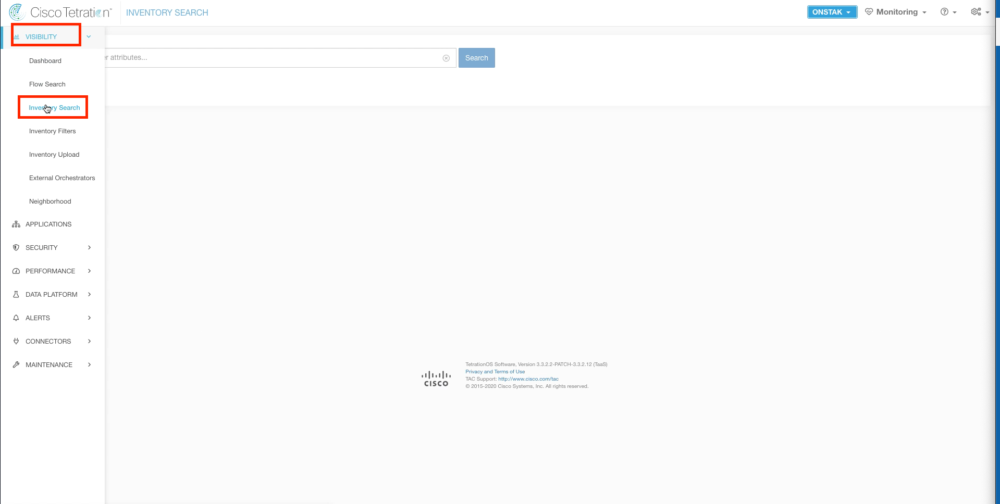</a>  

<a href="#step-002" style="font-weight:bold">Step 002</a>
  

Filter for the IP address of the Apache web server.  Then click on the IP address under the Address column.

  

<a href="#step-003" style="font-weight:bold">Step 003 </a>
  

On the Workload Profile,  click on Policies.

<a href="images/module24_003.png">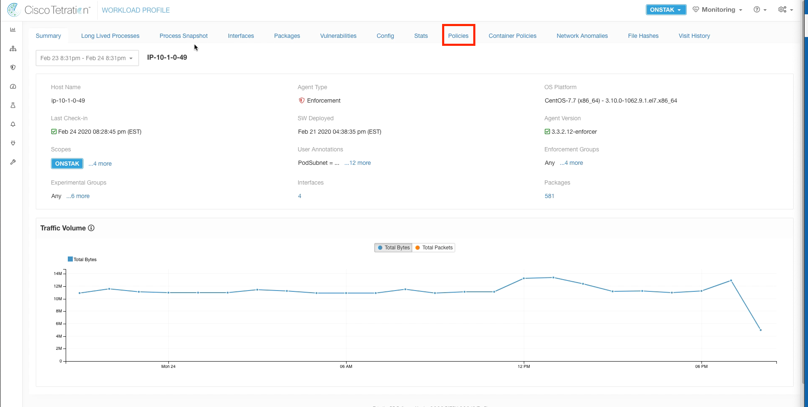</a>  

<a href="#step-004" style="font-weight:bold">Step 004</a>
  

Notice that there are currently 22 policies present.  We will see this increase when we enable enforcement on the OpenCart application workspace.

<a href="images/module24_004.png">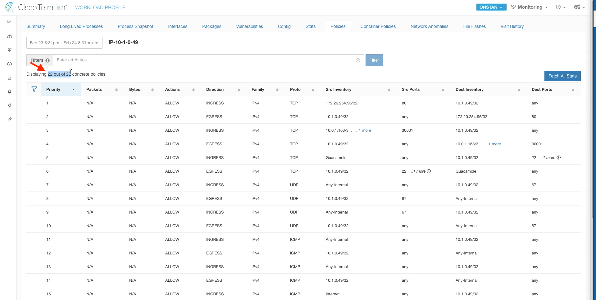</a>  

<a href="#step-005" style="font-weight:bold">Step 005</a>
  

Navigate to Applications and select the OpenCart application workspace.

<a href="images/module24_005.png">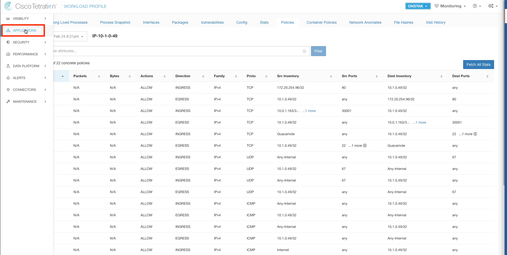</a>  

<a href="#step-006" style="font-weight:bold">Step 006</a>
  

Click on the Enforcement tab,  and select Enforce Policies.

<a href="images/module24_006.png">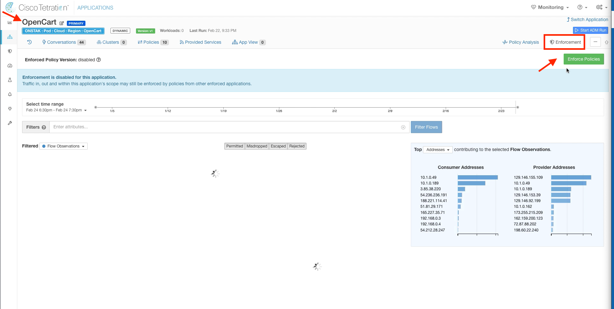</a>  

<a href="#step-007" style="font-weight:bold">Step 007</a>
  

Select the latest version of policy, and then click Accept and Enforce.  Optionally,  a reason can be entered which will show up in the application event log.

<a href="images/module24_007.png">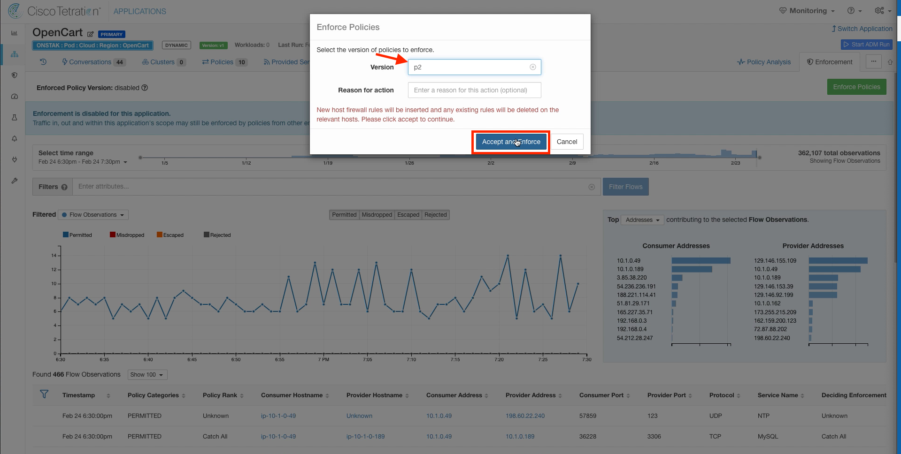</a>  

<a href="#step-008" style="font-weight:bold">Step 008</a>
  

Navigate to Inventory Search.  

<a href="images/module24_008.png">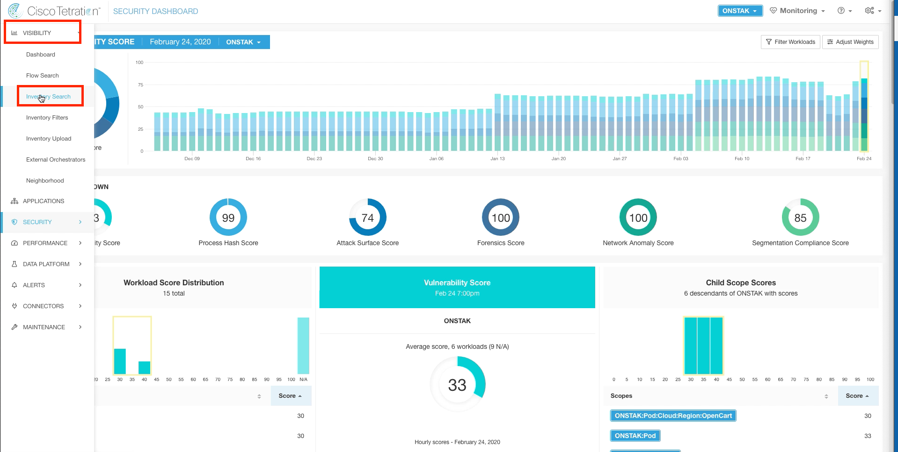</a>  

<a href="#step-009" style="font-weight:bold">Step 009</a>
  

Search for the IP address of the Apache web server and then click on the IP address.

<a href="images/module24_009.png">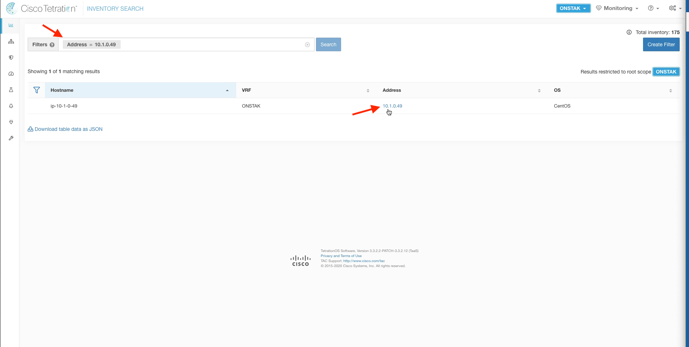</a>  

<a href="#step-010" style="font-weight:bold">Step 010</a>
  

Click on Policies.

<a href="images/module24_010.png">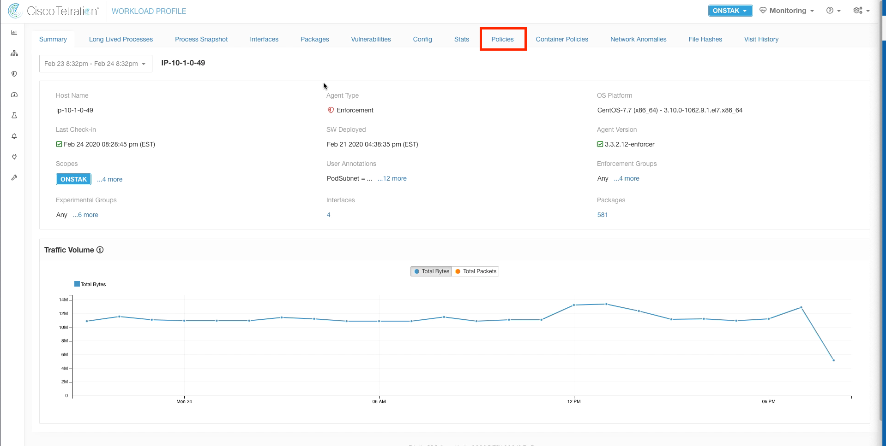</a>  

<a href="#step-011" style="font-weight:bold">Step 011</a>
  

Check the number of policies. This number should increase from what we observed previously. It may take a minute for the increased number of policies to be displayed.  

<a href="images/module24_011.png">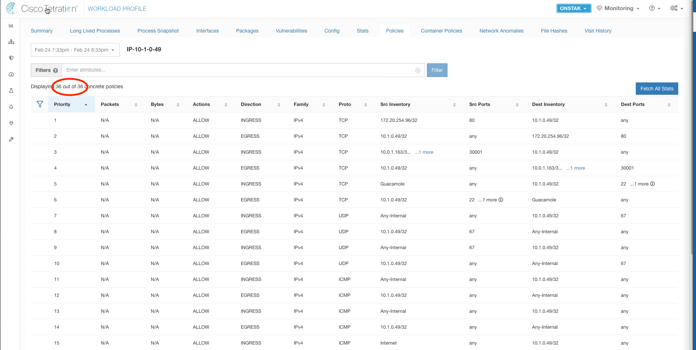</a>  

<a href="#step-012" style="font-weight:bold">Step 012</a>
  

Open a session to the Employee desktop.

<a href="images/module24_012.png">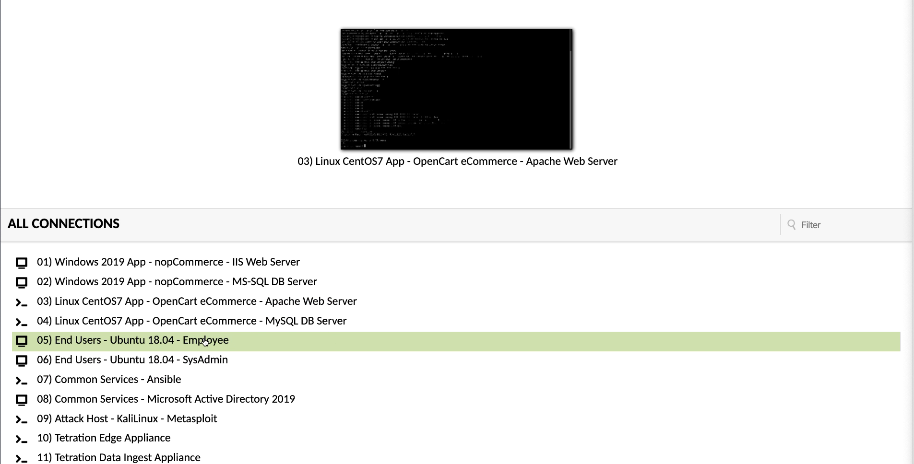</a>  

<a href="#step-013" style="font-weight:bold">Step 013</a>
  

In a new tab, also open a session to the SysAdmin desktop.  

<a href="images/module24_013.png">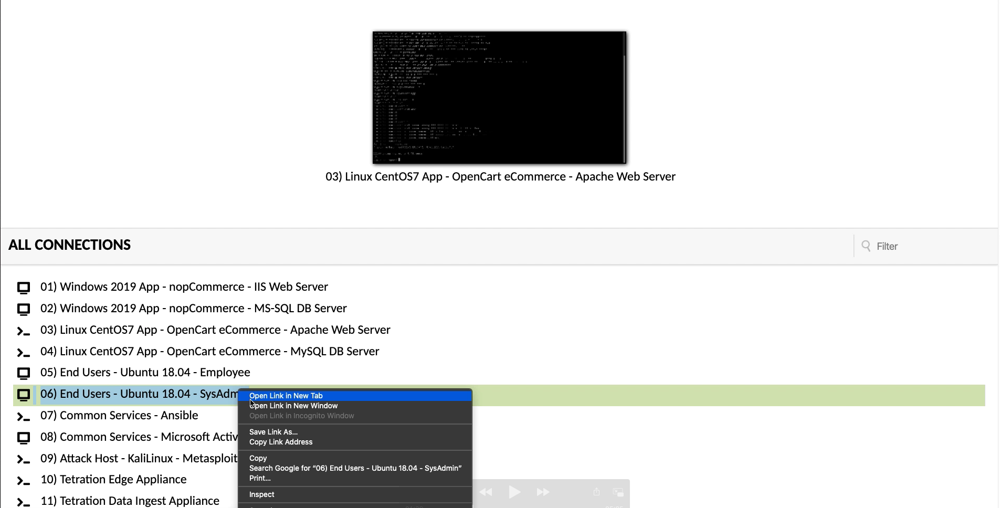</a>  

<a href="#step-014" style="font-weight:bold">Step 014</a>
  

In another tab, test connectivity to the Apace web server public IP address.  

<a href="images/module24_014.png">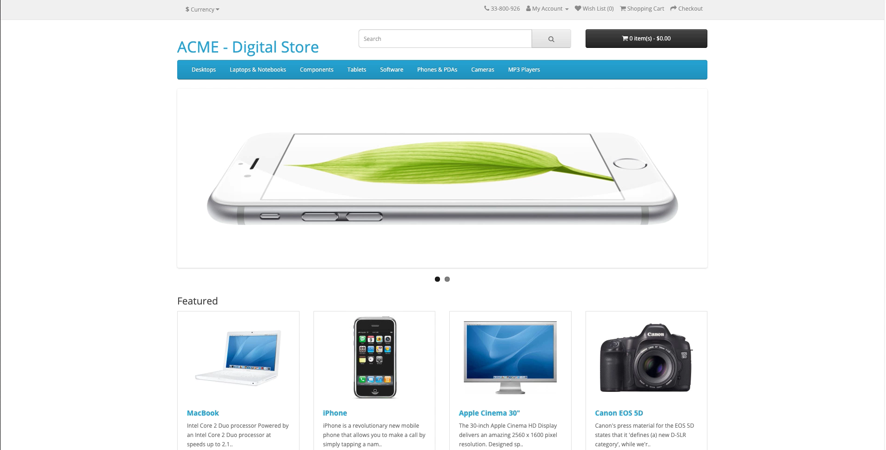</a>  

<a href="#step-015" style="font-weight:bold">Step 015</a>
  

From the Employee desktop,  open the Terminal application and use the curl command to attempt an HTTP connection to the IIS web server.  The Terminal application can be opened by clicking the black icon on the menu at the bottom middle of the screen.  The command should return output indicating "The document has moved", which indicates that the traffic is getting there on TCP port 80.  This is attempting a redirect to SSL.  To make the connection with ssl,  type `curl -k https://<APACHE_WEB_SERVER_IP>`.  This should return a text representation of the web site.  

<a href="images/module24_015.png">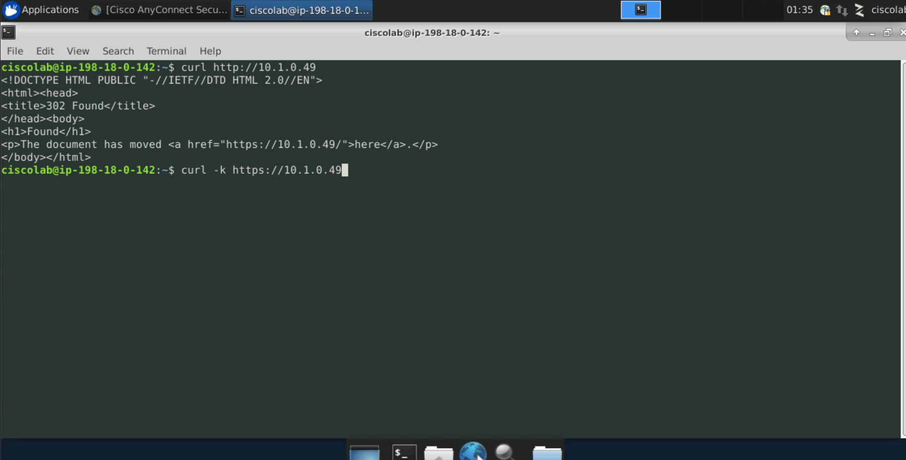</a>  

<a href="#step-016" style="font-weight:bold">Step 016</a>
  

Attempt an SSH connection to the Apache web server from the Employee desktop.  This connection should time out,  as SSH is not permitted from Employees to the Apache web server.  

<a href="images/module24_016.png">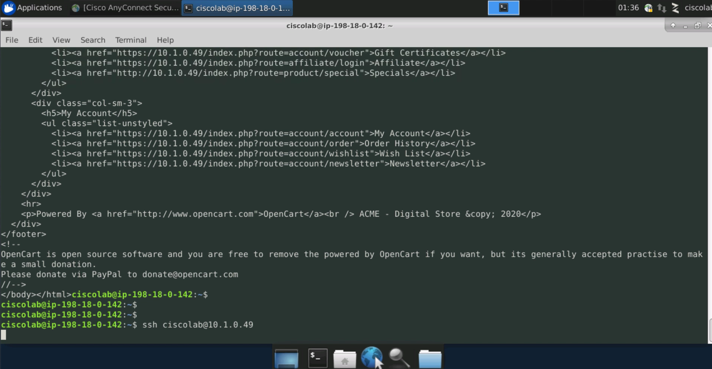</a>  

<a href="#step-017" style="font-weight:bold">Step 017</a>
  

From the SysAdmin desktop,  open the Terminal application and attempt an HTTP connection to the Apache web server using the curl command as shown in the image.  Output should be returned indicating "The document has moved".  Attempt a connection using SSL with the command `curl -k https://<APACHE_WEB_SERVER_IP`.  The text-based web site should be returned.  

<a href="images/module24_017.png">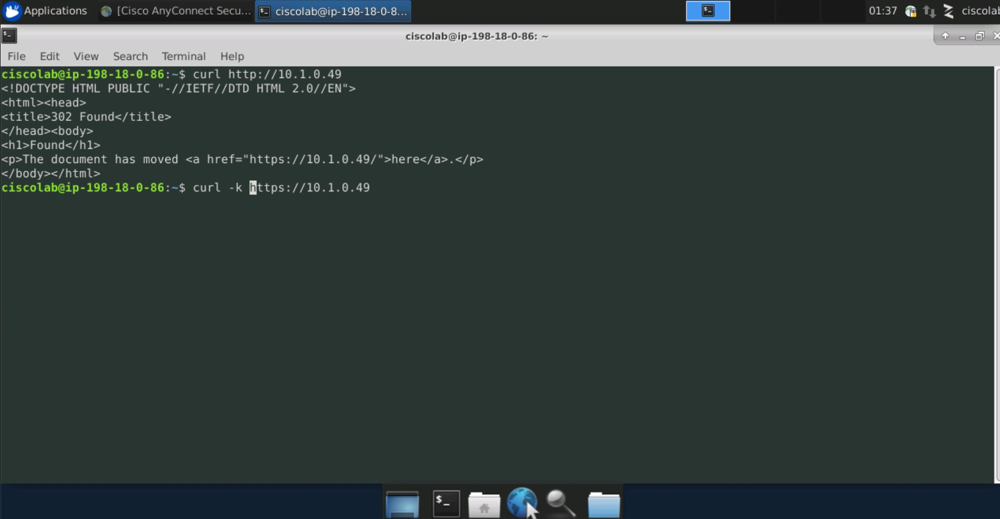</a>  

<a href="#step-018" style="font-weight:bold">Step 018</a>
  

From the SysAdmin desktop,  attempt to SSH to the Apache web server and the MySQL server.  The connections should both be successful.  

<a href="images/module24_018.png">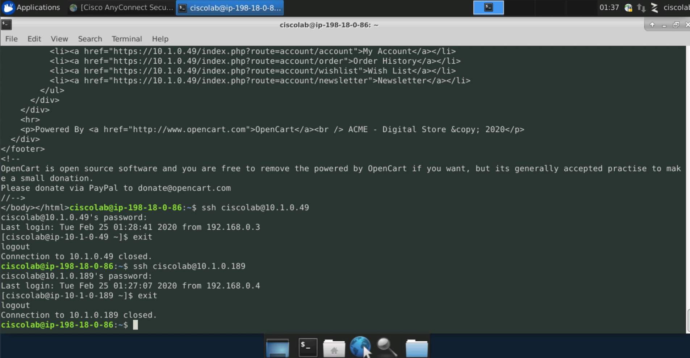</a>  

<a href="#step-019" style="font-weight:bold">Step 019</a>
  

Return to the Employee desktop and attempt SSH connections to both the Apache web server and the MySQL servers. Both of these connections should time out because we have not configured rules to allow Employees to SSH to the servers.

<a href="images/module24_019.png">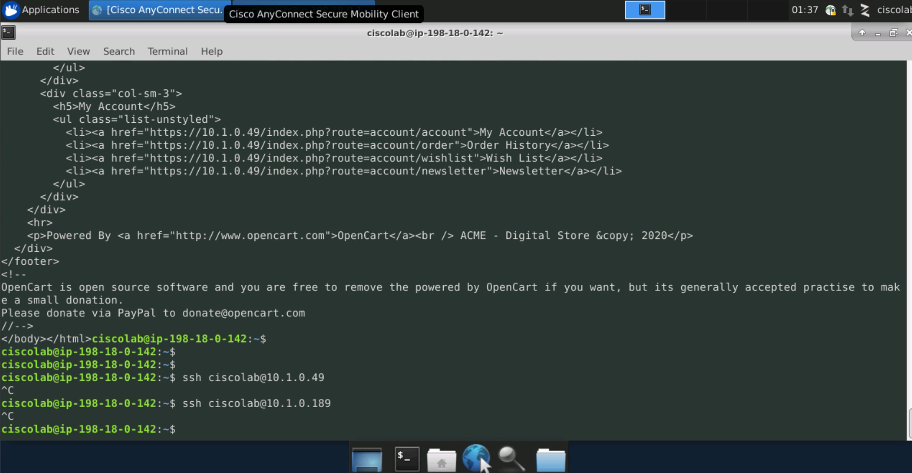</a>  

<a href="#step-020" style="font-weight:bold">Step 020</a>
  

Open a session to the Kali Linux server.  

<a href="images/module24_020.png">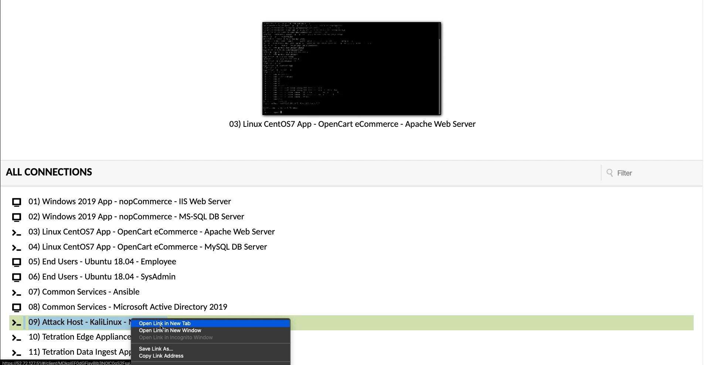</a>  

<a href="#step-021" style="font-weight:bold">Step 021</a>
  

Attempt a HTTP session to the Apache web server using the curl command as shown in the image.  Output should be returned for the connection on TCP port 80.   Now attempt a connection on TCP port 8080 using the curl command shown in the image.  This connection should time out, as we have blocked external access to the application on TCP port 8080.    

<a href="images/module24_021.png">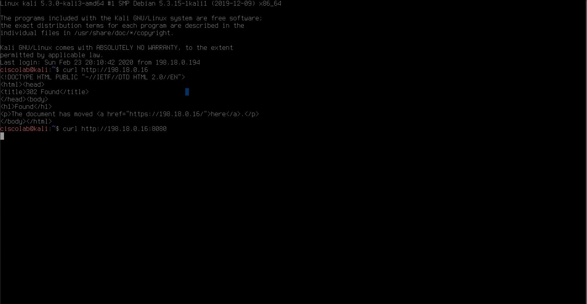</a>  

<a href="#step-022" style="font-weight:bold">Step 022</a>
  
Return to the Employee desktop,  and attempt a curl command to the Apache web server on port 8080 as shown in the image.  This connection should be successful because we have created a rule to explicitly allow employees to connect to the server on port 8080.

<a href="images/module24_022.png">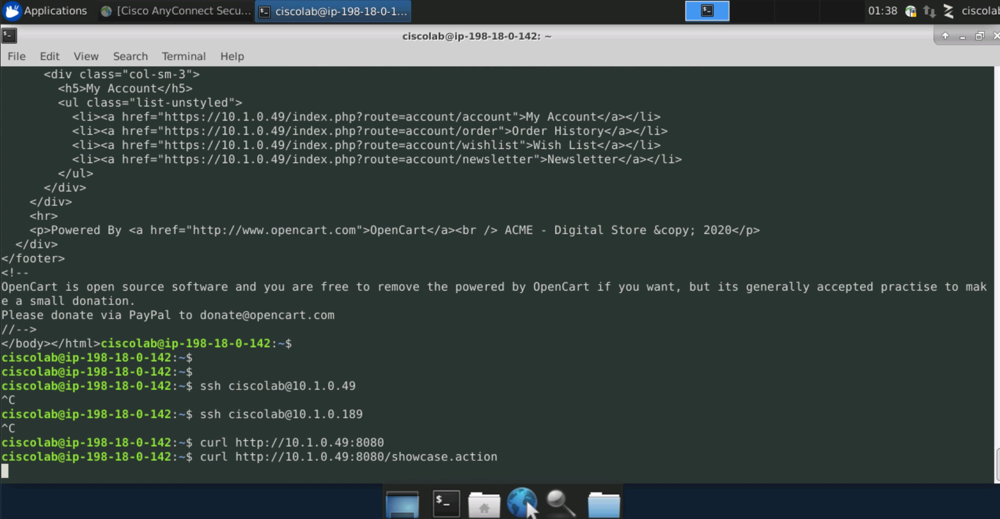</a>  

<a href="#step-023" style="font-weight:bold">Step 023</a>
  

The below image shows the output from the previous curl command.

<a href="images/module24_023.png">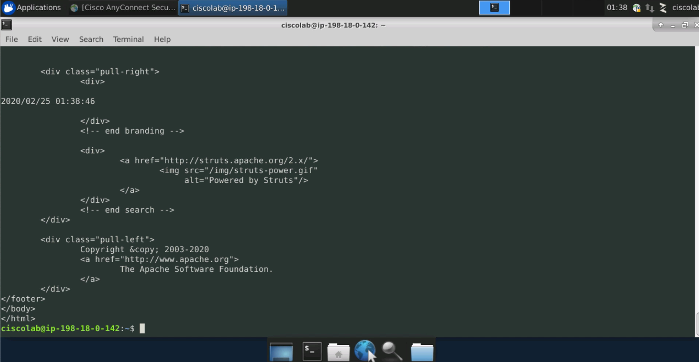</a>  

<a href="#step-024" style="font-weight:bold">Step 024</a>
  

Open a connection to the IIS web server.  

<a href="images/module24_024.png">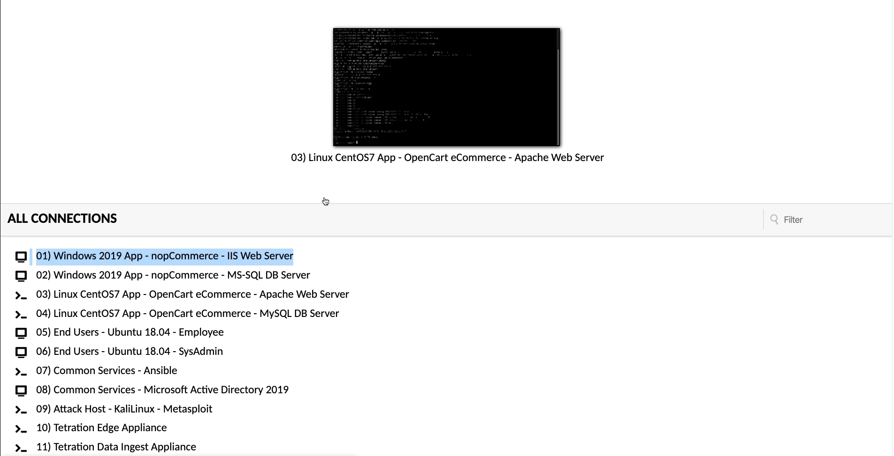</a>  

<a href="#step-025" style="font-weight:bold">Step 025</a>
  

Attempt to connect to the Apache web server in a web browser.  The connection should be blocked as we have not created any rules to allow the IIS web server to talk to the Apache web server, nor would we want to allow the communication.

<a href="images/module24_025.png">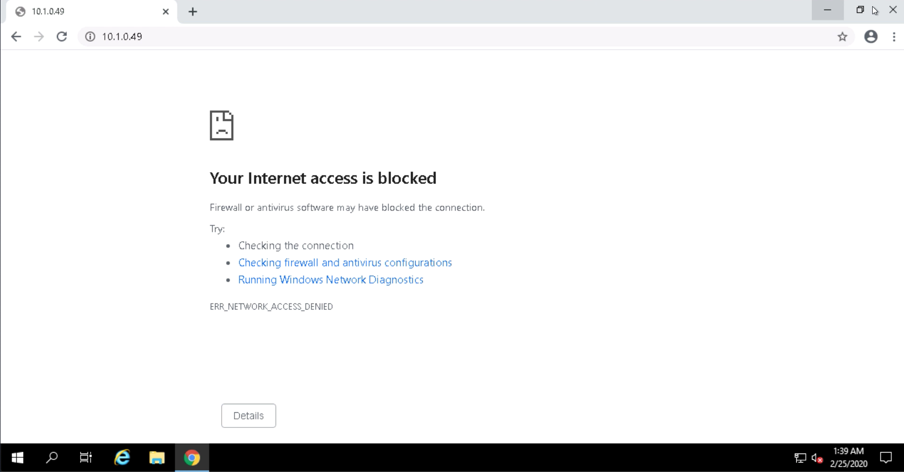</a>  

<a href="#step-026" style="font-weight:bold">Step 026</a>
  

Open a session to the Apache web server.  

<a href="images/module24_026.png">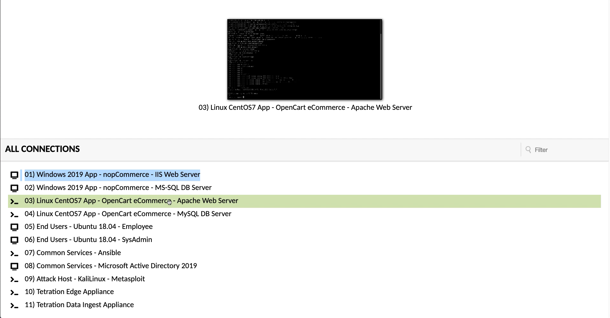</a>  

<a href="#step-027" style="font-weight:bold">Step 027</a>
  

Attempt a connection from the Apache web server to the IIS web server using the curl command.  The connection should time out.

<a href="images/module24_027.png">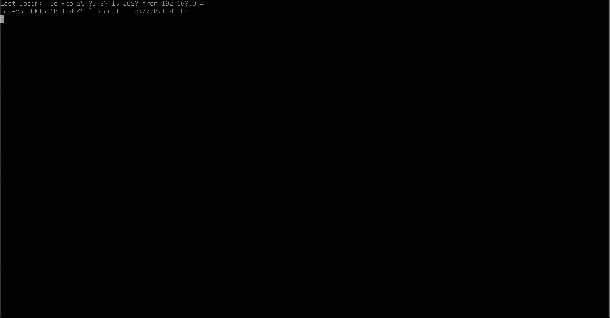</a>  

YOU HAVE FINISHED THIS MODULE

| [Return to Table of Contents](https://tetration.guru/bootcamp/) | [Go to Top of the Page]() | [Continue to the Next Module]() |
