# Cisco Tetration - Hands-On Lab

## Module 07.14  Segmentation - Enforcement - Containers

In this module we will configure the policies and enable enforcement on a microservices web application running in Amazon EKS.  Amazon Elastic Kubernetes Service (EKS) provides a Kubernetes master controller and worker node(s) to deploy containerized applications.  During the lab build process, an EKS cluster was brought up and the application was deployed into Kubernetes.  In this module, we will create an application workspace for the microservices application and define the clusters based on queries using the Kubernetes labels that were configured as part of the application deployment, and that are being brought into Tetration via the External Orchestrator configuration that we performed in <a href="">Module 6</a>. We will then create the policies needed to secure traffic between the multiple tiers of the application,  and enable enforcement.  Finally,  we will test to make sure the application is still functioning once moving into enforcement.  

---
<a href="https://cisco-tetration-hol-content.s3.amazonaws.com/videos/25a_container_policies_and_enforcement.mp4" style="font-weight:bold" title="Container Policy Definition"> Click here to view a video of tasks performed to define policies for a multi-tier microservices appplication.</a>

<a href="https://cisco-tetration-hol-content.s3.amazonaws.com/videos/25b_container_policies_and_enforcement.mp4" style="font-weight:bold" title="Container Policy Enforcement"> Click here to view a video of tasks performed to analyze and enforce the policy for a multi-tier microservices appplication.</a>

---

### Steps for this Module  
<a href="#step-001" style="font-weight:bold">Step 001 - Navigate to Agent Config</a>  
<a href="#step-002" style="font-weight:bold">Step 002 - Click to select the Linux Inventory Filter</a>  
<a href="#step-003" style="font-weight:bold">Step 003 - Edit the Inventory Filter</a>  
<a href="#step-004" style="font-weight:bold">Step 004 - Modify the Query to include Ubuntu</a>   
<a href="#step-005" style="font-weight:bold">Step 005 - Create a new application workspace</a>  
<a href="#step-006" style="font-weight:bold">Step 006 - Create the Sock Shop workspace</a>  
<a href="#step-007" style="font-weight:bold">Step 007 - Create Cluster</a>  
<a href="#step-008" style="font-weight:bold">Step 008 - Edit the Cluster details</a>  
<a href="#step-009" style="font-weight:bold">Step 009 - Create the first cluster</a>  
<a href="#step-010" style="font-weight:bold">Step 010 - Create the additional clusters</a>  
<a href="#step-011" style="font-weight:bold">Step 011 - Add a manual policy</a>  
<a href="#step-012" style="font-weight:bold">Step 012 - Add all policies</a>  
<a href="#step-013" style="font-weight:bold">Step 013 - Test access to the Sock Shop application</a>  
<a href="#step-014" style="font-weight:bold">Step 014 - Navigate to Inventory Search</a>  
<a href="#step-015" style="font-weight:bold">Step 015 - Filter for OS contains Ubuntu</a>  
<a href="#step-016" style="font-weight:bold">Step 016 - Examine Container Policies</a>  
<a href="#step-017" style="font-weight:bold">Step 017 - Navigate to the Sock Shop application</a>  
<a href="#step-018" style="font-weight:bold">Step 018 - Click on Policy Analysis </a>  
<a href="#step-019" style="font-weight:bold">Step 019 - Start Policy Analysis </a>  
<a href="#step-020" style="font-weight:bold">Step 020 - Analyze policies</a>  
<a href="#step-021" style="font-weight:bold">Step 021 - Move the application into enforcement</a>  
<a href="#step-022" style="font-weight:bold">Step 022 - Enforce the latest policy</a>  
<a href="#step-023" style="font-weight:bold">Step 023 - Navigate to Inventory Search</a>  
<a href="#step-024" style="font-weight:bold">Step 024 - Click the link to the EKS worker node</a>  
<a href="#step-025" style="font-weight:bold">Step 025 - Examine the message regarding policies</a>  
<a href="#step-026" style="font-weight:bold">Step 026 - Review Container Policies</a>  
<a href="#step-027" style="font-weight:bold">Step 027 - Filter Container Policies</a>  
<a href="#step-028" style="font-weight:bold">Step 028 - Filter Container Policies</a>  
<a href="#step-029" style="font-weight:bold">Step 029 - Test the application</a>    

<a href="#step-001" style="font-weight:bold">Step 001</a>
  

Rules will be implemented on the EKS worker node that is running Ubuntu.  Previously when we set up the Linux Inventory Filter,  we set it up to match on the CentOS operating system.   We must now modify the filter to include the Ubuntu operating system.  

Navigate to Agent Config.  

<a href="images/module25_001.png">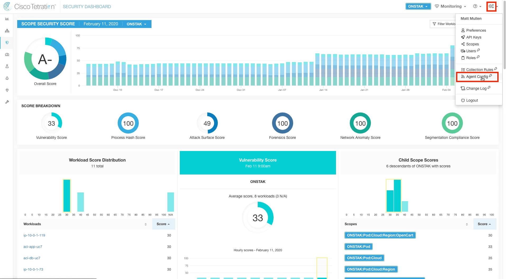</a>  

<a href="#step-002" style="font-weight:bold">Step 002</a>
  

Click on the Linux Inventory Filter.

<a href="images/module25_002.png">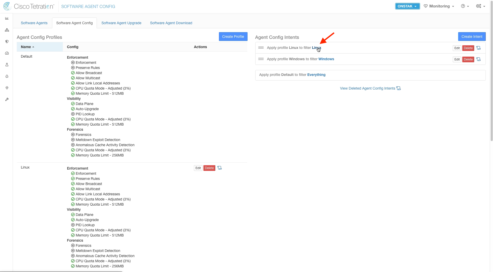</a>  

<a href="#step-003" style="font-weight:bold">Step 003</a>
  

Edit the Inventory Filter.

<a href="images/module25_003.png">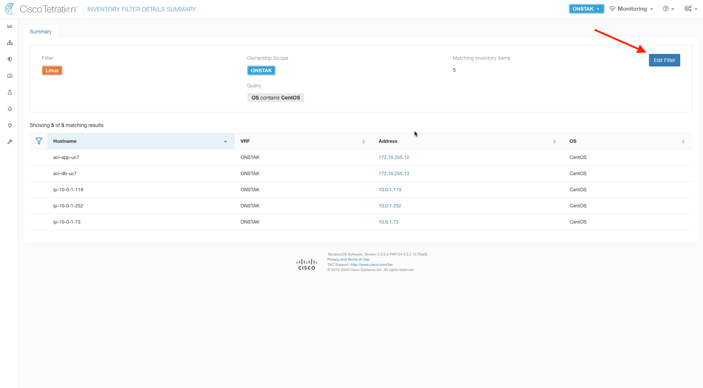</a>  

<a href="#step-004" style="font-weight:bold">Step 004</a>
  

Edit the query by adding the criteria `or OS contains Ubuntu`.

<a href="images/module25_004.png">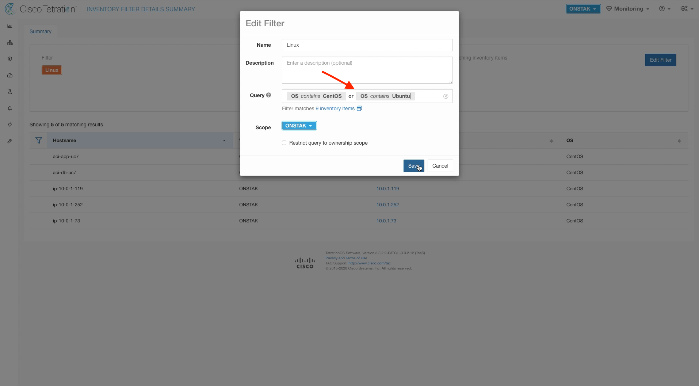</a>  

<a href="#step-005" style="font-weight:bold">Step 005</a>
  

Navigate to Applications and create a new Application Workspace.

<a href="images/module25_005.png">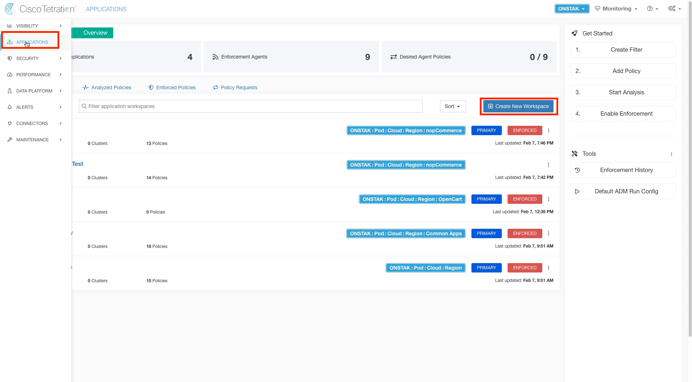</a>  

<a href="#step-006" style="font-weight:bold">Step 006</a>
  

Enter Sock Shop for the name of the workspace, and select the SockShop scope.

<a href="images/module25_006.png">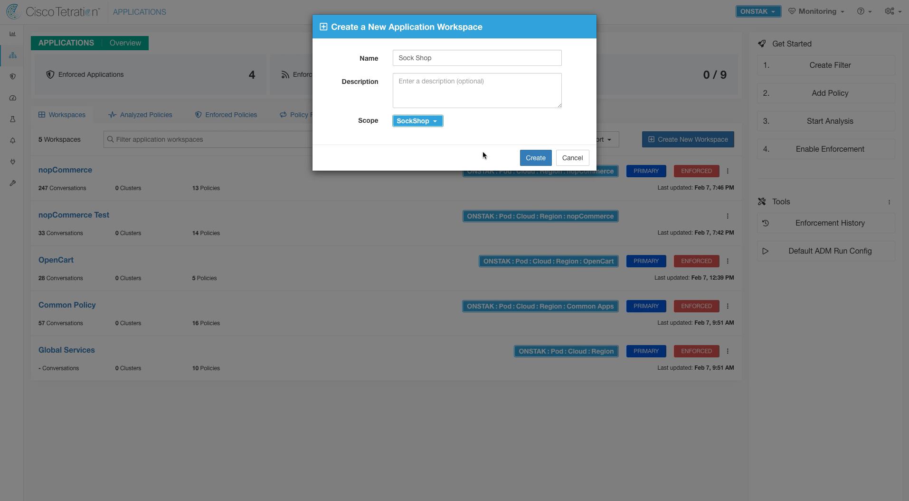</a>  

<a href="#step-007" style="font-weight:bold">Step 007</a>
  

Click on the Clusters tab and then add a new cluster.  

<a href="images/module25_007.png">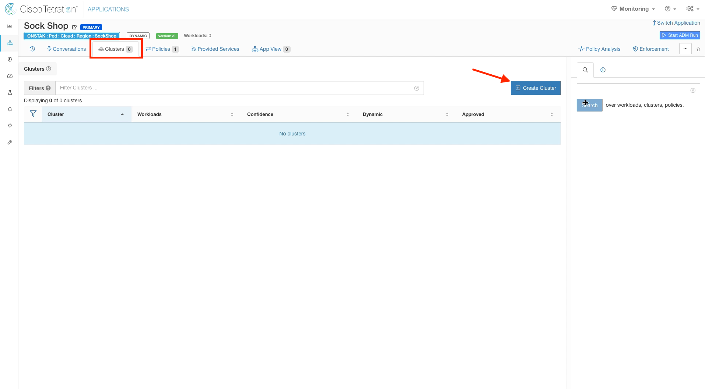</a>  

<a href="#step-008" style="font-weight:bold">Step 008</a>
  

Edit the created cluster.

<a href="images/module25_008.png">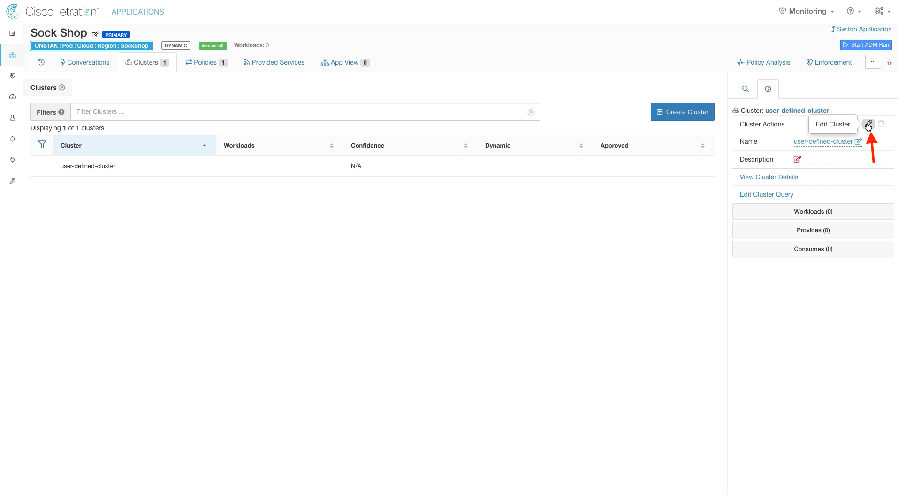</a>  

<a href="#step-009" style="font-weight:bold">Step 009</a>
  

Enter the name `Carts` and query `* orchestrator_AppCluster = carts`.

<a href="images/module25_009.png">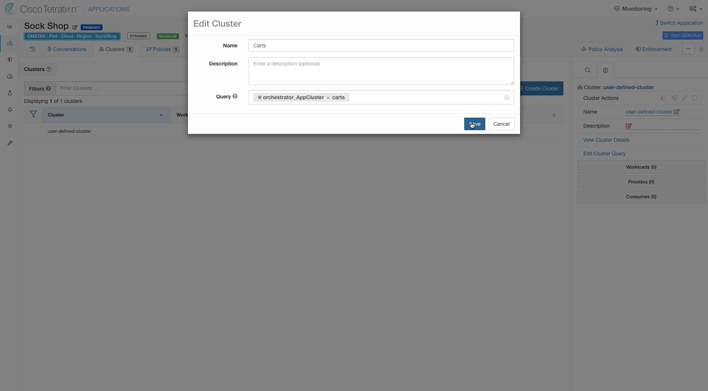</a>  

<a href="#step-010" style="font-weight:bold">Step 010</a>
  

Create the rest of the clusters as shown below.  

Name: `Carts DB`, Query: `orchestrator_AppCluster = carts-db`  
Name: `Catalogue`, Query: `orchestrator_AppCluster = catalogue`  
Name: `Catalogue DB`, Query: `orchestrator_AppCluster = catalogue-db`  
Name: `Front End`, Query: `orchestrator_AppCluster = front-end`  
Name: `Orders`, Query: `orchestrator_AppCluster = orders`  
Name: `Orders DB`, Query: `orchestrator_AppCluster = orders-db`  
Name: `Payment`, Query: `orchestrator_AppCluster = payment`   
Name: `Queue Master`, Query: `orchestrator_AppCluster = queue-master`  
Name: `RabbitMQ`, Query: `orchestrator_AppCluster = rabbitmq`  
Name: `Shipping`, Query: `orchestrator_AppCluster = shipping`  
Name: `User`, Query: `orchestrator_AppCluster = user`  
Name: `User DB`, Query: `orchestrator_AppCluster = user-db`

<a href="images/module25_010.png">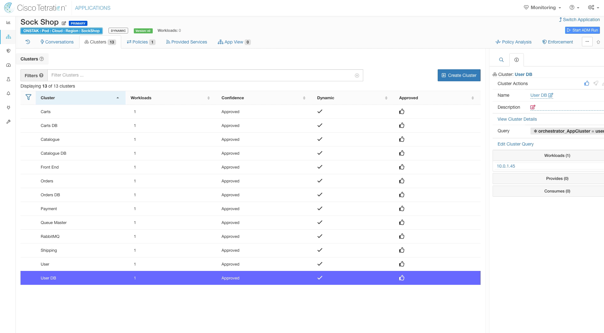</a>  

<a href="#step-011" style="font-weight:bold">Step 011</a>
  

Click on Policies and Add a Manual Policy.

<a href="images/module25_011.png">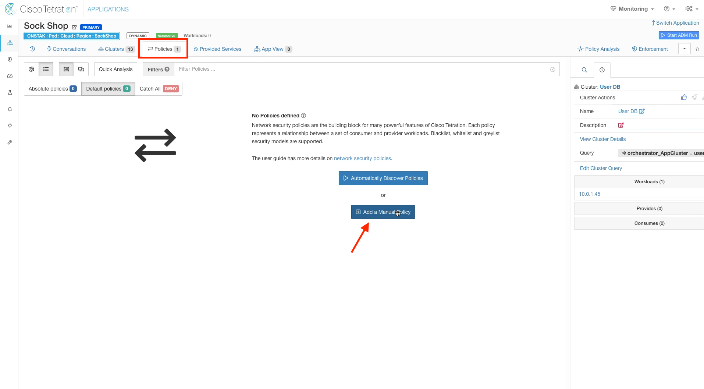</a>  

<a href="#step-012" style="font-weight:bold">Step 012</a>
  

Enter the policies as shown in the image below.

<a href="images/module25_012.png">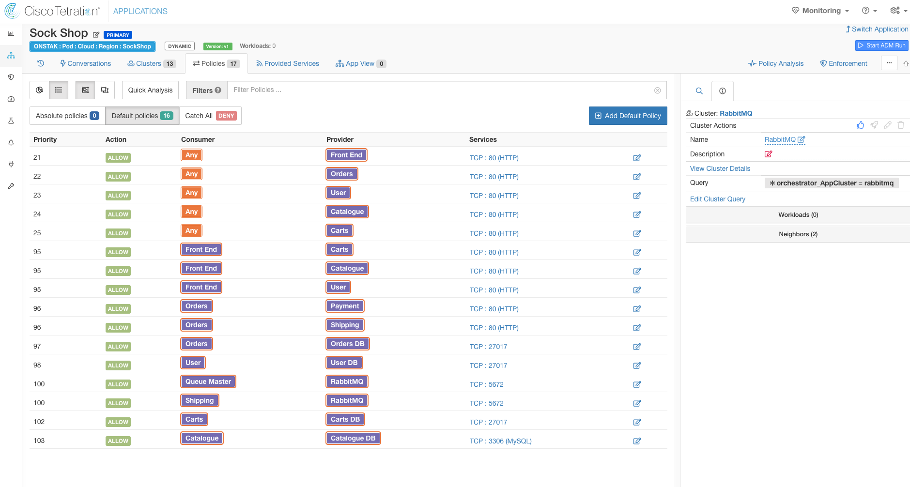</a>  

<a href="#step-013" style="font-weight:bold">Step 013</a>
  

Open a web browser to the EKS Sock Shop public URL as listed in the student workbook. This is a microservices application that is deployed into Kubernetes.  Navigate around the site to ensure all is working properly before we go into enforcement.  Register as a new user, and go through the process of buying some socks.  

<a href="images/module25_013.png">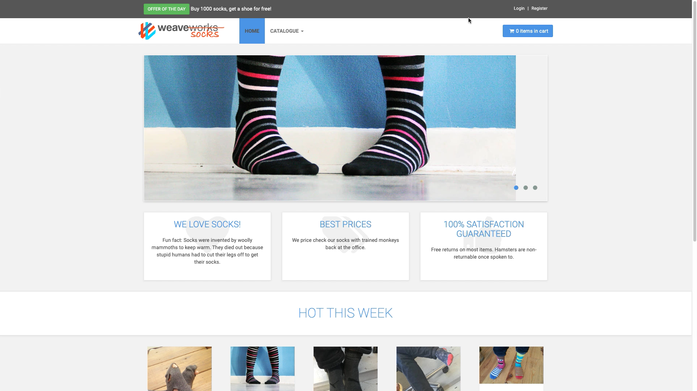</a>  

<a href="#step-014" style="font-weight:bold">Step 014</a>
  

Navigate to Inventory Search.  

<a href="images/module25_014.png">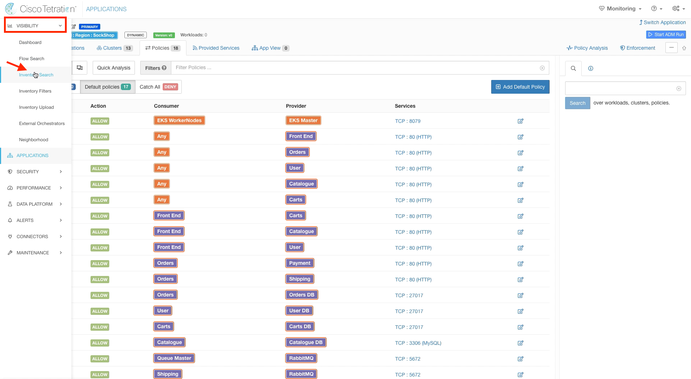</a>  

<a href="#step-015" style="font-weight:bold">Step 015</a>

Search for `OS contains Ubuntu`.  Your EKS worker node should be listed.  Click on the IP address to enter the Workload Profile.  

<a href="images/module25_015.png">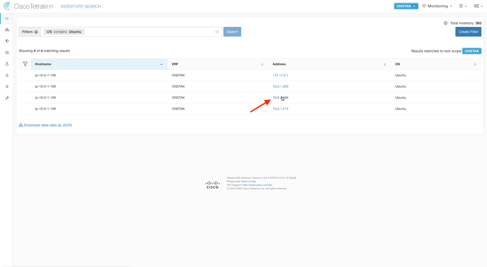</a>  

<a href="#step-016" style="font-weight:bold">Step 016</a>
  

Click on Container Policies, and note the number of displayed policies. Kubernetes heavily leverages iptables rules, hence the large number of rules already present.  

<a href="images/module25_016.png">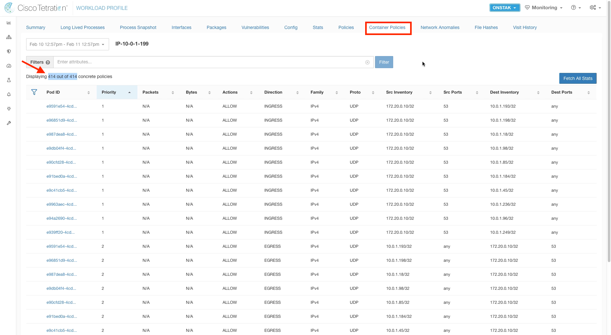</a>  

<a href="#step-017" style="font-weight:bold">Step 017</a>
  

Navigate to the Sock Shop application workspace.  

<a href="images/module25_017.png">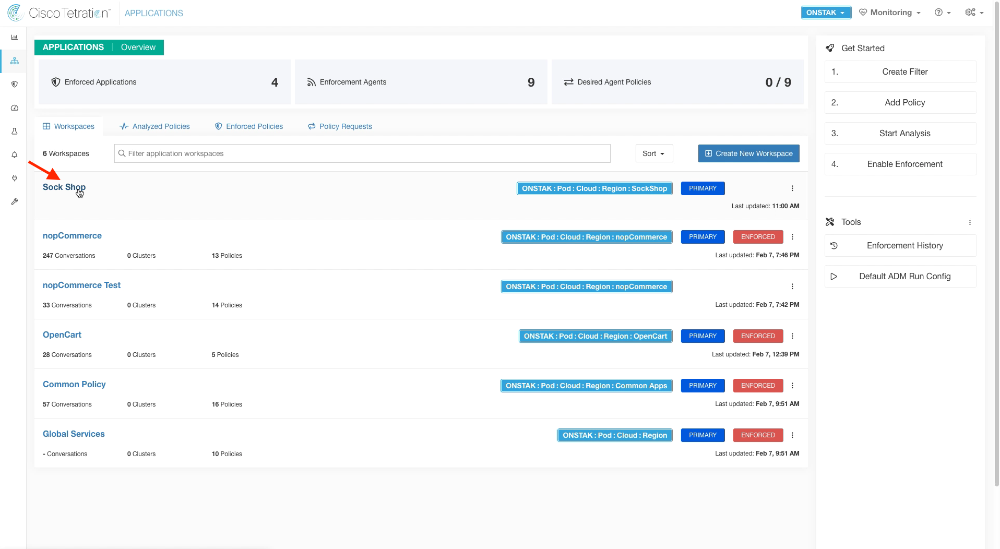</a>  

<a href="#step-018" style="font-weight:bold">Step 018</a>
  

Click on the Policy Analysis tab.  

<a href="images/module25_018.png">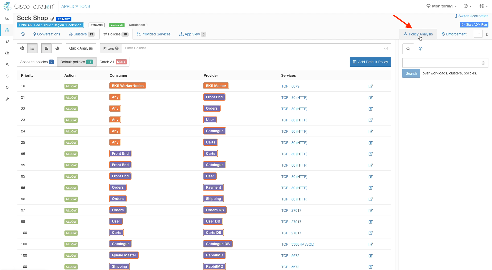</a>  

<a href="#step-019" style="font-weight:bold">Step 019</a>
  

Start Policy Analysis.  

> We can't actually do Policy Analysis for the Sock Shop application because Tetration does not currently have the ability to see traffic between pods of a containerized application.  We could have enforced the latest policies without enabling Policy Analysis,  however it is best practice to always analyze the latest policies prior to enforcing a new revision of policies.    

<a href="images/module25_019.png">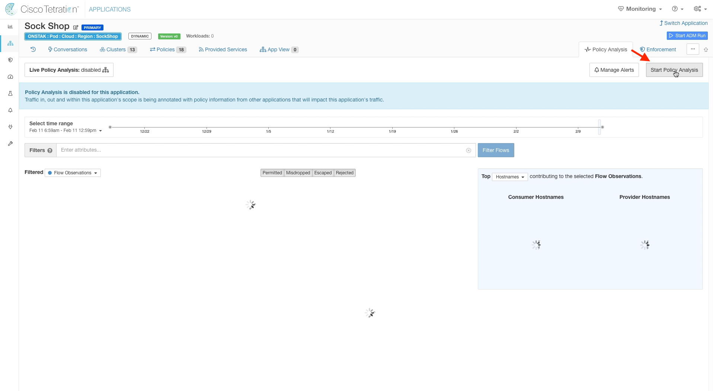</a>  

<a href="#step-020" style="font-weight:bold">Step 020</a>
  

Click on Analyze.  

<a href="images/module25_020.png">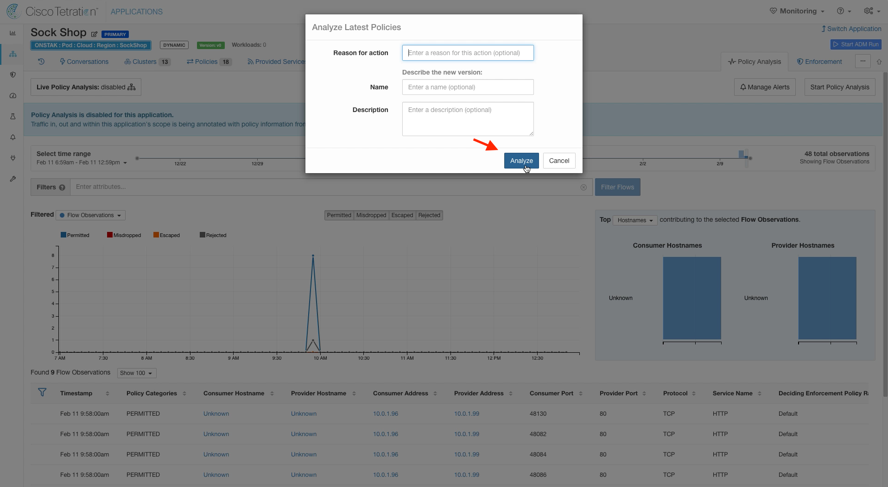</a>  

<a href="#step-021" style="font-weight:bold">Step 021</a>
  

Click on the Enforcement tab, and select Enforce Policies.

<a href="images/module25_021.png">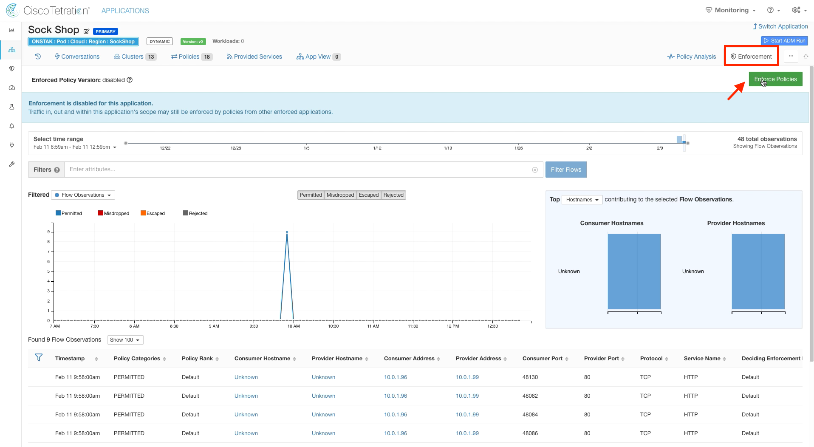</a>  

<a href="#step-022" style="font-weight:bold">Step 022</a>
  

Click Accept and Enforce.  

<a href="images/module25_022.png">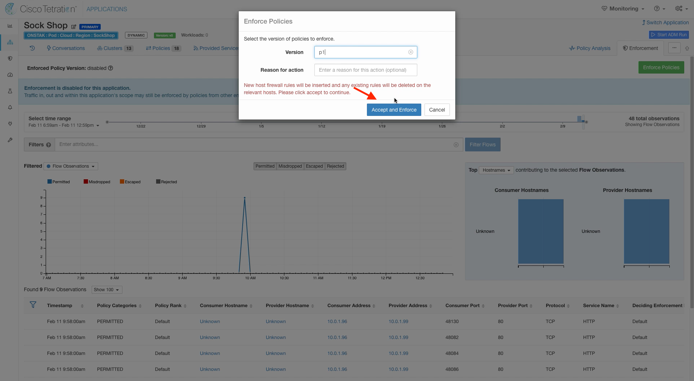</a>  

<a href="#step-023" style="font-weight:bold">Step 023</a>
  

Navigate to Inventory Search.

<a href="images/module25_023.png">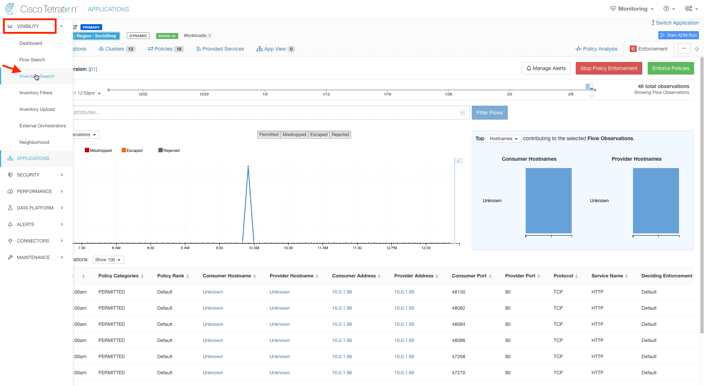</a>  

<a href="#step-024" style="font-weight:bold">Step 024</a>
  

Filter for `OS contains Ubuntu` and click on the Kubernetes worker node IP address.

<a href="images/module25_024.png">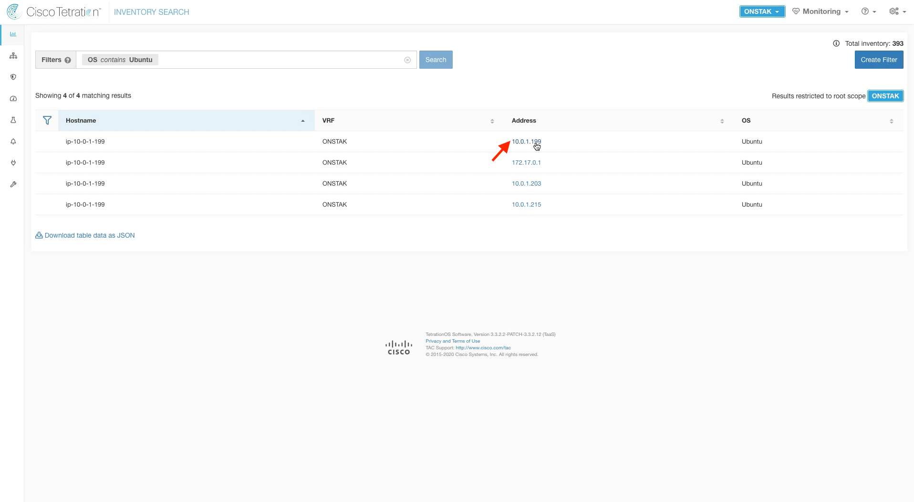</a>  

<a href="#step-025" style="font-weight:bold">Step 025</a>
  

The message "Provisioned Policies are different from Desired Policies". This is a transient condition that occurs when new policies have been enforced, but they have not yet been implemented on the workload iptables or Windows Firewall rules.  This usually occurs within 60 seconds of enforcement.  

<a href="images/module25_025.png">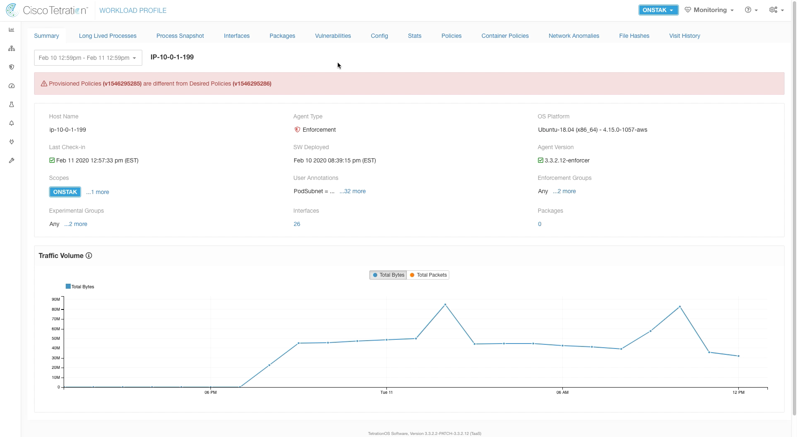</a>  

<a href="#step-026" style="font-weight:bold">Step 026</a>

Click on Container Policies.  In a few minutes, the number of displayed policies should have increased from the number we saw earlier.    

<a href="images/module25_026.png">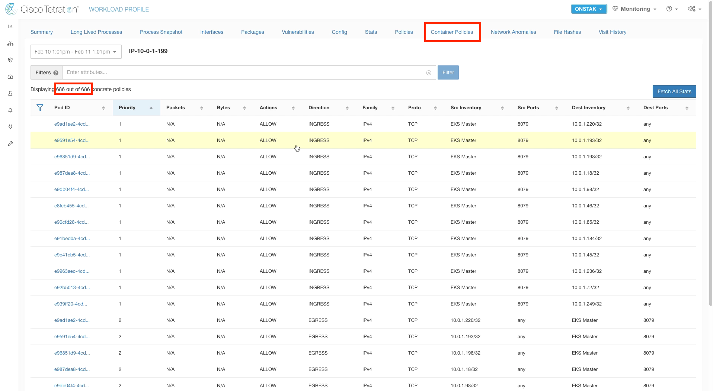</a>  

<a href="#step-027" style="font-weight:bold">Step 027</a>
  

Filter for the Carts pod by entering the filter `Src Inventory = Carts`.  This displays rules where the Carts cluster is the source.

<a href="images/module25_027.png">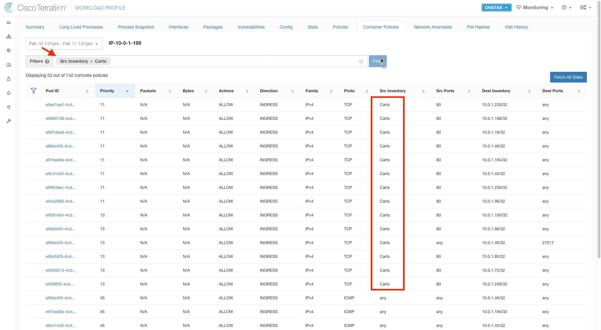</a>  

<a href="#step-028" style="font-weight:bold">Step 028</a>

 Enter another filter `Src Inventory = Front End`. This filters for rules that are associated with the Front End web interface of the application.  

<a href="images/module25_028.png">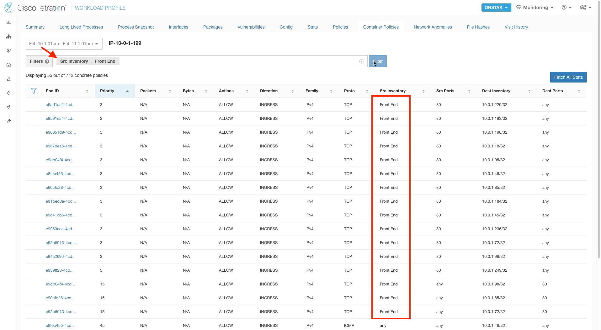</a>  

<a href="#step-029" style="font-weight:bold">Step 029</a>
  

Open a web browser once again to the Sock Shop public URL and refresh the page.  Walk through the same tests done previously to ensure the site is still working. Create a user, and order some socks.  Tetration is now managing the security between the different tiers of this microservices application.  

<a href="images/module25_029.png">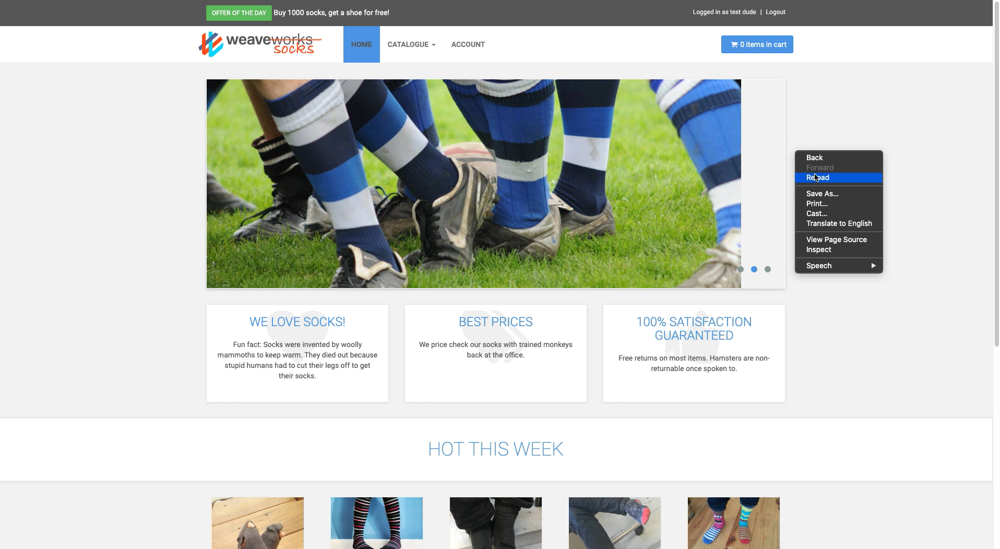</a>  

YOU HAVE COMPLETED THIS MODULE

| [Return to Table of Contents](https://tetration.guru/bootcamp/) | [Go to Top of the Page]() | [Continue to the Next Module]() |
