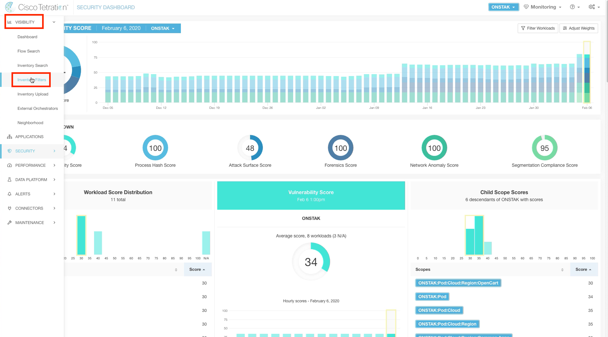
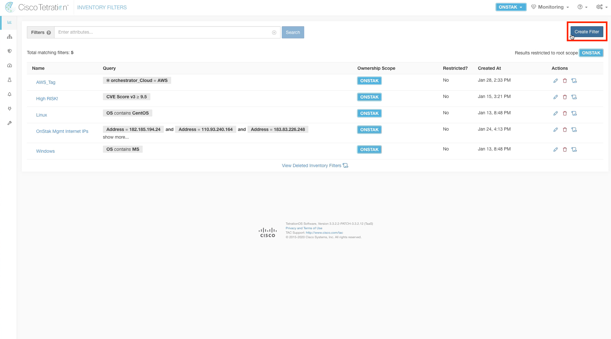
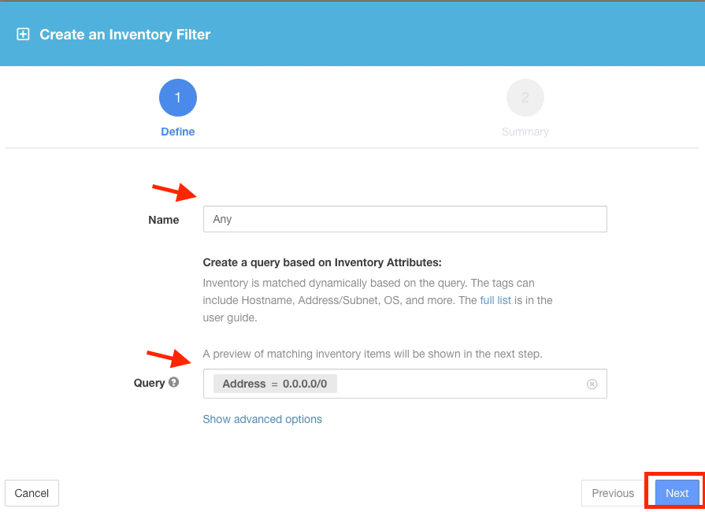
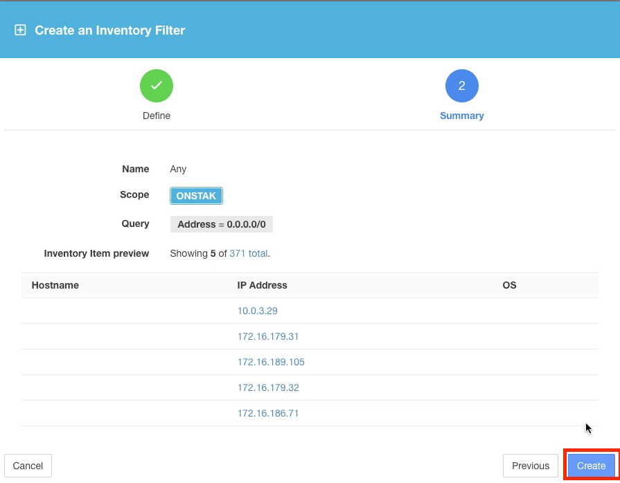
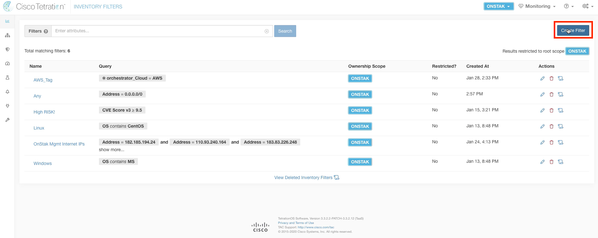
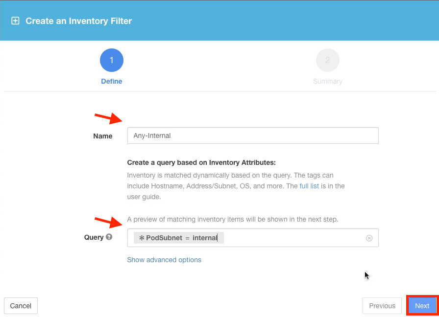
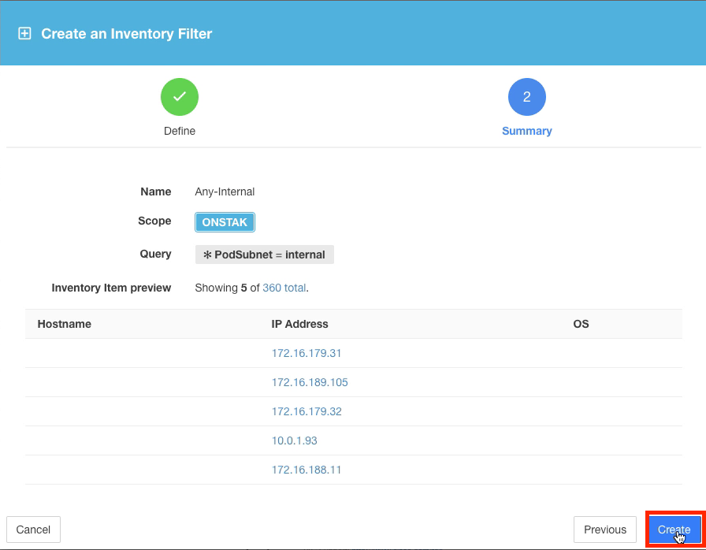
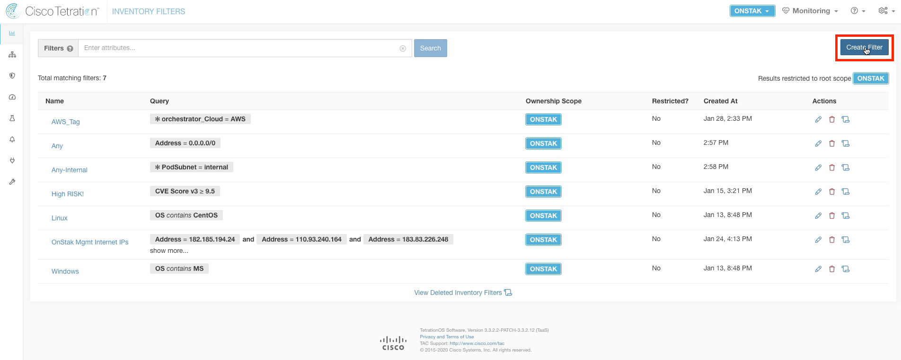
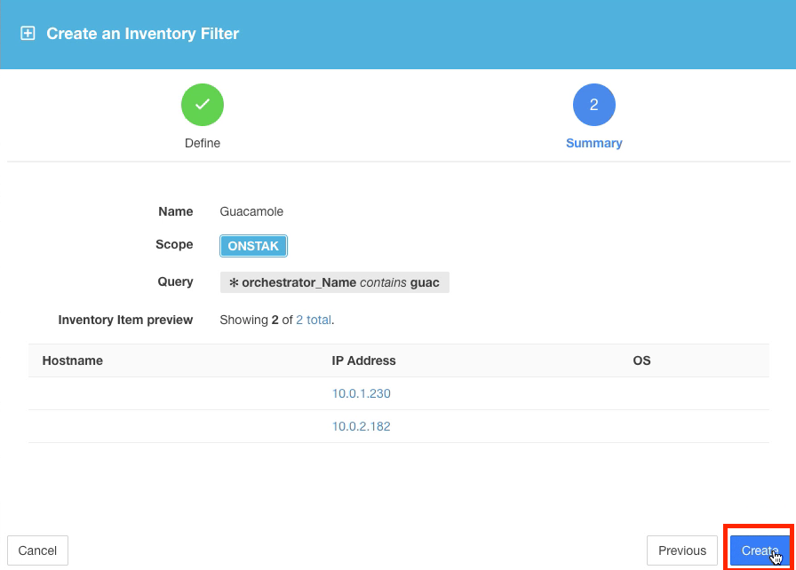

# Cisco Tetration Virtual Bootcamp

## Module 07.00  Segmentation - Inventory Filters

Inventory Filters provide a way to describe a group of endpoints as an object for easy  identification when used within policy and other areas of the system. For example, earlier in the lab when creating Agent Config Intents we created Inventory Filters that matched all Windows and Linux machines by matching on the Operating System.  This was done by creating a query that matched on the Operating System reported by the agent.  Inventory Filter queries can match on annotations, tags being received from the various External Orchestrators, inventory characteristics such as Operating System,  or security characteristics such as CVE score. This allows the administrator great flexibility when building policy.  

In this module we will create Inventory Filters that will be used in later modules to build our policies.   

---
<a href="https://cisco-tetration-hol-content.s3.amazonaws.com/videos/11_policy_creation_inventory_filters.mp4" style="font-weight:bold" title="Collection Rules Title"> Click here to view a video to create a few key Inventory Filters.</a>

---
### Steps for this Module  
<a href="#step-001" style="font-weight:bold">Step 001 - Navigate to Inventory Filters</a>  
<a href="#step-002" style="font-weight:bold">Step 002 - Create a new Inventory Filter</a>  
<a href="#step-003" style="font-weight:bold">Step 003 - Create Inventory Filter for Any</a>  
<a href="#step-004" style="font-weight:bold">Step 004 - View query results</a>  
<a href="#step-005" style="font-weight:bold">Step 005 - Create a new Inventory Filter</a>  
<a href="#step-006" style="font-weight:bold">Step 006 - Create Inventory Filter for Any-Internal</a>  
<a href="#step-007" style="font-weight:bold">Step 007 - View query results</a>  
<a href="#step-008" style="font-weight:bold">Step 008 - Create a new Inventory Filter</a>  
<a href="#step-009" style="font-weight:bold">Step 009 - Create Inventory Filter for Guacamole server</a>  
<a href="#step-010" style="font-weight:bold">Step 010 - View query results</a>  

---

<a href="#step-001" style="font-weight:bold">Step 001</a>
  

Navigate to Inventory Filters.

  

<a href="#step-002" style="font-weight:bold">Step 002</a>
  

Click on Create Filter.

  

<a href="#step-003" style="font-weight:bold">Step 003</a>
  

Create the filter named Any with the query Address = 0.0.0.0/0.  This will match any IPv4 address.

  

<a href="#step-004" style="font-weight:bold">Step 004</a>
  

Examine the query results.  The query will return all of the IP addresses that have been learned by Tetration and stored in inventory.

> The number of inventory items shown in the image may differ.  This is because endpoints in inventory are learned based on traffic that is reported into the cluster by the agents.

  

<a href="#step-005" style="font-weight:bold">Step 005</a>
  

Click Create Filter to create the next Inventory Filter.  

  

<a href="#step-006" style="font-weight:bold">Step 006</a>
  

Create a filter named Any-Internal with the query *PodSubnet = internal.  This will match the static annotation entries that we uploaded previously which describe the internal IP address space of the lab.  In this case it is all RFC1918 private IP address space - 10.0.0.0/8,  172.16.0.0/12, and 192.168.0.0/16.

  

<a href="#step-007" style="font-weight:bold">Step 007</a>
  

Observe the query results and then create the filter.

  

<a href="#step-008" style="font-weight:bold">Step 008</a>
  

Click Create Filter to create another Inventory Filter.

  

<a href="#step-009" style="font-weight:bold">Step 009</a>
  

Create the filter named Guacamole with query * orchestrator_Name contains guac.  This will match an AWS tag placed on the Apache Guacamole instance.   

> Apache Guacamole is the dashboard that you will be connecting to in order to gain access to the consoles of the servers. We will later use the Inventory Filter created here in our policy definition to ensure that the Guacamole server can access the rest of the workloads using SSH and RDP. It provides an easy way to refer to the server without having to remember its IP address or hostname.  We could also add additional Guacamole servers with the AWS tag,  and they would automatically be grouped into this filter and automatically inherit any rules that are using the Inventory Filter.

  

<a href="#step-010" style="font-weight:bold">Step 010</a>
  

The query matches only the internal IP of the Guacamole server.  Click Create.  

> The Guacamole server has both an external public IP which is indicated in your lab information under "Web Console URL", and an internal IP which is the one shown here.  

  

You have completed this module.

| [Return to Table of Contents](https://tetration.guru/bootcamp/) | [Go to Top of the Page](README.md) | [Continue to the Next Module](../module_08/) |