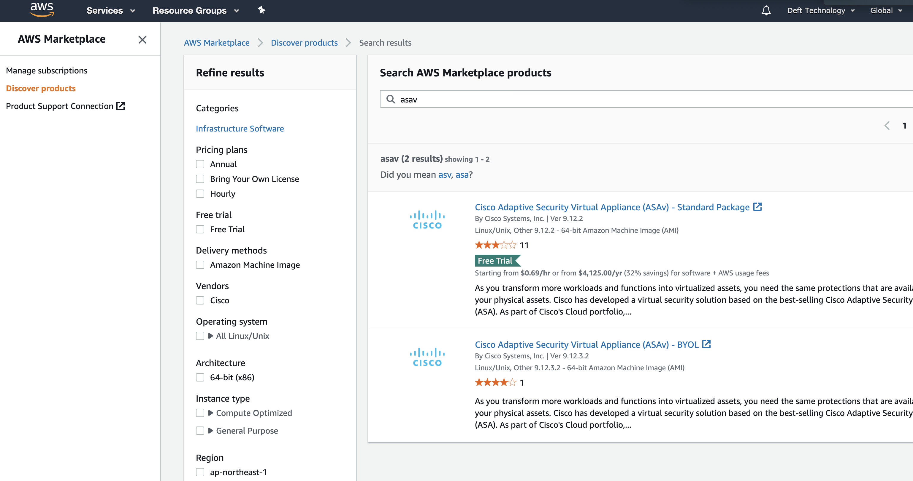
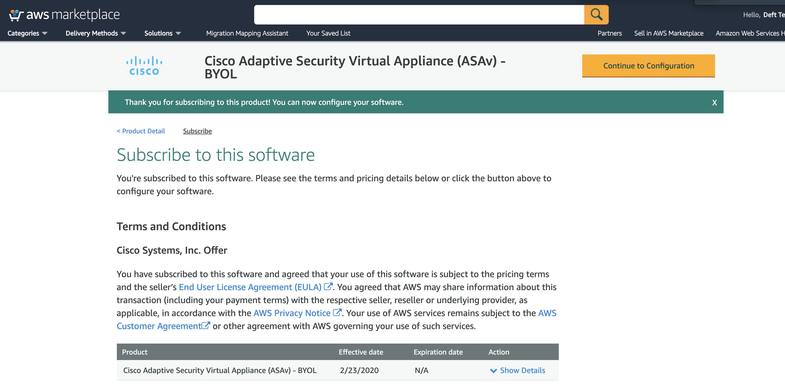

# Cisco Tetration Virtual Bootcamp

## (DO FIRST>> right-click above "View on GitHub" and Open in a new tab/window)
 
## Lab Environment Deployment

This lab environment build deploys entirely to AWS with the current unique exception of Cisco ISE, which requires deployment to an on-prem vCenter environment with a VPN connection and route table addition. Note importantly that this lab-build DOES NOT deploy any type of instance(s) for the Tetration cluster itself (TaaS/Tetration-V, etc), and ONLY deploys that which you see below in the "Complete Lab Diagram" inside of the "AWS Cloud" box with the already noted exception of ISE, as well as the exception of the necessary AMIs, which must be copied from Deft's AWS account and is detailed below in the next sub-section.  
  
It is REQUIRED that you have your own instance of Tetration, whether On-Prem, Tet-V, or TaaS makes no difference, only that you have one provisioned. This instance of Tetration does not require provisioning prior to the deployment of this lab environment, however this lab environment won't do you much good without Tetration. 

<a href="https://app.lucidchart.com/documents/view/425e1b97-194e-413a-b793-0df939a87501" style="font-weight:bold" target="_blank">"Complete Lab Diagram"  
</a>  


#### AMIs Required Prior to AWS Lab Environment Deployment

There are a number of AMIs that will be copied from Deft's AWS account in the Ohio region (us-east-2) prior to being able to deploy this lab environment to AWS successfully.  

From the AWS Console,  navigate to the EC2 service and change to the `us-east-2` region (Ohio).  Then select AMIs and change the view to "Private Images". If the AMIs listed below are not listed, <a href="https://github.com/deftcon/Tetration-Virtual-Bootcamp/issues/1" target="_blank">please open an issue on GitHub similar to this one</a>. 
  
ldap_ami: ami-0f7a08583b3138159     
mssql_ami: ami-09782396834215732  
iis_ami: ami-091df3f67b36e2250  
tet_data_ami: ami-0cf7fd4e75d7d91ab  
tet_edge_ami: ami-05d08946ffda72d18  
employee_ubuntu_ami: ami-0af925e340025c9f9  
sysadmin_ubuntu_ami: ami-0af925e340025c9f9  
mysql_ami: ami-051ba5822fc02da4b   
apache_ami: ami-0c85d8851d66cd9f9  
ansible_ami: ami-0083b10a007c92d2d  
guacamole_ami: ami-007f96a1ed0595540 
attack_server_ami: ami-04f958d48e22e185c  
mysql_ami: ami-051ba5822fc02da4b  
attack_server_ami: ami-04f958d48e22e185c

For a few of the images, you must Subscribe to use them in AWS Marketplace before they can be launched.  Please follow the links below and proceed to "Continue to Subscribe".   

https://aws.amazon.com/marketplace/pp?sku=89bab4k3h9x4rkojcm2tj8j4l  
https://aws.amazon.com/marketplace/pp?sku=aw0evgkw8e5c1q413zgy5pjce  
https://aws.amazon.com/marketplace/pp/B00WRGASUC  

Once you are subscribed to the above products,  a script called `ami_create.py` can be run to create new image files in your account and optionally copy them to another region. The script automates the process of creating the AMIs and populates the AMI IDs into the `parameters.yml` file which will later be used to launch all of the instances.  

`ami_create.py` requires Python 3.7 as well as the boto3 and pyyaml packages which can be installed by executing the following commands:

```
pip install boto3
pip install pyyaml
```

The script can then be run with the below command.  The region command-line argument is optional, and if omitted the AMIs will be created in the us-east-2 region.  If you plan to run the lab from an AWS region other than us-east-2, specify `--region` followed by the region name to have the AMIs copied to the destination region. 

```
python ami_create.yml --region us-east-1
```

   --- WORK IN PROGRESS BELOW ---


  

<a href="#step-001" style="font-weight:bold">Failed Launch - Navigate to URI and accept subscription:</a>  
<a href="images/admin_001.png"></a>  
  


<div class="step" id="step-002"><a href="#step-002" style="font-weight:bold">Step 002</a></div>  

<a href="images/admin_002.png"></a>  
  


<div class="step" id="step-003"><a href="#step-003" style="font-weight:bold">Step 003</a></div>  

<a href="images/admin_003.png"></a> 

asav_ami: ami-0f3cca6491d987102   # << This is the ASAv, is a region-specific image ID, and requires a subscription from AWS Marketplace (search for ASAv BYOL)  


<div class="step" id="step-004"><a href="#step-004" style="font-weight:bold">Step 004</a></div>  

<a href="images/admin_004.png"></a>  
  


<div class="step" id="step-005"><a href="#step-005" style="font-weight:bold">Step 005</a></div>  

<a href="images/admin_005.png"></a>  
  


<div class="step" id="step-006"><a href="#step-006" style="font-weight:bold">Step 006</a></div>  

<a href="images/admin_006.png"></a>  
  


<div class="step" id="step-007"><a href="#step-007" style="font-weight:bold">Step 007</a></div>  

<a href="images/admin_007.png"></a>  
  


<div class="step" id="step-008"><a href="#step-008" style="font-weight:bold">Step 008</a></div>  

<a href="images/admin_008.png"></a>  
  


<div class="step" id="step-009"><a href="#step-009" style="font-weight:bold">Step 009</a></div>  

<a href="images/admin_009.png"></a>  
  


<div class="step" id="step-010"><a href="#step-010" style="font-weight:bold">Step 010</a></div>  

<a href="images/admin_010.png"></a>  
  


<div class="step" id="step-011"><a href="#step-011" style="font-weight:bold">Step 011</a></div>  

<a href="images/admin_011.png"></a>  
  
  
  
#### Files Required to Deploy to AWS

Deployment of the environment for lab pod(s) requires the use of three files - namely: `parameters.yml`, `cisco-hol-pod-cft-template.yml`, and `launch.py`. 


`launch.py` reads in the parameters unique to each deployment set from `parameters.yml`, then executes one entire deployment of `cisco-hol-pod-cft-template.yml` per number of `student_count` found in `parameters.yml`. Student count begins with `00` and thus we recommend designating the first pod for the lab admin/instructor as a pristene deployment for use in demoing or troubleshooting any issues an actual student might for some reason encounter, and allowing the first student to be the second pod, which would begin with the numbering `01`. 


#### Parameters File Example

Below is an example of a `parameters.yml` file, however with additional inline commented markup, which can also be found in the directory `parameters-templates` under the name `parameters-example.yml`. The inline comments should be fairly self-explanatory, although much will be parsed out and explained following the example file. 


```yaml
---
# Prefer using Env Vars to set AWS Access & Secret Keys named as such:
# AWS_ACCESS_KEY_ID
# AWS_SECRET_ACCESS_KEY 
aws_access_key: 
aws_secret_key: 
aws_region: us-east-2   # << This is the region where you will deploy the lab pods to. Currently only one deployment set per region is supported.

student_count: 1   # << Number of pods to deploy. First pod starts with 00, so recommendation is to deploy 1 more pod than needed and use first for admin/instructor pod
student_prefix: cisco-student 

vpc_id: vpc-017dd7e8fc4a4b9de   # << This is your existing VPC in the above-mentioned AWS region where you will deploy the lab pods to
internet_gateway_id: igw-0dbfdfc228666cee0   # << This IGW needs to exist already in the above VPC
subnet_range_primary: 10.0.0.0/16   # << This will be the "Internal" subnet (inside the ASA FW) for most workloads, including apps
subnet_range_secondary: 198.18.0.0/16   # << This will be the "Internet" subnet (outside the ASA FW) for users and attacker

s3_bucket: tetration-hol-cft-template   # << S3 Bucket is global DNS unique name - change to any arbitrary desired non-overlapping name

ise_server_ip: 172.16.171.49   # << This is your own private on-prem ISE instance - needs VPN with AWS VGW

asav_ami: ami-0f3cca6491d987102   # << This is the ASAv, is a region-specific image ID, and requires a subscription from AWS Marketplace (search for ASAv BYOL)
ldap_ami: ami-0b416df717b448667   # << This is for MS Active Directory and is a private image that requires a simple copy
mssql_ami: ami-09782396834215732   # << This is for MS Win19 SQL and is a private image that requires a simple copy
iis_ami: ami-091df3f67b36e2250   # << This is for MS Win19 IIS and is a private image that requires a simple copy
mysql_ami: ami-051ba5822fc02da4b   # <<  This is for CentOS7 MySQL and is a private image that requires launch from shared AMI, you to Accept Subscription, then create the AMI
apache_ami: ami-0c85d8851d66cd9f9   # <<  This is for CentOS7 Apache and is a private image that requires launch from shared AMI, you to Accept Subscription, then create the AMI
ansible_ami: ami-0083b10a007c92d2d   # << This is for CentOS7 Ansible and is a private image that requires launch from shared AMI, you to Accept Subscription, then create the AMI
tet_data_ami: ami-0cf7fd4e75d7d91ab   # << This is the Tetration Data Ingest appliance and is a private image that requires a simple copy
tet_edge_ami: ami-05d08946ffda72d18   # << This is the Tetration Edge appliance and is a private image that requires a simple copy
employee_ami: ami-032ca0586c1a78e1d   # << This is the Win10 image for both Employee and SysAdmin and is a private image that requires a simple copy, however due to licensing reboots every hour - will likely be removed
sysadmin_ami: ami-032ca0586c1a78e1d   # << Simple AMI copy but most likely remove
employee_ubuntu_ami: ami-0af925e340025c9f9   # << This is the Ubuntu 18.04 desktop image for both Employee and SysAdmin and is a private image that requires a simple copy
sysadmin_ubuntu_ami: ami-0af925e340025c9f9   # << Simple AMI copy 
attack_server_ami: ami-04f958d48e22e185c   # << This is for Ubuntu Kali Linux with Metasploit and is a private image that requires launch, you to Accept Subscription, then create the AMI
guacamole_ami: ami-007f96a1ed0595540   # << This is for CentOS7 Guacamole and is a private image that requires launch from shared AMI, you to Accept Subscription, then create the AMI
eks_worker_ami: ami-0c4c60006aa81c29b   # << Global AWS Marketplace - will change with region - https://cloud-images.ubuntu.com/docs/aws/eks/

```

#### Requirements / Dependencies

It is important to note that prior to running `launch.py`, you must have a few things already created in your AWS environment - namely a VPC, an IGW, and a S3 bucket.
1. VPC: This probably goes without saying, but we recommend a non-default VPC. Place your VPC ID in `parameters.yml` in the `vpc_id:` line (no quotes surounding the value). This VPC must have at least two CIDR blocks, one for `subnet_range_primary` and one for `subnet_range_secondary`. It is important that **no** subnets be created in this VPC whatsoever, else the script will error out. `launch.py` will create the subnets and we have a brief discussion about them below. 
2. IGW: You must have one IGW created in your `vpc_id` and designated in the `parameters.yml` in the `internet_gateway_id:` lin (no quotes surounding the value).
3. S3 Bucket: Due to the size of the CFT, AWS requires that we first upload it to an S3 bucket prior to calling it and executing against it. It is required that you have already created the empty S3 bucket and placed the name of the bucket in the `parameters.yml` in the `s3_bucket:` line (no quotes surounding the value).
4. Two (2) Elastic IPs per student pod. These must be already *allocated* to your region, but not yet *assigned* to any ENIs. This requirement exists due to AWS not allowing a Public IP to be assigned to any EC2 instance with more than a single ENI. There are currently three instances that have multiple ENIs, including Guacamole, Tet Data Ingest, and ASAv. Guac requires one so that students can access the environment from the public internet, and Tet Data Ingest requires the ability to communicate out to the internet to reach the TaaS cluster. ASAv only communicates internally, even if you have ISE running on-prem, assuming you have a VGW back to your CGW. If you need ASAv to speak externally, there is some code that can be uncommented in the `cisco-hol-pod-cft-template.yml` file. 

> NOTE: By default, [AWS limits you to five (5) Elastic IPs per region](https://docs.aws.amazon.com/general/latest/gr/vpc-service.html#w571aab9d325b7b3b5){:target="_blank"}. If you plan to deploy more than two (2) student pods, you will need to [submit a request for service quota increase](https://console.aws.amazon.com/support/home?#/case/create?issueType=service-limit-increase&limitType=vpc){:target="_blank"}. 


#### Subnets

A quick discussion on subnets to be created at launch time is in order. This VPC must have at least two CIDR blocks, one for `subnet_range_primary` and one for `subnet_range_secondary`.


The `subnet_range_primary` and `subnet_range_secondary` field both require that you give them /16 address space. This is due to the fact that for every student pod to be created, the third octet will be used to indicate the student index #. 

Also due to AWS strict requirement that there be at least two subnets available in order to spin up an EKS cluster, there will be two subnets created in `subnet_range_primary` per student - one will begin at the base and the other will be calculated to begin much higher, so that each subnet's third octet should (for the most part) follow the student numbering index value. 

Say you chose `10.0.0.0/16` as your primary range, and `198.18.0.0/16` as your secondary. You could expect to see three subnets generated, only the first two of which would ever be populated with any workloads. 

##### Examples:

**_Student 1_**
* 10.0.1.0/24    < "Internal / Corporate" workload subnet (Inside ASAv)
* 198.18.1.0/24  < "External / Internet" workload subnet (Outside ASAv)
* 10.0.128.0/24  < not used, simply required by AWS

**_Student 2_**
* 10.0.2.0/24    < "Internal / Corporate" workload subnet (Inside ASAv)
* 198.18.2.0/24  < "External / Internet" workload subnet (Outside ASAv)
* 10.0.129.0/24  < not used, simply required by AWS


> Note that the default subnet value for the secondary range is `198.18.0.0/16` and was chosen specifically becuase it both represented a "real internet, non-RFC1918 IP range", and also that it falls in the *'Reserved'* range, specifically that "This block has been allocated for use in benchmark tests of network interconnect devices" per [RFC5735](https://tools.ietf.org/html/rfc5735){:target="_blank"}. It could initially be argued that a range such as `198.51.100.0/24` or `203.0.113.0/24` would seem more appropos as they were created so that "This block is assigned as "TEST-NET-2/3" for use in documentation and example code", but they weren't large enough (/24), so the decision was made soundly to provide a real-world-like environment whilst simultaneously avoiding any blackholing any legitimate internet traffic from within the lab environment. 

Here is a diagram that will help to explain the subnets described above in a bit better visual detail: 

More can be found [in the Diagrams section](../bootcamp/diagrams/){:target="_blank"}.


#### IAM Role API Credentials - Scope and Permissions

The AWS API Access key and Secret key used to deploy is preferred to be stored in the local OS environment variables, vs in the `parameters.yml` file, and the same is mentioned at the top of that file in the comments. The en environment variables should be labeled as `AWS_ACCESS_KEY_ID` and `AWS_SECRET_ACCESS_KEY`, respectively. If this is necessary to change, these variable names must be updated in the `launch.py` script to match your local env var names. 

The AWS credentials used need to have permissions that allow them to create, update, and delete the following:

(AWS global)
* S3 bucket (for vpc flow logs)
* IAM role (for EKS)
* IAM User and API Keys with RO access to EC2 & ELB (for student external orchestrators) (this still needs tightening and S3 flow log access)

(Region specific)
* CloudFormation
* Lambda
* CloudWatch
* Eventbridge
* EKS Cluster / EKS Node Groups

(VPC specific)
* Route Tables
* Subnets
* Security Groups
* EC2 (including autoscaling)
* ELB

#### Deploying Lab Environment to AWS

Assuming you've filled out your desired values in `parameters.yml`, it's time to deploy. Change directory to the `cisco-tetration-hol` directory and run python to launch (the below assumes `python` aliases to `python3` or `python3.7`).

```bash
cd /<relative-path>/cisco-tetration-hol
python launch.py
```
> Note that you will be asked to verify most of the data in parameters before proceeding. Enter "Y" (case insensitive) to proceed. Anything other than y/Y will terminate the launch. 

Assuming everything is correct creds allow you should have output similar to the following:

```bash
INFO: Fetching Public IP Of The Orchestrator...
INFO: Management Cidr: <--REDACTED - YOUR CURRENT IP-->/32
INFO: Checking VPC ID: vpc-082d43bff04cd342e...
INFO: VPC ID Verified: vpc-082d43bff04cd342e...
INFO: Checking Existing Subnets...
INFO: Subnet Check Completed...
INFO: Checking Available Elastic IPs...
INFO: Created Available Elastic IPs Collection...
INFO: Validating Subnet Range...
INFO: 256 Subnets Are Available...
INFO: Subnet Range Validation Completed...
INFO: Creating Student Accounts Collection...
INFO: [{'account_name': 'cisco-student-00', 'account_password': '8AetfFvCbUiKue', 'public_subnet_01': '10.1.0.0', 'public_subnet_02': '10.1.128.0', 'private_subnet': '198.18.0.0', 'eks_dns': '', 'guacamole_elastic_ip': '3.134.26.220', 'guacamole_elastic_ip_allocation_id': 'eipalloc-00ff1ef8b0c8562ad', 'tet_data_elastic_ip': '3.20.190.112', 'tet_data_elastic_ip_allocation_id': 'eipalloc-025e2db995a9b3751'}]
INFO: Student Accounts Collection Created...
You are about to deploy 1 student pod(s) to vpc-082d43bff04cd342e in the us-east-2 Region
Are you sure you wish to proceed with this deployment (y/Y to continue)? y
INFO: Uploading Template To S3...
INFO: CFT Template Uploaded To S3...
INFO: [{'ParameterKey': 'AccessKey', 'ParameterValue': '<--REDACTED-->'}, {'ParameterKey': 'SecretKey', 'ParameterValue': '<--REDACTED-->'}, {'ParameterKey': 'StudentIndex', 'ParameterValue': '0'}, {'ParameterKey': 'StudentName', 'ParameterValue': 'cisco-student-00'}, {'ParameterKey': 'StudentPassword', 'ParameterValue': '8AetfFvCbUiKue'}, {'ParameterKey': 'ManagementCidrBlock', 'ParameterValue': '172.116.159.56/32'}, {'ParameterKey': 'VpcID', 'ParameterValue': 'vpc-082d43bff04cd342e'}, {'ParameterKey': 'InternetGatewayId', 'ParameterValue': 'igw-0fec2ea47e798ea86'}, {'ParameterKey': 'Subnet01CidrBlock', 'ParameterValue': '10.1.0.0/24'}, {'ParameterKey': 'Subnet02CidrBlock', 'ParameterValue': '10.1.128.0/24'}, {'ParameterKey': 'Subnet03CidrBlock', 'ParameterValue': '198.18.0.0/24'}, {'ParameterKey': 'ASAvInsideSubnet', 'ParameterValue': '10.1.0.0'}, {'ParameterKey': 'ASAvOutsideSubnet', 'ParameterValue': '198.18.0.0'}, {'ParameterKey': 'GuacamoleElasticIp', 'ParameterValue': '3.134.26.220'}, {'ParameterKey': 'GuacamoleElasticIpAllocationId', 'ParameterValue': 'eipalloc-00ff1ef8b0c8562ad'}, {'ParameterKey': 'TetDataElasticIp', 'ParameterValue': '3.20.190.112'}, {'ParameterKey': 'TetDataElasticIpAllocationId', 'ParameterValue': 'eipalloc-025e2db995a9b3751'}, {'ParameterKey': 'Region', 'ParameterValue': 'us-east-2'}, {'ParameterKey': 'Subnet01AvailabilityZone', 'ParameterValue': 'a'}, {'ParameterKey': 'Subnet02AvailabilityZone', 'ParameterValue': 'b'}, {'ParameterKey': 'Subnet03AvailabilityZone', 'ParameterValue': 'a'}, {'ParameterKey': 'ISEIPAddress', 'ParameterValue': '172.16.171.49'}, {'ParameterKey': 'Win10EmployeePrivateIp', 'ParameterValue': '198.18.0.12'}, {'ParameterKey': 'Win10SysAdminPrivateIp', 'ParameterValue': '198.18.0.13'}, {'ParameterKey': 'AttackerPrivateIp', 'ParameterValue': '198.18.0.14'}, {'ParameterKey': 'IISOutsidePrivateIp', 'ParameterValue': '198.18.0.15'}, {'ParameterKey': 'ApacheOutsidePrivateIp', 'ParameterValue': '198.18.0.16'}, {'ParameterKey': 'ASAvOutsidePrivateIp01', 'ParameterValue': '198.18.0.17'}, {'ParameterKey': 'ASAvOutsidePrivateIp02', 'ParameterValue': '198.18.0.18'}, {'ParameterKey': 'Ubuntu1804EmployeePrivateIp', 'ParameterValue': '198.18.0.19'}, {'ParameterKey': 'Ubuntu1804SysAdminPrivateIp', 'ParameterValue': '198.18.0.20'}, {'ParameterKey': 'GuacamoleOutsidePrivateIp', 'ParameterValue': '198.18.0.21'}, {'ParameterKey': 'ASAvImageID', 'ParameterValue': 'ami-018637632d5e62976'}, {'ParameterKey': 'LDAPImageID', 'ParameterValue': 'ami-0273c11f1bc3fff82'}, {'ParameterKey': 'MSSQLImageID', 'ParameterValue': 'ami-090ab21d87411b44e'}, {'ParameterKey': 'IISImageID', 'ParameterValue': 'ami-0c4e857f7ec9de0dc'}, {'ParameterKey': 'MySQLImageID', 'ParameterValue': 'ami-0c170ef4a4f9b1789'}, {'ParameterKey': 'ApacheImageID', 'ParameterValue': 'ami-0bb3d60453bbc693a'}, {'ParameterKey': 'AnsibleImageID', 'ParameterValue': 'ami-08faf88a030245bd6'}, {'ParameterKey': 'TetrationDataIngestImageID', 'ParameterValue': 'ami-0c2276fc51ad25018'}, {'ParameterKey': 'TetrationEdgeImageID', 'ParameterValue': 'ami-0cb78ddba97ce6591'}, {'ParameterKey': 'Win10EmployeeImageID', 'ParameterValue': 'ami-03a948df14a70d159'}, {'ParameterKey': 'Win10SysAdminImageID', 'ParameterValue': 'ami-03a948df14a70d159'}, {'ParameterKey': 'Ubuntu1804EmployeeImageID', 'ParameterValue': 'ami-0483fe5b0c9444daa'}, {'ParameterKey': 'Ubuntu1804SysAdminImageID', 'ParameterValue': 'ami-0483fe5b0c9444daa'}, {'ParameterKey': 'AttackerImageID', 'ParameterValue': 'ami-09b253f6574754048'}, {'ParameterKey': 'GuacamoleImageID', 'ParameterValue': 'ami-04e70edcc169673d7'}, {'ParameterKey': 'EKSWorkerImageID', 'ParameterValue': 'ami-0c4c60006aa81c29b'}]
INFO: StackName: cisco-student-00, Status: CREATE_IN_PROGRESS
INFO: StackName: cisco-student-00, Status: CREATE_IN_PROGRESS
INFO: StackName: cisco-student-00, Status: CREATE_IN_PROGRESS
INFO: StackName: cisco-student-00, Status: CREATE_IN_PROGRESS
INFO: StackName: cisco-student-00, Status: CREATE_IN_PROGRESS
INFO: StackName: cisco-student-00, Status: CREATE_IN_PROGRESS
.
.
.
INFO: StackName: cisco-student-00, Status: CREATE_IN_PROGRESS
INFO: StackName: cisco-student-00, Status: CREATE_IN_PROGRESS
INFO: StackName: cisco-student-00, Status: CREATE_COMPLETE
INFO: CloudFormation Completed Successfully...
INFO: Initializing EKS DNS Assembly...
INFO: EKS DNS Assembly Completed...
INFO: StackName: cisco-student-00, Status: Generating CSV Report...
Exiting! All The Tasks Are Completed Successfully...
```

Then you should find in your relative-path `reports` directory, a CSV file with every students' information. An enhancement to export a single XLS file with nicely formatted info *per student* is something we aim to do, in addition to the currently exported single CSV which is still very useful for the Lab Admin. 

> If the script reports that the EKS Worker image could not be found,  it may be that the AMI ID has changed since this lab was developed.  The AMI ID changes from time to time as operating system patches are released and Amazon updates the images.  If this is the case,  this link has all possible region-specific AMIs for the EKS worker: - https://cloud-images.ubuntu.com/docs/aws/eks/

#### Tearing Down Lab Environment

Teardown is simple. **_Ensure your `parameters.yml` file is the environment you want to teardown, and ...:_**

```shell
python rollback.py
```

> Note that you will be asked to verify most of the data in parameters before proceeding. Notice that on rollback we require a bit more stringent checking. This is for your protection. You will be asked to enter 'Y' initially and this is case sensitive, then a second verification is performed ensuring your intent, and this one requires you to type out 'YES' initially and this is case sensitive. Anything else will terminate the destruction of the environment. 

Assuming everything is correct creds allow you should have output similar to the following:


```bash
INFO: Checking VPC ID: vpc-082d43bff04cd342e...
INFO: VPC ID Verified: vpc-082d43bff04cd342e...
INFO: Validating Subnet Range...
INFO: 256 Subnets Are Available...
INFO: Subnet Range Validation Completed...
INFO: Creating Student Accounts Collection...
INFO: [{'account_name': 'cisco-student-00', 'public_subnet_01': '10.1.0.0', 'public_subnet_02': '10.1.128.0', 'private_subnet': '198.18.0.0'}]
INFO: Student Accounts Collection Created...
You are about to DESTROY all student pod(s) in vpc-082d43bff04cd342e in the us-east-2 Region
Are you sure you wish to destory all of these pods (type "Y" to continue)? Y
ARE YOU ABSOLUTELY SURE (type "YES" to continue)? YES
INFO: Initializing VPC Flow Logs S3 Bucket Deletion...
INFO: S3 Bucket Deleted: cisco-hol-cisco-student-00-vpc-flow-logs-us-east-2a
INFO: S3 Bucket Deletion Complete...
INFO: Initializing EKS Load Balancers Deletion...
INFO: ELB Deleted: a360fa1f4581311eab1f0066d929a5c5...
INFO: EKS Load Balancers Deletion Complete...
INFO: Commencing CloudFormation Stack Deletion...
INFO: Stack Deleted: cisco-student-00...
INFO: CloudFormation Stacks Deletion Complete...
INFO: StackName: cisco-student-00, Status: DELETE_IN_PROGRESS
INFO: StackName: cisco-student-00, Status: DELETE_IN_PROGRESS
INFO: StackName: cisco-student-00, Status: DELETE_IN_PROGRESS
INFO: StackName: cisco-student-00, Status: DELETE_IN_PROGRESS
INFO: StackName: cisco-student-00, Status: DELETE_IN_PROGRESS
INFO: StackName: cisco-student-00, Status: DELETE_IN_PROGRESS
INFO: StackName: cisco-student-00, Status: DELETE_IN_PROGRESS
.
.
.
INFO: StackName: cisco-student-00, Status: DELETE_IN_PROGRESS
INFO: StackName: cisco-student-00, Status: DELETE_IN_PROGRESS
INFO: StackName: cisco-student-00, Status: DELETE_IN_PROGRESS
WARN: cisco-student-00 Does Not Exist...
INFO: CloudFormation Rollback Completed Successfully...
```


#### Limitations

Currently deploying this lab environment only supports a single 'deployment set' per region, where 'deployment set' is defined as any numerical value defined in `parameters.yml` under the `student_count` field. It essentially is the number of student pods you are deploying at any one time. You must have 2x EIPs per student allocated to your region, as per the above section labeled "Requirements / Dependancies". Removing the single deployment option per region is an enhancement that we aim to add shortly. 

Currently there is a limitation that prevents any abilitiy to increment student pod count once deployed. Since it would take a bit of an effort to add, it is something we will be looking at however, don't aim to add anytime soon.


##### LICENSE


This lab is provided using the <a href="https://github.com/deftcon/cisco-tetration-hol/blob/master/LICENSE" target="_blank">GPL-3.0</a>. You may fork this repo and use it mostly as you like, however you must retain the same GPL license, and you must give credit. This lab was created by <a href="https://github.com/raheel-anwar" target="_blank">Raheel Anwar</a>, <a href="https://github.com/mamullen13316" target="_blank">Matt Mullen<a>, and <a href="https://github.com/highspeedsnow" target="_blank">Mark Snow</a>. All video content was created, directed, and edited by <a href="https://www.instagram.com/highspeedsnow" target="_blank">Mark</a> and was shot by both Mark and Matt. 


---

[Go to Top of Page](README.md)

